# BÁO CÁO ĐỀ TÀI NHÓM: PHÂN TÍCH VÀ THIẾT KẾ HỆ THỐNG QUẢN LÝ VÀ CHO THUÊ XE MÁY THÔNG MINH (SMARTRENTAL)


---


## MỤC LỤC


1. [CHƯƠNG 1: TỔNG QUAN & YÊU CẦU HỆ THỐNG (SRS)](#chương-1-tổng-quan--yêu-cầu-hệ-thống-srs)

2. [CHƯƠNG 2: MÔ HÌNH HÓA CHỨC NĂNG (USE CASE & ACTIVITY DIAGRAMS)](#chương-2-mô-hình-hóa-chức-năng-use-case--activity-diagrams)

3. [CHƯƠNG 3: MÔ HÌNH HÓA TIẾN TRÌNH (DFD & PROCESS SPECIFICATIONS)](#chương-3-mô-hình-hóa-tiến-trình-dfd--process-specifications)

4. [CHƯƠNG 4: MÔ HÌNH HÓA DỮ LIỆU (ERD & DATA DICTIONARY)](#chương-4-mô-hình-hóa-dữ-liệu-erd--data-dictionary)

5. [CHƯƠNG 5: PHÂN TÍCH & THIẾT KẾ HƯỚNG ĐỐI TƯỢNG (CLASS & SEQUENCE DIAGRAMS)](#chương-5-phân-tích--thiết-kế-hướng-đối-tượng-class--sequence-diagrams)

6. [CHƯƠNG 6: GIAO DIỆN NGƯỜI DÙNG & KIẾN TRÚC HỆ THỐNG (UI & SYSTEM ARCHITECTURE)](#chương-6-giao-diện-người-dùng--kiến-trúc-hệ-thống-ui--system-architecture)

7. [CHƯƠNG 7: ĐÁNH GIÁ & TỔNG KẾT (FEEDBACK & EVALUATION)](#chương-7-đánh-giá--tổng-kết-feedback--evaluation)


---


# CHƯƠNG 1: TỔNG QUAN & YÊU CẦU HỆ THỐNG (SRS)

## Dự án: Hệ thống Quản lý và Cho thuê xe máy Thông minh (Smart Motorcycle Rental System)

---

## 1. ĐỊNH NGHĨA BÀI TOÁN & BỐI CẢNH (PROBLEM DEFINITION)

### 1.1. Hiện trạng & Khó khăn thực tế
Hiện nay, các cửa hàng cho thuê xe máy (xe ga, xe số, xe côn tay) truyền thống gặp nhiều khó khăn trong khâu quản lý vận hành:
*   **Quản lý thủ công:** Việc ghi chép thông tin khách hàng, lịch trình thuê, và quản lý tình trạng xe (rảnh, đang thuê, đang bảo dưỡng) chủ yếu thực hiện qua sổ sách hoặc Excel, dễ dẫn đến nhầm lẫn, trùng lịch (overbooking).
*   **Kiểm soát giấy tờ phức tạp:** Việc kiểm tra và lưu trữ thông tin Giấy phép lái xe (GPLX hạng A1, A2) của khách hàng gặp khó khăn, dễ xảy ra trường hợp khách sử dụng GPLX không hợp lệ.
*   **Rủi ro tài sản cao:** Khó theo dõi thời gian trả xe của khách, dẫn đến việc trễ hẹn ảnh hưởng đến khách thuê sau. Khó quản lý lịch sử hư hỏng, sự cố phát sinh của từng chiếc xe máy.
*   **Khó theo dõi doanh thu:** Việc tính toán doanh thu, tiền phạt trễ giờ, chi phí sửa chữa xe không được tự động hóa.

### 1.2. Giải pháp: Hệ thống Cho thuê xe máy Thông minh
Hệ thống ra đời nhằm cung cấp giải pháp chuyển đổi số toàn diện cho cửa hàng thuê xe máy với hai phân hệ giao diện:
1.  **Giao diện Khách hàng (Customer Web/App):** Tìm kiếm, lọc xe máy theo loại (xe số, xe ga, xe côn tay), xem giá thuê theo ngày, đăng ký thông tin cá nhân (GPLX A1/A2), đặt xe, thanh toán đặt cọc trực tuyến và yêu cầu gia hạn thuê xe khi cần.
2.  **Giao diện Quản trị (Admin Dashboard):** Giúp chủ cửa hàng và nhân viên quản lý toàn bộ vòng đời của xe, tiếp nhận và duyệt đơn hàng, xử lý bàn giao/nhận lại xe, tính toán phụ phí (trễ giờ, hư hỏng) và theo dõi doanh thu.

---

## 2. PHẠM VI DỰ ÁN (PROJECT SCOPE)

### 2.1. Các Tác nhân trong Hệ thống (Actors)
*   **Khách hàng (Customer):** Người có nhu cầu thuê xe máy. Thực hiện tìm xe, đặt xe, thanh toán, yêu cầu gia hạn và đánh giá dịch vụ.
*   **Nhân viên cửa hàng (Staff):** Thực hiện bàn giao xe, kiểm tra tình trạng xe khi khách trả, ghi nhận sự cố, lập hóa đơn phụ phí và duyệt yêu cầu gia hạn thủ công (nếu cần).
*   **Quản trị viên / Chủ cửa hàng (Admin):** Quản lý danh mục xe máy, cấu hình giá thuê/phí phạt, quản lý tài khoản nhân viên, quản lý tài khoản khách hàng và xem báo cáo tài chính.

### 2.2. Các phân hệ chính
1.  **Quản lý Xe máy:** Phân loại theo loại xe (Xe số, Xe ga, Xe côn tay, Xe PKL, Xe điện), phân khối (cc), tình trạng xe (Sẵn sàng, Đang thuê, Đang bảo dưỡng, Đang sửa chữa). Phân nhóm xe rõ ràng theo dung tích xi-lanh và động cơ: Nhóm dưới 50cc & Xe điện (không yêu cầu GPLX), Nhóm từ 50cc - dưới 175cc (yêu cầu GPLX hạng A1 hoặc A2), và Nhóm từ 175cc trở lên / Xe phân khối lớn PKL (yêu cầu GPLX hạng A2).
2.  **Quản lý Đặt xe (Booking):** Theo dõi toàn bộ vòng đời đơn đặt xe từ lúc khởi tạo -> đặt cọc -> bàn giao xe -> (gia hạn/trả xe sớm nếu có) -> trả xe & thanh quyết toán. Hỗ trợ hệ thống gửi thông báo tự động trước giờ nhận/trả xe và khi quá hạn.
3.  **Quản lý Khách hàng & Xác thực:** Đăng ký, đăng nhập. Hệ thống yêu cầu tải lên hình ảnh GPLX (hạng A1/A2...) nếu muốn đặt xe từ 50cc trở lên. Hồ sơ này cần được Nhân viên/Admin phê duyệt thủ công trước khi phân quyền thuê các nhóm xe máy tương ứng. Trước khi duyệt, mặc định khách hàng chỉ được thuê nhóm dưới 50cc.
4.  **Cấu hình Giá & Phí phạt:** Thiết lập giá thuê theo ngày, cấu hình giảm giá cho thuê dài ngày, định giá động tự động tăng 15% - 30% vào Lễ/Tết hoặc cuối tuần. Cấu hình phí phạt trễ giờ lũy tiến (sau 2 tiếng ân hạn), bảng giá đền bù linh kiện hư hỏng.

---

## 3. YÊU CẦU CHỨC NĂNG (FUNCTIONAL REQUIREMENTS)

### 3.1. Chức năng dành cho Khách hàng
*   **Đăng ký & Đăng nhập:** 
    *   Xác thực qua Email hoặc Số điện thoại.
    *   Khách hàng tải ảnh chụp GPLX lên hệ thống. Ảnh này cần được Nhân viên hoặc Admin phê duyệt thủ công để xác minh tính hợp lệ và thời hạn.
    *   Nếu chưa có GPLX hoặc chưa được phê duyệt, tài khoản chỉ được phép đặt các dòng xe dưới 50cc và xe điện.
*   **Tìm kiếm & Lọc xe máy:**
    *   Lọc theo hãng (Honda, Yamaha, Vespa...), loại xe (xe ga, xe số, xe côn, xe PKL, xe điện), phân khối (50cc, 110cc, 125cc, 150cc, 175cc, 300cc...), và khoảng giá.
    *   Hiển thị rõ ràng ba phân loại nhóm xe và điều kiện tương ứng:
        *   *Nhóm xe dưới 50cc (và xe điện):* Dành cho học sinh, sinh viên hoặc khách hàng chưa được duyệt GPLX.
        *   *Nhóm xe từ 50cc đến dưới 175cc:* Yêu cầu khách hàng có GPLX hạng A1 hoặc A2 đã được Nhân viên/Admin phê duyệt.
        *   *Nhóm xe từ 175cc trở lên (Xe PKL):* Yêu cầu khách hàng có GPLX hạng A2 đã được Nhân viên/Admin phê duyệt.
*   **Xem chi tiết xe:** Hình ảnh xe, biển số (ẩn một phần bảo mật), tình trạng mũ bảo hiểm đi kèm, mức tiêu thụ xăng, bảng giá thuê.
*   **Đặt xe trực tuyến:**
    *   Chọn thời gian nhận/trả xe.
    *   Chọn thêm dịch vụ đi kèm (thuê thêm mũ bảo hiểm chất lượng cao, áo mưa).
    *   Hệ thống kiểm tra trạng thái tải ảnh GPLX của khách hàng: Nếu đặt xe nhóm từ 50cc đến dưới 175cc, khách hàng phải đã tải ảnh GPLX A1 hoặc A2. Nếu đặt xe nhóm từ 175cc trở lên (Xe PKL), khách hàng phải đã tải ảnh GPLX A2.
*   **Thanh toán đặt cọc:** Tích hợp thanh toán online (chuyển khoản ngân hàng hoặc ví điện tử qua Cổng thanh toán) để giữ xe. Khi thanh toán cọc thành công, hệ thống tự động xác nhận đơn hàng và chuyển trạng thái sang 'Chờ nhận xe' (tự động 100%, không cần nhân viên duyệt). Mọi khoản hoàn tiền (refund) cũng được xử lý tự động qua API Cổng thanh toán.
*   **Gia hạn thuê xe (Rental Extension):** Yêu cầu gia hạn thời gian thuê trực tiếp trên app (Xem chi tiết tại mục Quy tắc nghiệp vụ).
*   **Yêu cầu trả xe sớm:** Tính năng cho phép khách hàng chủ động yêu cầu kết thúc hành trình sớm hơn dự kiến ngay trên ứng dụng di động (yêu cầu gửi trước giờ muốn trả ít nhất 1 tiếng).
*   **Đánh giá chuyến đi (Rating & Review):** Khách hàng đánh giá độ ổn định và tình trạng vận hành của xe, thái độ phục vụ của cửa hàng sau khi hoàn tất đơn thuê.

### 3.2. Chức năng dành cho Nhân viên (Staff)
*   **Quản lý Đơn đặt xe (Booking Workflow):**
    *   Theo dõi danh sách các đơn đặt xe đã được hệ thống tự động xác nhận (sau khi khách cọc thành công) để chuẩn bị xe trước khi bàn giao. Nhân viên thực hiện duyệt hồ sơ GPLX của khách hàng trên hệ thống khi có yêu cầu đăng ký mới.
*   **Quy trình Bàn giao xe (Check-in):** 
    *   Đối chiếu GPLX gốc của khách hàng khi đến tiệm (yêu cầu GPLX A1/A2 còn hiệu lực cho xe từ 50cc - dưới 175cc; GPLX A2 còn hiệu lực cho xe từ 175cc trở lên).
    *   Kiểm tra xe cùng khách hàng: Nhân viên ghi chép và nhập tay trực tiếp mức xăng và số ODO ban đầu vào ứng dụng, đồng thời ghi nhận tình trạng ngoại quan có xước/móp hay không (chụp ảnh lưu trữ). Không sử dụng thiết bị phần cứng IoT/GPS để lấy dữ liệu.
    *   Bàn giao xe kèm phụ kiện (2 mũ bảo hiểm + 1 áo mưa).
    *   Xác nhận bàn giao xe và chuyển trạng thái đơn sang "Đang thuê (In Progress)".
*   **Quy trình Nhận lại xe (Check-out):** 
    *   Tiếp nhận thông tin khi khách hàng gửi yêu cầu trả xe sớm trên ứng dụng di động.
    *   Kiểm tra tình trạng xe khi khách trả: Nhân viên ghi chép và nhập tay trực tiếp mức xăng và số ODO thực tế lúc trả xe vào ứng dụng (hệ thống sẽ kiểm tra bắt buộc ODO trả ≥ ODO nhận), kiểm tra vết trầy xước/hư hỏng mới (so với ảnh chụp lúc giao).
    *   Kiểm tra số lượng phụ kiện trả lại (mũ bảo hiểm, áo mưa).
    *   Lập biên bản sự cố và áp phí phạt đền bù hư hại (nếu có) dựa trên bảng giá linh kiện có sẵn.
*   **Xử lý Gia hạn thuê xe (thủ công):** Phê duyệt hoặc từ chối yêu cầu gia hạn khi khách gọi hotline hoặc yêu cầu trực tiếp tại quầy.
*   **Hoàn thành bảo dưỡng:** Nhân viên có quyền cập nhật trạng thái hoàn thành bảo dưỡng xe, đưa xe về lại trạng thái Sẵn sàng.

### 3.3. Chức năng dành cho Quản trị viên (Admin)
*   **Quản lý Xe máy (Inventory):** Thêm mới xe, cập nhật thông tin (Biển số, số khung, số máy, phân khối, đời xe), xóa xe hoặc thay đổi trạng thái xe (Sẵn sàng, Đang bảo dưỡng, Đang sửa chữa).
*   **Quản lý Cấu hình Giá & Phí phạt:** 
    *   Thiết lập bảng giá thuê xe theo ngày cho từng dòng xe (xe số, xe ga, xe côn tay, xe PKL).
    *   Cấu hình ưu đãi giảm giá khi thuê xe dài ngày (giảm giá theo số ngày thuê).
    *   Cấu hình định giá động (Dynamic Pricing): Cấu hình khoảng tăng giá từ 15% - 30% vào các ngày Lễ/Tết hoặc dịp cuối tuần.
    *   Cấu hình phí phạt trễ giờ (theo giờ hoặc tự động tính theo 1/2 ngày, 1 ngày thuê mới).
    *   Cấu hình Bảng giá đền bù linh kiện/phụ kiện bị hư hại hoặc mất mát.
*   **Quản lý Tài khoản (Staff Management):** Tạo tài khoản nhân viên mới, phân quyền, khóa tài khoản nhân viên.
*   **Quản lý Khách hàng:** 
    *   Xem hồ sơ khách hàng, hình ảnh GPLX đã tải lên (chỉ để đối chiếu khi cần), lịch sử các lần thuê xe, và đánh dấu cảnh báo (Blacklist) đối với khách hàng nợ xấu hoặc vi phạm nghiêm trọng hợp đồng.
*   **Quản lý Lịch bảo dưỡng:** Lập lịch và theo dõi lịch bảo trì định kỳ cho xe máy (thay dầu, kiểm tra phanh, lốp sau mỗi X km).
*   **Thống kê & Báo cáo:** Xem biểu đồ doanh thu theo thời gian, hiệu suất hoạt động của từng dòng xe, chi phí sửa chữa bảo trì định kỳ.

---

## 4. QUY TẮC NGHIỆP VỤ & CÁC TRƯỜNG HỢP ĐẶC BIỆT (BUSINESS RULES)

Đây là các quy tắc nghiệp vụ chi tiết phục vụ cho việc thiết kế sơ đồ và lập trình logic hệ thống.

### 4.1. Nghiệp vụ Gia hạn thuê xe (Rental Extension)
Khách hàng đang thuê xe có thể gửi yêu cầu gia hạn thời gian thuê thông qua ứng dụng/web. Quy trình xử lý như sau:
*   **Thời gian yêu cầu:** Khách hàng phải gửi yêu cầu gia hạn **trước giờ trả xe hiện tại ít nhất 2 tiếng**.
*   **Kiểm tra tính khả dụng của xe:**
    *   Hệ thống kiểm tra xem chiếc xe đó **có lịch đặt của khách hàng khác** trong khoảng thời gian yêu cầu gia hạn hay không.
    *   *Trường hợp 1 (Xe trống):* Hệ thống cho phép gia hạn -> Tính toán số tiền cần trả thêm (giá tiền của những ngày thuê thêm sẽ được tính theo đơn giá của chính ngày thực tế gia hạn đó, bao gồm cả giá động/Lễ/Tết nếu có, không tính theo giá cũ của hợp đồng ban đầu) -> Khách hàng thanh toán trực tuyến -> Hệ thống tự động gia hạn thành công và cập nhật lịch trả xe mới.
    *   *Trường hợp 2 (Xe đã được đặt trước bởi người khác):* Hệ thống hiển thị từ chối gia hạn tự động. Gợi ý khách hàng trả xe đúng hẹn hoặc liên hệ hotline cửa hàng để nhân viên hỗ trợ đổi sang một xe máy khác cùng phân khúc (nếu còn trống) khi khách mang xe đến trả.
*   **Giới hạn gia hạn:** Khách hàng chỉ được gia hạn tối đa **3 lần** cho một đơn thuê để tránh tình trạng chiếm giữ xe quá lâu ảnh hưởng đến kế hoạch bảo dưỡng định kỳ của cửa hàng.

### 4.2. Quy định Trả xe muộn (Late Return)
Nếu khách hàng trả xe trễ so với thời gian cam kết trong hợp đồng mà không được duyệt gia hạn:
*   **Thời gian ân hạn (Grace Period):** Khách hàng được phép trả xe trễ tối đa **2 tiếng** so với giờ hẹn trả trong hợp đồng mà không bị tính phí phạt trễ hạn.
*   **Tính phí phạt khi vượt quá Thời gian ân hạn (Trễ > 2 tiếng):**
    *   Trễ từ **trên 2 tiếng đến dưới 6 tiếng:** Áp dụng phí phạt tính theo giờ, nhưng tối đa không vượt quá mức phạt của mốc tiếp theo (1/2 ngày thuê xe).
        *   Xe số / Xe ga thường: 30,000 VND / giờ.
        *   Xe côn tay / Xe phân khối lớn (>= 175cc): 50,000 VND / giờ.
    *   Trễ **từ 6 tiếng đến dưới 12 tiếng:** Phí phạt bằng **1/2 ngày thuê** của xe đang thuê.
    *   Trễ **từ 12 tiếng trở lên:** Tính tròn thành **1 ngày thuê mới** (phí phạt bằng 1 ngày thuê xe).

### 4.3. Quy định Hủy đặt xe (Cancellation & Refund)
Khách hàng đã đặt cọc xe trực tuyến nhưng muốn hủy đơn:
*   **Hủy trước giờ nhận xe > 24 tiếng:** Hoàn cọc 100% tự động về tài khoản khách hàng thông qua API của Cổng thanh toán.
*   **Hủy trước giờ nhận xe từ 12 đến 24 tiếng:** Phạt 50% tiền cọc (hoàn lại 50% tự động qua API của Cổng thanh toán).
*   **Hủy trước giờ nhận xe < 12 tiếng hoặc không đến nhận xe (No-show) quá 2 tiếng so với lịch hẹn:** Phạt 100% tiền cọc (không hoàn tiền). Đơn hàng sẽ bị hủy hoặc chuyển sang trạng thái `Khong_Den_Nhan_Xe`.

### 4.4. Quy định Xử lý Sự cố & Hư hỏng (Damage & Incidents)
Khi khách hàng trả xe, nhân viên thực hiện đối chiếu ngoại quan xe dựa trên ảnh chụp và ODO lúc bàn giao:
*   **Hư hại linh kiện / Trầy xước nặng:**
    *   Nhân viên lập biên bản hư hại trên hệ thống, chụp ảnh vết thương tổn của xe.
    *   Hệ thống áp phí đền bù dựa trên **Bảng giá linh kiện thay thế** được Admin cấu hình sẵn (ví dụ: vỡ gương: 100,000 VND, bể yếm xe: 300,000 VND, xước sơn sâu: 150,000 VND).
    *   Tiền phạt hư hại sẽ được trừ trực tiếp vào tiền cọc (nếu cọc bằng tiền mặt/chuyển khoản giữ chân) hoặc yêu cầu khách thanh toán thêm qua cổng trực tuyến trước khi đóng đơn hàng.
*   **Mất mát phụ kiện đi kèm:**
    *   Mất mũ bảo hiểm: Phạt 150,000 VND / chiếc.
    *   Mất áo mưa: Phạt 50,000 VND / chiếc.

### 4.5. Quy trình Yêu cầu Trả xe sớm (Early Return)
*   **Điều kiện thực hiện:** Khách hàng có thể chủ động kết thúc hành trình sớm hơn dự kiến qua ứng dụng di động.
*   **Quy trình nghiệp vụ:**
    1.  Khách hàng bấm nút **"Yêu cầu trả xe sớm"** trên ứng dụng ít nhất trước **1 tiếng** so với thời điểm muốn trả thực tế.
    2.  Hệ thống gửi thông báo cho nhân viên tại điểm trả xe để sẵn sàng tiếp nhận xe và kiểm tra bàn giao.
    3.  Khách hàng mang xe đến tiệm, nhân viên tiến hành quy trình nhận lại xe (Check-out) như bình thường.
    4.  *Chính sách chi phí:* Khách hàng thanh toán theo hợp đồng đã ký kết ban đầu. Mọi khoản hoàn phí thuê cho thời gian trả sớm (nếu có) sẽ được tính toán và hoàn tiền tự động thông qua API của Cổng thanh toán, không thực hiện hoàn tiền thủ công tại quầy.

### 4.6. Hệ thống Cảnh báo & Thông báo tự động (Automatic Alerts)
Hệ thống tự động gửi các thông báo nhắc nhở qua ứng dụng di động của khách hàng:
*   **Trước giờ nhận xe 2 tiếng:** Nhắc nhở chuẩn bị đầy đủ giấy tờ cần thiết (CCCD, GPLX phù hợp với loại xe đã đặt) và mã đặt xe.
*   **Trước giờ trả xe 2 tiếng:** Nhắc nhở khách hàng sắp xếp thời gian quay lại điểm trả xe, kiểm tra lại đồ đạc cá nhân trong cốp và đổ lại lượng xăng ban đầu giống lúc nhận xe.
*   **Khi chạm mốc hết giờ hẹn trả xe:** Bắt đầu gửi thông báo liên tục nhắc nhở trả xe hoặc đề xuất thực hiện gia hạn nếu đủ điều kiện.

### 4.7. Cấu hình Giá đặc biệt & Định giá động (Dynamic Pricing & Discounts)
*   **Ưu đãi thuê dài ngày:** Giảm giá tự động theo ngày thuê (do Admin thiết lập, ví dụ: thuê trên 3 ngày giảm 5%, trên 7 ngày giảm 10% trên tổng hóa đơn thuê xe gốc).
*   **Định giá động (Dynamic Pricing):** Hệ thống tự động tăng giá thuê xe từ **15% - 30%** vào các ngày Lễ/Tết hoặc dịp cuối tuần dựa trên dữ liệu cấu hình hệ thống từ Admin.

---

## 5. LUỒNG NGHIỆP VỤ CHÍNH (KEY BUSINESS FLOWS)

### 5.1. Luồng Yêu cầu Gia hạn Thuê xe
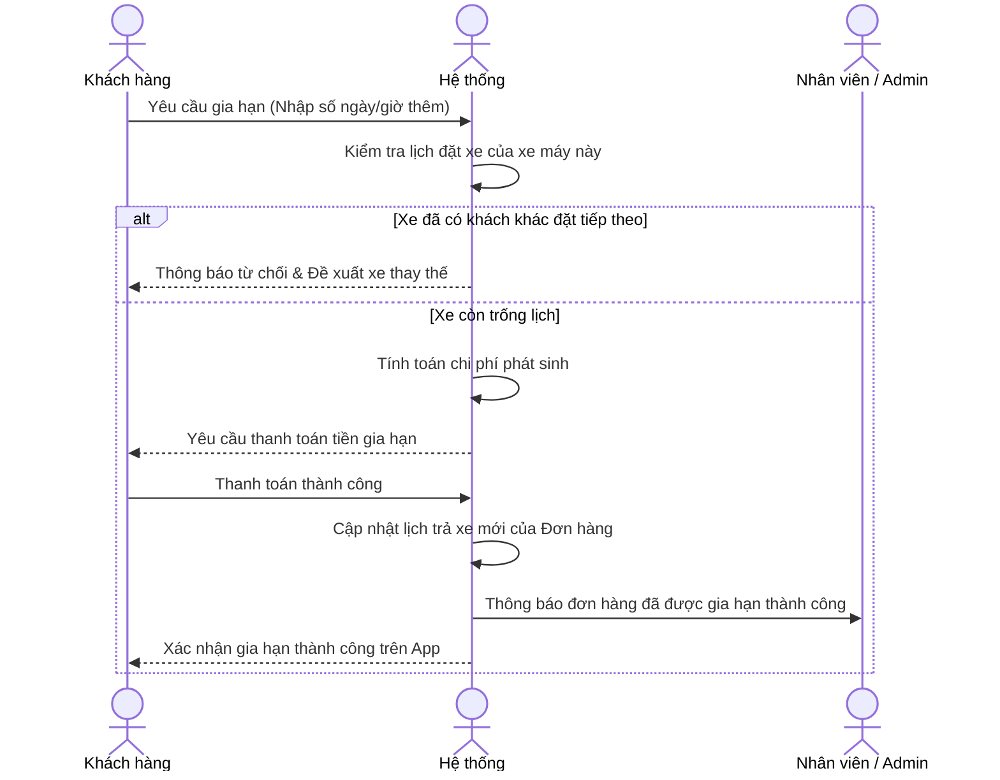
```mermaid
sequenceDiagram
    actor Customer as Khách hàng
    actor System as Hệ thống
    actor Staff as Nhân viên / Admin

    Customer->>System: Yêu cầu gia hạn (Nhập số ngày/giờ thêm)
    System->>System: Kiểm tra lịch đặt xe của xe máy này
    alt Xe đã có khách khác đặt tiếp theo
        System-->>Customer: Thông báo từ chối & Đề xuất xe thay thế
    else Xe còn trống lịch
        System->>System: Tính toán chi phí phát sinh
        System-->>Customer: Yêu cầu thanh toán tiền gia hạn
        Customer->>System: Thanh toán thành công
        System->>System: Cập nhật lịch trả xe mới của Đơn hàng
        System->>Staff: Thông báo đơn hàng đã được gia hạn thành công
        System-->>Customer: Xác nhận gia hạn thành công trên App
    end
```

### 5.2. Quy trình Bàn giao & Kiểm tra trả xe máy
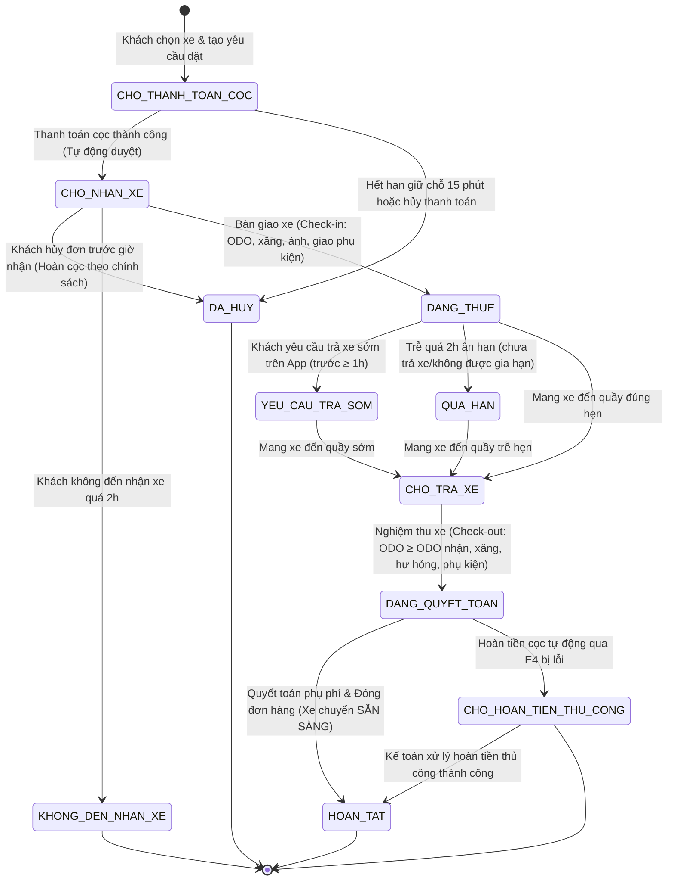
```mermaid
stateDiagram-v2
    [*] --> CHO_THANH_TOAN_COC : Khách chọn xe & tạo yêu cầu đặt
    CHO_THANH_TOAN_COC --> CHO_NHAN_XE : Thanh toán cọc thành công (Tự động duyệt)
    CHO_THANH_TOAN_COC --> DA_HUY : Hết hạn giữ chỗ 15 phút hoặc hủy thanh toán
    CHO_NHAN_XE --> DA_HUY : Khách hủy đơn trước giờ nhận (Hoàn cọc theo chính sách)
    CHO_NHAN_XE --> KHONG_DEN_NHAN_XE : Khách không đến nhận xe quá 2h
    CHO_NHAN_XE --> DANG_THUE : Bàn giao xe (Check-in: ODO, xăng, ảnh, giao phụ kiện)
    DANG_THUE --> YEU_CAU_TRA_SOM : Khách yêu cầu trả xe sớm trên App (trước ≥ 1h)
    DANG_THUE --> QUA_HAN : Trễ quá 2h ân hạn (chưa trả xe/không được gia hạn)
    YEU_CAU_TRA_SOM --> CHO_TRA_XE : Mang xe đến quầy sớm
    DANG_THUE --> CHO_TRA_XE : Mang xe đến quầy đúng hẹn
    QUA_HAN --> CHO_TRA_XE : Mang xe đến quầy trễ hẹn
    CHO_TRA_XE --> DANG_QUYET_TOAN : Nghiệm thu xe (Check-out: ODO ≥ ODO nhận, xăng, hư hỏng, phụ kiện)
    DANG_QUYET_TOAN --> HOAN_TAT : Quyết toán phụ phí & Đóng đơn hàng (Xe chuyển SẴN SÀNG)
    DANG_QUYET_TOAN --> CHO_HOAN_TIEN_THU_CONG : Hoàn tiền cọc tự động qua E4 bị lỗi
    CHO_HOAN_TIEN_THU_CONG --> HOAN_TAT : Kế toán xử lý hoàn tiền thủ công thành công
    HOAN_TAT --> [*]
    DA_HUY --> [*]
    KHONG_DEN_NHAN_XE --> [*]
    CHO_HOAN_TIEN_THU_CONG --> [*]
```

---

## 6. YÊU CẦU PHI CHỨC NĂNG (NON-FUNCTIONAL REQUIREMENTS)

### 6.1. Hướng đến khách du lịch đa quốc gia (Đa ngôn ngữ VIE/ENG)
*   **Hỗ trợ đa ngôn ngữ:** Thiết lập và hỗ trợ song song hai ngôn ngữ là Tiếng Việt (VIE) và Tiếng Anh (ENG) trên cả giao diện Web và Ứng dụng di động.
*   **Trải nghiệm người dùng:** Cho phép người dùng chuyển đổi ngôn ngữ linh hoạt tại phần cài đặt hoặc góc trên thanh điều hướng. Mọi thông tin mô tả xe, điều khoản hợp đồng và thông báo đều được dịch nghĩa chuẩn xác.


---


# CHƯƠNG 2: MÔ HÌNH HÓA CHỨC NĂNG (USE CASE & ACTIVITY DIAGRAMS)


Dựa trên các yêu cầu chức năng đã phân tích ở Chương 1, phân hệ này trình bày chi tiết mô hình Use Case và các Biểu đồ Hoạt động (Activity Diagrams) mô tả nghiệp vụ của hệ thống.


## QUY ƯỚC THIẾT KẾ (DESIGN CONVENTIONS)

1. **Xác thực và Phân quyền (Authentication & Authorization):** Các hành động (Login, Logout) được định nghĩa là **Tiền điều kiện (Pre-conditions)**.
2. **Loại bỏ phân rã chức năng (Functional Decomposition):** Các bước xử lý logic tự động (Khóa xe tạm 15 phút, Kiểm tra lịch xe trống) được đặc tả trong **Luồng sự kiện (Flow of Events)**.
3. **Phân cấp sơ đồ:** Phân tách thành Sơ đồ tổng thể và Sơ đồ phân hệ để quản lý tính phức tạp.

---

## 1. DANH SÁCH CÁC TÁC NHÂN (ACTORS)

| Tác nhân | Ký hiệu | Loại tác nhân | Vai trò trong hệ thống |
|----------|:---:|:---:|------------------------|
| **Khách hàng** (Customer) | `E1` | Primary Actor (Chính) | Đăng ký tài khoản, tìm kiếm xe máy, thực hiện đặt xe trực tuyến, quản lý chuyến đi (gia hạn, hủy đặt, yêu cầu trả sớm), thực hiện thanh toán online và đánh giá dịch vụ sau chuyến đi. |
| **Nhân viên** (Staff) | `E2` | Primary Actor (Chính) | Xem danh sách công việc giao nhận, thực hiện quy trình bàn giao xe (Check-in), nhận lại xe (Check-out), kiểm tra tình trạng xe, ghi nhận đền bù hư hại và ghi chú vi phạm nội bộ. |
| **Quản trị viên** (Admin) | `E3` | Primary Actor (Chính) | Tra cứu, hậu kiểm thông tin khách hàng và bằng lái, quản lý danh mục xe máy, tài khoản nhân viên, cấu hình thông số hệ thống, quản lý danh sách đen (Blacklist) và xem báo cáo thống kê. |
| **Cổng thanh toán** (Payment Gateway) | `E4` | Supporting Actor (Hỗ trợ) | Hệ thống bên ngoài thực hiện xử lý các giao dịch thanh toán đặt cọc cọc, hoàn tiền cọc, hoặc thu phụ phí từ Khách hàng và phản hồi kết quả giao dịch về hệ thống. |

---

## 2. SƠ ĐỒ USE CASE TỔNG THỂ HỆ THỐNG (OVERALL DIAGRAM)

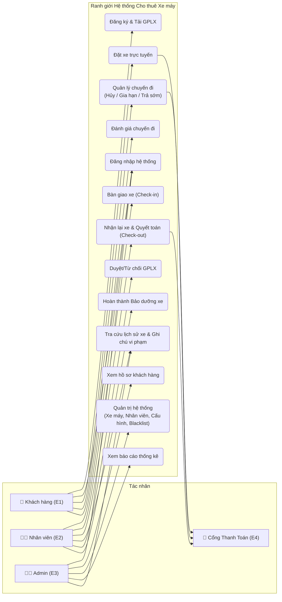
```mermaid
graph LR
    %% Actors
    subgraph Actors [Tác nhân]
        E1["👤 Khách hàng (E1)"]
        E2["🧑‍💼 Nhân viên (E2)"]
        E3["👨‍💻 Admin (E3)"]
        E4["🏦 Cổng Thanh Toán (E4)"]
    end

    %% System Boundary
    subgraph System [Ranh giới Hệ thống Cho thuê Xe máy]
        %% Common
        UC_Auth("Đăng nhập hệ thống")

        %% Customer Core
        UC_Reg("Đăng ký & Tải GPLX")
        UC_Book("Đặt xe trực tuyến")
        UC_TripMgmt("Quản lý chuyến đi<br/>(Hủy / Gia hạn / Trả sớm)")
        UC_Rate("Đánh giá chuyến đi")

        %% Staff Core
        UC_Checkin("Bàn giao xe (Check-in)")
        UC_Checkout("Nhận lại xe & Quyết toán (Check-out)")
        UC_History("Tra cứu lịch sử xe & Ghi chú vi phạm")
        UC_ApproveGPLX("Duyệt/Từ chối GPLX")
        UC_Maintenance("Hoàn thành Bảo dưỡng xe")

        %% Admin Core
        UC_ReviewCustomer("Xem hồ sơ khách hàng")
        UC_SysAdmin("Quản trị hệ thống<br/>(Xe máy, Nhân viên, Cấu hình, Blacklist)")
        UC_Report("Xem báo cáo thống kê")
    end

    %% Relationships - Customer
    E1 --> UC_Reg
    E1 --> UC_Auth
    E1 --> UC_Book
    E1 --> UC_TripMgmt
    E1 --> UC_Rate

    %% Relationships - Staff
    E2 --> UC_Auth
    E2 --> UC_Checkin
    E2 --> UC_Checkout
    E2 --> UC_History
    E2 --> UC_ApproveGPLX
    E2 --> UC_Maintenance

    %% Relationships - Admin
    E3 --> UC_Auth
    E3 --> UC_ReviewCustomer
    E3 --> UC_SysAdmin
    E3 --> UC_Report
    E3 --> UC_History


    %% Supporting Connections
    UC_Book --> E4
    UC_TripMgmt --> E4
    UC_Checkout --> E4
```

---

## 3. SƠ ĐỒ USE CASE PHÂN HỆ KHÁCH HÀNG (CUSTOMER SUB-SYSTEM)

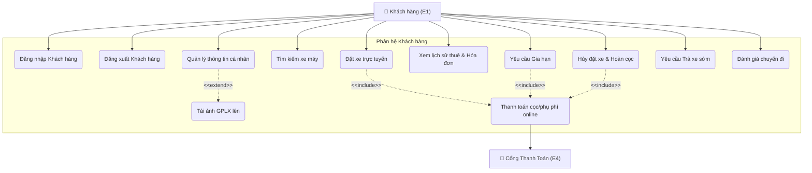
```mermaid
graph TB
    E1["👤 Khách hàng (E1)"]
    E4["🏦 Cổng Thanh Toán (E4)"]

    subgraph Customer_Boundary [Phân hệ Khách hàng]
        UC_Login("Đăng nhập Khách hàng")
        UC_Logout("Đăng xuất Khách hàng")
        UC_Profile("Quản lý thông tin cá nhân")
        UC_UpGPLX("Tải ảnh GPLX lên")
        UC_Search("Tìm kiếm xe máy")
        
        UC_Book("Đặt xe trực tuyến")
        UC_Pay("Thanh toán cọc/phụ phí online")
        UC_History("Xem lịch sử thuê & Hóa đơn")
        
        UC_Cancel("Hủy đặt xe & Hoàn cọc")
        UC_Extend("Yêu cầu Gia hạn")
        UC_Early("Yêu cầu Trả xe sớm")
        UC_Rate("Đánh giá chuyến đi")
    end

    %% Relationships
    E1 --> UC_Profile
    E1 --> UC_Login
    E1 --> UC_Logout
    E1 --> UC_Search
    E1 --> UC_Book
    E1 --> UC_History
    E1 --> UC_Cancel
    E1 --> UC_Extend
    E1 --> UC_Early
    E1 --> UC_Rate

    %% Relationships between Use Cases
    UC_Profile -.->|"&lt;&lt;extend&gt;&gt;"| UC_UpGPLX
    UC_Book -.->|"&lt;&lt;include&gt;&gt;"| UC_Pay
    UC_Extend -.->|"&lt;&lt;include&gt;&gt;"| UC_Pay
    UC_Cancel -.->|"&lt;&lt;include&gt;&gt;"| UC_Pay
    
    %% Supporting Actor Connection
    UC_Pay --> E4
    
```

---

## 4. SƠ ĐỒ USE CASE PHÂN HỆ QUẢN TRỊ & VẬN HÀNH (MANAGEMENT SUB-SYSTEM)


```mermaid
graph TB
    E2["🧑‍💼 Nhân viên (E2)"]
    E3["👨‍💻 Admin (E3)"]
    E4["🏦 Cổng Thanh Toán (E4)"]

    subgraph Management_Boundary [Phân hệ Quản trị & Vận hành]
        %% Common
        UC_LoginStaff("Đăng nhập Quản trị")
        UC_History("Tra cứu lịch sử xe")
        UC_Violate("Ghi chú vi phạm nội bộ")

        %% Staff Use Cases
        UC_Worklist("Xem danh sách giao nhận")
        UC_Checkin("Bàn giao xe (Check-in)")
        UC_Checkout("Nhận lại xe & Quyết toán (Check-out)")
        UC_Damage("Ghi nhận đền bù hư hại")
        UC_ApproveGPLX("Duyệt/Từ chối GPLX")
        UC_Maintenance("Hoàn thành Bảo dưỡng xe")

        %% Admin Use Cases
        UC_ReviewCustomer("Xem hồ sơ khách hàng")
        UC_ManageVehicles("Quản lý danh mục xe máy")
        UC_ManageStaff("Quản lý tài khoản nhân viên")
        UC_LockStaff("Khóa tài khoản nhân viên")
        UC_ManageConfig("Quản lý cấu hình hệ thống")
        UC_Blacklist("Quản lý Blacklist khách hàng")
        UC_Report("Xem báo cáo thống kê")
    end

    %% Staff Actions
    E2 --> UC_LoginStaff
    E2 --> UC_Worklist
    E2 --> UC_Checkin
    E2 --> UC_Checkout
    E2 --> UC_History
    E2 --> UC_Violate
    E2 --> UC_ApproveGPLX
    E2 --> UC_Maintenance

    %% Admin Actions
    E3 --> UC_LoginStaff
    E3 --> UC_ReviewCustomer
    E3 --> UC_ManageVehicles
    E3 --> UC_ManageStaff
    E3 --> UC_ManageConfig
    E3 --> UC_Blacklist
    E3 --> UC_History
    E3 --> UC_Violate
    E3 --> UC_Report
    E3 --> UC_ApproveGPLX

    %% Relationships (Includes/Extends)
    UC_Checkout -.->|"&lt;&lt;extend&gt;&gt;"| UC_Damage
    UC_ManageStaff -.->|"&lt;&lt;extend&gt;&gt;"| UC_LockStaff

    %% Payments connection during checkout
    UC_Checkout --> E4
```

---

## 5. ĐẶC TẢ CHI TIẾT CÁC USE CASE ĐẶC TRƯNG HỆ THỐNG

### 5.1. Use Case: Đặt xe trực tuyến & Khóa xe tạm
*   **Mô tả:** Khách hàng tiến hành đặt xe máy trực tuyến. Hệ thống kiểm tra điều kiện tài khoản và lịch xe khả dụng, sau đó khóa xe tạm thời 15 phút trong khi chờ khách hàng hoàn tất thanh toán cọc trực tuyến qua cổng thanh toán.
*   **Tác nhân chính:** Khách hàng (E1).
*   **Tác nhân hỗ trợ:** Cổng thanh toán (E4).
*   **Tiền điều kiện:** 
    1. Khách hàng đã đăng nhập tài khoản thành công.
    2. Nếu đặt xe > 50cc, khách hàng đã tải ảnh GPLX và **được Nhân viên/Admin phê duyệt** hợp lệ, phân hạng tương thích với nhóm xe muốn thuê.
    3. Khách hàng không nằm trong danh sách đen (Blacklist) của hệ thống.
*   **Luồng sự kiện chính:**
    1. Khách hàng chọn chiếc xe máy mong muốn và khoảng thời gian thuê (Ngày/Giờ Nhận - Ngày/Giờ Trả).
    2. Hệ thống kiểm tra điều kiện tài khoản (Hệ thống kiểm tra xem tài khoản đã có dữ liệu ảnh GPLX trong kho dữ liệu chưa để mở khóa danh mục xe tương ứng, và kiểm tra xem có nằm trong Blacklist hay không).
    3. Hệ thống kiểm tra lịch khả dụng của xe máy trong thời gian thuê để đảm bảo không bị trùng lịch với đơn đặt khác.
    4. Hệ thống hiển thị thông tin hóa đơn tạm tính và số tiền đặt cọc cần đóng (thường là 30% giá trị đơn hàng hoặc 1.000.000đ tùy cấu hình loại xe).
    5. Hệ thống khóa trạng thái xe tạm thời trong hệ thống (`TrangThaiXe = KHOA_TAM_15M`) và bắt đầu bộ đếm ngược 15 phút.
    6. Khách hàng lựa chọn phương thức thanh toán và thực hiện chuyển tiền cọc thông qua Cổng thanh toán (E4).
    7. Cổng thanh toán xử lý giao dịch và gửi phản hồi kết quả giao dịch thành công cho hệ thống.
    8. Hệ thống lưu chính thức đơn đặt xe (Trạng thái đơn hàng: `CHO_NHAN_XE`), cập nhật lịch xe máy là `DA_DAT` trong khoảng thời gian đã chọn, đồng thời gửi thông báo chuẩn bị xe tới Nhân viên tại chi nhánh tương ứng.
*   **Luồng thay thế và Luồng ngoại lệ:**
    *   *Ngoại lệ 2a (GPLX không hợp lệ):* Hệ thống thông báo tài khoản chưa tải ảnh GPLX hoặc hạng bằng lái không tương thích với phân khối xe yêu cầu và dừng Use Case.
    *   *Ngoại lệ 2b (Tài khoản thuộc Blacklist):* Hệ thống thông báo tài khoản bị từ chối dịch vụ do vi phạm quy định và dừng Use Case.
    *   *Ngoại lệ 3a (Xe đã bị đặt trùng lịch - Race condition):* Hệ thống thông báo xe vừa được đặt bởi người dùng khác trong quá trình chọn, đề xuất khách hàng chọn xe khác cùng phân khúc.
    *   *Ngoại lệ 5a (Giao dịch thất bại hoặc quá 15 phút không thanh toán):* Hệ thống tự động giải phóng trạng thái xe từ `KHOA_TAM_15M` về trạng thái khả dụng (`SAN_SANG`), đồng thời hủy đơn tạm thời và thông báo đơn đặt xe hết hạn.
    *   *Ngoại lệ 7a (Lỗi phản hồi từ Cổng thanh toán):* Hệ thống giữ trạng thái khóa tạm của xe để chờ cổng thanh toán đối soát hoặc hiển thị liên kết để khách hàng thử thanh toán lại trong thời gian 15 phút còn lại.

### 5.2. Use Case: Nhận lại xe & Quyết toán (Check-out)
*   **Mô tả:** Nhân viên kiểm tra và nhận lại xe máy từ khách hàng khi kết thúc hành trình. Hệ thống tính toán các khoản phụ thu phát sinh (phạt trễ hạn, đền bù hư hỏng nếu có) và thực hiện xuất hóa đơn quyết toán, tự động xử lý hoàn tiền đặt cọc hoặc yêu cầu thanh toán thêm.
*   **Tác nhân chính:** Nhân viên (E2).
*   **Tác nhân hỗ trợ:** Cổng thanh toán (E4).
*   **Tiền điều kiện:** 
    1. Nhân viên đã đăng nhập thành công và tài khoản đang ở trạng thái hoạt động.
    2. Đơn đặt xe tương ứng đang ở trạng thái hoạt động (`DANG_THUE`).
*   **Luồng sự kiện chính:**
    1. Nhân viên mở danh sách xe đến hạn trả hoặc nhận yêu cầu trả xe từ khách hàng, chọn đúng Đơn đặt xe tương ứng.
    2. Nhân viên cùng khách hàng đồng kiểm ngoại quan, động cơ và các phụ kiện đi kèm.
    3. Nhân viên nhập dữ liệu Check-out vào hệ thống bao gồm: Chỉ số ODO trả, Mức nhiên liệu trả, Số lượng phụ kiện trả lại, tải lên ảnh chụp hiện trạng xe và mức Phí đền bù hư hại (nếu có).
    4. Hệ thống kiểm tra và xác nhận các dữ liệu đầu vào hợp lệ.
    5. Hệ thống tự động tính toán phí phạt trễ hạn (nếu có) và tính tổng tiền quyết toán (`TongQuyetToan = TienThueGoc + TienPhatTreHan + TienDenBuHuHai - TienCoc`).
    6. Hệ thống xuất hóa đơn quyết toán gửi tới email/ứng dụng khách hàng và hiển thị trên màn hình của Nhân viên.
    7. Hệ thống tiến hành quyết toán tài chính:
        *   Nếu `TongQuyetToan > 0`: Khách hàng thực hiện thanh toán khoản thiếu qua cổng thanh toán (E4) hoặc tiền mặt cho nhân viên.
        *   Nếu `TongQuyetToan < 0`: Trong trường hợp khách trả sớm hoặc cọc dư, hệ thống tự động gọi API hoàn tiền thông qua Cổng thanh toán (E4), nhân viên tuyệt đối không trả tiền mặt.
    8. Hệ thống cập nhật trạng thái Đơn đặt xe sang `HOAN_TAT`.
    9. Hệ thống giải phóng xe máy về trạng thái khả dụng (`SAN_SANG`), cập nhật chỉ số ODO mới và mức xăng mới làm cơ sở cho lần thuê tiếp theo.
*   **Luồng thay thế và Luồng ngoại lệ:**
    *   *Thay thế 5a (Phát sinh phạt trễ hạn):* Nếu thời gian trả xe muộn hơn giờ hẹn, hệ thống tự động áp dụng biểu phí phạt trễ hạn lũy tiến được cấu hình sẵn:
        *   Trễ ≤ 2 tiếng: Miễn phí (ân hạn).
        *   Trễ từ 2h - 6h: Phạt 30.000đ/giờ (xe số/xe ga) hoặc 50.000đ/giờ (xe côn/PKL) (tối đa không quá 1/2 đơn giá ngày).
        *   Trễ từ 6h - 12h: Phạt bằng 1/2 đơn giá thuê 1 ngày.
        *   Trễ trên 12h: Phạt bằng 1 ngày thuê gốc.
    *   *Thay thế 5b (Phát sinh hư hại hoặc mất phụ kiện):* Nhân viên chọn thêm mục "Ghi nhận đền bù hư hại" trong giao diện, chọn loại linh kiện hỏng/mất từ danh mục có sẵn (kèm đơn giá chuẩn) hoặc nhập số tiền thỏa thuận đền bù trực tiếp để cộng vào hóa đơn quyết toán.
    *   *Ngoại lệ 3a (Sai lệch dữ liệu chỉ số ODO hoặc nhiên liệu):* Nếu chỉ số ODO trả nhỏ hơn chỉ số ODO bàn giao ban đầu, hệ thống báo lỗi dữ liệu không hợp lệ và yêu cầu nhân viên kiểm tra, nhập lại.
    *   *Ngoại lệ 7a (Khách hàng không đồng ý mức phí phạt hoặc đền bù):* Nhân viên ghi nhận tình trạng, tải lên các bằng chứng (ảnh chụp, video) và chọn trạng thái đơn hàng là `TRANH_CHAP`. Xe máy vẫn tạm thời chuyển về trạng thái `KHOA_TAM` để kiểm định thêm và luồng quyết toán tài chính sẽ chuyển cho Admin giải quyết thủ công.
    *   *Ngoại lệ 7b (Lỗi kết nối Cổng thanh toán khi thực hiện hoàn cọc):* Hệ thống ghi nhận trạng thái hoàn cọc lỗi, lưu vết lệnh hoàn tiền ở trạng thái `CHO_XU_LY` (Pending) để kế toán thực hiện xử lý tay, đồng thời đơn thuê vẫn chuyển về `HOAN_TAT` để giải phóng xe hoạt động.

### 5.3. Use Case: Đánh giá chuyến đi
*   **Mô tả:** Khách hàng thực hiện đánh giá chất lượng xe và dịch vụ sau khi chuyến đi kết thúc. Hệ thống đảm bảo mỗi đơn đặt xe chỉ được đánh giá duy nhất một lần bằng cách vô hiệu hóa nút đánh giá nếu đã có dữ liệu.
*   **Tác nhân chính:** Khách hàng (E1).
*   **Tiền điều kiện:** 
    1. Chuyến đi đã được hoàn tất (`TrangThaiBooking = HOAN_TAT`).
    2. Phương thức `isReviewed()` của `HopDongBooking` trả về `false` (Khách hàng chưa từng đánh giá đơn này).
*   **Luồng sự kiện chính:**
    1. Hệ thống hiển thị nút "Đánh giá" trên đơn thuê đã hoàn tất.
    2. Khách hàng click vào nút Đánh giá, chọn số sao (1-5) và nhập nội dung.
    3. Hệ thống kiểm tra lại điều kiện `isReviewed() == false`.
    4. Hệ thống lưu bản ghi đánh giá vào kho dữ liệu `D8: Danh_Gia`.
    5. Hệ thống vô hiệu hóa nút "Đánh giá" (chuyển sang màu xám/disabled).
*   **Luồng thay thế và Luồng ngoại lệ:**
    *   *Ngoại lệ 3a (Khách hàng đã đánh giá):* Nếu hệ thống phát hiện đơn hàng đã có dữ liệu đánh giá trước đó do khách click đúp hoặc mở trên nhiều thiết bị, hệ thống báo lỗi "Đơn này đã được đánh giá" và hủy thao tác.


Toàn bộ luồng nghiệp vụ trên được cụ thể hóa thông qua các Biểu đồ Hoạt động dưới đây:


## 1. LUỒNG ĐẶT XE & KHÓA PHƯƠNG TIỆN TẠM THỜI 15 PHÚT

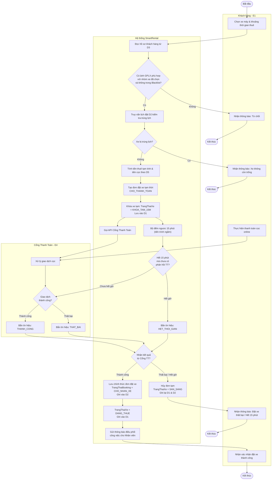
```mermaid
graph TB
    Start(["Bắt đầu"])

    subgraph E1 [Khách hàng - E1]
        A1["Chọn xe máy & khoảng thời gian thuê"]
        A2["Nhận thông báo: Từ chối"]
        A3["Nhận thông báo: Xe không còn trống"]
        A4["Thực hiện thanh toán cọc online"]
        A5["Nhận xác nhận đặt xe thành công"]
        A6["Nhận thông báo: Đặt xe thất bại / Hết 15 phút"]
    end

    subgraph SYS [Hệ thống SmartRental]
        S1["Đọc hồ sơ khách hàng từ D3"]
        S2{"Có ảnh GPLX phù hợp<br/>với nhóm xe đã chọn<br/>và không trong Blacklist?"}
        S3["Truy vấn lịch đặt D2 kiểm tra trùng lịch"]
        S4{"Xe bị trùng lịch?"}
        S5["Tính tiền thuê tạm tính & tiền cọc theo D5"]
        S6["Tạo đơn đặt xe tạm thời<br/>CHO_THANH_TOAN"]
        S7["Khóa xe tạm: TrangThaiXe = KHOA_TAM_15M<br/>Lưu vào D1"]
        S8["Gọi API Cổng Thanh Toán"]
        S9{"Nhận kết quả<br/>từ Cổng TT?"}
        S10["Hủy đơn tạm<br/>TrangThaiXe = SAN_SANG<br/>Ghi lại D1 & D2"]
        S11["Lưu chính thức đơn đặt xe<br/>TrangThaiBooking = CHO_NHAN_XE<br/>Ghi vào D2"]
        S12["TrangThaiXe = DANG_THUE<br/>Ghi vào D1"]
        S13["Gửi thông báo điều phối<br/>công việc cho Nhân viên"]
        C1["Bộ đếm ngược 15 phút (tiến trình ngầm)"]
        C2{"Hết 15 phút<br/>mà chưa có<br/>phản hồi TT?"}
        C3["Bắn tín hiệu: HET_THOI_GIAN"]
    end

    subgraph E4 [Cổng Thanh Toán - E4]
        P1["Xử lý giao dịch cọc"]
        P2{"Giao dịch<br/>thành công?"}
        P3["Bắn tín hiệu: THANH_CONG"]
        P4["Bắn tín hiệu: THAT_BAI"]
    end

    %% Flow
    Start --> A1 --> S1
    S1 --> S2
    S2 -- Không --> A2 --> End1([Kết thúc])
    S2 -- Có --> S3 --> S4
    S4 -- Có --> A3 --> End2([Kết thúc])
    S4 -- Không --> S5 --> S6 --> S7
    S7 --> S8
    S8 --> P1 --> P2
    S7 --> C1 --> C2
    C2 -- Chưa hết giờ --> P2
    C2 -- Hết giờ --> C3

    P2 -- Thành công --> P3 --> S9
    P2 -- Thất bại --> P4 --> S9
    C3 --> S9

    S9 -- Thành công --> S11
    S9 -- Thất bại / Hết giờ --> S10

    S10 --> A6 --> End3([Kết thúc])

    A4 --> P1

    S11 --> S12 --> S13 --> A5 --> End4([Kết thúc])
```

---

## 2. LUỒNG GIA HẠN THUÊ XE TRÊN ỨNG DỤNG (EXTENSION LOGIC)

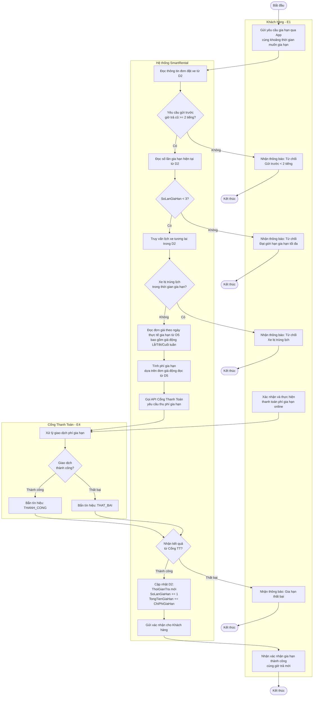
```mermaid
graph TB
    Start(["Bắt đầu"])

    subgraph E1 [Khách hàng - E1]
        A1["Gửi yêu cầu gia hạn qua App<br/>cùng khoảng thời gian muốn gia hạn"]
        A2["Nhận thông báo: Từ chối<br/>Gửi trước &lt; 2 tiếng"]
        A3["Nhận thông báo: Từ chối<br/>Đạt giới hạn gia hạn tối đa"]
        A4["Nhận thông báo: Từ chối<br/>Xe bị trùng lịch"]
        A5["Xác nhận và thực hiện<br/>thanh toán phí gia hạn online"]
        A6["Nhận thông báo: Gia hạn thất bại"]
        A7["Nhận xác nhận gia hạn thành công<br/>cùng giờ trả mới"]
    end

    subgraph SYS [Hệ thống SmartRental]
        S1["Đọc thông tin đơn đặt xe từ D2"]
        S2{"Yêu cầu gửi trước<br/>giờ trả cũ &gt;= 2 tiếng?"}
        S3["Đọc số lần gia hạn hiện tại từ D2"]
        S4{"SoLanGiaHan &lt; 3?"}
        S5["Truy vấn lịch xe tương lai trong D2"]
        S6{"Xe bị trùng lịch<br/>trong thời gian gia hạn?"}
        S7["Đọc đơn giá theo ngày thực tế gia hạn từ D5<br/>bao gồm giá động Lễ/Tết/Cuối tuần"]
        S8["Tính phí gia hạn<br/>dựa trên đơn giá động đọc từ D5"]
        S9["Gọi API Cổng Thanh Toán<br/>yêu cầu thu phí gia hạn"]
        S10{"Nhận kết quả<br/>từ Cổng TT?"}
        S11["Cập nhật D2:<br/>ThoiGianTra mới<br/>SoLanGiaHan += 1<br/>TongTienGiaHan += ChiPhiGiaHan"]
        S12["Gửi xác nhận cho Khách hàng"]
    end

    subgraph E4 [Cổng Thanh Toán - E4]
        P1["Xử lý giao dịch phí gia hạn"]
        P2{"Giao dịch<br/>thành công?"}
        P3["Bắn tín hiệu: THANH_CONG"]
        P4["Bắn tín hiệu: THAT_BAI"]
    end

    %% Flow
    Start --> A1 --> S1 --> S2
    S2 -- Không --> A2 --> End1([Kết thúc])
    S2 -- Có --> S3 --> S4
    S4 -- Không --> A3 --> End2([Kết thúc])
    S4 -- Có --> S5 --> S6
    S6 -- Có --> A4 --> End3([Kết thúc])
    S6 -- Không --> S7 --> S8 --> S9

    S9 --> P1
    A5 --> P1
    P1 --> P2
    P2 -- Thành công --> P3 --> S10
    P2 -- Thất bại --> P4 --> S10

    S10 -- Thất bại --> A6 --> End4([Kết thúc])
    S10 -- Thành công --> S11 --> S12 --> A7 --> End5([Kết thúc])
```

---

## 3. LUỒNG CHECK-IN, CHECK-OUT & QUYẾT TOÁN PHỤ PHÍ LŨY TIẾN

### 3.1. Phân đoạn Bàn giao xe (Check-in)

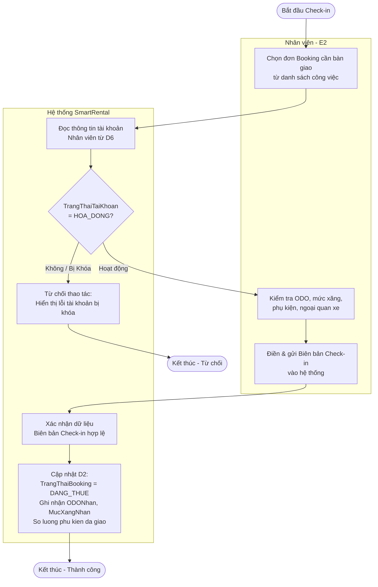
```mermaid
graph TB
    Start1(["Bắt đầu Check-in"])

    subgraph E2_CI [Nhân viên - E2]
        NV1["Chọn đơn Booking cần bàn giao<br/>từ danh sách công việc"]
        NV2["Kiểm tra ODO, mức xăng,<br/>phụ kiện, ngoại quan xe"]
        NV3["Điền & gửi Biên bản Check-in<br/>vào hệ thống"]
    end

    subgraph SYS_CI [Hệ thống SmartRental]
        S1["Đọc thông tin tài khoản<br/>Nhân viên từ D6"]
        S2{"TrangThaiTaiKhoan<br/>= HOA_DONG?"}
        S3["Từ chối thao tác:<br/>Hiển thị lỗi tài khoản bị khóa"]
        S4["Xác nhận dữ liệu<br/>Biên bản Check-in hợp lệ"]
        S5["Cập nhật D2:<br/>TrangThaiBooking = DANG_THUE<br/>Ghi nhận ODONhan, MucXangNhan<br/>So luong phu kien da giao"]
    end

    %% Flow
    Start1 --> NV1 --> S1 --> S2
    S2 -- Không / Bị Khóa --> S3 --> End_CI_Reject([Kết thúc - Từ chối])
    S2 -- Hoạt động --> NV2 --> NV3 --> S4 --> S5 --> End_CI_OK([Kết thúc - Thành công])
```

### 3.2. Phân đoạn Nhận lại xe & Quyết toán (Check-out)

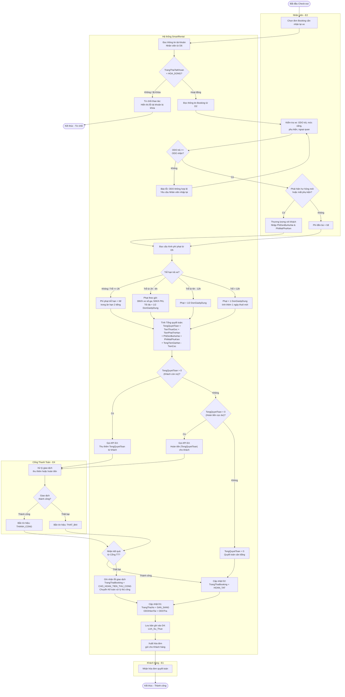
```mermaid
graph TB
    Start2(["Bắt đầu Check-out"])

    subgraph E2_CO [Nhân viên - E2]
        NV1["Chọn đơn Booking cần nhận lại xe"]
        NV2["Kiểm tra xe: ODO trả, mức xăng,<br/>phụ kiện, ngoại quan"]
        NV3{"Phát hiện hư hỏng mới<br/>hoặc mất phụ kiện?"}
        NV4["Thương lượng với khách<br/>Nhập PhiDenBuHuHai & PhiMatPhuKien"]
        NV5["Phí đền bù = 0đ"]
    end

    subgraph SYS_CO [Hệ thống SmartRental]
        S1["Đọc thông tin tài khoản<br/>Nhân viên từ D6"]
        S2{"TrangThaiTaiKhoan<br/>= HOA_DONG?"}
        S3["Từ chối thao tác:<br/>Hiển thị lỗi tài khoản bị khóa"]
        S4["Đọc thông tin Booking từ D2"]
        S5{"ODO trả &gt;=<br/>ODO nhận?"}
        S6["Báo lỗi: ODO không hợp lệ<br/>Yêu cầu Nhân viên nhập lại"]
        S7["Đọc cấu hình phí phạt từ D5"]
        S8{"Trễ hạn trả xe?"}
        S9["Phí phạt trễ hạn = 0đ<br/>trong ân hạn 2 tiếng"]
        S10["Phạt theo giờ:<br/>30K/h xe số-ga; 50K/h PKL<br/>Tối đa = 1/2 DonGiaApDung"]
        S11["Phạt = 1/2 DonGiaApDung"]
        S12["Phạt = 1 DonGiaApDung<br/>tính thêm 1 ngày thuê mới"]
        S13["Tính Tổng quyết toán:<br/>TongQuyetToan =<br/>TienThueGoc + TienPhatTreHan<br/>+ PhiDenBuHuHai + PhiMatPhuKien<br/>+ TongTienGiaHan - TienCoc"]
        S14{"TongQuyetToan &gt; 0<br/>(Khách còn nợ)?"}
        S15{"TongQuyetToan &lt; 0<br/>(Hoàn tiền cọc dư)?"}
        S16["TongQuyetToan = 0:<br/>Quyết toán cân bằng"]
        S17["Gọi API E4:<br/>Thu thêm TongQuyetToan từ khách"]
        S18["Gọi API E4:<br/>Hoàn tiền |TongQuyetToan| cho khách"]
        S19{"Nhận kết quả<br/>từ Cổng TT?"}
        S20["Ghi nhận lỗi giao dịch<br/>TrangThaiBooking = CHO_HOAN_TIEN_THU_CONG<br/>Chuyển Kế toán xử lý thủ công"]
        S21["Cập nhật D2:<br/>TrangThaiBooking = HOAN_TAT"]
        S22["Cập nhật D1:<br/>TrangThaiXe = SAN_SANG<br/>ODOHienTai = ODOTra"]
        S23["Lưu bản ghi vào D4:<br/>Lich_Su_Thue"]
        S24["Xuất hóa đơn<br/>gửi cho Khách hàng"]
    end

    subgraph E4_CO [Cổng Thanh Toán - E4]
        P1["Xử lý giao dịch<br/>thu thêm hoặc hoàn tiền"]
        P2{"Giao dịch<br/>thành công?"}
        P3["Bắn tín hiệu: THANH_CONG"]
        P4["Bắn tín hiệu: THAT_BAI"]
    end

    subgraph E1_CO [Khách hàng - E1]
        KH1["Nhận hóa đơn quyết toán"]
    end

    %% Flow
    Start2 --> NV1 --> S1 --> S2
    S2 -- Không / Bị Khóa --> S3 --> End_CO_Reject([Kết thúc - Từ chối])
    S2 -- Hoạt động --> S4 --> NV2 --> S5
    S5 -- Không --> S6 --> NV2
    S5 -- Có --> NV3
    NV3 -- Có --> NV4 --> S7
    NV3 -- Không --> NV5 --> S7
    S7 --> S8
    S8 -- Không / Trễ <= 2h --> S9 --> S13
    S8 -- Trễ từ 2h - 6h --> S10 --> S13
    S8 -- Trễ từ 6h - 12h --> S11 --> S13
    S8 -- Trễ > 12h --> S12 --> S13
    S13 --> S14
    S14 -- Có --> S17 --> P1
    S14 -- Không --> S15
    S15 -- Có --> S18 --> P1
    S15 -- Không --> S16 --> S21

    P1 --> P2
    P2 -- Thành công --> P3 --> S19
    P2 -- Thất bại --> P4 --> S19
    S19 -- Thành công --> S21
    S19 -- Thất bại --> S20
    S20 --> S22

    S21 --> S22 --> S23 --> S24 --> KH1 --> End_CO_OK([Kết thúc - Thành công])
```

---

## 4. LUỒNG ĐĂNG KÝ VÀ DUYỆT GPLX (MANUAL APPROVAL)

Mô tả luồng hệ thống ghi nhận ảnh GPLX và Nhân viên/Admin thực hiện duyệt thủ công để cấp quyền thuê xe.

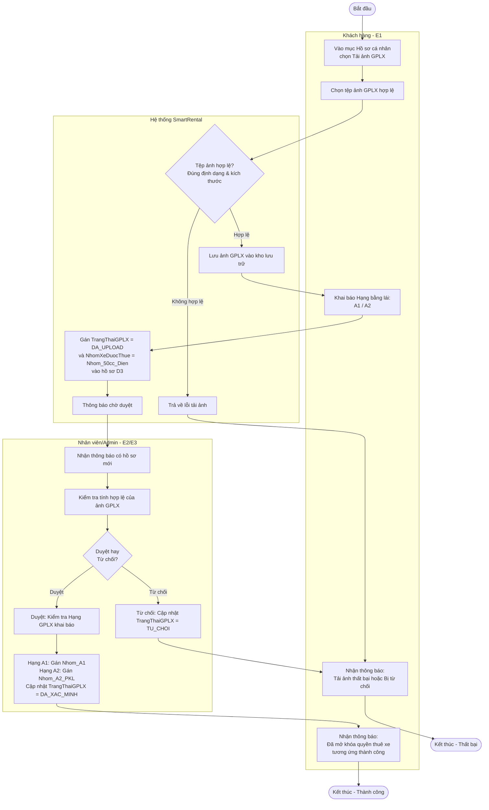
```mermaid
graph TB
    Start(["Bắt đầu"])

    subgraph E1_GPLX [Khách hàng - E1]
        A1["Vào mục Hồ sơ cá nhân<br/>chọn Tải ảnh GPLX"]
        A2["Chọn tệp ảnh GPLX hợp lệ"]
        A3["Khai báo Hạng bằng lái:<br/>A1 / A2"]
        A4["Nhận thông báo:<br/>Đã mở khóa quyền thuê xe<br/>tương ứng thành công"]
        A5["Nhận thông báo:<br/>Tải ảnh thất bại hoặc Bị từ chối"]
    end

    subgraph SYS_GPLX [Hệ thống SmartRental]
        S1{"Tệp ảnh hợp lệ?<br/>Đúng định dạng & kích thước"}
        S2["Lưu ảnh GPLX vào kho lưu trữ"]
        S3["Gán TrangThaiGPLX = DA_UPLOAD<br/>và NhomXeDuocThue = Nhom_50cc_Dien<br/>vào hồ sơ D3"]
        S4["Thông báo chờ duyệt"]
        S8["Trả về lỗi tải ảnh"]
    end

    subgraph E2_GPLX [Nhân viên/Admin - E2/E3]
        NV1["Nhận thông báo có hồ sơ mới"]
        NV2["Kiểm tra tính hợp lệ của ảnh GPLX"]
        NV3{"Duyệt hay<br/>Từ chối?"}
        NV4["Từ chối: Cập nhật TrangThaiGPLX = TU_CHOI"]
        NV5["Duyệt: Kiểm tra Hạng GPLX khai báo"]
        NV6["Hạng A1: Gán Nhom_A1<br/>Hạng A2: Gán Nhom_A2_PKL<br/>Cập nhật TrangThaiGPLX = DA_XAC_MINH"]
    end

    %% Flow
    Start --> A1 --> A2 --> S1
    S1 -- Không hợp lệ --> S8 --> A5 --> End_Fail([Kết thúc - Thất bại])
    S1 -- Hợp lệ --> S2 --> A3 --> S3 --> S4
    
    S4 --> NV1 --> NV2 --> NV3
    NV3 -- Từ chối --> NV4 --> A5
    NV3 -- Duyệt --> NV5 --> NV6 --> A4 --> End_OK([Kết thúc - Thành công])
```

---

## 5. LUỒNG HOÀN THÀNH BẢO DƯỠNG XE

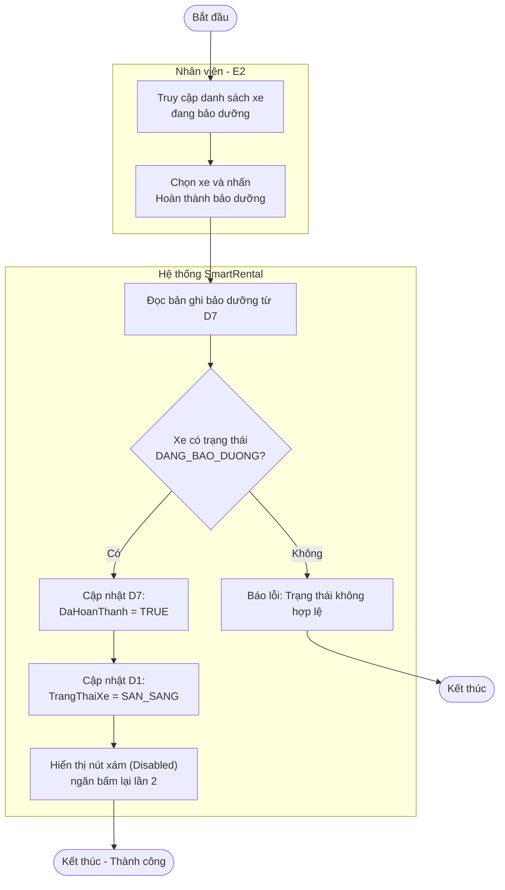
```mermaid
graph TB
    Start(["Bắt đầu"])

    subgraph E2_BD [Nhân viên - E2]
        BD1["Truy cập danh sách xe<br/>đang bảo dưỡng"]
        BD2["Chọn xe và nhấn<br/>Hoàn thành bảo dưỡng"]
    end

    subgraph SYS_BD [Hệ thống SmartRental]
        S1["Đọc bản ghi bảo dưỡng từ D7"]
        S2{"Xe có trạng thái<br/>DANG_BAO_DUONG?"}
        S3["Báo lỗi: Trạng thái không hợp lệ"]
        S4["Cập nhật D7:<br/>DaHoanThanh = TRUE"]
        S5["Cập nhật D1:<br/>TrangThaiXe = SAN_SANG"]
        S6["Hiển thị nút xám (Disabled)<br/>ngăn bấm lại lần 2"]
    end

    %% Flow
    Start --> BD1 --> BD2 --> S1 --> S2
    S2 -- Không --> S3 --> End1([Kết thúc])
    S2 -- Có --> S4 --> S5 --> S6 --> End2([Kết thúc - Thành công])
```

---

## 6. LUỒNG ĐÁNH GIÁ CHUYẾN ĐI

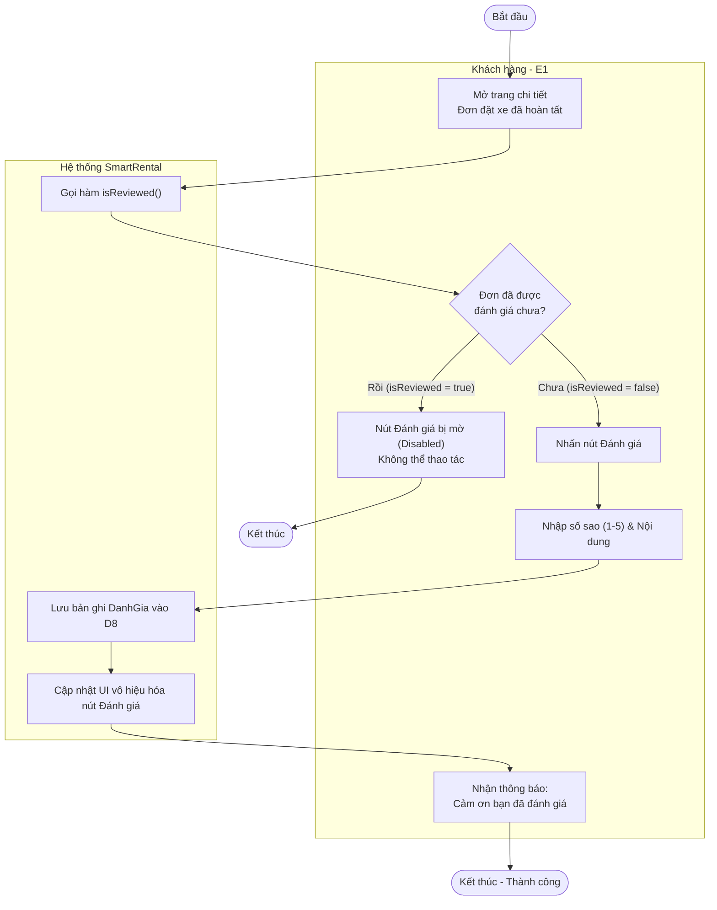
```mermaid
graph TB
    Start(["Bắt đầu"])

    subgraph E1_Rating [Khách hàng - E1]
        R1["Mở trang chi tiết<br/>Đơn đặt xe đã hoàn tất"]
        R2{"Đơn đã được<br/>đánh giá chưa?"}
        R3["Nút Đánh giá bị mờ (Disabled)<br/>Không thể thao tác"]
        R4["Nhấn nút Đánh giá"]
        R5["Nhập số sao (1-5) & Nội dung"]
        R6["Nhận thông báo:<br/>Cảm ơn bạn đã đánh giá"]
    end

    subgraph SYS_Rating [Hệ thống SmartRental]
        S1["Gọi hàm isReviewed()"]
        S2["Lưu bản ghi DanhGia vào D8"]
        S3["Cập nhật UI vô hiệu hóa nút Đánh giá"]
    end

    %% Flow
    Start --> R1 --> S1 --> R2
    R2 -- Rồi (isReviewed = true) --> R3 --> End1([Kết thúc])
    R2 -- Chưa (isReviewed = false) --> R4 --> R5 --> S2 --> S3 --> R6 --> End2([Kết thúc - Thành công])
```

---

> **Ghi chú tổng hợp:**
> - Tất cả mã trạng thái (`TrangThaiBooking`, `TrangThaiXe`, `TrangThaiGPLX`, `NhomXeDuocThue`) được sử dụng **đồng nhất 100%** với Từ điển dữ liệu (D1–D6).
> - Sơ đồ 4 (GPLX Auto-Unlock) thể hiện việc Admin/Nhân viên can thiệp vào luồng cấp quyền.
> - Sơ đồ 3 Check-out đảm bảo hệ thống **chỉ giải phóng xe và đóng đơn sau khi nhận tín hiệu phản hồi từ Cổng thanh toán**, không bỏ qua bước xác nhận giao dịch.


---


# CHƯƠNG 3: MÔ HÌNH HÓA TIẾN TRÌNH (DFD & PROCESS SPECIFICATIONS)


Sau khi mô tả các chức năng dưới góc nhìn Use Case, Chương 3 trình bày luồng di chuyển của dữ liệu thông qua Sơ đồ luồng dữ liệu (DFD) và đặc tả chi tiết cho từng tiến trình xử lý.


## Hệ thống Quản lý và Cho thuê xe máy Thông minh

---

## 1. SƠ ĐỒ NGỮ CẢNH (CONTEXT DIAGRAM — DFD LEVEL -1)

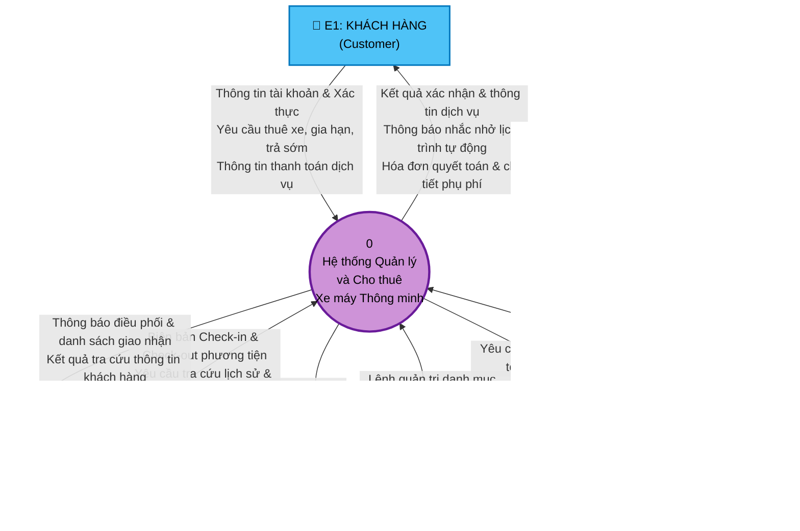
```mermaid
graph TB
    %% === EXTERNAL ENTITIES ===
    E1["👤 E1: KHÁCH HÀNG<br/>(Customer)"]
    E2["🧑‍💼 E2: NHÂN VIÊN<br/>(Staff)"]
    E3["👨‍💻 E3: QUẢN TRỊ VIÊN<br/>(Admin)"]
    E4["🏦 E4: CỔNG THANH TOÁN<br/>(Payment Gateway)"]

    %% === CENTRAL PROCESS ===
    P0(("0<br/>Hệ thống Quản lý<br/>và Cho thuê<br/>Xe máy Thông minh"))

    %% === KHÁCH HÀNG ↔ HỆ THỐNG ===
    E1 -->|"Thông tin tài khoản & Xác thực<br/>Yêu cầu thuê xe, gia hạn, trả sớm<br/>Thông tin thanh toán dịch vụ"| P0
    P0 -->|"Kết quả xác nhận & thông tin dịch vụ<br/>Thông báo nhắc nhở lịch trình tự động<br/>Hóa đơn quyết toán & chi tiết phụ phí"| E1

    %% === NHÂN VIÊN ↔ HỆ THỐNG ===
    E2 -->|"Biên bản Check-in & Check-out phương tiện<br/>Yêu cầu tra cứu lịch sử & ghi chú vi phạm"| P0
    P0 -->|"Thông báo điều phối & danh sách giao nhận<br/>Kết quả tra cứu thông tin khách hàng"| E2

    %% === ADMIN ↔ HỆ THỐNG ===
    E3 -->|"Lệnh quản trị danh mục, nhân viên & cấu hình"| P0
    P0 -->|"Báo cáo quản trị"| E3

    %% === CỔNG THANH TOÁN ↔ HỆ THỐNG ===
    P0 -->|"Yêu cầu giao dịch thanh toán trực tuyến"| E4
    E4 -->|"Kết quả giao dịch thanh toán trực tuyến"| P0

    %% === STYLES ===
    style E1 fill:#4FC3F7,stroke:#0277BD,color:#000,stroke-width:2px
    style E2 fill:#81C784,stroke:#2E7D32,color:#000,stroke-width:2px
    style E3 fill:#FFB74D,stroke:#E65100,color:#000,stroke-width:2px
    style E4 fill:#F48FB1,stroke:#880E4F,color:#000,stroke-width:2px
    style P0 fill:#CE93D8,stroke:#6A1B9A,color:#000,stroke-width:3px
```

### Bảng tổng hợp luồng dữ liệu — Sơ đồ Ngữ cảnh (Context Diagram)

1. **Thông tin tài khoản & Xác thực** (Khách hàng `E1` → Hệ thống `P0`):
   - *Mô tả:* Chứa toàn bộ thông tin đăng ký tài khoản mới và thông tin xác thực đăng nhập của khách hàng.
   - *Bao hàm:* 
     - `F1.1: Yêu cầu đăng ký tài khoản` (HoTen, Email, SoDienThoai, LuaChonGPLX, AnhGPLXMatTruoc, AnhGPLXMatSau, HangGPLX, SoGPLX, NgayCapGPLX, NgayHetHanGPLX).
     - `F1.2: Thông tin đăng nhập` (Email/SoDienThoai, MatKhau).

2. **Yêu cầu thuê xe, gia hạn, trả sớm** (Khách hàng `E1` → Hệ thống `P0`):
   - *Mô tả:* Các tương tác trực tiếp của khách hàng nhằm đặt xe, thay đổi hợp đồng hoặc gửi phản hồi.
   - *Bao hàm:*
     - `F2.1: Yêu cầu tìm kiếm xe` (LoaiXe, HangXe, PhanKhoi, KhoangGia_Min, KhoangGia_Max, ThoiGianNhan, ThoiGianTra).
     - `F2.6: Yêu cầu đặt xe` (MaKhachHang, MaXe, ThoiGianNhan, ThoiGianTra, DichVuDiKem[]).
     - `F2.7: Yêu cầu hủy đặt xe` (MaBooking).
     - `F3.1: Yêu cầu gia hạn` (MaBooking, SoNgayGiaHanThem, ThoiGianTraMoi).
     - `F3.8: Yêu cầu trả xe sớm` (MaBooking, ThoiGianMuonTra).
     - `F4.14: Đánh giá chuyến đi` (MaBooking, DanhGiaSao, NoiDungDanhGia).

3. **Thông tin thanh toán dịch vụ** (Khách hàng `E1` → Hệ thống `P0`):
   - *Mô tả:* Tài liệu/thông tin xác nhận việc khách hàng đã thực hiện thanh toán qua ứng dụng.
   - *Bao hàm:*
     - `F2.9: Thanh toán đặt cọc` (MaBooking, TienCoc, PhuongThucCoc).
     - `F3.2: Thanh toán gia hạn` (MaBooking, SoTienGiaHan, PhuongThucCoc).

4. **Kết quả xác nhận & thông tin dịch vụ** (Hệ thống `P0` → Khách hàng `E1`):
   - *Mô tả:* Kết quả trả về cho khách hàng từ các yêu cầu dịch vụ.
   - *Bao hàm:*
     - `F1.3: Kết quả đăng nhập` (Xác thực thành công / thông báo sai tài khoản mật khẩu).
     - `F2.2: Kết quả tìm kiếm xe` (Danh sách xe máy khả dụng).
     - `F2.8: Thông báo khóa xe tạm` (MaXe, ThoiGianKhoaTam = 15 phút).
     - `F2.14: Xác nhận đặt xe` (MaBooking, TrangThaiBooking, DonGiaApDung, TongTienThue, TienCoc).
     - `F3.6: Kết quả gia hạn` (KetQua, TienGiaHanThem, GoiYXeThayTe).
     - `F3.15: Kết quả yêu cầu trả sớm` (Thông báo đồng ý/từ chối yêu cầu trả sớm).

5. **Thông báo nhắc nhở lịch trình tự động** (Hệ thống `P0` → Khách hàng `E1`):
   - *Mô tả:* Các thông báo đẩy tự động từ hệ thống để nhắc lịch trình.
   - *Bao hàm:*
     - `F2.13: Thông báo nhắc nhở tự động` (Nhắc nhận xe trước 2h, nhắc trả xe trước 2h, nhắc hết giờ hẹn trả xe).

6. **Hóa đơn quyết toán & chi tiết phụ phí** (Hệ thống `P0` → Khách hàng `E1`):
   - *Mô tả:* Hóa đơn chi tiết các khoản chi phí khi hoàn tất chuyến đi.
   - *Bao hàm:*
     - `F4.10: Hóa đơn quyết toán` (MaBooking, TongTienThue, TienGiamGia, TienTangGia, TongTienGiaHan, PhiPhatTreHan, PhiDenBuHuHai, PhiMatPhuKien, TienCoc, TongThanhToan).

7. **Biên bản Check-in & Check-out phương tiện** (Nhân viên `E2` → Hệ thống `P0`):
   - *Mô tả:* Biên bản do nhân viên lập tại quầy khi giao xe hoặc nhận lại xe từ khách.
   - *Bao hàm:*
     - `F4.4: Biên bản Check-in` (MaBooking, ODONhan, MucXangNhan, AnhNgoaiQuanNhan[], Phụ kiện giao).
     - `F4.6: Biên bản Check-out` (MaBooking, ODOTra, MucXangTra, AnhNgoaiQuanTra[], Phụ kiện trả, Phí đền bù hư hại, Phí mất phụ kiện).

8. **Yêu cầu tra cứu lịch sử & ghi chú vi phạm** (Nhân viên `E2` → Hệ thống `P0`):
   - *Mô tả:* Các yêu cầu truy vấn dữ liệu từ nhân viên để phục vụ vận hành hàng ngày và rà soát lỗi vi phạm.
   - *Bao hàm:*
     - `F4.1: Yêu cầu xem danh sách giao nhận` (NgayTruyVan, MaNhanVien).
     - `F5.1: Yêu cầu tra cứu lịch sử` (BienSoXe, KhoangThoiGian).
     - `F5.5: Ghi chú vi phạm nội bộ` (MaLichSu, GhiChuNoiBo, DanhDauViPham = TRUE).

9. **Thông báo điều phối & danh sách giao nhận** (Hệ thống `P0` → Nhân viên `E2`):
   - *Mô tả:* Các thông báo từ hệ thống giúp nhân viên nắm được đầu việc cần thực hiện.
   - *Bao hàm:*
     - `F2.12: Thông báo đơn mới` (Thông tin đơn xe đã cọc thành công để chuẩn bị xe).
     - `F3.10: Thông báo trả sớm` (Thông tin khách hàng muốn trả xe sớm trước thời hạn).
     - `F4.3: Danh sách giao nhận trong ngày` (Danh sách các đơn bàn giao và nghiệm thu trong ca làm việc).

10. **Kết quả tra cứu thông tin khách hàng** (Hệ thống `P0` → Nhân viên `E2`):
    - *Mô tả:* Dữ liệu lịch sử thuê xe và thông tin khách hàng tương ứng được trả về sau khi tra cứu.
    - *Bao hàm:*
      - `F5.4: Kết quả tra cứu` (Thông tin khách hàng & thông tin chuyến đi đã thực hiện).

11. **Lệnh quản trị danh mục, nhân viên & cấu hình** (Quản trị viên `E3` → Hệ thống `P0`):
    - *Mô tả:* Các lệnh thay đổi cấu hình hoặc cập nhật danh mục từ Admin.
    - *Bao hàm:*
      - `F5.7: Yêu cầu Blacklist` (Đưa khách hàng vi phạm nghiêm trọng vào danh sách đen).
      - `F6.1: Yêu cầu cập nhật thông tin xe máy` (Thêm, sửa, xóa thông tin xe trong `D1`).
      - `F6.5: Yêu cầu cập nhật cấu hình hệ thống` (Thiết lập giá ngày, bảng đền bù, phí phạt trễ hạn trong `D5`).
      - `F6.9: Yêu cầu quản lý nhân viên` (Tạo mới, khóa, phân quyền nhân viên trong `D6`).

12. **Báo cáo quản trị** (Hệ thống `P0` → Quản trị viên `E3`):
    - *Mô tả:* Dữ liệu báo cáo tài chính và thông tin hệ thống được gửi tới Admin.
    - *Bao hàm:*
      - `F5.4: Kết quả tra cứu` (Đối với tài khoản Admin tra cứu).
      - `F6.4: Kết quả cập nhật xe` (Phản hồi cập nhật danh mục xe máy).
      - `F6.8: Kết quả cập nhật cấu hình` (Phản hồi cập nhật cấu hình vận hành).
      - `F6.12: Kết quả quản lý nhân viên` (Phản hồi kết quả cập nhật danh sách nhân viên).

13. **Yêu cầu giao dịch thanh toán trực tuyến** (Hệ thống `P0` → Cổng thanh toán `E4`):
    - *Mô tả:* Yêu cầu xử lý thanh toán cọc/gia hạn hoặc hoàn trả tiền cọc gửi sang ngân hàng/ví điện tử.
    - *Bao hàm:*
      - `F2.16: Yêu cầu giao dịch trực tuyến` (SoTien, MaBooking, LoaiGiaoDich ∈ {Dat_Coc, Hoan_Tien}).
      - `F3.12: Yêu cầu giao dịch gia hạn trực tuyến` (SoTien, MaBooking).
      - `F4.17: Yêu cầu giao dịch quyết toán trực tuyến` (SoTien, MaBooking).

14. **Kết quả giao dịch thanh toán trực tuyến** (Cổng thanh toán `E4` → Hệ thống `P0`):
    - *Mô tả:* Tín hiệu xác nhận giao dịch đã được thực hiện thành công hay thất bại.
    - *Bao hàm:*
      - `F2.17: Kết quả giao dịch` (MaBooking, SoTien, TrangThaiGD ∈ {Thanh_Cong, That_Bai}).
      - `F3.13: Kết quả giao dịch gia hạn` (MaBooking, SoTien, TrangThaiGD ∈ {Thanh_Cong, That_Bai}).
      - `F4.18: Kết quả giao dịch quyết toán` (MaBooking, SoTien, TrangThaiGD ∈ {Thanh_Cong, That_Bai}).


---

## 2. SƠ ĐỒ DFD MỨC 0 (LEVEL 0 DFD)


```mermaid
graph TB
    %% ╔══════════════════════════════════════════════╗
    %% ║           EXTERNAL ENTITIES                  ║
    %% ╚══════════════════════════════════════════════╝
    E1["👤 E1: KHÁCH HÀNG"]
    E2["🧑‍💼 E2: NHÂN VIÊN"]
    E3["👨‍💻 E3: ADMIN"]
    E4["🏦 E4: CỔNG THANH TOÁN"]

    %% ╔══════════════════════════════════════════════╗
    %% ║              PROCESSES                       ║
    %% ╚══════════════════════════════════════════════╝
    P1(("1.0<br/>Đăng ký, Đăng nhập<br/>& Cấp quyền GPLX"))
    P2(("2.0<br/>Đặt xe trực tuyến<br/>& Giữ chỗ"))
    P3(("3.0<br/>Gia hạn &<br/>Yêu cầu Trả xe sớm"))
    P4(("4.0<br/>Nhận xe &<br/>Quyết toán phụ phí"))
    P5(("5.0<br/>Tra cứu Lịch sử thuê<br/>& Quản lý Blacklist"))
    P6(("6.0<br/>Quản lý Danh mục<br/>& Cấu hình Hệ thống"))

    %% ╔══════════════════════════════════════════════╗
    %% ║             DATA STORES                      ║
    %% ╚══════════════════════════════════════════════╝
    D1[("D1: Xe_May")]
    D2[("D2: Hop_Dong_Booking")]
    D3[("D3: Khach_Hang_GPLX")]
    D4[("D4: Lich_Su_Thue")]
    D5[("D5: Cau_Hinh_He_Thong")]
    D6[("D6: Nhan_Vien")]

    %% ╔══════════════════════════════════════════════╗
    %% ║    P1.0 — ĐĂNG KÝ, ĐĂNG NHẬP & XÁC THỰC       ║
    %% ╚══════════════════════════════════════════════╝
    E1 -->|"F1.1: Yêu cầu đăng ký tài khoản<br/>(Thông tin + Ảnh GPLX)"| P1
    E1 -->|"F1.2: Thông tin đăng nhập"| P1
    P1 -->|"F1.3: Kết quả đăng nhập"| E1
    P1 -->|"F1.7: Lưu thông tin KH<br/>(Auto phân quyền GPLX)"| D3
    D3 -->|"F1.8: Đọc thông tin KH"| P1
    E2 -->|"F1.9: Yêu cầu đăng nhập quản trị"| P1
    E3 -->|"F1.9: Yêu cầu đăng nhập quản trị"| P1
    P1 -->|"F1.10: Kết quả đăng nhập quản trị"| E2
    P1 -->|"F1.10: Kết quả đăng nhập quản trị"| E3
    D6 -->|"F1.11: Đọc thông tin xác thực NV/Admin"| P1
    E2 -->|"F1.4: Lệnh duyệt/từ chối GPLX"| P1
    E3 -->|"F1.4: Lệnh duyệt/từ chối GPLX"| P1
    P1 -->|"F1.5: Kết quả duyệt GPLX"| E1

    %% ╔══════════════════════════════════════════════╗
    %% ║    P2.0 — ĐẶT XE TRỰC TUYẾN & GIỮ CHỖ      ║
    %% ╚══════════════════════════════════════════════╝
    E1 -->|"F2.1: Yêu cầu tìm kiếm xe"| P2
    P2 -->|"F2.2: Kết quả tìm kiếm xe"| E1
    D1 -->|"F2.3: Đọc danh sách xe"| P2
    D5 -->|"F2.4: Đọc cấu hình & giá động"| P2
    D3 -->|"F2.5: Kiểm tra quyền thuê xe"| P2
    E1 -->|"F2.6: Yêu cầu đặt xe"| P2
    E1 -->|"F2.7: Yêu cầu hủy đặt xe"| P2
    P2 -->|"F2.8: Thông báo khóa xe tạm"| E1
    E1 -->|"F2.9: Thanh toán đặt cọc"| P2
    P2 -->|"F2.10: Lưu đơn đặt xe (Auto Confirm)"| D2
    P2 -->|"F2.11: Cập nhật trạng thái xe"| D1
    P2 -->|"F2.12: Thông báo đơn mới"| E2
    P2 -->|"F2.13: Thông báo nhắc nhở tự động"| E1
    P2 -->|"F2.14: Xác nhận đặt xe"| E1
    D2 -->|"F2.15: Kiểm tra lịch xe trùng"| P2
    P2 -->|"F2.16: Giao dịch cọc/hoàn tiền"| E4
    E4 -->|"F2.17: Kết quả giao dịch"| P2

    %% ╔══════════════════════════════════════════════╗
    %% ║   P3.0 — GIA HẠN & YÊU CẦU TRẢ XE SỚM      ║
    %% ╚══════════════════════════════════════════════╝
    E1 -->|"F3.1: Yêu cầu gia hạn"| P3
    E1 -->|"F3.2: Thanh toán gia hạn"| P3
    D2 -->|"F3.3: Đọc đơn gia hạn"| P3
    D5 -->|"F3.4: Đọc giá động ngày gia hạn"| P3
    P3 -->|"F3.6: Kết quả gia hạn"| E1
    P3 -->|"F3.7: Cập nhật gia hạn"| D2
    E1 -->|"F3.8: Yêu cầu trả xe sớm"| P3
    P3 -->|"F3.9: Cập nhật trả sớm"| D2
    P3 -->|"F3.10: Thông báo trả sớm"| E2
    P3 -->|"F3.12: Giao dịch gia hạn trực tuyến"| E4
    E4 -->|"F3.13: Kết quả giao dịch gia hạn"| P3

    %% ╔══════════════════════════════════════════════╗
    %% ║  P4.0 — NHẬN XE & QUYẾT TOÁN PHỤ PHÍ        ║
    %% ╚══════════════════════════════════════════════╝
    E2 -->|"F4.1: Yêu cầu xem danh sách giao nhận"| P4
    D2 -->|"F4.2: Đọc booking trong ngày"| P4
    P4 -->|"F4.3: Danh sách công việc NV"| E2
    E2 -->|"F4.4: Biên bản Check-in (ODO/Xăng)"| P4
    P4 -->|"F4.5: Cập nhật trạng thái Đang thuê"| D2
    E2 -->|"F4.6: Biên bản Check-out (ODO/Xăng)"| P4
    D5 -->|"F4.8: Đọc cấu hình phạt/đền bù"| P4
    P4 -->|"F4.10: Hóa đơn quyết toán"| E1
    P4 -->|"F4.11: Đóng đơn hàng"| D2
    P4 -->|"F4.12: Giải phóng xe"| D1
    P4 -->|"F4.13: Lưu lịch sử thuê"| D4
    E1 -->|"F4.14: Đánh giá chuyến đi"| P4
    P4 -->|"F4.17: Lệnh hoàn tiền/thu thêm (Auto API)"| E4
    E4 -->|"F4.18: Kết quả quyết toán"| P4
    D6 -->|"F4.19: Kiểm tra trạng thái NV"| P4

    %% ╔══════════════════════════════════════════════╗
    %% ║  P5.0 — TRA CỨU LỊCH SỬ THUÊ & BLACKLIST    ║
    %% ╚══════════════════════════════════════════════╝
    E2 -->|"F5.1: Tra cứu vi phạm phạt nguội"| P5
    E3 -->|"F5.1: Tra cứu vi phạm phạt nguội"| P5
    D4 -->|"F5.2: Đọc lịch sử theo biển số"| P5
    D3 -->|"F5.3: Đọc thông tin KH"| P5
    P5 -->|"F5.4: Kết quả tra cứu"| E2
    P5 -->|"F5.4: Kết quả tra cứu"| E3
    E2 -->|"F5.5: Ghi chú vi phạm nội bộ"| P5
    P5 -->|"F5.6: Cập nhật ghi chú lịch sử"| D4
    E3 -->|"F5.7: Yêu cầu Blacklist"| P5
    P5 -->|"F5.8: Cập nhật Blacklist"| D3

    %% ╔══════════════════════════════════════════════╗
    %% ║  P6.0 — QUẢN LÝ DANH MỤC & CẤU HÌNH         ║
    %% ╚══════════════════════════════════════════════╝
    E3 -->|"F6.1: Cập nhật thông tin xe máy"| P6
    P6 -->|"F6.2: Lưu thông tin xe mới"| D1
    D1 -->|"F6.3: Đọc danh sách xe quản trị"| P6
    P6 -->|"F6.4: Kết quả cập nhật xe"| E3
    E3 -->|"F6.5: Thiết lập giá động & phí phạt"| P6
    P6 -->|"F6.6: Lưu cấu hình hệ thống"| D5
    D5 -->|"F6.7: Đọc cấu hình quản trị"| P6
    P6 -->|"F6.8: Kết quả cập nhật cấu hình"| E3
    E3 -->|"F6.9: Quản lý tài khoản NV"| P6
    P6 -->|"F6.10: Cập nhật thông tin NV"| D6
    D6 -->|"F6.11: Đọc thông tin nhân viên"| P6
    P6 -->|"F6.12: Kết quả quản lý nhân viên"| E3

    %% ╔══════════════════════════════════════════════╗
    %% ║               STYLES                         ║
    %% ╚══════════════════════════════════════════════╝
    style E1 fill:#4FC3F7,stroke:#0277BD,color:#000,stroke-width:2px
    style E2 fill:#81C784,stroke:#2E7D32,color:#000,stroke-width:2px
    style E3 fill:#FFB74D,stroke:#E65100,color:#000,stroke-width:2px
    style E4 fill:#F48FB1,stroke:#880E4F,color:#000,stroke-width:2px
    style P1 fill:#CE93D8,stroke:#6A1B9A,color:#000,stroke-width:2px
    style P2 fill:#CE93D8,stroke:#6A1B9A,color:#000,stroke-width:2px
    style P3 fill:#CE93D8,stroke:#6A1B9A,color:#000,stroke-width:2px
    style P4 fill:#CE93D8,stroke:#6A1B9A,color:#000,stroke-width:2px
    style P5 fill:#CE93D8,stroke:#6A1B9A,color:#000,stroke-width:2px
    style P6 fill:#CE93D8,stroke:#6A1B9A,color:#000,stroke-width:2px
```

---

## 3. MA TRẬN TRUY XUẤT LUỒNG DỮ LIỆU — TIẾN TRÌNH — KHO DỮ LIỆU

### 3.1. Ma trận Tiến trình ↔ Kho dữ liệu

| Tiến trình | D1: Xe_May | D2: Hop_Dong_Booking | D3: Khach_Hang_GPLX | D4: Lich_Su_Thue | D5: Cau_Hinh_He_Thong | D6: Nhan_Vien |
|:---:|:---:|:---:|:---:|:---:|:---:|:---:|
| **P1.0** Đăng ký, Đăng nhập & GPLX | — | — | **R/W** | — | — | **R** |
| **P2.0** Đặt xe & Giữ chỗ | **R/W** | **R/W** | **R** | — | **R** | — |
| **P3.0** Gia hạn & Trả xe sớm | — | **R/W** | — | — | **R** | — |
| **P4.0** Nhận xe & Quyết toán | **W** | **R/W** | — | **W** | **R** | **R** |
| **P5.0** Tra cứu LS thuê & Blacklist | — | — | **R/W** | **R/W** | — | **R/W** |
| **P6.0** Quản lý Danh mục & Cấu hình | **R/W** | — | — | — | **R/W** | **R/W** |

> **R** = Đọc (Read) | **W** = Ghi (Write) | **R/W** = Đọc và Ghi

### 3.2. Ma trận Tiến trình ↔ Tác nhân ngoài

| | E1: Khách hàng | E2: Nhân viên | E3: Admin | E4: Cổng TT |
|---|:---:|:---:|:---:|:---:|
| **P1.0** Đăng ký, Đăng nhập & GPLX | **IN/OUT** | **IN/OUT** | **IN/OUT** | — |
| **P2.0** Đặt xe & Giữ chỗ | **IN/OUT** | **OUT** | — | **IN/OUT** |
| **P3.0** Gia hạn & Trả xe sớm | **IN/OUT** | **OUT** | — | — |
| **P4.0** Nhận xe & Quyết toán | **IN/OUT** | **IN/OUT** | — | — |
| **P5.0** Tra cứu LS thuê & Blacklist | — | **IN/OUT** | **IN/OUT** | — |
| **P6.0** Quản lý Danh mục & Cấu hình | — | — | **IN/OUT** | — |

> **IN** = Luồng từ Actor vào Process | **OUT** = Luồng từ Process ra Actor

---

## 4. MÔ TẢ CHI TIẾT 6 TIẾN TRÌNH (PROCESS SPECIFICATIONS)

### P1.0 — Đăng ký & Xác thực GPLX

| Thuộc tính | Chi tiết |
|-----------|---------|
| **Mã tiến trình** | 1.0 |
| **Tên** | Đăng ký & Xác thực GPLX |
| **Mô tả** | Tiếp nhận đăng ký tài khoản khách hàng. Nhân viên/Admin thực hiện kiểm tra và duyệt/từ chối ảnh GPLX. |
| **Luồng vào** | `F1.1: Yêu cầu đăng ký tài khoản` (từ KH), `F1.2: Thông tin đăng nhập` (từ KH), `F1.8: Đọc thông tin khách hàng` (từ D3), `F1.4: Lệnh duyệt/từ chối GPLX` (từ NV/Admin) |
| **Luồng ra** | `F1.3: Kết quả đăng nhập` (đến KH), `F1.7: Lưu thông tin khách hàng` (đến D3), `F1.5: Kết quả duyệt GPLX` (đến KH) |
| **Logic xử lý** | 1. Nhận thông tin đăng ký → Xác thực Email/SĐT duy nhất trong D3.<br>2. Nếu khách hàng tải ảnh GPLX → Hệ thống gán `TrangThaiGPLX` = `Da_Upload` chờ duyệt. NV/Admin thực hiện duyệt (`F1.4`). Nếu hợp lệ, hệ thống cập nhật `NhomXeDuocThue` tương ứng vào D3 và thông báo tài khoản sẵn sàng (`F1.5`). Nếu từ chối, yêu cầu cập nhật lại.<br>3. Nếu chọn "Không có GPLX": Gán `TrangThaiGPLX` = `Khong_Dang_Ky` và `NhomXeDuocThue` = `Nhom_50cc_Dien`. Ghi toàn bộ vào D3.<br>4. Xác thực Đăng nhập: Đóng vai trò là "Cổng bảo mật". Đọc từ D3 cho Khách hàng và D6 cho Nhân viên/Admin. Nếu tài khoản trong D6 có `TrangThaiTaiKhoan` = `Bi_Khoa`, hệ thống phải trả về thông báo lỗi dù mật khẩu đúng. Nếu khớp -> trả về token đăng nhập thành công (`F1.3`). |

---

### P2.0 — Đặt xe trực tuyến & Giữ chỗ

| Thuộc tính | Chi tiết |
|-----------|---------|
| **Mã tiến trình** | 2.0 |
| **Tên** | Đặt xe trực tuyến & Giữ chỗ |
| **Mô tả** | Xử lý tìm kiếm xe máy khả dụng, kiểm tra GPLX đã duyệt (A1/A2), kiểm tra lịch xe không trùng, tính giá động (Lễ/Tết 30%), giảm giá dài ngày, khóa xe tạm 15 phút, tự động duyệt đơn sau khi cọc thành công, xử lý hủy đơn hàng và hoàn cọc trực tuyến. |
| **Luồng vào** | `F2.1: Yêu cầu tìm kiếm xe` (từ KH), `F2.3: Đọc danh sách xe` (từ D1), `F2.4: Đọc cấu hình hệ thống` (từ D5), `F2.5: Kiểm tra GPLX khách` (từ D3), `F2.6: Yêu cầu đặt xe` (từ KH), `F2.7: Yêu cầu hủy đặt xe` (từ KH), `F2.9: Thanh toán đặt cọc` (từ KH), `F2.15: Kiểm tra lịch xe trùng` (từ D2), `F2.17: Kết quả giao dịch` (từ Cổng TT), `F2.25: Đọc đơn đặt xe (để hủy)` (từ D2) |
| **Luồng ra** | `F2.2: Kết quả tìm kiếm xe` (đến KH), `F2.8: Thông báo khóa xe tạm` (đến KH), `F2.10: Lưu đơn đặt xe` (đến D2), `F2.11: Cập nhật trạng thái xe` (đến D1), `F2.12: Thông báo đơn mới` (đến NV), `F2.13: Thông báo nhắc nhở tự động` (đến KH), `F2.14: Xác nhận đặt xe` (đến KH), `F2.16: Yêu cầu giao dịch trực tuyến` (đến Cổng TT), `F2.26: Cập nhật giao dịch hoàn tiền` (đến D2) |
| **Logic xử lý** | 1. Nhận yêu cầu tìm kiếm xe → Đọc D1 truy vấn xe khả dụng (`TrangThaiXe = San_Sang`) → Trả kết quả.<br>2. Nhận yêu cầu đặt xe: Đọc trạng thái GPLX khách từ D3 (`F2.5`):<br>&nbsp;&nbsp;• Nếu xe thuộc nhóm `Nhom_A2_PKL` yêu cầu GPLX hạng `A2` đã được duyệt. Nếu không thỏa → Từ chối.<br>&nbsp;&nbsp;• Nếu xe thuộc nhóm `Nhom_A1` yêu cầu GPLX hạng `A1` hoặc `A2` đã được duyệt. Nếu không thỏa → Từ chối.<br>&nbsp;&nbsp;• Nếu xe thuộc nhóm `Nhom_50cc_Dien` → Không yêu cầu GPLX.<br>&nbsp;&nbsp;• Nếu khách trong Blacklist (`TrangThaiBlacklist = TRUE`) → Từ chối.<br>&nbsp;&nbsp;• Kiểm tra lịch xe trùng trong D2 (`F2.15`) -> Nếu trùng -> Từ chối. Nếu trống -> Ghi nhận đơn tạm thời, khóa xe tạm 15 phút (`F2.8`) chờ thanh toán cọc.<br>3. Tính toán tiền thuê: Đọc bảng giá, cấu hình giảm giá dài ngày và giá động lễ tết/cuối tuần từ D5. Tính toán `TienCoc`. Gửi yêu cầu cọc đến Cổng TT (`F2.16`).<br>4. Nhận kết quả cọc (`F2.17`):<br>&nbsp;&nbsp;• **Thành công:** Tự động hoàn toàn, cập nhật ngay lập tức D2 (`TrangThaiBooking = CHO_NHAN_XE`), cập nhật D1 (`TrangThaiXe = Dang_Thue`), gửi xác nhận KH (`F2.14`), thông báo NV chuẩn bị xe (`F2.12`).<br>&nbsp;&nbsp;• **Thất bại/Quá 15 phút:** Hủy đơn tạm, giải phóng xe.<br>5. Xử lý yêu cầu hủy đơn từ khách (`F2.7`): Đọc booking từ D2 (`F2.25`), tính số giờ trước giờ nhận xe:<br>&nbsp;&nbsp;• Hủy trước > 24h: Hoàn cọc 100%.<br>&nbsp;&nbsp;• Hủy trước từ 12-24h: Hoàn cọc 50%, phạt 50%.<br>&nbsp;&nbsp;• Hủy trước < 12h: Phạt 100%.<br>&nbsp;&nbsp;• Hệ thống tự động gửi yêu cầu hoàn tiền (`F2.16: Hoan_Tien`) sang E4. Cập nhật D2 (`TrangThaiBooking = DA_HUY`) và giải phóng xe D1 (`TrangThaiXe = San_Sang`). Nhận kết quả giao dịch hoàn tiền từ E4 (`F2.17`) và cập nhật vào D2 (`F2.26`).<br>6. Hệ thống tự động kích hoạt định kỳ tiến trình nhắc nhở tự động, quét `D2` để phát thông báo `F2.13` cho các đơn sát giờ hẹn. Đồng thời tự động cập nhật trạng thái `Khong_Den_Nhan_Xe` nếu quá 2h. |

---

### P3.0 — Gia hạn & Yêu cầu Trả xe sớm

| Thuộc tính | Chi tiết |
|-----------|---------|
| **Mã tiến trình** | 3.0 |
| **Tên** | Gia hạn & Yêu cầu Trả xe sớm |
| **Mô tả** | Xử lý yêu cầu gia hạn thời gian thuê (trước 2h, tối đa 3 lần, kiểm tra lịch trùng) và yêu cầu trả xe sớm (trước ≥ 1 tiếng). Hỗ trợ thanh toán tiền gia hạn online trực tuyến. |
| **Luồng vào** | `F3.1: Yêu cầu gia hạn` (từ KH), `F3.2: Thanh toán gia hạn` (từ KH), `F3.3: Đọc booking gia hạn` (từ D2), `F3.4: Đọc cấu hình gia hạn và bảng giá động theo ngày` (từ D5), `F3.5: Kiểm tra lịch xe` (từ D2), `F3.8: Yêu cầu trả xe sớm` (từ KH), `F3.13: Kết quả giao dịch gia hạn` (từ Cổng TT), `F3.14: Đọc đơn đặt xe (để trả sớm)` (từ D2) |
| **Luồng ra** | `F3.6: Kết quả gia hạn` (đến KH), `F3.7: Cập nhật gia hạn` (đến D2), `F3.9: Cập nhật trả sớm` (đến D2), `F3.10: Thông báo trả sớm` (đến NV), `F3.12: Yêu cầu giao dịch gia hạn trực tuyến` (đến Cổng TT), `F3.15: Kết quả yêu cầu trả sớm` (đến KH) |
| **Logic xử lý** | **Gia hạn (chỉ KH thao tác qua App):**<br>1. Kiểm tra yêu cầu gửi trước giờ trả cũ ≥ 2 tiếng.<br>2. Kiểm tra `SoLanGiaHan` < 3 (đọc giới hạn tối đa từ D5). Nếu vượt -> Từ chối (`F3.6`).<br>3. Truy vấn D2 (`F3.5`) xem xe có bị trùng lịch đặt của người khác trong thời gian gia hạn không. Nếu trùng -> Từ chối, đề xuất đổi xe tại quầy.<br>4. Nếu hợp lệ -> Tính tiền gia hạn dựa trên đơn giá của chính ngày thực tế gia hạn đó (đọc bảng giá động/Lễ Tết từ D5) -> KH thanh toán online (`F3.2`) -> Gửi yêu cầu giao dịch gia hạn trực tuyến (`F3.12`) đến Cổng TT -> Nhận kết quả giao dịch (`F3.13`). Nếu thành công -> Cập nhật D2 (`ThoiGianTra` mới, `SoLanGiaHan += 1`, `TongTienGiaHan += ChiPhiGiaHan`) -> Thông báo thành công (`F3.6`). Nếu thất bại -> Từ chối gia hạn.<br>**Trả xe sớm:**<br>1. Đọc đơn đặt xe từ D2 (`F3.14`) để kiểm tra trạng thái đơn phải là `DANG_THUE`. Nếu không thỏa mãn (ví dụ: đã quá giờ trả hoặc trễ giờ trả mà không gia hạn) -> Từ chối yêu cầu và gửi phản hồi lỗi cho khách hàng (`F3.15`).<br>2. Kiểm tra thời điểm gửi yêu cầu phải trước thời gian muốn trả thực tế (`ThoiGianMuonTra`) ít nhất 1 tiếng. Nếu không thỏa mãn -> Từ chối và phản hồi lỗi cho khách hàng (`F3.15`).<br>3. Nếu hợp lệ -> Cập nhật D2: `CoTraSom = TRUE`, `TrangThaiBooking = YEU_CAU_TRA_SOM`. Gửi thông báo đến NV (`F3.10`) chuẩn bị tiếp nhận và gửi kết quả xác nhận thành công cho khách hàng (`F3.15`). |

---

### P4.0 — Nhận xe & Quyết toán phụ phí

| Thuộc tính | Chi tiết |
|-----------|---------|
| **Mã tiến trình** | 4.0 |
| **Tên** | Nhận xe & Quyết toán phụ phí |
| **Mô tả** | Cung cấp danh sách công việc giao/nhận xe trong ngày cho nhân viên. Xử lý Check-in (bàn giao xe), Check-out (nhận lại xe), quyết toán phụ phí: đền bù hư hại, mất phụ kiện, phạt trễ hạn lũy tiến. Thực hiện kiểm tra tính hợp lệ và quyền hạn hoạt động của nhân viên trước các tác vụ bàn giao/nhận xe. |
| **Luồng vào** | `F4.1: Yêu cầu xem danh sách giao nhận` (từ NV), `F4.2: Đọc danh sách booking trong ngày` (từ D2), `F4.4: Biên bản Check-in` (từ NV), `F4.6: Biên bản Check-out` (từ NV), `F4.7: Đọc booking quyết toán` (từ D2), `F4.8: Đọc bảng giá phạt và đền bù` (từ D5), `F4.14: Đánh giá chuyến đi` (từ KH), `F4.19: Đọc thông tin nhân viên giao nhận` (từ D6), `F4.20: Lệnh hoàn thành bảo dưỡng` (từ NV) |
| **Luồng ra** | `F4.3: Danh sách giao nhận trong ngày` (đến NV), `F4.5: Cập nhật Check-in` (đến D2), `F4.10: Hóa đơn quyết toán` (đến KH), `F4.11: Cập nhật quyết toán` (đến D2), `F4.12: Giải phóng xe` (đến D1), `F4.13: Lưu lịch sử thuê` (đến D4), `F4.21: Cập nhật bảo dưỡng` (đến D7) |
| **Logic xử lý** | **Xem danh sách công việc:**<br>1. NV mở Dashboard truy vấn công việc hôm nay.<br>2. Hệ thống đọc D2 lọc các Booking cần Giao/Nhận trả kết quả cho NV.<br>**Check-in:**<br>1. Hệ thống đọc thông tin tài khoản nhân viên từ D6 (`F4.19`) để kiểm tra tính hợp lệ. Nếu tài khoản không tồn tại hoặc ở trạng thái bị khóa (`Bi_Khoa`) -> Từ chối thực hiện thao tác.<br>2. Nếu tài khoản hoạt động (`Hoat_Dong`), NV ghi nhận biên bản Check-in: ODONhan, MucXangNhan, chụp ảnh ngoại quan, giao phụ kiện.<br>3. Cập nhật D2: TrangThaiBooking = `Dang_Thue`. Cập nhật số lượng phụ kiện đã giao vào Booking D2.<br>**Check-out:**<br>1. Hệ thống đọc thông tin tài khoản nhân viên từ D6 (`F4.19`) để kiểm tra. Nếu tài khoản không hợp lệ hoặc bị khóa (`Bi_Khoa`) -> Từ chối thực hiện thao tác.<br>2. Nếu tài khoản hợp lệ, NV kiểm tra xe: ODOTra ≥ ODONhan, MucXangTra, vết hư hại mới, phụ kiện trả lại.<br>3. NV trao đổi trực tiếp với khách, thống nhất và nhập mức phí đền bù (PhiDenBuHuHai, PhiMatPhuKien) vào biên bản.<br>4. Tính PhiPhatTreHan (đọc cấu hình từ D5):<br>&nbsp;&nbsp;• Trễ ≤ 2h: 0đ (ân hạn)<br>&nbsp;&nbsp;• Trễ từ trên 2 tiếng đến dưới 6 tiếng: Áp dụng phí phạt tính theo giờ: Xe số/ga: 30K/h; Côn tay/PKL: 50K/h. Tối đa không vượt quá DonGiaApDung / 2.<br>&nbsp;&nbsp;• Trễ từ 6 tiếng đến dưới 12 tiếng: Phí phạt bằng DonGiaApDung / 2.<br>&nbsp;&nbsp;• Trễ từ 12 tiếng trở lên: Tính tròn thành 1 ngày thuê mới (Phí phạt bằng DonGiaApDung).<br>5. TongThanhToan = TongTienThue - TienGiamGia + TienTangGia + TongTienGiaHan + PhiPhatTreHan + PhiDenBuHuHai + PhiMatPhuKien - TienCoc<br>6. Xuất hóa đơn cho KH (`F4.10`) → Cập nhật D2 (`Hoan_Tat`) → Cập nhật D1 (`San_Sang`, cập nhật ODO hiện tại = ODOTra) → Lưu D4 (`F4.13`).<br>**Hoàn thành bảo dưỡng:**<br>Nhân viên có quyền gửi `Lệnh hoàn thành bảo dưỡng` để chuyển xe từ `Dang_Bao_Duong` sang `San_Sang` và cập nhật bản ghi bảo dưỡng trong D7. |

---

### P5.0 — Tra cứu Lịch sử thuê & Quản lý Blacklist

| Thuộc tính | Chi tiết |
|-----------|---------|
| **Mã tiến trình** | 5.0 |
| **Tên** | Tra cứu Lịch sử thuê & Quản lý Blacklist |
| **Mô tả** | Hỗ trợ Nhân viên/Admin tra cứu lịch sử thuê xe nội bộ theo biển số và khoảng thời gian (phục vụ xử lý phạt nguội offline, thống kê). Quản lý danh sách Blacklist khách hàng vi phạm nghiêm trọng. |
| **Luồng vào** | `F5.1: Yêu cầu tra cứu lịch sử` (từ NV/Admin), `F5.2: Đọc lịch sử theo biển số` (từ D4), `F5.3: Đọc thông tin khách hàng` (từ D3), `F5.5: Ghi chú vi phạm nội bộ` (từ NV/Admin), `F5.7: Yêu cầu Blacklist` (từ Admin) |
| **Luồng ra** | `F5.4: Kết quả tra cứu` (đến NV/Admin), `F5.6: Cập nhật ghi chú lịch sử` (đến D4), `F5.8: Cập nhật Blacklist` (đến D3) |
| **Logic xử lý** | 1. NV/Admin nhập tiêu chí tra cứu: {BienSoXe, KhoangThoiGian_Tu, KhoangThoiGian_Den}<br>2. Truy vấn D4: Tìm bản ghi Lich_Su_Thue có BienSoXe VÀ khoảng thời gian giao nhau với [ThoiGianNhan, ThoiGianTra]<br>&nbsp;&nbsp;• **Nếu tìm thấy:** Truy D3 lấy thông tin KH → Hiển thị kết quả cho NV/Admin<br>&nbsp;&nbsp;• **Nếu không tìm thấy:** Hiển thị thông báo `Khong_Tim_Thay`<br>3. NV/Admin có thể ghi chú nội bộ (GhiChuNoiBo) và đánh dấu vi phạm (DanhDauViPham = TRUE) vào bản ghi D4<br>4. NV/Admin có quyền yêu cầu đưa khách hàng vào Blacklist → Cập nhật D3 (TrangThaiBlacklist = TRUE, LyDoBlacklist) |

---

### P6.0 — Quản lý Danh mục, Nhân viên & Cấu hình Hệ thống [MỚI]

| Thuộc tính | Chi tiết |
|-----------|---------|
| **Mã tiến trình** | 6.0 |
| **Tên** | Quản lý Danh mục, Nhân viên & Cấu hình Hệ thống |
| **Mô tả** | Tiến trình chuyên dụng dành cho Quản trị viên nhằm kiểm soát và quản lý danh mục đội xe máy, tài khoản nhân viên vận hành và thiết lập các tham số cấu hình định giá động/phạt trễ hạn/đền bù toàn cục của hệ thống. |
| **Luồng vào** | `F6.1: Yêu cầu cập nhật thông tin xe máy` (từ Admin), `F6.3: Đọc danh sách xe quản trị` (từ D1), `F6.5: Yêu cầu cập nhật cấu hình hệ thống` (từ Admin), `F6.7: Đọc cấu hình hệ thống quản trị` (từ D5), `F6.9: Yêu cầu quản lý nhân viên` (từ Admin), `F6.11: Đọc thông tin nhân viên` (từ D6) |
| **Luồng ra** | `F6.2: Lưu thông tin xe mới` (đến D1), `F6.4: Kết quả cập nhật xe` (đến Admin), `F6.6: Lưu cấu hình hệ thống` (đến D5), `F6.8: Kết quả cập nhật cấu hình` (đến Admin), `F6.10: Cập nhật thông tin nhân viên` (đến D6), `F6.12: Kết quả quản lý nhân viên` (đến Admin) |
| **Logic xử lý** | **Quản lý danh mục xe:**<br>1. Admin gửi thông tin xe máy mới/sửa đổi (`F6.1`).<br>2. Hệ thống kiểm tra tính hợp lệ của biển số, số khung, số máy có bị trùng lặp trong D1 (`F6.3`) hay không.<br>3. Nếu hợp lệ, lưu trữ thông tin xe vào D1 (`F6.2`) và trả kết quả thành công (`F6.4`). Nếu lỗi, từ chối cập nhật và trả báo lỗi.<br>**Quản lý nhân viên:**<br>1. Admin gửi thông tin nhân viên mới/chỉnh sửa hoặc yêu cầu khóa tài khoản (`F6.9`).<br>2. Hệ thống kiểm tra tính hợp lệ của tài khoản trong D6 (`F6.11`).<br>3. Nếu hợp lệ, lưu hoặc cập nhật thông tin vào D6 (`F6.10`) và gửi kết quả xác nhận (`F6.12`) cho Admin.<br>**Quản lý cấu hình hệ thống:**<br>1. Admin gửi yêu cầu thay đổi thiết lập cấu hình vận hành mới (`F6.5`).<br>2. Hệ thống thực hiện cập nhật ghi đè các tham số thiết lập (giá trị phạt, số lần gia hạn tối đa, giá phạt phụ kiện) vào kho D5 (`F6.6`) và trả kết quả xác nhận (`F6.8`) cho Admin. |

---

## 5. SƠ ĐỒ PHÂN RÃ MỨC 1 (LEVEL 1 DFD)

Sơ đồ DFD Mức 1 phân rã chi tiết 6 tiến trình cốt lõi ở Mức 0 nhằm mô tả chi tiết luồng xử lý và các dòng dữ liệu nội bộ (internal flows) phát sinh giữa các tiến trình con.

5.1. Tiến trình 1.0 — Đăng ký, Đăng nhập & Quản lý GPLX (Tự động)
Sơ đồ này làm rõ quy trình: Khách hàng đăng ký và tải ảnh lên là hệ thống tự động cấp quyền thuê xe dựa trên dữ liệu khai báo, đồng thời xử lý xác thực tập trung cho cả 3 nhóm người dùng.
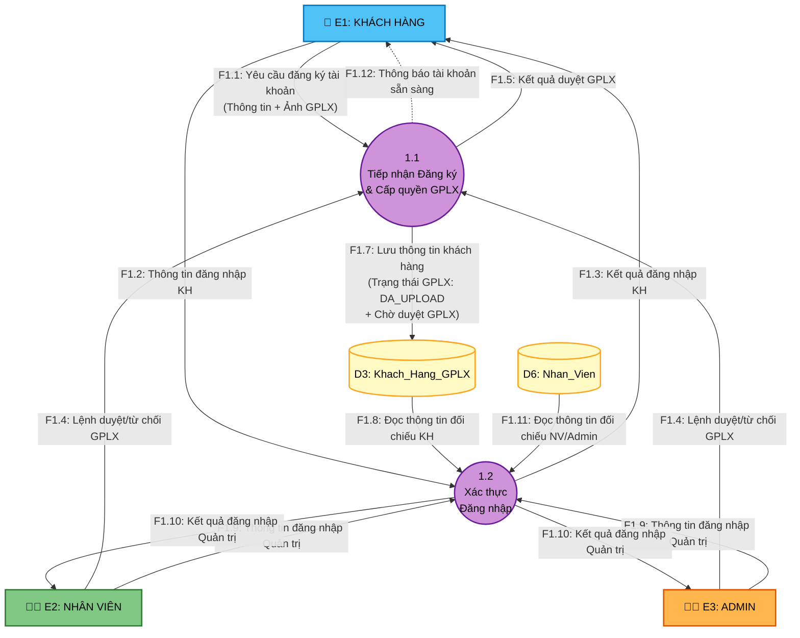
```mermaid
graph TB
    %% === ACTORS ===
    E1["👤 E1: KHÁCH HÀNG"]
    E2["🧑‍💼 E2: NHÂN VIÊN"]
    E3["👨‍💻 E3: ADMIN"]

    %% === DATA STORES ===
    D3[("D3: Khach_Hang_GPLX")]
    D6[("D6: Nhan_Vien")]

    %% === SUB-PROCESSES ===
    P11(("1.1<br/>Tiếp nhận Đăng ký<br/>& Cấp quyền GPLX"))
    P12(("1.2<br/>Xác thực<br/>Đăng nhập"))

    %% === FLOWS - REGISTRATION & AUTO GPLX ===
    E1 -->|"F1.1: Yêu cầu đăng ký tài khoản<br/>(Thông tin + Ảnh GPLX)"| P11
    P11 -->|"F1.7: Lưu thông tin khách hàng<br/>(Trạng thái GPLX: DA_UPLOAD<br/>+ Chờ duyệt GPLX)"| D3
    P11 -.->|"F1.12: Thông báo tài khoản sẵn sàng"| E1
    E2 -->|"F1.4: Lệnh duyệt/từ chối GPLX"| P11
    E3 -->|"F1.4: Lệnh duyệt/từ chối GPLX"| P11
    P11 -->|"F1.5: Kết quả duyệt GPLX"| E1
    
    %% === FLOWS - AUTHENTICATION ===
    E1 -->|"F1.2: Thông tin đăng nhập KH"| P12
    E2 -->|"F1.9: Thông tin đăng nhập Quản trị"| P12
    E3 -->|"F1.9: Thông tin đăng nhập Quản trị"| P12

    D3 -->|"F1.8: Đọc thông tin đối chiếu KH"| P12
    D6 -->|"F1.11: Đọc thông tin đối chiếu NV/Admin"| P12

    P12 -->|"F1.3: Kết quả đăng nhập KH"| E1
    P12 -->|"F1.10: Kết quả đăng nhập Quản trị"| E2
    P12 -->|"F1.10: Kết quả đăng nhập Quản trị"| E3

    %% === STYLES ===
    style E1 fill:#4FC3F7,stroke:#0277BD,color:#000,stroke-width:2px
    style E2 fill:#81C784,stroke:#2E7D32,color:#000,stroke-width:2px
    style E3 fill:#FFB74D,stroke:#E65100,color:#000,stroke-width:2px
    style P11 fill:#CE93D8,stroke:#6A1B9A,color:#000,stroke-width:2px
    style P12 fill:#CE93D8,stroke:#6A1B9A,color:#000,stroke-width:2px
    style D3 fill:#FFF9C4,stroke:#F9A825,color:#000,stroke-width:2px
    style D6 fill:#FFF9C4,stroke:#F9A825,color:#000,stroke-width:2px
```

*   **P1.1 (Tiếp nhận Đăng ký & Cấp quyền GPLX):** Tiếp nhận thông tin đăng ký (`F1.1`). Khách hàng có thể đính kèm ảnh và hệ thống gán `TrangThaiGPLX = DA_UPLOAD` chờ duyệt. Nhân viên/Admin thực hiện duyệt. Khi hợp lệ, dựa vào hạng GPLX khai báo (A1 hoặc A2), hệ thống sẽ gán `NhomXeDuocThue` tương ứng. Nếu chọn "Không có GPLX", gán `TrangThaiGPLX = KHONG_DANG_KY` và `NhomXeDuocThue = Nhom_50cc_Dien`. Toàn bộ thông tin được ghi trực tiếp vào `D3` (`F1.7`).
*   **P1.2 (Xác thực Đăng nhập):** Đóng vai trò là "Cổng bảo mật". Tiến trình đọc thông tin đối chiếu từ `D3` cho Khách hàng và `D6` cho Nhân viên/Admin. Trong quá trình xác thực, nếu tài khoản Nhân viên/Admin trong `D6` có `TrangThaiTaiKhoan = Bi_Khoa`, hệ thống sẽ trả về lỗi ngay cả khi mật khẩu hợp lệ. Nếu hợp lệ, hệ thống trả về kết quả đăng nhập thành công.

---

### 5.2. Tiến trình 2.0 — Đặt xe trực tuyến & Giữ chỗ

Sơ đồ phân rã mức 1 cho tiến trình 2.0 làm rõ quy trình tìm kiếm xe, xác thực GPLX & Blacklist, tự động khóa giữ xe tạm thời 15 phút, quy trình thanh toán cọc thông qua cổng thanh toán, tự động duyệt đơn và lên lịch nhắc nhở.

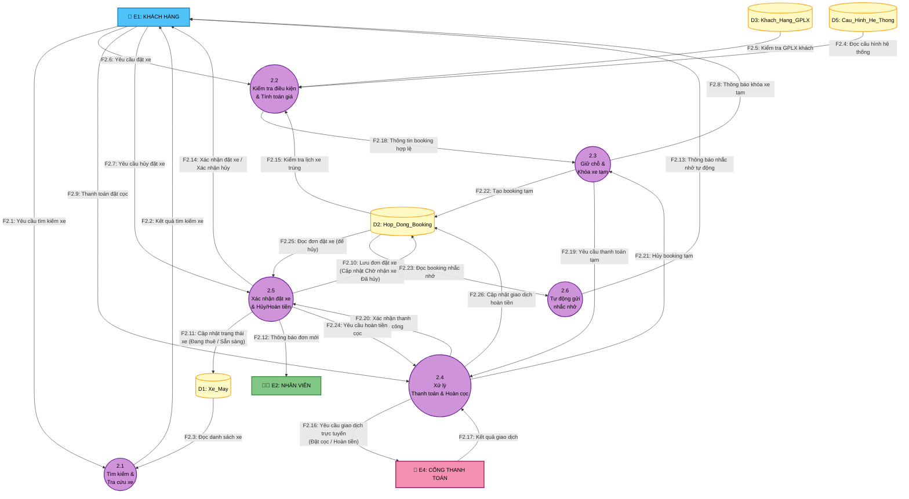
```mermaid
graph TB
    %% === ACTORS ===
    E1["👤 E1: KHÁCH HÀNG"]
    E2["🧑‍💼 E2: NHÂN VIÊN"]
    E4["🏦 E4: CỔNG THANH TOÁN"]

    %% === DATA STORES ===
    D1[("D1: Xe_May")]
    D2[("D2: Hop_Dong_Booking")]
    D3[("D3: Khach_Hang_GPLX")]
    D5[("D5: Cau_Hinh_He_Thong")]

    %% === SUB-PROCESSES ===
    P21(("2.1<br/>Tìm kiếm &<br/>Tra cứu xe"))
    P22(("2.2<br/>Kiểm tra điều kiện<br/>& Tính toán giá"))
    P23(("2.3<br/>Giữ chỗ &<br/>Khóa xe tạm"))
    P24(("2.4<br/>Xử lý<br/>Thanh toán & Hoàn cọc"))
    P25(("2.5<br/>Xác nhận đặt xe<br/>& Hủy/Hoàn tiền"))
    P26(("2.6<br/>Tự động gửi<br/>nhắc nhở"))

    %% === FLOWS ===
    E1 -->|"F2.1: Yêu cầu tìm kiếm xe"| P21
    D1 -->|"F2.3: Đọc danh sách xe"| P21
    P21 -->|"F2.2: Kết quả tìm kiếm xe"| E1

    E1 -->|"F2.6: Yêu cầu đặt xe"| P22
    D3 -->|"F2.5: Kiểm tra GPLX khách"| P22
    D2 -->|"F2.15: Kiểm tra lịch xe trùng"| P22
    D5 -->|"F2.4: Đọc cấu hình hệ thống"| P22
    P22 -->|"F2.18: Thông tin booking hợp lệ"| P23

    P23 -->|"F2.22: Tạo booking tạm"| D2
    P23 -->|"F2.8: Thông báo khóa xe tạm"| E1
    P23 -->|"F2.19: Yêu cầu thanh toán tạm"| P24

    E1 -->|"F2.9: Thanh toán đặt cọc"| P24
    P24 -->|"F2.16: Yêu cầu giao dịch trực tuyến<br/>(Đặt cọc / Hoàn tiền)"| E4
    E4 -->|"F2.17: Kết quả giao dịch"| P24
    P24 -->|"F2.20: Xác nhận thanh toán thành công"| P25
    P24 -->|"F2.21: Hủy booking tạm"| P23

    E1 -->|"F2.7: Yêu cầu hủy đặt xe"| P25
    D2 -->|"F2.25: Đọc đơn đặt xe (để hủy)"| P25
    P25 -->|"F2.10: Lưu đơn đặt xe (Cập nhật Chờ nhận xe / Đã hủy)"| D2
    P25 -->|"F2.11: Cập nhật trạng thái xe (Đang thuê / Sẵn sàng)"| D1
    P25 -->|"F2.14: Xác nhận đặt xe / Xác nhận hủy"| E1
    P25 -->|"F2.12: Thông báo đơn mới"| E2
    P25 -->|"F2.24: Yêu cầu hoàn tiền cọc"| P24
    P24 -->|"F2.26: Cập nhật giao dịch hoàn tiền"| D2

    D2 -->|"F2.23: Đọc booking nhắc nhở"| P26
    P26 -->|"F2.13: Thông báo nhắc nhở tự động"| E1

    %% === STYLES ===
    style E1 fill:#4FC3F7,stroke:#0277BD,color:#000,stroke-width:2px
    style E2 fill:#81C784,stroke:#2E7D32,color:#000,stroke-width:2px
    style E4 fill:#F48FB1,stroke:#880E4F,color:#000,stroke-width:2px
    style P21 fill:#CE93D8,stroke:#6A1B9A,color:#000,stroke-width:2px
    style P22 fill:#CE93D8,stroke:#6A1B9A,color:#000,stroke-width:2px
    style P23 fill:#CE93D8,stroke:#6A1B9A,color:#000,stroke-width:2px
    style P24 fill:#CE93D8,stroke:#6A1B9A,color:#000,stroke-width:2px
    style P25 fill:#CE93D8,stroke:#6A1B9A,color:#000,stroke-width:2px
    style P26 fill:#CE93D8,stroke:#6A1B9A,color:#000,stroke-width:2px
    style D1 fill:#FFF9C4,stroke:#F9A825,color:#000,stroke-width:2px
    style D2 fill:#FFF9C4,stroke:#F9A825,color:#000,stroke-width:2px
    style D3 fill:#FFF9C4,stroke:#F9A825,color:#000,stroke-width:2px
    style D5 fill:#FFF9C4,stroke:#F9A825,color:#000,stroke-width:2px
```

*   **P2.1 (Tìm kiếm & Tra cứu xe):** Tiếp nhận bộ lọc tìm kiếm (`F2.1`), đối chiếu danh sách xe máy khả dụng trong kho `D1` (`F2.3`) và hiển thị kết quả cho khách hàng (`F2.2`).
*   **P2.2 (Kiểm tra điều kiện & Tính toán giá):** Khi nhận yêu cầu đặt xe (`F2.6`), kiểm tra GPLX của khách từ `D3` (`F2.5`) xem có phù hợp với nhóm xe yêu cầu (A1/A2/Xe dưới 50cc). Đọc cấu hình định giá từ `D5` (`F2.4`) để tính giá thuê và tiền cọc. Đọc `D2` (`F2.15`) để kiểm tra xung đột lịch. Nếu hợp lệ, truyền sang `P2.3` qua luồng nội bộ `F2.18`.
*   **P2.3 (Giữ chỗ & Khóa xe tạm):** Dựa trên `F2.18`, ghi nhận booking tạm thời (`TrangThaiBooking = Cho_Xac_Nhan`) vào `D2` (`F2.22`), phát thông báo khóa giữ xe tạm thời 15 phút (`F2.8`) đến khách hàng và gửi yêu cầu thanh toán (`F2.19`) sang `P2.4`.
*   **P2.4 (Xử lý Thanh toán & Hoàn cọc):** Tiếp nhận chứng từ thanh toán cọc (`F2.9`), gửi yêu cầu giao dịch (`F2.16`) sang cổng thanh toán `E4` và nhận lại kết quả (`F2.17`). Gửi tín hiệu thành công (`F2.20`) cho `P2.5`, hoặc tín hiệu hủy giữ chỗ (`F2.21`) cho `P2.3` nếu giao dịch thất bại/quá hạn. Tiếp nhận yêu cầu hoàn tiền (`F2.24`) từ `P2.5` để gửi lệnh hoàn tiền (`F2.16`) sang `E4`, nhận lại kết quả hoàn tiền (`F2.17`) và cập nhật chi tiết giao dịch hoàn tiền vào `D2` (`F2.26`).
*   **P2.5 (Xác nhận đặt xe & Hủy/Hoàn tiền):** Khi nhận tín hiệu cọc thành công (`F2.20`), hệ thống ngay lập tức chuyển trạng thái booking thành `Cho_Nhan_Xe` trong `D2` (`F2.10`) và cập nhật trạng thái xe thành `Dang_Thue` trong `D1` (`F2.11`) một cách tự động 100% (không có bước Staff duyệt chen ngang), gửi xác nhận đặt xe (`F2.14`) đến khách và gửi thông báo đơn mới (`F2.12`) đến nhân viên. Khi nhận yêu cầu hủy đặt xe (`F2.7`), tiến trình tính toán tiền phạt và tự động gửi yêu cầu hoàn tiền (`F2.24`) sang `P2.4`.
*   **P2.6 (Tự động gửi nhắc nhở):** Tiến trình tự động chạy ngầm định kỳ của hệ thống, quét đọc thông tin các booking sắp đến hạn từ `D2` (`F2.23`) để gửi các thông báo nhắc nhở tự động (`F2.13`) đến khách hàng.

---

### 5.3. Tiến trình 3.0 — Gia hạn & Yêu cầu Trả xe sớm

Sơ đồ phân rã mức 1 cho tiến trình 3.0 chi tiết hóa quy trình tự động gia hạn hợp đồng qua ứng dụng (kiểm tra hạn mức gia hạn, trùng lịch) và luồng xử lý yêu cầu trả xe sớm.

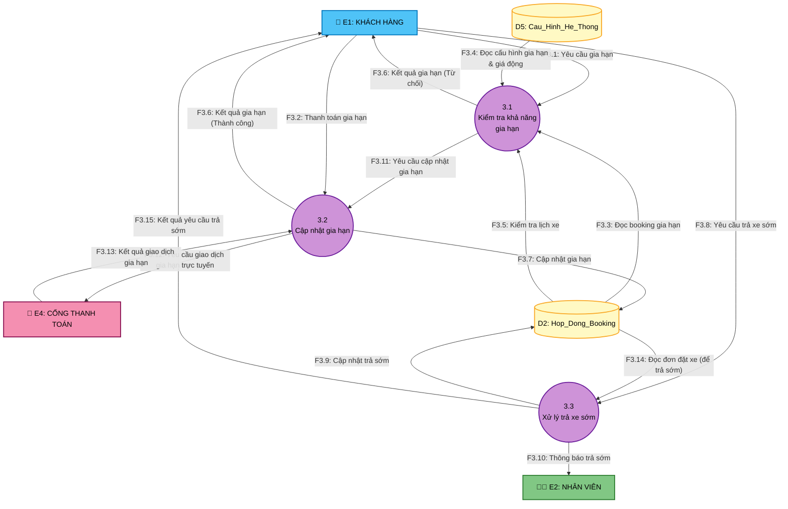
```mermaid
graph TB
    %% === ACTORS ===
    E1["👤 E1: KHÁCH HÀNG"]
    E2["🧑‍💼 E2: NHÂN VIÊN"]
    E4["🏦 E4: CỔNG THANH TOÁN"]

    %% === DATA STORES ===
    D2[("D2: Hop_Dong_Booking")]
    D5[("D5: Cau_Hinh_He_Thong")]

    %% === SUB-PROCESSES ===
    P31(("3.1<br/>Kiểm tra khả năng<br/>gia hạn"))
    P32(("3.2<br/>Cập nhật gia hạn"))
    P33(("3.3<br/>Xử lý trả xe sớm"))

    %% === FLOWS ===
    E1 -->|"F3.1: Yêu cầu gia hạn"| P31
    D2 -->|"F3.3: Đọc booking gia hạn"| P31
    D5 -->|"F3.4: Đọc cấu hình gia hạn & giá động"| P31
    D2 -->|"F3.5: Kiểm tra lịch xe"| P31
    P31 -->|"F3.11: Yêu cầu cập nhật gia hạn"| P32
    P31 -->|"F3.6: Kết quả gia hạn (Từ chối)"| E1

    E1 -->|"F3.2: Thanh toán gia hạn"| P32
    P32 -->|"F3.7: Cập nhật gia hạn"| D2
    P32 -->|"F3.6: Kết quả gia hạn (Thành công)"| E1
    P32 -->|"F3.12: Yêu cầu giao dịch gia hạn trực tuyến"| E4
    E4 -->|"F3.13: Kết quả giao dịch gia hạn"| P32

    E1 -->|"F3.8: Yêu cầu trả xe sớm"| P33
    D2 -->|"F3.14: Đọc đơn đặt xe (để trả sớm)"| P33
    P33 -->|"F3.9: Cập nhật trả sớm"| D2
    P33 -->|"F3.10: Thông báo trả sớm"| E2
    P33 -->|"F3.15: Kết quả yêu cầu trả sớm"| E1

    %% === STYLES ===
    style E1 fill:#4FC3F7,stroke:#0277BD,color:#000,stroke-width:2px
    style E2 fill:#81C784,stroke:#2E7D32,color:#000,stroke-width:2px
    style E4 fill:#F48FB1,stroke:#880E4F,color:#000,stroke-width:2px
    style P31 fill:#CE93D8,stroke:#6A1B9A,color:#000,stroke-width:2px
    style P32 fill:#CE93D8,stroke:#6A1B9A,color:#000,stroke-width:2px
    style P33 fill:#CE93D8,stroke:#6A1B9A,color:#000,stroke-width:2px
    style D2 fill:#FFF9C4,stroke:#F9A825,color:#000,stroke-width:2px
    style D5 fill:#FFF9C4,stroke:#F9A825,color:#000,stroke-width:2px
```

*   **P3.1 (Kiểm tra khả năng gia hạn):** Tiếp nhận yêu cầu gia hạn (`F3.1`), đọc thông tin booking gốc từ `D2` (`F3.3`) để đối chiếu số lần gia hạn hiện tại (phải < 3 lần). Đọc cấu hình giới hạn gia hạn và bảng giá động theo ngày từ `D5` (`F3.4`) để tính toán lại số tiền phụ thu theo giá trị thực tế của ngày gia hạn. Đồng thời đọc `D2` (`F3.5`) để kiểm tra xe có bị trùng lịch thuê của khách hàng khác.
    *   *Không hợp lệ / Trùng lịch:* Gửi phản hồi từ chối gia hạn (`F3.6`) cho khách hàng.
    *   *Hợp lệ:* Truyền thông tin phê duyệt (`F3.11`) sang tiến trình 3.2.
*   **P3.2 (Cập nhật gia hạn):** Nhận lệnh gia hạn hợp lệ `F3.11`, nhận thông tin thanh toán tiền gia hạn phụ thu (`F3.2`). Tiến trình gửi yêu cầu giao dịch gia hạn (`F3.12`) đến Cổng thanh toán `E4`, nhận kết quả giao dịch (`F3.13`), và nếu thành công, tiến hành cập nhật lại thời gian trả xe mới (`ThoiGianTra`), số lần gia hạn (`SoLanGiaHan += 1`) cùng tổng tiền gia hạn phụ thu vào kho booking `D2` (`F3.7`), đồng thời gửi thông báo xác nhận gia hạn thành công (`F3.6`) cho khách hàng.
*   **P3.3 (Xử lý trả xe sớm):** Tiếp nhận yêu cầu trả xe sớm trước thời hạn ít nhất 1 giờ (`F3.8`). Tiến trình đọc đơn đặt xe tương ứng từ `D2` (`F3.14`) để kiểm tra trạng thái đơn phải là `DANG_THUE`. Nếu không thỏa mãn (ví dụ: đã quá giờ trả hoặc trễ giờ trả mà không gia hạn), hoặc nếu thời điểm gửi yêu cầu cách giờ trả mong muốn dưới 1 tiếng, gửi phản hồi lỗi cho khách hàng (`F3.15`). Nếu hợp lệ, cập nhật cờ `CoTraSom = TRUE` và chuyển đổi trạng thái booking thành `YEU_CAU_TRA_SOM` trong `D2` (`F3.9`), đồng thời gửi thông báo điều phối trả xe sớm (`F3.10`) đến nhân viên tại quầy và gửi kết quả xác nhận thành công (`F3.15`) cho khách hàng.

---

### 5.4. Tiến trình 4.0 — Nhận xe & Quyết toán phụ phí

Sơ đồ phân rã mức 1 cho tiến trình 4.0 làm rõ quy trình quản lý danh sách công việc giao nhận trong ngày, quy trình Check-in giao xe, quy trình Check-out nhận lại xe, thuật toán tự động tính toán phụ phí phạt muộn lũy tiến và tổng quyết toán hợp đồng.

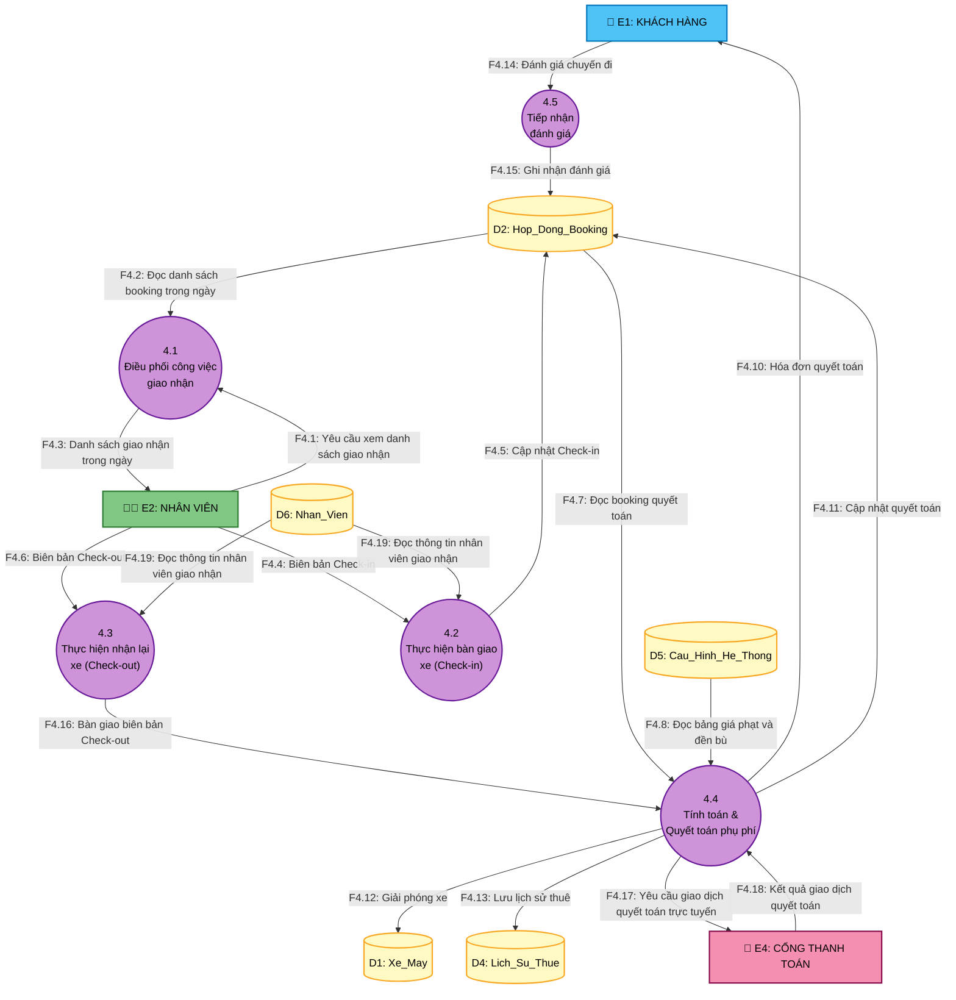
```mermaid
graph TB
    %% === ACTORS ===
    E1["👤 E1: KHÁCH HÀNG"]
    E2["🧑‍💼 E2: NHÂN VIÊN"]
    E4["🏦 E4: CỔNG THANH TOÁN"]

    %% === DATA STORES ===
    D1[("D1: Xe_May")]
    D2[("D2: Hop_Dong_Booking")]
    D4[("D4: Lich_Su_Thue")]
    D5[("D5: Cau_Hinh_He_Thong")]
    D6[("D6: Nhan_Vien")]

    %% === SUB-PROCESSES ===
    P41(("4.1<br/>Điều phối công việc<br/>giao nhận"))
    P42(("4.2<br/>Thực hiện bàn giao<br/>xe (Check-in)"))
    P43(("4.3<br/>Thực hiện nhận lại<br/>xe (Check-out)"))
    P44(("4.4<br/>Tính toán &<br/>Quyết toán phụ phí"))
    P45(("4.5<br/>Tiếp nhận<br/>đánh giá"))

    %% === FLOWS ===
    E2 -->|"F4.1: Yêu cầu xem danh sách giao nhận"| P41
    D2 -->|"F4.2: Đọc danh sách booking trong ngày"| P41
    P41 -->|"F4.3: Danh sách giao nhận trong ngày"| E2

    E2 -->|"F4.4: Biên bản Check-in"| P42
    D6 -->|"F4.19: Đọc thông tin nhân viên giao nhận"| P42
    P42 -->|"F4.5: Cập nhật Check-in"| D2

    E2 -->|"F4.6: Biên bản Check-out"| P43
    D6 -->|"F4.19: Đọc thông tin nhân viên giao nhận"| P43
    P43 -->|"F4.16: Bàn giao biên bản Check-out"| P44

    D2 -->|"F4.7: Đọc booking quyết toán"| P44
    D5 -->|"F4.8: Đọc bảng giá phạt và đền bù"| P44
    P44 -->|"F4.10: Hóa đơn quyết toán"| E1
    P44 -->|"F4.11: Cập nhật quyết toán"| D2
    P44 -->|"F4.12: Giải phóng xe"| D1
    P44 -->|"F4.13: Lưu lịch sử thuê"| D4
    P44 -->|"F4.17: Yêu cầu giao dịch quyết toán trực tuyến"| E4
    E4 -->|"F4.18: Kết quả giao dịch quyết toán"| P44

    E1 -->|"F4.14: Đánh giá chuyến đi"| P45
    P45 -->|"F4.15: Ghi nhận đánh giá"| D2

    %% === STYLES ===
    style E1 fill:#4FC3F7,stroke:#0277BD,color:#000,stroke-width:2px
    style E2 fill:#81C784,stroke:#2E7D32,color:#000,stroke-width:2px
    style E4 fill:#F48FB1,stroke:#880E4F,color:#000,stroke-width:2px
    style P41 fill:#CE93D8,stroke:#6A1B9A,color:#000,stroke-width:2px
    style P42 fill:#CE93D8,stroke:#6A1B9A,color:#000,stroke-width:2px
    style P43 fill:#CE93D8,stroke:#6A1B9A,color:#000,stroke-width:2px
    style P44 fill:#CE93D8,stroke:#6A1B9A,color:#000,stroke-width:2px
    style P45 fill:#CE93D8,stroke:#6A1B9A,color:#000,stroke-width:2px
    style D1 fill:#FFF9C4,stroke:#F9A825,color:#000,stroke-width:2px
    style D2 fill:#FFF9C4,stroke:#F9A825,color:#000,stroke-width:2px
    style D4 fill:#FFF9C4,stroke:#F9A825,color:#000,stroke-width:2px
    style D5 fill:#FFF9C4,stroke:#F9A825,color:#000,stroke-width:2px
    style D6 fill:#FFF9C4,stroke:#F9A825,color:#000,stroke-width:2px
```

*   **P4.1 (Điều phối công việc giao nhận):** Nhân viên gửi yêu cầu truy vấn danh sách công việc giao nhận trong ngày (`F4.1`). Tiến trình đọc dữ liệu đơn thuê từ `D2` (`F4.2`) có mốc thời gian trong ngày và trả về danh sách phân phối cụ thể (`F4.3`).
*   **P4.2 (Thực hiện bàn giao xe - Check-in):** Khi tiến hành giao xe, nhân viên cửa hàng điền biên bản bàn giao gồm chỉ số ODO giao, mức xăng giao, phụ kiện đi kèm và ảnh ngoại quan (`F4.4`). Tiến trình đọc thông tin tài khoản nhân viên từ `D6` (`F4.19`) để kiểm tra trạng thái. Nếu tài khoản nhân viên hoạt động (`Hoat_Dong`), tiến trình cập nhật thông tin Check-in và chuyển trạng thái booking sang `DANG_THUE` trong `D2` (`F4.5`). Nếu bị khóa, hệ thống từ chối Check-in.
*   **P4.3 (Thực hiện nhận lại xe - Check-out):** Khi khách trả xe, nhân viên nghiệm thu xe và điền biên bản nhận lại (`F4.6`). Tiến trình đọc thông tin tài khoản nhân viên từ `D6` (`F4.19`) để kiểm tra trạng thái hoạt động. Nếu tài khoản nhân viên hoạt động, tiến trình chuyển biên bản Check-out sang tiến trình 4.4 qua luồng `F4.16` để thực hiện quyết toán. Nếu bị khóa, hệ thống từ chối Check-out.
*   **P4.4 (Tính toán & Quyết toán phụ phí):** Tiếp nhận dữ liệu biên bản trả xe `F4.16`, đọc chi tiết hợp đồng từ `D2` (`F4.7`) và đọc cấu hình bảng giá phạt/đền bù từ `D5` (`F4.8`) để thực hiện:
    *   Tính toán thời gian trễ hạn và áp dụng logic phạt muộn lũy tiến (trễ dưới 2h ân hạn, trễ 2-6h phạt theo giờ nhưng tối đa không quá 1/2 ngày thuê xe, trễ 6-12h phạt 1/2 ngày, trễ trên 12h phạt 1 ngày thuê).
    *   Tính tổng chi phí quyết toán dựa trên công thức nghiệp vụ (Tiền thuê gốc + Tăng giá ngày lễ - Giảm giá thuê dài ngày + Tiền gia hạn + Phí phạt trễ hạn + Phí đền bù hư hại/mất phụ kiện - Tiền cọc).
    *   Nếu tổng quyết toán chênh lệch, đặc biệt là trường hợp cần hoàn tiền cọc dư cho khách, hệ thống TỰ ĐỘNG gọi API và gửi yêu cầu giao dịch quyết toán/hoàn tiền (`F4.17`) sang Cổng thanh toán `E4` mà không cần sự can thiệp thủ công của nhân viên. Sau khi nhận kết quả giao dịch thành công (`F4.18`), tiến hành xuất hóa đơn quyết toán (`F4.10`), cập nhật booking thành `HOAN_TAT` trong `D2` (`F4.11`), cập nhật trạng thái xe thành `SAN_SANG` và ODO trong `D1` (`F4.12`), lưu vào lịch sử thuê `D4` (`F4.13`).
*   **P4.5 (Tiếp nhận đánh giá):** Nhận thông tin đánh giá chất lượng dịch vụ (`F4.14`) của khách hàng gửi sau chuyến đi để cập nhật ghi nhận (`F4.15`) vào kho `D2`.

---

### 5.5. Tiến trình 5.0 — Tra cứu Lịch sử thuê & Quản lý Blacklist

Sơ đồ phân rã mức 1 cho tiến trình 5.0 làm rõ quy trình tra cứu dữ liệu thuê xe phục vụ nghiệp vụ xử lý vi phạm giao thông (phạt nguội) và kiểm soát danh sách đen (Blacklist).

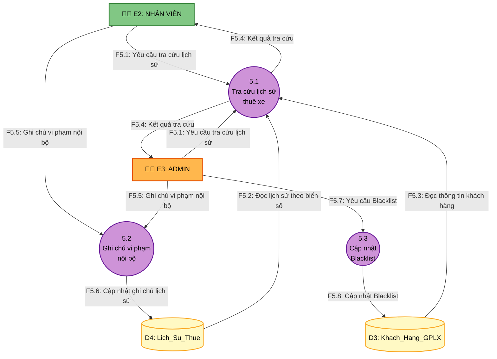
```mermaid
graph TB
    %% === ACTORS ===
    E2["🧑‍💼 E2: NHÂN VIÊN"]
    E3["👨‍💻 E3: ADMIN"]

    %% === DATA STORES ===
    D3[("D3: Khach_Hang_GPLX")]
    D4[("D4: Lich_Su_Thue")]

    %% === SUB-PROCESSES ===
    P51(("5.1<br/>Tra cứu lịch sử<br/>thuê xe"))
    P52(("5.2<br/>Ghi chú vi phạm<br/>nội bộ"))
    P53(("5.3<br/>Cập nhật<br/>Blacklist"))

    %% === FLOWS ===
    E2 -->|"F5.1: Yêu cầu tra cứu lịch sử"| P51
    E3 -->|"F5.1: Yêu cầu tra cứu lịch sử"| P51
    D4 -->|"F5.2: Đọc lịch sử theo biển số"| P51
    D3 -->|"F5.3: Đọc thông tin khách hàng"| P51
    P51 -->|"F5.4: Kết quả tra cứu"| E2
    P51 -->|"F5.4: Kết quả tra cứu"| E3

    E2 -->|"F5.5: Ghi chú vi phạm nội bộ"| P52
    E3 -->|"F5.5: Ghi chú vi phạm nội bộ"| P52
    P52 -->|"F5.6: Cập nhật ghi chú lịch sử"| D4

    E3 -->|"F5.7: Yêu cầu Blacklist"| P53
    P53 -->|"F5.8: Cập nhật Blacklist"| D3

    %% === STYLES ===
    style E2 fill:#81C784,stroke:#2E7D32,color:#000,stroke-width:2px
    style E3 fill:#FFB74D,stroke:#E65100,color:#000,stroke-width:2px
    style P51 fill:#CE93D8,stroke:#6A1B9A,color:#000,stroke-width:2px
    style P52 fill:#CE93D8,stroke:#6A1B9A,color:#000,stroke-width:2px
    style P53 fill:#CE93D8,stroke:#6A1B9A,color:#000,stroke-width:2px
    style D3 fill:#FFF9C4,stroke:#F9A825,color:#000,stroke-width:2px
    style D4 fill:#FFF9C4,stroke:#F9A825,color:#000,stroke-width:2px
```

*   **P5.1 (Tra cứu lịch sử thuê xe):** Nhân viên hoặc Admin gửi yêu cầu tra cứu (`F5.1`) bao gồm biển số xe và khoảng thời gian vi phạm giao thông. Tiến trình thực hiện truy vấn đối chiếu lịch sử thuê trong `D4` (`F5.2`), đồng thời đọc thông tin cá nhân khách hàng trong `D3` (`F5.3`) để xuất kết quả đối chiếu (`F5.4`). **Lưu ý:** Hệ thống chỉ xuất dữ liệu cung cấp thông tin người dùng phương tiện hỗ trợ việc nhân viên đi đóng phạt nguội; việc đi đóng phạt thực tế là quy trình thủ công ngoài hệ thống.
*   **P5.2 (Ghi chú vi phạm nội bộ):** Nhân viên hoặc Admin gửi thông tin ghi nhận lỗi vi phạm phạt nguội (`F5.5`) để lưu vết trực tiếp vào bản ghi lịch sử thuê tương ứng trong `D4` (`F5.6`) dưới dạng `DanhDauViPham = TRUE` VÀ ghi chú nội bộ.
*   **P5.3 (Cập nhật Blacklist):** Tiếp nhận yêu cầu đưa khách hàng vi phạm nghiêm trọng vào danh sách đen từ Admin (`F5.7`). Tiến trình cập nhật lại cờ `TrangThaiBlacklist = TRUE` cùng lý do chi tiết vào hồ sơ khách hàng trong kho `D3` (`F5.8`).

---

### 5.6. Tiến trình 6.0 — Quản lý Danh mục, Nhân viên & Cấu hình Hệ thống [MỚI]

Sơ đồ phân rã mức 1 cho tiến trình 6.0 làm rõ quy trình quản lý thông tin xe máy, quản lý tài khoản nhân viên và quản lý cấu hình hệ thống của Admin.

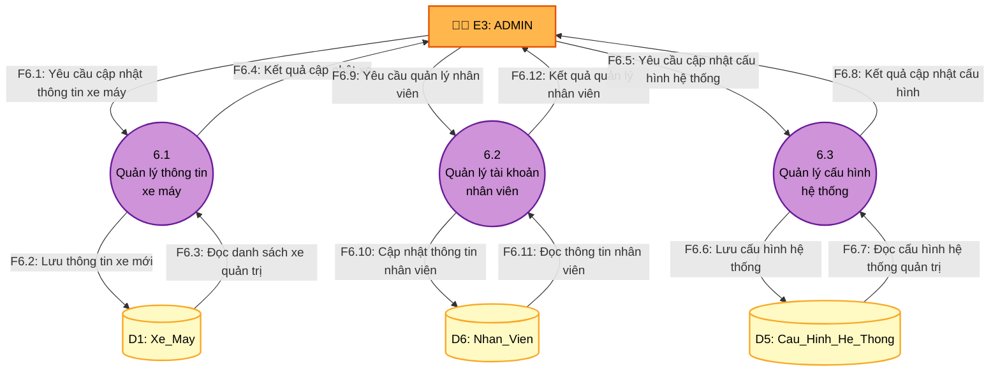
```mermaid
graph TB
    %% === ACTORS ===
    E3["👨‍💻 E3: ADMIN"]

    %% === DATA STORES ===
    D1[("D1: Xe_May")]
    D5[("D5: Cau_Hinh_He_Thong")]
    D6[("D6: Nhan_Vien")]

    %% === SUB-PROCESSES ===
    P61(("6.1<br/>Quản lý thông tin<br/>xe máy"))
    P62(("6.2<br/>Quản lý tài khoản<br/>nhân viên"))
    P63(("6.3<br/>Quản lý cấu hình<br/>hệ thống"))

    %% === FLOWS ===
    E3 -->|"F6.1: Yêu cầu cập nhật thông tin xe máy"| P61
    D1 -->|"F6.3: Đọc danh sách xe quản trị"| P61
    P61 -->|"F6.2: Lưu thông tin xe mới"| D1
    P61 -->|"F6.4: Kết quả cập nhật xe"| E3

    E3 -->|"F6.9: Yêu cầu quản lý nhân viên"| P62
    D6 -->|"F6.11: Đọc thông tin nhân viên"| P62
    P62 -->|"F6.10: Cập nhật thông tin nhân viên"| D6
    P62 -->|"F6.12: Kết quả quản lý nhân viên"| E3

    E3 -->|"F6.5: Yêu cầu cập nhật cấu hình hệ thống"| P63
    D5 -->|"F6.7: Đọc cấu hình hệ thống quản trị"| P63
    P63 -->|"F6.6: Lưu cấu hình hệ thống"| D5
    P63 -->|"F6.8: Kết quả cập nhật cấu hình"| E3

    %% === STYLES ===
    style E3 fill:#FFB74D,stroke:#E65100,color:#000,stroke-width:2px
    style P61 fill:#CE93D8,stroke:#6A1B9A,color:#000,stroke-width:2px
    style P62 fill:#CE93D8,stroke:#6A1B9A,color:#000,stroke-width:2px
    style P63 fill:#CE93D8,stroke:#6A1B9A,color:#000,stroke-width:2px
    style D1 fill:#FFF9C4,stroke:#F9A825,color:#000,stroke-width:2px
    style D5 fill:#FFF9C4,stroke:#F9A825,color:#000,stroke-width:2px
    style D6 fill:#FFF9C4,stroke:#F9A825,color:#000,stroke-width:2px
```

*   **P6.1 (Quản lý thông tin xe máy):** Tiếp nhận yêu cầu cập nhật thông tin xe máy từ Admin (`F6.1`), đối chiếu danh sách xe hiện tại trong `D1` (`F6.3`) để kiểm tra tính hợp lệ (biển số/số khung không trùng), tiến hành lưu thông tin xe mới/đã chỉnh sửa vào `D1` (`F6.2`) và phản hồi kết quả cập nhật (`F6.4`) về cho Admin.
*   **P6.2 (Quản lý tài khoản nhân viên):** Tiếp nhận yêu cầu quản lý nhân viên từ Admin (`F6.9`). Tiến trình kiểm tra thông tin nhân viên hiện tại trong `D6` (`F6.11`), thực hiện lưu mới hoặc chỉnh sửa/khóa tài khoản nhân viên vào `D6` (`F6.10`), và gửi thông báo kết quả (`F6.12`) cho Admin.
*   **P6.3 (Quản lý cấu hình hệ thống):** Tiếp nhận yêu cầu điều chỉnh các tham số cấu hình hệ thống từ Admin (`F6.5`), đọc thông tin cấu hình hiện tại từ `D5` (`F6.7`) để ghi đè cấu hình mới vào `D5` (`F6.6`) và phản hồi kết quả xác nhận (`F6.8`) về cho Admin.

---

> **Ghi chú tổng hợp:**
> - Tất cả tên luồng dữ liệu (F1.1 → F6.12), kho dữ liệu (D1 → D6), và thuộc tính được sử dụng **đồng nhất 100%** với tài liệu [Từ điển dữ liệu](file:///Users/vqd2k6/Desktop/PTTKHT-UTH/Project-KTHP/docs/data-dictionary.md).
> - Mã Mermaid.js sử dụng cú pháp `graph TB` (Top-Bottom), có thể nhúng trực tiếp vào báo cáo Markdown hoặc render qua Mermaid Live Editor.
> - **Nghiệp vụ phạt nguội giao thông** là quy trình dân sự bên ngoài. Hệ thống chỉ hỗ trợ tra cứu lịch sử thuê (P5.0) để NV/Admin tự xử lý offline với cơ quan chức năng và khách hàng.


Để làm rõ logic nghiệp vụ và các quy tắc rẽ nhánh cụ thể của từng tiến trình trong DFD, dưới đây là tài liệu Đặc tả tiến trình (Process Specifications - PS) tương ứng.


## 1. TIẾN TRÌNH 1.0 — ĐĂNG KÝ & TỰ ĐỘNG PHÂN QUYỀN GPLX

### 1.1. Structured English (Ngôn ngữ cấu trúc)

```text
PROCESS 1.0: Đăng ký & Xét duyệt GPLX (Nhân viên/Admin duyệt)
BEGIN
    RECEIVE F1.1: Yêu cầu đăng ký tài khoản (HoTen, Email, SoDienThoai, MatKhau, LuaChonGPLX, HangGPLX, AnhGPLXMatTruoc, AnhGPLXMatSau)
    
    // Bước 1: Kiểm tra tính hợp lệ dữ liệu đầu vào cơ bản
    IF Email không đúng định dạng HOẶC SoDienThoai không phải dạng số THEN
        SEND Thông báo lỗi "Dữ liệu đầu vào không hợp lệ" to Khách hàng E1
        TERMINATE PROCESS
    ENDIF

    // Bước 2: Kiểm tra trùng lặp tài khoản
    READ D3: Khach_Hang_GPLX
        WHERE D3.Email = Email OR D3.SoDienThoai = SoDienThoai
    IF Tìm thấy bản ghi tương ứng trong D3 THEN
        SEND Thông báo lỗi "Tài khoản đã tồn tại trên hệ thống" to Khách hàng E1
        TERMINATE PROCESS
    ENDIF

    // Bước 3: Đăng ký GPLX chờ duyệt
    IF LuaChonGPLX = 'Co_GPLX' AND (AnhGPLXMatTruoc IS NOT NULL OR AnhGPLXMatSau IS NOT NULL) THEN
        // Khách có GPLX và đã tải ảnh lên, chờ NV/Admin duyệt
        SET TrangThaiGPLX = 'DA_UPLOAD'
        SET NhomXeDuocThue = 'Nhom_50cc_Dien' // Mặc định trước khi duyệt
    ELSE
        // Khách không khai báo GPLX hoặc chưa tải ảnh
        SET TrangThaiGPLX = 'Khong_Dang_Ky'
        SET NhomXeDuocThue = 'Nhom_50cc_Dien'
    ENDIF
    
    // Bước 4: Ghi thông tin tài khoản vào kho D3
    WRITE D3: Khach_Hang_GPLX
        VALUES (MaKhachHang = AutoGen, HoTen, Email, SoDienThoai, MatKhau = Hash(MatKhau),
                LuaChonGPLX, HangGPLX, AnhGPLXMatTruoc, AnhGPLXMatSau,
                TrangThaiGPLX = TrangThaiGPLX, NhomXeDuocThue = NhomXeDuocThue,
                TrangThaiBlacklist = FALSE, NgayTao = CurrentTime)
    
    SEND F1.6: Thông báo tài khoản tạo thành công to Khách hàng E1

    // Bước 5: NV/Admin xét duyệt GPLX (Nghiệp vụ độc lập)
    IF RECEIVE F1.4: Lệnh duyệt/từ chối GPLX (KetQuaDuyet) THEN
        IF KetQuaDuyet = 'APPROVE' THEN
            IF HangGPLX = 'A2' THEN SET NhomXeDuocThue = 'Nhom_A2_PKL'
            ELSE IF HangGPLX = 'A1' THEN SET NhomXeDuocThue = 'Nhom_A1'
            ENDIF
            UPDATE D3: Khach_Hang_GPLX SET TrangThaiGPLX = 'DA_XAC_MINH', NhomXeDuocThue = NhomXeDuocThue
        ELSE
            UPDATE D3: Khach_Hang_GPLX SET TrangThaiGPLX = 'TU_CHOI'
        ENDIF
        SEND F1.5: Kết quả duyệt GPLX to Khách hàng E1
    ENDIF
END
```

### 1.2. Decision Table (Bảng quyết định)

Bảng quyết định dưới đây thể hiện quy tắc **tự động phân hạng** nhóm xe được phép thuê dựa trên dữ liệu khách hàng tự khai báo khi đăng ký:

| Điều kiện (Conditions) | Q1 | Q2 | Q3 | Q4 | Q5 |
| :--- | :---: | :---: | :---: | :---: | :---: |
| Khách hàng có tải ảnh GPLX lên (`AnhGPLX IS NOT NULL`)? | Y | Y | Y | N | Bất kỳ |
| Hạng GPLX hiện tại của khách hàng là gì? | Bất kỳ | Bất kỳ | Bất kỳ | Bất kỳ | Bất kỳ |
| Kết quả xét duyệt từ Nhân viên/Admin? | APPROVE (A2) | APPROVE (A1) | REJECT | Không cần duyệt | - |
| **Hành động (Actions)** | | | | | |
| Cập nhật `TrangThaiGPLX = DA_UPLOAD` (Chờ duyệt) | | | | | X |
| Cập nhật `TrangThaiGPLX = DA_XAC_MINH` | X | X | | | |
| Cập nhật `TrangThaiGPLX = TU_CHOI` | | | X | | |
| Cập nhật `TrangThaiGPLX = Khong_Dang_Ky` | | | | X | |
| Gán nhóm xe được thuê = `Nhom_A2_PKL` | X | | | | |
| Gán nhóm xe được thuê = `Nhom_A1` | | X | | | |
| Gán nhóm xe được thuê = `Nhom_50cc_Dien` | | | X | X | X |

### 1.3. Decision Tree (Cây quyết định)

```mermaid
graph LR
    A["Khách đăng ký tài khoản"] --> B{"Có tải ảnh GPLX lên?"}
    B -->|"Không tải / Không có GPLX"| C["TrangThaiGPLX = Khong_Dang_Ky\nNhomXeDuocThue = Nhom_50cc_Dien"]
    B -->|"Có tải ảnh GPLX lên"| D["TrangThaiGPLX = DA_UPLOAD\nChờ NV/Admin duyệt"]
    D --> E{"Kết quả duyệt"}
    E -->|"APPROVE (A2)"| F["TrangThaiGPLX = DA_XAC_MINH\nNhomXeDuocThue = Nhom_A2_PKL"]
    E -->|"APPROVE (A1)"| G["TrangThaiGPLX = DA_XAC_MINH\nNhomXeDuocThue = Nhom_A1"]
    E -->|"REJECT"| H["TrangThaiGPLX = TU_CHOI\nNhomXeDuocThue = Nhom_50cc_Dien"]
    C --> I["Ghi vào D3"]
    F --> I
    G --> I
    H --> I
```

---

## 2. TIẾN TRÌNH 2.0 — ĐẶT XE TRỰC TUYẾN & GIỮ CHỖ

### 2.1. Structured English (Ngôn ngữ cấu trúc)

```text
PROCESS 2.0: Đặt xe trực tuyến & Giữ chỗ
BEGIN
    // Xử lý Tìm kiếm xe máy khả dụng
    IF RECEIVE F2.1: Yêu cầu tìm kiếm xe THEN
        READ D1: Xe_May WHERE TrangThaiXe = 'San_Sang' AND (LoaiXe, HangXe, PhanKhoi khớp bộ lọc)
        READ D5: Cau_Hinh_He_Thong (Đọc bảng giá cơ bản)
        SEND F2.2: Kết quả tìm kiếm xe to Khách hàng E1
    ENDIF

    // Xử lý Đặt xe giữ chỗ
    IF RECEIVE F2.6: Yêu cầu đặt xe (MaKhachHang, MaXe, ThoiGianNhan, ThoiGianTra) THEN
        // Kiểm tra Blacklist
        READ D3: Khach_Hang_GPLX WHERE D3.MaKhachHang = MaKhachHang
        IF D3.TrangThaiBlacklist = TRUE THEN
            SEND Thông báo lỗi "Tài khoản nằm trong danh sách hạn chế" to Khách hàng E1
            TERMINATE PROCESS
        ENDIF

        // Kiểm tra phân quyền GPLX đối với nhóm xe máy đã chọn
        READ D1: Xe_May WHERE D1.MaXe = MaXe
        IF D1.NhomXe = 'Nhom_A2_PKL' AND D3.NhomXeDuocThue != 'Nhom_A2_PKL' THEN
            SEND Thông báo lỗi "Yêu cầu GPLX hạng A2 để đặt dòng xe này" to Khách hàng E1
            TERMINATE PROCESS
        ELSE IF D1.NhomXe = 'Nhom_A1' AND D3.NhomXeDuocThue = 'Nhom_50cc_Dien' THEN
            SEND Thông báo lỗi "Yêu cầu GPLX hạng A1 hoặc A2 để đặt dòng xe này" to Khách hàng E1
            TERMINATE PROCESS
        ENDIF

        // Kiểm tra lịch trùng phương tiện
        READ D2: Hop_Dong_Booking WHERE D2.MaXe = MaXe AND TrangThaiBooking != 'DA_HUY'
            AND (ThoiGianNhan < D2.ThoiGianTra AND ThoiGianTra > D2.ThoiGianNhan)
        IF Tìm thấy lịch trùng THEN
            SEND Thông báo lỗi "Xe đã được đặt trong khoảng thời gian này" to Khách hàng E1
            TERMINATE PROCESS
        ENDIF

        // Tạo đơn hàng tạm, giữ xe 15 phút
        WRITE D2: Hop_Dong_Booking
            VALUES (MaBooking = AutoGen, MaKhachHang, MaXe, ThoiGianNhan, ThoiGianTra, TrangThaiBooking = 'CHO_THANH_TOAN_COC', ThoiGianTao = CurrentTime)
        UPDATE D1: Xe_May SET TrangThaiXe = 'KHOA_TAM_15M' WHERE D1.MaXe = MaXe
        SEND F2.8: Thông báo khóa xe tạm (15 phút chờ cọc) to Khách hàng E1

        // Tính toán tiền đặt cọc (30% tổng tiền thuê)
        READ D5: Cau_Hinh_He_Thong (Đọc thông số chiết khấu dài ngày và phụ thu ngày lễ)
        SET DonGia = D1.DonGiaMoiNgay
        SET SoNgay = ThoiGianTra - ThoiGianNhan
        SET TongTienThue = DonGia * SoNgay
        IF SoNgay >= 14 THEN APPLY Chiết khấu dài ngày 15%
        ELSE IF SoNgay >= 7 THEN APPLY Chiết khấu dài ngày 10%
        ELSE IF SoNgay >= 3 THEN APPLY Chiết khấu dài ngày 5%
        ENDIF
        IF ThoiGianNhan thuộc Ngày Lễ/Tết THEN APPLY Phụ thu giá ngày lễ +30%
        ENDIF
        SET TienCoc = TongTienThue * 30%

        // Giao dịch thanh toán cọc trực tuyến
        SEND F2.16: Yêu cầu giao dịch trực tuyến (TienCoc, MaBooking, LoaiGiaoDich = 'Dat_Coc') to Cổng thanh toán E4
        RECEIVE F2.17: Kết quả giao dịch (MaBooking, TrangThaiGD)
        
        IF TrangThaiGD = 'Thanh_Cong' THEN
            UPDATE D2: Hop_Dong_Booking SET TrangThaiBooking = 'CHO_NHAN_XE' WHERE D2.MaBooking = MaBooking
            UPDATE D1: Xe_May SET TrangThaiXe = 'Dang_Thue' WHERE D1.MaXe = D2.MaXe
            SEND F2.14: Xác nhận đặt xe thành công to Khách hàng E1
            SEND F2.12: Thông báo đơn mới to Nhân viên E2 chuẩn bị bàn giao
        ELSE
            // Giao dịch thất bại hoặc quá 15 phút không thanh toán
            UPDATE D2: Hop_Dong_Booking SET TrangThaiBooking = 'DA_HUY' WHERE D2.MaBooking = MaBooking
            UPDATE D1: Xe_May SET TrangThaiXe = 'San_Sang' WHERE D1.MaXe = MaXe
            SEND Thông báo lỗi "Giao dịch cọc thất bại hoặc hết hạn giữ chỗ" to Khách hàng E1
        ENDIF
    ENDIF

    // Xử lý Hủy đặt xe và tính hoàn tiền cọc
    IF RECEIVE F2.7: Yêu cầu hủy đặt xe (MaBooking) THEN
        READ D2: Hop_Dong_Booking WHERE D2.MaBooking = MaBooking
        SET ThoiGianTruocNhan = D2.ThoiGianNhan - CurrentTime
        
        // Tính tiền hoàn cọc dựa trên mốc thời gian hủy
        IF ThoiGianTruocNhan >= 24 giờ THEN
            SET TiLeHoan = 100%
        ELSE IF ThoiGianTruocNhan >= 12 giờ AND ThoiGianTruocNhan < 24 giờ THEN
            SET TiLeHoan = 50%
        ELSE
            SET TiLeHoan = 0%
        ENDIF
        
        SET TienHoanCoc = D2.TienCoc * TiLeHoan
        SET TienPhatHuy = D2.TienCoc * (100% - TiLeHoan)

        // Thực hiện lệnh hoàn tiền trực tuyến qua Cổng thanh toán E4 nếu số tiền hoàn > 0
        IF TienHoanCoc > 0 THEN
            SEND F2.16: Yêu cầu giao dịch trực tuyến (TienHoanCoc, MaBooking, LoaiGiaoDich = 'Hoan_Tien') to Cổng thanh toán E4
            RECEIVE F2.17: Kết quả giao dịch (MaBooking, TrangThaiGD = 'Thanh_Cong')
        ENDIF

        // Cập nhật trạng thái đơn hàng và giải phóng phương tiện
        UPDATE D2: Hop_Dong_Booking 
            SET TrangThaiBooking = 'DA_HUY', 
                TienHoanCoc = TienHoanCoc, 
                TienPhatTreHan = TienPhatHuy
            WHERE D2.MaBooking = MaBooking
        UPDATE D1: Xe_May SET TrangThaiXe = 'San_Sang' WHERE D1.MaXe = D2.MaXe
        
        SEND F2.26: Cập nhật giao dịch hoàn tiền to D2
        SEND Thông báo xác nhận hủy và kết quả hoàn tiền to Khách hàng E1
    ENDIF

    // Xử lý Hủy đơn tự động (Khách không đến nhận xe quá 2h)
    IF Tới chu kỳ tự động quét hệ thống THEN
        READ D2: Hop_Dong_Booking WHERE TrangThaiBooking = 'CHO_NHAN_XE' AND CurrentTime > (ThoiGianNhan + 2 giờ)
        IF Tìm thấy bản ghi THEN
            UPDATE D2: Hop_Dong_Booking SET TrangThaiBooking = 'Khong_Den_Nhan_Xe'
            UPDATE D1: Xe_May SET TrangThaiXe = 'San_Sang' WHERE D1.MaXe = D2.MaXe
        ENDIF
    ENDIF
END
```

### 2.2. Decision Table (Bảng quyết định)

#### Bảng A: Xét duyệt hợp lệ yêu cầu đặt xe
| Điều kiện (Conditions) | Q1 | Q2 | Q3 | Q4 | Q5 |
| :--- | :---: | :---: | :---: | :---: | :---: |
| Khách hàng nằm trong Blacklist (`D3.TrangThaiBlacklist = TRUE`)? | Y | N | N | N | N |
| Nhóm xe máy đã đặt là loại nào? | Bất kỳ | PKL (A2) | A1 (110-150cc) | A1 | PKL (A2) |
| Nhóm xe khách được phép thuê (`D3.NhomXeDuocThue`)? | Bất kỳ | Nhom_A1 | Nhom_50cc_Dien | Nhom_A1 | Nhom_A2_PKL |
| Trùng lịch thuê xe khác trong kho `D2`? | Bất kỳ | N | N | Y | N |
| **Hành động (Actions)** | | | | |
| Từ chối đặt xe, xuất thông báo lỗi phù hợp | X | X | X | X | |
| Chấp nhận đặt xe, chuyển trạng thái xe sang giữ chỗ tạm | | | | | X |

#### Bảng B: Xác định chính sách hoàn cọc khi hủy đặt xe
| Điều kiện (Conditions) | Q1 | Q2 | Q3 |
| :--- | :---: | :---: | :---: |
| Khoảng thời gian hủy đơn trước giờ nhận xe ($H$)? | $H \ge 24h$ | $12h \le H < 24h$ | $H < 12h$ |
| **Hành động (Actions)** | | | |
| Chấp nhận hoàn trả tiền cọc cho khách hàng | 100% | 50% | 0% (Không hoàn) |
| Áp dụng phạt hủy đặt xe | 0% | 50% | 100% |
| Chuyển trạng thái đơn đặt xe sang `DA_HUY` | X | X | X |
| Cập nhật trạng thái xe máy sang `San_Sang` | X | X | X |

### 2.3. Decision Tree (Cây quyết định)

#### Cây quyết định xét duyệt đặt xe:
```mermaid
graph TD
    A["Yêu cầu Đặt xe"] -->|"Nằm trong Blacklist"| B["Từ chối đặt xe: Lỗi Blacklist"]
    A -->|"Không trong Blacklist"| C{"Kiểm tra bằng lái & Nhóm xe"}
    C -->|"Dòng PKL & Khách chỉ có bằng A1 hoặc không có bằng"| D["Từ chối đặt xe: Thiếu GPLX A2"]
    C -->|"Dòng A1 & Khách không có bằng lái"| E["Từ chối đặt xe: Thiếu GPLX A1"]
    C -->|"Khớp bằng lái hợp lệ"| F{"Kiểm tra lịch xe máy D2"}
    F -->|"Đã bị đặt trùng lịch"| G["Từ chối đặt xe: Xe bận"]
    F -->|"Lịch trống khả dụng"| H["Chấp thuận đặt xe: Khóa xe 15 phút"]
```

#### Cây quyết định chính sách hoàn cọc khi hủy đơn:
```mermaid
graph LR
    A["Hủy đặt xe"] -->|"Thời gian hủy từ 24 tiếng trở lên trước giờ nhận"| B["Hoàn cọc 100%, Phạt hủy 0%"]
    A -->|"Thời gian hủy từ 12 đến dưới 24 tiếng trước giờ nhận"| C["Hoàn cọc 50%, Phạt hủy 50%"]
    A -->|"Thời gian hủy dưới 12 tiếng trước giờ nhận"| D["Hoàn cọc 0% (Mất cọc), Phạt hủy 100%"]
```

---

## 3. TIẾN TRÌNH 3.0 — GIA HẠN & YÊU CẦU TRẢ XE SỚM

### 3.1. Structured English (Ngôn ngữ cấu trúc)

```text
PROCESS 3.0: Gia hạn & Yêu cầu Trả xe sớm
BEGIN
    // Xử lý Gia hạn thuê xe máy trực tuyến
    IF RECEIVE F3.1: Yêu cầu gia hạn (MaBooking, SoNgayGiaHanThem, ThoiGianTraMoi) THEN
        READ D2: Hop_Dong_Booking WHERE D2.MaBooking = MaBooking
        
        // Bước 1: Kiểm tra điều kiện thời gian gửi yêu cầu
        SET ThoiGianConLai = D2.ThoiGianTra - CurrentTime
        IF ThoiGianConLai < 2 giờ THEN
            SEND Thông báo lỗi "Phải yêu cầu gia hạn trước giờ trả xe cũ tối thiểu 2 tiếng" to Khách hàng E1
            TERMINATE PROCESS
        ENDIF

        // Bước 2: Kiểm tra số lần đã gia hạn
        READ D5: Cau_Hinh_He_Thong (Đọc GioHanGiaHanToiDa)
        IF D2.SoLanGiaHan >= D5.GioHanGiaHanToiDa THEN
            SEND Thông báo lỗi "Vượt quá giới hạn gia hạn tối đa" to Khách hàng E1
            TERMINATE PROCESS
        ENDIF

        // Bước 3: Kiểm tra lịch xe trùng trong tương lai
        READ D2: Hop_Dong_Booking AS D2_Other 
            WHERE D2_Other.MaXe = D2.MaXe 
              AND D2_Other.MaBooking != MaBooking 
              AND D2_Other.TrangThaiBooking != 'DA_HUY'
              AND (D2.ThoiGianTra < D2_Other.ThoiGianTra AND ThoiGianTraMoi > D2_Other.ThoiGianNhan)
        IF Tìm thấy lịch trùng THEN
            SEND Thông báo lỗi "Xe đã được đặt lịch bởi khách hàng tiếp theo, không thể gia hạn" to Khách hàng E1
            TERMINATE PROCESS
        ENDIF

        // Bước 4: Tính chi phí phụ thu gia hạn dựa trên đơn giá NGÀY THỰC TẾ GIA HẠN
        // SRS v2.0 quy định: Tính theo giá của ngày gia hạn, bao gồm cả giá động Lễ/Tết nếu có
        READ D5: Cau_Hinh_He_Thong (Lấy PhanTramTangGiaLe và danh sách ngày lễ)
        READ D1: Xe_May WHERE D1.MaXe = D2.MaXe (Lấy DonGiaNgay gốc của xe)
        SET DonGiaNgayGiaHan = D1.DonGiaNgay  // Giá gốc
        IF ThoiGianTraMoi thuộc Ngày Lễ/Tết hoặc Cuối tuần THEN
            SET DonGiaNgayGiaHan = D1.DonGiaNgay * (1 + D5.PhanTramTangGiaLe / 100)
        ENDIF
        SET ChiPhiGiaHan = DonGiaNgayGiaHan * SoNgayGiaHanThem

        // Bước 5: Thực hiện thanh toán trực tuyến phần tiền phụ thu gia hạn
        SEND F3.12: Yêu cầu giao dịch gia hạn trực tuyến (ChiPhiGiaHan, MaBooking) to Cổng thanh toán E4
        RECEIVE F3.13: Kết quả giao dịch gia hạn (MaBooking, TrangThaiGD)
        
        IF TrangThaiGD = 'Thanh_Cong' THEN
            // Cập nhật thông tin gia hạn thành công vào đơn hàng
            UPDATE D2: Hop_Dong_Booking
                SET ThoiGianTra = ThoiGianTraMoi,
                    SoLanGiaHan = D2.SoLanGiaHan + 1,
                    TongTienGiaHan = D2.TongTienGiaHan + ChiPhiGiaHan
                WHERE D2.MaBooking = MaBooking
            SEND F3.6: Kết quả gia hạn (Thành công) to Khách hàng E1
        ELSE
            SEND F3.6: Kết quả gia hạn (Thất bại do giao dịch không thành công) to Khách hàng E1
        ENDIF
    ENDIF

    // Xử lý thông báo Yêu cầu trả xe sớm
    IF RECEIVE F3.8: Yêu cầu trả xe sớm (MaBooking, ThoiGianMuonTra) THEN
        READ D2: Hop_Dong_Booking WHERE D2.MaBooking = MaBooking
        
        // Bước 1: Kiểm tra trạng thái đơn đặt xe hiện tại
        IF D2.TrangThaiBooking != 'Dang_Thue' THEN
            SEND F3.15: Kết quả yêu cầu trả sớm (Thất bại: Đơn xe không ở trạng thái đang thuê) to Khách hàng E1
            TERMINATE PROCESS
        ENDIF

        // Bước 2: Kiểm tra thời gian báo trước (tối thiểu 1 tiếng)
        SET ThoiGianBaoTruoc = ThoiGianMuonTra - CurrentTime
        IF ThoiGianBaoTruoc < 1 giờ THEN
            SEND F3.15: Kết quả yêu cầu trả sớm (Thất bại: Phải báo trước tối thiểu 1 tiếng trước giờ muốn trả thực tế) to Khách hàng E1
            TERMINATE PROCESS
        ENDIF

        // Bước 3: Ghi nhận thông báo trả sớm hợp lệ
        UPDATE D2: Hop_Dong_Booking
            SET CoTraSom = TRUE,
                TrangThaiBooking = 'YEU_CAU_TRA_SOM'
            WHERE D2.MaBooking = MaBooking
            
        SEND F3.10: Thông báo trả sớm to Nhân viên E2 chuẩn bị tiếp nhận xe
        SEND F3.15: Kết quả yêu cầu trả sớm (Thành công: Yêu cầu đã được ghi nhận) to Khách hàng E1
    ENDIF
END
```

### 3.2. Decision Table (Bảng quyết định)

#### Bảng A: Xét duyệt yêu cầu gia hạn thuê xe máy
| Điều kiện (Conditions) | Q1 | Q2 | Q3 | Q4 | Q5 |
| :--- | :---: | :---: | :---: | :---: | :---: |
| Thời gian yêu cầu cách giờ trả cũ $\ge 2$ tiếng? | N | Y | Y | Y | Y |
| Số lần đã gia hạn trước đó của booking này ($N$)? | Bất kỳ | $N \ge 3$ | $N < 3$ | $N < 3$ | $N < 3$ |
| Xe bị trùng lịch của khách hàng khác tiếp theo? | Bất kỳ | Bất kỳ | Y | N | N |
| Kết quả giao dịch thanh toán phụ phí gia hạn? | Bất kỳ | Bất kỳ | Bất kỳ | Thất bại | Thành công |
| **Hành động (Actions)** | | | | | |
| Từ chối gia hạn, hiển thị lỗi tương ứng | X | X | X | X | |
| Cập nhật giờ trả mới, tăng số lần gia hạn +1 và lưu D2 | | | | | X |

#### Bảng B: Xét duyệt yêu cầu báo trả xe sớm
| Điều kiện (Conditions) | Q1 | Q2 | Q3 |
| :--- | :---: | :---: | :---: |
| Trạng thái đơn booking hiện tại là `Dang_Thue`? | N | Y | Y |
| Thời gian báo trước giờ trả thực tế muốn trả $\ge 1$ tiếng? | Bất kỳ | N | Y |
| **Hành động (Actions)** | | | |
| Từ chối ghi nhận yêu cầu trả xe sớm | X | X | |
| Cập nhật cờ `CoTraSom = TRUE` & `TrangThaiBooking = YEU_CAU_TRA_SOM` | | | X |
| Gửi thông báo điều phối tiếp nhận xe cho Nhân viên quầy | | | X |

### 3.3. Decision Tree (Cây quyết định)

#### Cây quyết định xét duyệt gia hạn:
```mermaid
graph TD
    A["Yêu cầu Gia hạn"] -->|"Thời điểm yêu cầu trễ: dưới 2 tiếng trước giờ trả"| B["Từ chối gia hạn: Trễ hạn yêu cầu"]
    A -->|"Thời điểm hợp lệ: từ 2 tiếng trở lên"| C{"Kiểm tra số lần gia hạn"}
    C -->|"Đã gia hạn từ 3 lần trở lên"| D["Từ chối gia hạn: Đạt giới hạn tối đa"]
    C -->|"Gia hạn dưới 3 lần"| E{"Kiểm tra lịch trùng trong D2"}
    E -->|"Trùng lịch đặt tiếp theo"| F["Từ chối gia hạn: Xe đã có người đặt"]
    E -->|"Không trùng lịch"| G{"Thanh toán phí gia hạn"}
    G -->|"Giao dịch thất bại"| H["Từ chối gia hạn: Thanh toán lỗi"]
    G -->|"Giao dịch thành công"| I["Phê duyệt gia hạn: Cập nhật thời gian trả mới và tăng số lần gia hạn"]
```

#### Cây quyết định báo trả xe sớm:
```mermaid
graph TD
    A["Yêu cầu Trả xe sớm"] -->|"Trạng thái đơn hàng khác Đang thuê"| B["Từ chối: Đơn xe không ở trạng thái đang thuê"]
    A -->|"Trạng thái đơn hàng là Đang thuê"| C{"Kiểm tra thời gian báo trước"}
    C -->|"Báo trước dưới 1 tiếng trước giờ muốn trả"| D["Từ chối: Phải báo trước tối thiểu 1 tiếng"]
    C -->|"Báo trước từ 1 tiếng trở lên"| E["Chấp nhận: Cập nhật CoTraSom = True và TrangThaiBooking = YEU_CAU_TRA_SOM"]
```

---

## 4. TIẾN TRÌNH 4.0 — NHẬN XE & QUYẾT TOÁN PHỤ PHÍ

### 4.1. Structured English (Ngôn ngữ cấu trúc)

```text
PROCESS 4.0: Nhận xe & Quyết toán phụ phí
BEGIN
    // 1. NGHIỆP VỤ CHECK-IN (BÀN GIAO PHƯƠNG TIỆN)
    IF RECEIVE F4.4: Biên bản Check-in (MaBooking, ODONhan, MucXangNhan, AnhNgoaiQuanNhan, DanhSachPhuKienGiao) THEN
        UPDATE D2: Hop_Dong_Booking
            SET TrangThaiBooking = 'Dang_Thue',
                ODONhan = ODONhan,
                MucXangNhan = MucXangNhan,
                PhuKienGiao = DanhSachPhuKienGiao
            WHERE D2.MaBooking = MaBooking
        UPDATE D1: Xe_May SET TrangThaiXe = 'Dang_Thue' WHERE D1.MaXe = D2.MaXe
        SEND F4.5: Cập nhật Check-in thành công to D2
        TERMINATE PROCESS
    ENDIF

    // 2. NGHIỆP VỤ CHECK-OUT & QUYẾT TOÁN TÀI CHÍNH
    IF RECEIVE F4.6: Biên bản Check-out (MaBooking, ODOTra, MucXangTra, PhiDenBuHuHai, SoPhuKienThuHoi) THEN
        READ D2: Hop_Dong_Booking WHERE D2.MaBooking = MaBooking
        IF ODOTra < D2.ODONhan THEN
            SEND Thông báo lỗi "ODO trả không được nhỏ hơn ODO nhận" to Nhân viên E2
            TERMINATE PROCESS
        ENDIF
        READ D1: Xe_May WHERE D1.MaXe = D2.MaXe
        READ D5: Cau_Hinh_He_Thong (Đọc thông số đơn giá đền bù phụ kiện và biểu phí phạt trễ giờ)

        // Bước 2.1: Tính toán phí phạt trễ giờ trả xe (HoursLate)
        SET ThoiGianTre = CurrentTime - D2.ThoiGianTra
        SET PhiPhatTreHan = 0
        
        IF ThoiGianTre > 0 THEN
            SET HoursLate = ThoiGianTre quy đổi ra giờ
            IF HoursLate <= 2 THEN
                SET PhiPhatTreHan = 0  // Thời gian ân hạn
            ELSE IF HoursLate > 2 AND HoursLate <= 6 THEN
                IF D1.LoaiXe = 'Xe_So' OR D1.LoaiXe = 'Xe_Ga' THEN
                    SET DonGiaPhatGio = D5.BieuPhiPhatGioThuong
                ELSE
                    SET DonGiaPhatGio = D5.BieuPhiPhatGioPKL
                ENDIF
                SET PhiPhatTreHan = HoursLate * DonGiaPhatGio
                // Phạt tối đa theo giờ không vượt quá nửa đơn giá thuê ngày
                IF PhiPhatTreHan > (D2.DonGiaApDung / 2) THEN
                    SET PhiPhatTreHan = D2.DonGiaApDung / 2
                ENDIF
            ELSE IF HoursLate > 6 AND HoursLate <= 12 THEN
                SET PhiPhatTreHan = D2.DonGiaApDung / 2
            ELSE
                // Trễ từ trên 12 tiếng tính thành 1 ngày thuê mới
                SET PhiPhatTreHan = D2.DonGiaApDung
            ENDIF
        ENDIF

        // Bước 2.2: Tính phí đền bù phụ kiện bị mất
        SET PhiMatPhuKien = 0
        IF SoPhuKienThuHoi < D2.PhuKienGiao THEN
            SET SoMuBaoHiemMat = D2.PhuKienGiao.SoMuBaoHiem - SoPhuKienThuHoi.SoMuBaoHiem
            SET PhiMatPhuKien = SoMuBaoHiemMat * D5.DonGiaPhatMatMuBaoHiem
        ENDIF

        // Bước 2.3: Tính tổng chi phí quyết toán cuối cùng (TongThanhToan)
        // Công thức: Tổng thanh toán = Tiền thuê gốc - Giảm giá dài ngày + Tăng giá lễ tết + Tiền gia hạn + Phí trễ giờ + Phí đền bù hư hại + Phí mất phụ kiện - Tiền cọc
        SET TongQuyetToan = D2.TongTienThue - D2.TienGiamGia + D2.TienTangGia + D2.TongTienGiaHan + PhiPhatTreHan + PhiDenBuHuHai + PhiMatPhuKien
        SET TongThanhToan = TongQuyetToan - D2.TienCoc

        // Bước 2.4: Xử lý giao dịch tài chính chênh lệch trực tuyến
        IF TongThanhToan > 0 THEN
            // Khách cần nộp thêm phụ phí trễ giờ hoặc hư hỏng
            SEND F4.17: Yêu cầu giao dịch quyết toán trực tuyến (TongThanhToan, MaBooking, Loai = 'Thu_Them') to Cổng thanh toán E4
            RECEIVE F4.18: Kết quả giao dịch quyết toán (MaBooking, TrangThaiGD)
            IF TrangThaiGD != 'Thanh_Cong' THEN
                // Ghi nhận lỗi, tạo task thủ công cho kế toán xử lý
                UPDATE D2: Hop_Dong_Booking
                    SET GhiChu = 'LOI_CONG_TT: Thu_Them thất bại, cần xử lý thủ công'
                    WHERE D2.MaBooking = MaBooking
            ENDIF
        ELSE IF TongThanhToan < 0 THEN
            // Hoàn lại tiền cọc dư cho khách (do trả xe sớm hoặc tiền cọc lớn hơn phụ phí)
            SET TienHoan = AbsoluteValue(TongThanhToan)
            SEND F4.17: Yêu cầu giao dịch quyết toán trực tuyến (TienHoan, MaBooking, Loai = 'Hoan_Tra') to Cổng thanh toán E4
            RECEIVE F4.18: Kết quả giao dịch quyết toán (MaBooking, TrangThaiGD)
            IF TrangThaiGD != 'Thanh_Cong' THEN
                // Hoàn tiền thất bại — ghi nhận để kế toán xử lý tay
                UPDATE D2: Hop_Dong_Booking
                    SET GhiChu = 'LOI_CONG_TT: Hoan_Tra thất bại, cần xử lý thủ công'
                    WHERE D2.MaBooking = MaBooking
                // Vẫn tiếp tục đóng đơn và giải phóng xe để không ảnh hưởng hoạt động
            ENDIF
        ENDIF
        // Trường hợp TongThanhToan = 0: Quyết toán cân bằng, không cần giao dịch TT

        // Bước 2.5: Cập nhật trạng thái phương tiện và lưu trữ hồ sơ
        UPDATE D2: Hop_Dong_Booking
            SET TrangThaiBooking = 'Hoan_Tat',
                PhiPhatTreHan = PhiPhatTreHan,
                PhiMatPhuKien = PhiMatPhuKien,
                TongThanhToan = TongQuyetToan,
                ODOTra = ODOTra,
                MucXangTra = MucXangTra
            WHERE D2.MaBooking = MaBooking

        UPDATE D1: Xe_May
            SET TrangThaiXe = 'San_Sang',
                OdoHienTai = ODOTra
            WHERE D1.MaXe = D2.MaXe

        // Lưu trữ lịch sử chuyến đi sang kho lưu trữ D4
        WRITE D4: Lich_Su_Thue
            VALUES (MaLichSu = AutoGen, MaBooking, MaKhachHang = D2.MaKhachHang, MaXe = D2.MaXe, ThoiGianNhan = D2.ThoiGianNhan, ThoiGianTra = CurrentTime, TongThanhToan = TongQuyetToan)

        SEND F4.10: Hóa đơn quyết toán to Khách hàng E1
        SEND F4.12: Giải phóng xe thành công to D1
        SEND F4.13: Lưu lịch sử thuê thành công to D4
    ENDIF

    // 3. NGHIỆP VỤ HOÀN THÀNH BẢO DƯỠNG
    IF RECEIVE F4.20: Lệnh hoàn thành bảo dưỡng (MaBaoDuong) THEN
        UPDATE D7: Bao_Duong SET DaHoanThanh = TRUE WHERE MaBaoDuong = MaBaoDuong
        READ D7: Bao_Duong WHERE MaBaoDuong = MaBaoDuong
        UPDATE D1: Xe_May SET TrangThaiXe = 'San_Sang' WHERE MaXe = D7.MaXe
        SEND F4.21: Cập nhật bảo dưỡng thành công to D7
    ENDIF
END
```

### 4.2. Decision Table (Bảng quyết định)

#### Quy định tính phí phạt trả trễ hạn phương tiện (PhiPhatTreHan)
| Điều kiện (Conditions) | Q1 | Q2 | Q3 | Q4 | Q5 |
| :--- | :---: | :---: | :---: | :---: | :---: |
| Thời gian trả xe thực tế trễ bao lâu ($HoursLate$)? | $HoursLate \le 2h$ | $2h < HoursLate \le 6h$ | $2h < HoursLate \le 6h$ | $6h < HoursLate \le 12h$ | $HoursLate > 12h$ |
| Loại xe máy đang thuê là gì? | Bất kỳ | Xe số / Xe ga | Côn tay / PKL | Bất kỳ | Bất kỳ |
| **Hành động (Actions)** | | | | | |
| Miễn phí phạt trễ giờ (Thời gian ân hạn) | X | | | | |
| Tính phạt: $HoursLate \times$ BieuPhiPhatGioThuong (Tối đa = 50% đơn giá ngày) | | X | | | |
| Tính phạt: $HoursLate \times$ BieuPhiPhatGioPKL (Tối đa = 50% đơn giá ngày) | | | X | | |
| Phạt mặc định bằng 50% đơn giá ngày thuê của xe | | | | X | |
| Phạt tính tròn bằng 1 ngày thuê mới (100% đơn giá ngày) | | | | | X |

### 4.3. Decision Tree (Cây quyết định)

```mermaid
graph TD
    A["Quyết toán Trễ giờ"] -->|"Trễ dưới hoặc bằng 2 tiếng"| B["PhiPhatTreHan = 0 VNĐ (Ân hạn)"]
    A -->|"Trễ từ trên 2 tiếng đến dưới 6 tiếng"| C{"Phân loại dòng xe"}
    C -->|"Xe số hoặc Xe ga"| D["Phạt theo BieuPhiPhatGioThuong, Tối đa = 50% đơn giá ngày"]
    C -->|"Xe côn tay hoặc PKL"| E["Phạt theo BieuPhiPhatGioPKL, Tối đa = 50% đơn giá ngày"]
    A -->|"Trễ từ trên 6 tiếng đến dưới 12 tiếng"| F["Phạt mặc định = 50% đơn giá ngày"]
    A -->|"Trễ trên 12 tiếng"| G["Tính tròn thành 1 ngày thuê mới (100% đơn giá ngày)"]
```

---

## 5. TIẾN TRÌNH 5.0 — TRA CỨU LỊCH SỬ THUÊ & QUẢN LÝ BLACKLIST

### 5.1. Structured English (Ngôn ngữ cấu trúc)

```text
PROCESS 5.0: Tra cứu Lịch sử thuê & Quản lý Blacklist
BEGIN
    // Xử lý tra cứu lịch sử vi phạm giao thông (Phạt nguội)
    IF RECEIVE F5.1: Yêu cầu tra cứu lịch sử (BienSoXe, KhoangThoiGian_Tu, KhoangThoiGian_Den) THEN
        // Bước 1: Tra cứu bản ghi lịch sử thuê xe tương ứng trong kho D4
        READ D4: Lich_Su_Thue AS D4_Rec
            WHERE D4_Rec.BienSoXe = BienSoXe
              AND (D4_Rec.ThoiGianNhan <= KhoangThoiGian_Den AND D4_Rec.ThoiGianTra >= KhoangThoiGian_Tu)
              
        IF Tìm thấy bản ghi lịch sử thỏa mãn THEN
            // Bước 2: Đọc thông tin cá nhân khách hàng tương ứng từ kho D3
            READ D3: Khach_Hang_GPLX WHERE D3.MaKhachHang = D4_Rec.MaKhachHang
            SET Kết_Quả_Tra_Cứu = {Thông tin khách hàng D3, Thông tin chuyến đi D4_Rec}
            SEND F5.4: Kết quả tra cứu to Nhân viên E2 / Admin E3
        ELSE
            SEND Thông báo lỗi "Không tìm thấy dữ liệu thuê xe trùng khớp với thời gian vi phạm" to NV/Admin
        ENDIF
    ENDIF

    // Xử lý ghi nhận và ghi chú phạt nguội nội bộ
    IF RECEIVE F5.5: Ghi chú vi phạm nội bộ (MaLichSu, GhiChuLoiViPham, MucTienPhatNguoi) THEN
        UPDATE D4: Lich_Su_Thue
            SET DanhdauViPham = TRUE,
                GhiChuNoiBo = GhiChuLoiViPham,
                TienPhatNguoiPhatSinh = MucTienPhatNguoi
            WHERE D4.MaLichSu = MaLichSu
        SEND F5.6: Cập nhật ghi chú lịch sử thành công to D4
    ENDIF

    // Xử lý cập nhật danh sách đen (Blacklist) khách hàng
    IF RECEIVE F5.7: Yêu cầu Blacklist (MaKhachHang, LyDoDưaVaoBlacklist) THEN
        READ D3: Khach_Hang_GPLX WHERE D3.MaKhachHang = MaKhachHang
        
        // Cập nhật trạng thái Blacklist của khách hàng trong kho D3
        UPDATE D3: Khach_Hang_GPLX
            SET TrangThaiBlacklist = TRUE,
                LyDoBlacklist = LyDoDưaVaoBlacklist
            WHERE D3.MaKhachHang = MaKhachHang
            
        SEND F5.8: Cập nhật Blacklist thành công to D3
        SEND Thông báo tài khoản bị hạn chế do vi phạm to Khách hàng E1 (qua hệ thống)
    ENDIF
END
```

### 5.2. Decision Table (Bảng quyết định)

#### Quy định xử lý phân loại trạng thái Blacklist khách hàng
| Điều kiện (Conditions) | Q1 | Q2 | Q3 | Q4 |
| :--- | :---: | :---: | :---: | :---: |
| Có biên bản xác nhận vi phạm giao thông (Phạt nguội) chưa xử lý? | Y | Y | N | N |
| Khách hàng từ chối hợp tác nộp phạt/thanh toán phụ phí quá hạn? | Y | N | Y | N |
| Gây hư hỏng nghiêm trọng cho xe và có hành vi phá hoại? | Bất kỳ | Bất kỳ | Y | N |
| **Hành động (Actions)** | | | | |
| Đưa khách hàng vào danh sách đen (`TrangThaiBlacklist = TRUE`) | X | | X | |
| Ghi nhận cảnh báo nội bộ, yêu cầu ký cam kết bổ sung | | X | | |
| Duy trì trạng thái hoạt động bình thường của tài khoản khách | | | | X |

### 5.3. Decision Tree (Cây quyết định)

```mermaid
graph TD
    A["Đánh giá hồ sơ Khách hàng"] -->|"Gây hư hỏng nặng cố ý hoặc phá hoại phương tiện"| B["Cập nhật TrangThaiBlacklist = True"]
    A -->|"Có lỗi vi phạm phạt nguội hoặc nợ phụ phí"| C{"Thái độ hợp tác của khách"}
    C -->|"Từ chối nộp phạt hoặc trốn tránh liên hệ"| D["Cập nhật TrangThaiBlacklist = True"]
    C -->|"Đồng ý nộp phạt hoặc đang xử lý"| E["Trạng thái: Cảnh cáo nội bộ - Cho phép thuê"]
    A -->|"Không có vi phạm nghiêm trọng"| F["Trạng thái: Hoạt động bình thường"]
```

---

## 6. TIẾN TRÌNH 6.0 — QUẢN LÝ DANH MỤC, NHÂN VIÊN & CẤU HÌNH HỆ THỐNG

### 6.1. Structured English (Ngôn ngữ cấu trúc)

```text
PROCESS 6.0: Quản lý Danh mục, Nhân viên & Cấu hình Hệ thống
BEGIN
    // 1. QUẢN LÝ DANH MỤC XE MÁY (P6.1)
    IF RECEIVE F6.1: Yêu cầu cập nhật thông tin xe máy (HanhDong ∈ {ADD, UPDATE, DELETE}, BienSoXe, SoKhung, SoMay, DonGiaNgay, TenXe, LoaiXe) THEN
        IF HanhDong = ADD THEN
            // Kiểm tra trùng lắp dữ liệu xe
            READ D1: Xe_May WHERE D1.BienSo = BienSoXe OR D1.SoKhung = SoKhung OR D1.SoMay = SoMay
            IF Tìm thấy bản ghi trùng lặp THEN
                SEND F6.4: Kết quả cập nhật xe (Thất bại: Biển số, số khung hoặc số máy đã tồn tại) to Admin E3
                TERMINATE PROCESS
            ENDIF
            // Thêm xe máy mới vào kho
            WRITE D1: Xe_May
                VALUES (MaXe = AutoGen, BienSoXe, SoKhung, SoMay, DonGiaNgay, TenXe, LoaiXe, TrangThaiXe = 'San_Sang')
        ELSE IF HanhDong = UPDATE THEN
            UPDATE D1: Xe_May
                SET DonGiaMoiNgay = DonGiaNgay,
                    TenXe = TenXe,
                    LoaiXe = LoaiXe
                WHERE D1.BienSo = BienSoXe
        ELSE IF HanhDong = DELETE THEN
            // Chỉ được xóa xe khi xe đang không trong hợp đồng thuê
            READ D1: Xe_May WHERE D1.BienSo = BienSoXe
            IF D1.TrangThaiXe = 'Dang_Thue' THEN
                SEND F6.4: Kết quả cập nhật xe (Thất bại: Xe đang trong hợp đồng thuê hoạt động) to Admin E3
                TERMINATE PROCESS
            ENDIF
            DELETE D1: Xe_May WHERE D1.BienSo = BienSoXe
        ENDIF
        SEND F6.4: Kết quả cập nhật xe (Thành công) to Admin E3
    ENDIF

    // 2. QUẢN LÝ TÀI KHOẢN NHÂN VIÊN (P6.2)
    IF RECEIVE F6.9: Yêu cầu quản lý nhân viên (HanhDong ∈ {CREATE, UPDATE, LOCK}, MaNhanVien, HoTen, Email, SoDienThoai, QuyenHan) THEN
        IF HanhDong = CREATE THEN
            READ D6: Nhan_Vien WHERE D6.Email = Email OR D6.SoDienThoai = SoDienThoai
            IF Tìm thấy bản ghi trùng lặp THEN
                SEND F6.12: Kết quả quản lý nhân viên (Thất bại: Email hoặc Số điện thoại nhân viên trùng lặp) to Admin E3
                TERMINATE PROCESS
            ENDIF
            WRITE D6: Nhan_Vien
                VALUES (MaNhanVien = AutoGen, HoTen, Email, SoDienThoai, QuyenHan, TrangThaiTaiKhoan = 'ACTIVE')
        ELSE IF HanhDong = UPDATE THEN
            UPDATE D6: Nhan_Vien
                SET HoTen = HoTen,
                    QuyenHan = QuyenHan
                WHERE D6.MaNhanVien = MaNhanVien
        ELSE IF HanhDong = LOCK THEN
            UPDATE D6: Nhan_Vien
                SET TrangThaiTaiKhoan = 'LOCKED'
                WHERE D6.MaNhanVien = MaNhanVien
        ENDIF
        SEND F6.12: Kết quả quản lý nhân viên (Thành công) to Admin E3
    ENDIF

    // 3. QUẢN LÝ CẤU HÌNH HỆ THỐNG (P6.3)
    IF RECEIVE F6.5: Yêu cầu cập nhật cấu hình hệ thống (BieuPhiPhatGio, DonGiaMatMuBaoHiem, TiLeDatCoc, GioHanGiaHanToiDa) THEN
        // Xác thực logic nghiệp vụ tham số cấu hình
        IF TiLeDatCoc < 10% OR TiLeDatCoc > 50% THEN
            SEND F6.8: Kết quả cập nhật cấu hình (Thất bại: Tỉ lệ đặt cọc phải nằm trong khoảng từ 10% đến 50%) to Admin E3
            TERMINATE PROCESS
        ENDIF
        IF GioHanGiaHanToiDa > 5 THEN
            SEND F6.8: Kết quả cập nhật cấu hình (Thất bại: Giới hạn gia hạn tối đa không được vượt quá 5 lần) to Admin E3
            TERMINATE PROCESS
        ENDIF

        // Lưu cấu hình hợp lệ vào kho dữ liệu cấu hình D5
        UPDATE D5: Cau_Hinh_He_Thong
            SET BieuPhiPhatGio = BieuPhiPhatGio,
                DonGiaPhatMatMuBaoHiem = DonGiaMatMuBaoHiem,
                TiLeDatCoc = TiLeDatCoc,
                GioHanGiaHanToiDa = GioHanGiaHanToiDa
            WHERE MaCauHinh = 'CF-001'
            
        SEND F6.8: Kết quả cập nhật cấu hình (Thành công) to Admin E3
    ENDIF
END
```

### 6.2. Decision Table (Bảng quyết định)

#### Quy định phê duyệt cập nhật cấu hình hệ thống và tài khoản nhân sự
| Điều kiện (Conditions) | Q1 | Q2 | Q3 | Q4 |
| :--- | :---: | :---: | :---: | :---: |
| Tỷ lệ đặt cọc nằm trong khoảng $[10\%, 50\%]$? | N | Y | Y | Y |
| Giới hạn số lần gia hạn tối đa của hệ thống $\le 5$ lần? | Bất kỳ | N | Y | Y |
| Email nhân sự mới thêm chưa có trong kho `D6`? | Bất kỳ | Bất kỳ | N | Y |
| **Hành động (Actions)** | | | | |
| Từ chối cập nhật cấu hình, báo lỗi tham số vượt giới hạn | X | X | | |
| Từ chối thêm nhân viên mới, báo lỗi trùng tài khoản | | | X | |
| Ghi đè cấu hình mới vào kho D5 và phản hồi thành công | | | | X |
| Ghi nhận thông tin tài khoản nhân sự mới vào kho D6 | | | | X |

### 6.3. Decision Tree (Cây quyết định)

```mermaid
graph TD
    A["Tiếp nhận lệnh Quản trị Admin"] -->|"Lệnh Quản lý xe máy"| B{"Kiểm tra Trạng thái xe"}
    B -->|"Xe đang có hợp đồng thuê hoạt động"| C["Từ chối xóa phương tiện"]
    B -->|"Xe rảnh hoặc Biển số hợp lệ"| D["Cập nhật danh mục D1 thành công"]
    
    A -->|"Lệnh thiết lập Cấu hình hệ thống"| E{"Kiểm tra tham số cấu hình"}
    E -->|"Tỉ lệ cọc ngoài khoảng 10% đến 50% hoặc Gia hạn trên 5 lần"| F["Từ chối cập nhật: Sai tham số ràng buộc"]
    E -->|"Tham số hợp lệ"| G["Ghi đè cấu hình mới vào D5"]
    
    A -->|"Lệnh Quản lý nhân viên"| H{"Kiểm tra email trùng trong D6"}
    H -->|"Đã tồn tại Email trùng lắp"| I["Từ chối thêm nhân sự mới"]
    H -->|"Email hợp lệ độc nhất"| J["Lưu/Cập nhật nhân viên vào D6"]
```


---


# CHƯƠNG 4: MÔ HÌNH HÓA DỮ LIỆU (ERD & DATA DICTIONARY)


Nhằm lưu trữ thông tin lâu dài cho các thực thể đã xác định, Chương 4 trình bày thiết kế cơ sở dữ liệu vật lý (ERD) cùng Từ điển dữ liệu (Data Dictionary) để chuẩn hóa cấu trúc dữ liệu.


Tài liệu này trình bày thiết kế cơ sở dữ liệu của Hệ thống Quản lý và Cho thuê xe máy Thông minh qua 3 cấp độ: Khái niệm (Conceptual), Logic (Logical), và Vật lý (Physical).

---

## 1. SƠ ĐỒ ERD MỨC KHÁI NIỆM (CONCEPTUAL ERD)

Sơ đồ ở mức khái niệm rất tổng quát, chỉ hiển thị **Tên các thực thể (Entity)** và **Mối quan hệ nghiệp vụ chính (Relationship)** giữa chúng. Sơ đồ này không chứa khóa chính (PK), khóa ngoại (FK) hay bất kỳ thuộc tính chi tiết nào, giúp người xem dễ dàng nắm bắt bức tranh toàn cảnh của hệ thống.

```mermaid
erDiagram
    Khach_Hang_GPLX ||--o{ Hop_Dong_Booking : "thuc hien"
    Xe_May ||--o{ Hop_Dong_Booking : "duoc thue"
    
    Hop_Dong_Booking ||--o| Hoa_Don_Quyet_Toan : "quyet toan"
    Hop_Dong_Booking ||--o| Bien_Ban_Giao_Nhan : "giao nhan"
    Hop_Dong_Booking ||--o| Danh_Gia : "co"
    Hop_Dong_Booking ||--o| Lich_Su_Thue : "luu vet"
    
    Nhan_Vien ||--o{ Bien_Ban_Giao_Nhan : "ban giao"
    Nhan_Vien ||--o{ Bien_Ban_Giao_Nhan : "tiep nhan"
    
    Xe_May ||--o{ Bao_Duong : "bao duong"
    
    DM_LoaiXe ||--o{ Xe_May : "phan loai"
    DM_NhomXe ||--o{ Xe_May : "thuoc nhom"
    DM_NhomXe ||--o{ Khach_Hang_GPLX : "nhom xe thue"
```

---

## 2. SƠ ĐỒ ERD MỨC LOGIC (LOGICAL ERD)

Sơ đồ ở mức logic chi tiết hơn, thể hiện **Tên thực thể**, **Mối quan hệ**, và **Tất cả các thuộc tính** thuộc thực thể đó, bao gồm ký hiệu Khóa chính (PK) và Khóa ngoại (FK). Kiểu dữ liệu ở đây được trừu tượng hóa thành các kiểu logic độc lập với DBMS (như String, Integer, Decimal, DateTime, Boolean, Text, Date).

```mermaid
erDiagram
    Khach_Hang_GPLX {
        String MaKhachHang PK
        String HoTen
        String Email
        String SoDienThoai
        String CCCD
        String DiaChi
        String MatKhau
        Boolean CoGPLX
        String HangGPLX
        String SoGPLX
        Date NgayCapGPLX
        Date NgayHetHanGPLX
        Text AnhGPLXMatTruoc
        Text AnhGPLXMatSau
        String TrangThaiGPLX
        String MaNhomXeDuocThue FK
        Boolean TrangThaiBlacklist
        Text LyDoBlacklist
        DateTime NgayTao
        DateTime NgayCapNhat
    }

    Xe_May {
        String MaXe PK
        String BienSo
        String SoKhung
        String SoMay
        String HangXe
        String TenXe
        String MaLoaiXe FK
        Integer PhanKhoi
        String MaNhomXe FK
        Integer DoiXe
        Text HinhAnhXe
        String TrangThaiXe
        Decimal MucTieuThuXang
        Integer SoMuBaoHiem
        Boolean CoAoMua
        Decimal DonGiaNgay
        Integer ODOHienTai
        DateTime NgayTao
        DateTime NgayCapNhat
    }

    Hop_Dong_Booking {
        String MaBooking PK
        String MaKhachHang FK
        String MaXe FK
        DateTime ThoiGianNhan
        DateTime ThoiGianTra
        DateTime ThoiGianTraGoc
        Integer SoNgayThue
        Integer SoNgayThueGoc
        String TrangThaiBooking
        Integer SoLanGiaHan
        Boolean CoTraSom
        DateTime ThoiGianYeuCauTraSom
        Text GhiChu
        DateTime NgayTao
        DateTime NgayCapNhat
    }

    Hoa_Don_Quyet_Toan {
        String MaHoaDon PK
        String MaBooking FK
        Decimal DonGiaApDung
        Decimal TongTienThue
        Decimal PhanTramGiamGia
        Decimal TienGiamGia
        Decimal PhanTramTangGia
        Decimal TienTangGia
        Decimal TienCoc
        String PhuongThucCoc
        String MaGiaoDichCoc
        String TrangThaiThanhToanCoc
        Decimal TongTienGiaHan
        Decimal PhiPhatTreHan
        Decimal PhiDenBuHuHai
        Decimal PhiMatPhuKien
        Text LyDoPhat
        Decimal TongThanhToan
        DateTime NgayTao
    }

    Bien_Ban_Giao_Nhan {
        String MaBienBan PK
        String MaBooking FK
        DateTime ThoiGianTraThucTe
        Integer ODONhan
        Integer ODOTra
        String MucXangNhan
        String MucXangTra
        Text AnhNgoaiQuanNhan
        Text AnhNgoaiQuanTra
        Integer SoMuBaoHiemGiao
        Integer SoMuBaoHiemTra
        Boolean CoAoMuaGiao
        Boolean CoAoMuaTra
        String MaNhanVienGiao FK
        String MaNhanVienNhan FK
        DateTime NgayTao
        DateTime NgayCapNhat
    }

    Nhan_Vien {
        String MaNhanVien PK
        String HoTen
        String Email
        String SoDienThoai
        String VaiTro
        Boolean TrangThaiTaiKhoan
        String MatKhau
        DateTime NgayTao
    }

    Bao_Duong {
        String MaBaoDuong PK
        String MaXe FK
        DateTime NgayBaoDuong
        Decimal ChiPhi
        Text ChiTietBaoDuong
        Boolean DaHoanThanh
    }

    Danh_Gia {
        String MaDanhGia PK
        String MaBooking FK
        Integer DiemDanhGia
        Text NoiDung
        DateTime NgayTao
    }

    Lich_Su_Thue {
        String MaLichSu PK
        String MaBooking FK
        String MaKhachHang FK
        String MaXe FK
        String BienSoXe
        DateTime ThoiGianNhan
        DateTime ThoiGianTra
        Decimal TongTienThanhToan
        Text GhiChuNoiBo
        Boolean DanhDauViPham
        DateTime NgayTao
    }

    Cau_Hinh_He_Thong {
        String MaCauHinh PK
        Integer SoLanGiaHanToiDa
        Decimal DonGiaPhatXeThuong_Gio
        Decimal DonGiaPhatXePKL_Gio
        Decimal PhatMatMuBaoHiem
        Decimal PhatMatAoMua
        Decimal PhanTramTangGiaLe
        DateTime NgayTao
        DateTime NgayCapNhat
    }

    DM_LoaiXe {
        String MaLoaiXe PK
    }

    DM_NhomXe {
        String MaNhomXe PK
    }

    %% === RELATIONSHIPS ===
    Khach_Hang_GPLX ||--o{ Hop_Dong_Booking : "thuc hien"
    Xe_May ||--o{ Hop_Dong_Booking : "duoc thue"
    
    Hop_Dong_Booking ||--o| Hoa_Don_Quyet_Toan : "quyet toan"
    Hop_Dong_Booking ||--o| Bien_Ban_Giao_Nhan : "giao nhan"
    
    Nhan_Vien ||--o{ Bien_Ban_Giao_Nhan : "giao xe (MaNhanVienGiao)"
    Nhan_Vien ||--o{ Bien_Ban_Giao_Nhan : "nhan xe (MaNhanVienNhan)"
    
    Hop_Dong_Booking ||--o| Lich_Su_Thue : "luu vet"
    Hop_Dong_Booking ||--o| Danh_Gia : "co danh gia"
    Khach_Hang_GPLX ||--o{ Lich_Su_Thue : "co lich su"
    Xe_May ||--o{ Lich_Su_Thue : "co lich su"
    Xe_May ||--o{ Bao_Duong : "duoc bao duong"

    DM_LoaiXe ||--o{ Xe_May : "loai xe"
    DM_NhomXe ||--o{ Xe_May : "nhom xe"
    DM_NhomXe ||--o{ Khach_Hang_GPLX : "nhom xe thue"
```

---

## 3. SƠ ĐỒ ERD MỨC VẬT LÝ (PHYSICAL ERD)

Sơ đồ ở mức vật lý cực kỳ chi tiết, dùng trực tiếp để sinh mã và triển khai cơ sở dữ liệu thật. Sơ đồ chứa đầy đủ **Tên thực thể**, **Các khóa chính (PK) / Khóa ngoại (FK) / Ràng buộc (UK)**, và **Kiểu dữ liệu vật lý chính xác** tương thích với hệ quản trị CSDL (ví dụ: varchar, nvarchar, decimal, datetime, int, boolean).

```mermaid
erDiagram
    %% === LOOKUP TABLES (DYNAMIC) ===
    DM_LoaiXe { varchar_20 MaLoaiXe PK }
    DM_NhomXe { varchar_20 MaNhomXe PK }

    %% === ENTITIES & ATTRIBUTES ===
    Xe_May {
        varchar_10 MaXe PK
        varchar_12 BienSo UK
        varchar_20 SoKhung UK
        varchar_20 SoMay UK
        varchar_30 HangXe
        varchar_50 TenXe
        varchar_20 MaLoaiXe FK
        int PhanKhoi
        varchar_20 MaNhomXe FK
        int DoiXe
        text HinhAnhXe
        varchar_20 TrangThaiXe "ENUM: San_Sang, Dang_Thue, KHOA_TAM_15M, Dang_Bao_Duong"
        decimal_4_1 MucTieuThuXang
        int SoMuBaoHiem
        boolean CoAoMua
        decimal_12_0 DonGiaNgay
        int ODOHienTai
        datetime NgayTao
        datetime NgayCapNhat
    }

    Hop_Dong_Booking {
        varchar_15 MaBooking PK
        varchar_10 MaKhachHang FK
        varchar_10 MaXe FK
        datetime ThoiGianNhan
        datetime ThoiGianTra
        datetime ThoiGianTraGoc
        int SoNgayThue
        int SoNgayThueGoc
        varchar_20 TrangThaiBooking "ENUM: Cho_Thanh_Toan_Coc, Cho_Nhan_Xe, Dang_Thue, CHO_HOAN_TIEN_THU_CONG,..."
        int SoLanGiaHan
        boolean CoTraSom
        datetime ThoiGianYeuCauTraSom
        text GhiChu
        datetime NgayTao
        datetime NgayCapNhat
    }

    Hoa_Don_Quyet_Toan {
        varchar_15 MaHoaDon PK
        varchar_15 MaBooking FK
        decimal_12_0 DonGiaApDung
        decimal_15_0 TongTienThue
        decimal_4_1 PhanTramGiamGia
        decimal_15_0 TienGiamGia
        decimal_4_1 PhanTramTangGia
        decimal_15_0 TienTangGia
        decimal_15_0 TienCoc
        varchar_20 PhuongThucCoc "ENUM: Chuyen_Khoan, Tien_Mat, Vi_Dien_Tu"
        varchar_100 MaGiaoDichCoc
        varchar_20 TrangThaiThanhToanCoc "ENUM: PENDING, SUCCESS, FAILED, REFUNDED"
        decimal_15_0 TongTienGiaHan
        decimal_15_0 PhiPhatTreHan
        decimal_15_0 PhiDenBuHuHai
        decimal_15_0 PhiMatPhuKien
        text LyDoPhat
        decimal_15_0 TongThanhToan
        datetime NgayTao
    }

    Bien_Ban_Giao_Nhan {
        varchar_15 MaBienBan PK
        varchar_15 MaBooking FK
        datetime ThoiGianTraThucTe
        int ODONhan
        int ODOTra
        varchar_20 MucXangNhan "ENUM: Day, 3_Phan_4, 1_Phan_2, 1_Phan_4, Gan_Het"
        varchar_20 MucXangTra "ENUM: Day, 3_Phan_4, 1_Phan_2, 1_Phan_4, Gan_Het"
        text AnhNgoaiQuanNhan
        text AnhNgoaiQuanTra
        int SoMuBaoHiemGiao
        int SoMuBaoHiemTra
        boolean CoAoMuaGiao
        boolean CoAoMuaTra
        varchar_10 MaNhanVienGiao FK
        varchar_10 MaNhanVienNhan FK
        datetime NgayTao
        datetime NgayCapNhat
    }

    Khach_Hang_GPLX {
        varchar_10 MaKhachHang PK
        nvarchar_100 HoTen
        varchar_100 Email UK
        varchar_15 SoDienThoai UK
        varchar_12 CCCD UK
        nvarchar_200 DiaChi
        varchar_255 MatKhau
        boolean CoGPLX
        varchar_20 HangGPLX "ENUM: A1, A2, Khac"
        varchar_12 SoGPLX UK
        date NgayCapGPLX
        date NgayHetHanGPLX
        text AnhGPLXMatTruoc
        text AnhGPLXMatSau
        varchar_20 TrangThaiGPLX "ENUM: Khong_Dang_Ky, Da_Upload, Hop_Le, Tu_Choi"
        varchar_20 MaNhomXeDuocThue FK
        boolean TrangThaiBlacklist
        text LyDoBlacklist
        datetime NgayTao
        datetime NgayCapNhat
    }

    Lich_Su_Thue {
        varchar_15 MaLichSu PK
        varchar_15 MaBooking FK
        varchar_10 MaKhachHang FK
        varchar_10 MaXe FK
        varchar_12 BienSoXe
        datetime ThoiGianNhan
        datetime ThoiGianTra
        decimal_15_0 TongTienThanhToan
        text GhiChuNoiBo
        boolean DanhDauViPham
        datetime NgayTao
        %% Indexes
        %% Index: idx_BienSoXe(BienSoXe)
        %% Index: idx_ThoiGian(ThoiGianNhan, ThoiGianTra)
    }

    Cau_Hinh_He_Thong {
        varchar_10 MaCauHinh PK
        int SoLanGiaHanToiDa
        decimal_12_0 DonGiaPhatXeThuong_Gio
        decimal_12_0 DonGiaPhatXePKL_Gio
        decimal_12_0 PhatMatMuBaoHiem
        decimal_12_0 PhatMatAoMua
        decimal_4_1 PhanTramTangGiaLe
        datetime NgayTao
        datetime NgayCapNhat
    }

    Nhan_Vien {
        varchar_10 MaNhanVien PK
        nvarchar_100 HoTen
        varchar_100 Email UK
        varchar_15 SoDienThoai
        varchar_20 VaiTro "ENUM: Nhan_Vien, Admin"
        boolean TrangThaiTaiKhoan
        varchar_255 MatKhau
        datetime NgayTao
    }

    Danh_Gia {
        varchar_15 MaDanhGia PK
        varchar_15 MaBooking FK
        int DiemDanhGia
        text NoiDung
        datetime NgayTao
    }

    Bao_Duong {
        varchar_15 MaBaoDuong PK
        varchar_10 MaXe FK
        datetime NgayBaoDuong
        decimal_15_0 ChiPhi
        text ChiTietBaoDuong
        boolean DaHoanThanh
    }

    %% === RELATIONSHIPS ===
    Khach_Hang_GPLX ||--o{ Hop_Dong_Booking : "dat don"
    Xe_May ||--o{ Hop_Dong_Booking : "thuoc don"
    
    Hop_Dong_Booking ||--o| Hoa_Don_Quyet_Toan : "co hoa don"
    Hop_Dong_Booking ||--o| Bien_Ban_Giao_Nhan : "co bien ban"
    
    Nhan_Vien ||--o{ Bien_Ban_Giao_Nhan : "giao xe (MaNhanVienGiao)"
    Nhan_Vien ||--o{ Bien_Ban_Giao_Nhan : "nhan xe (MaNhanVienNhan)"
    
    Hop_Dong_Booking ||--o| Lich_Su_Thue : "luu vet"
    Hop_Dong_Booking ||--o| Danh_Gia : "co danh gia"
    Khach_Hang_GPLX ||--o{ Lich_Su_Thue : "co lich su"
    Xe_May ||--o{ Lich_Su_Thue : "co lich su"
    Xe_May ||--o{ Bao_Duong : "duoc bao duong"

    %% === LOOKUP RELATIONSHIPS ===
    DM_LoaiXe ||--o{ Xe_May : "loai xe"
    DM_NhomXe ||--o{ Xe_May : "nhom xe"
    DM_NhomXe ||--o{ Khach_Hang_GPLX : "nhom xe thue"
```

---

## 4. QUY ĐỊNH KÝ HIỆU & KIỂU DỮ LIỆU VẬT LÝ (SQL SCHEMA)

- `varchar_XX` $\to$ `VARCHAR(XX)`
- `nvarchar_XX` $\to$ `NVARCHAR(XX)`
- `decimal_XX_Y` $\to$ `DECIMAL(XX, Y)`
- Lookup tables (Danh mục) được dùng thay cho `ENUM(...)` để chuẩn hóa dữ liệu theo chuẩn 3NF, dễ dàng mở rộng động.
- `text` $\to$ `TEXT`

---

## 3. THIẾT KẾ CHI TIẾT CÁC BẢNG CƠ SỞ DỮ LIỆU

*(Ghi chú: Để tinh gọn đặc tả SQL, các bảng danh mục (DM_...) mặc định có 1 cột Primary Key là Mã và 1 cột Tên mô tả. Dưới đây là đặc tả SQL cho các bảng nghiệp vụ chính).*

### 3.1. Bảng `Xe_May` (Motorcycles)
*   **Mã SQL tạo bảng:**
```sql
CREATE TABLE Xe_May (
    MaXe VARCHAR(10) PRIMARY KEY,
    BienSo VARCHAR(12) NOT NULL UNIQUE,
    SoKhung VARCHAR(20) NOT NULL UNIQUE,
    SoMay VARCHAR(20) NOT NULL UNIQUE,
    HangXe VARCHAR(30) NOT NULL,
    TenXe VARCHAR(50) NOT NULL,
    MaLoaiXe VARCHAR(20) NOT NULL,
    PhanKhoi INT NOT NULL CHECK (PhanKhoi >= 0),
    MaNhomXe VARCHAR(20) NOT NULL,
    DoiXe INT NOT NULL CHECK (DoiXe >= 1900),
    HinhAnhXe TEXT, -- Lưu mảng JSON các URL
    TrangThaiXe VARCHAR(20) NOT NULL DEFAULT 'San_Sang',
    MucTieuThuXang DECIMAL(4,1) NULL CHECK (MucTieuThuXang >= 0),
    SoMuBaoHiem INT NOT NULL DEFAULT 2,
    CoAoMua BOOLEAN NOT NULL DEFAULT TRUE,
    DonGiaNgay DECIMAL(12,0) NOT NULL CHECK (DonGiaNgay > 0),
    ODOHienTai INT NOT NULL DEFAULT 0 CHECK (ODOHienTai >= 0),
    NgayTao DATETIME NOT NULL DEFAULT CURRENT_TIMESTAMP,
    NgayCapNhat DATETIME NOT NULL DEFAULT CURRENT_TIMESTAMP ON UPDATE CURRENT_TIMESTAMP,
    FOREIGN KEY (MaLoaiXe) REFERENCES DM_LoaiXe(MaLoaiXe),
    FOREIGN KEY (MaNhomXe) REFERENCES DM_NhomXe(MaNhomXe)
);
```

### 3.2. Bảng `Khach_Hang_GPLX` (Customers)
*   **Mã SQL tạo bảng:**
```sql
CREATE TABLE Khach_Hang_GPLX (
    MaKhachHang VARCHAR(10) PRIMARY KEY,
    HoTen VARCHAR(100) CHARACTER SET utf8mb4 NOT NULL,
    Email VARCHAR(100) UNIQUE NULL,
    SoDienThoai VARCHAR(15) UNIQUE NOT NULL,
    CCCD VARCHAR(12) UNIQUE NULL,
    DiaChi VARCHAR(200) CHARACTER SET utf8mb4 NULL,
    MatKhau VARCHAR(255) NOT NULL,
    CoGPLX BOOLEAN NOT NULL DEFAULT FALSE,
    HangGPLX VARCHAR(20) NULL,
    SoGPLX VARCHAR(12) UNIQUE NULL,
    NgayCapGPLX DATE NULL,
    NgayHetHanGPLX DATE NULL,
    AnhGPLXMatTruoc TEXT NULL,
    AnhGPLXMatSau TEXT NULL,
    TrangThaiGPLX VARCHAR(20) NOT NULL DEFAULT 'Khong_Dang_Ky',
    MaNhomXeDuocThue VARCHAR(20) NOT NULL DEFAULT 'Nhom_50cc_Dien',
    TrangThaiBlacklist BOOLEAN NOT NULL DEFAULT FALSE,
    LyDoBlacklist TEXT NULL,
    NgayTao DATETIME NOT NULL DEFAULT CURRENT_TIMESTAMP,
    NgayCapNhat DATETIME NOT NULL DEFAULT CURRENT_TIMESTAMP ON UPDATE CURRENT_TIMESTAMP,
    FOREIGN KEY (MaNhomXeDuocThue) REFERENCES DM_NhomXe(MaNhomXe),
    CONSTRAINT chk_NgayGPLX CHECK (NgayHetHanGPLX > NgayCapGPLX)
);
```

### 3.3. Bảng `Nhan_Vien` (Staff & Admin Accounts)
*   **Mã SQL tạo bảng:**
```sql
CREATE TABLE Nhan_Vien (
    MaNhanVien VARCHAR(10) PRIMARY KEY,
    HoTen VARCHAR(100) CHARACTER SET utf8mb4 NOT NULL,
    Email VARCHAR(100) UNIQUE NOT NULL,
    SoDienThoai VARCHAR(15) NOT NULL,
    VaiTro VARCHAR(20) NOT NULL,
    TrangThaiTaiKhoan BOOLEAN NOT NULL DEFAULT TRUE,
    MatKhau VARCHAR(255) NOT NULL,
    NgayTao DATETIME NOT NULL DEFAULT CURRENT_TIMESTAMP
);
```

### 3.4. Bảng `Hop_Dong_Booking` (Rentals)
*   **Mã SQL tạo bảng:**
```sql
CREATE TABLE Hop_Dong_Booking (
    MaBooking VARCHAR(15) PRIMARY KEY,
    MaKhachHang VARCHAR(10) NOT NULL,
    MaXe VARCHAR(10) NOT NULL,
    ThoiGianNhan DATETIME NOT NULL,
    ThoiGianTra DATETIME NOT NULL,
    ThoiGianTraGoc DATETIME NOT NULL,
    SoNgayThue INT NOT NULL CHECK (SoNgayThue > 0),
    SoNgayThueGoc INT NOT NULL CHECK (SoNgayThueGoc > 0),
    TrangThaiBooking VARCHAR(20) NOT NULL DEFAULT 'Cho_Thanh_Toan_Coc',
    SoLanGiaHan INT NOT NULL DEFAULT 0 CHECK (SoLanGiaHan <= 3),
    CoTraSom BOOLEAN NOT NULL DEFAULT FALSE,
    ThoiGianYeuCauTraSom DATETIME NULL,
    GhiChu TEXT NULL,
    NgayTao DATETIME NOT NULL DEFAULT CURRENT_TIMESTAMP,
    NgayCapNhat DATETIME NOT NULL DEFAULT CURRENT_TIMESTAMP ON UPDATE CURRENT_TIMESTAMP,

    FOREIGN KEY (MaKhachHang) REFERENCES Khach_Hang_GPLX(MaKhachHang),
    FOREIGN KEY (MaXe) REFERENCES Xe_May(MaXe),
    CONSTRAINT chk_ThoiGianThue CHECK (ThoiGianTra > ThoiGianNhan),
    CONSTRAINT chk_ThoiGianTraGoc CHECK (ThoiGianTraGoc >= ThoiGianNhan)
);
```

### 3.5. Bảng `Hoa_Don_Quyet_Toan` (Financial Records)
*   **Mã SQL tạo bảng:**
```sql
CREATE TABLE Hoa_Don_Quyet_Toan (
    MaHoaDon VARCHAR(15) PRIMARY KEY,
    MaBooking VARCHAR(15) NOT NULL UNIQUE,
    DonGiaApDung DECIMAL(12,0) NOT NULL CHECK (DonGiaApDung >= 0),
    TongTienThue DECIMAL(15,0) NOT NULL CHECK (TongTienThue >= 0),
    PhanTramGiamGia DECIMAL(4,1) DEFAULT 0 CHECK (PhanTramGiamGia >= 0),
    TienGiamGia DECIMAL(15,0) DEFAULT 0 CHECK (TienGiamGia >= 0),
    PhanTramTangGia DECIMAL(4,1) DEFAULT 0 CHECK (PhanTramTangGia >= 0),
    TienTangGia DECIMAL(15,0) DEFAULT 0 CHECK (TienTangGia >= 0),
    TienCoc DECIMAL(15,0) NOT NULL CHECK (TienCoc >= 0),
    PhuongThucCoc VARCHAR(20) NOT NULL,
    MaGiaoDichCoc VARCHAR(100) NULL,
    TrangThaiThanhToanCoc VARCHAR(20) NOT NULL DEFAULT 'PENDING',
    TongTienGiaHan DECIMAL(15,0) DEFAULT 0 CHECK (TongTienGiaHan >= 0),
    PhiPhatTreHan DECIMAL(15,0) DEFAULT 0 CHECK (PhiPhatTreHan >= 0),
    PhiDenBuHuHai DECIMAL(15,0) DEFAULT 0 CHECK (PhiDenBuHuHai >= 0),
    PhiMatPhuKien DECIMAL(15,0) DEFAULT 0 CHECK (PhiMatPhuKien >= 0),
    LyDoPhat TEXT NULL,
    TongThanhToan DECIMAL(15,0) NOT NULL CHECK (TongThanhToan >= 0),
    NgayTao DATETIME NOT NULL DEFAULT CURRENT_TIMESTAMP,

    FOREIGN KEY (MaBooking) REFERENCES Hop_Dong_Booking(MaBooking)
);
```

### 3.6. Bảng `Bien_Ban_Giao_Nhan` (Check-in / Check-out Records)
*   **Mã SQL tạo bảng:**
```sql
CREATE TABLE Bien_Ban_Giao_Nhan (
    MaBienBan VARCHAR(15) PRIMARY KEY,
    MaBooking VARCHAR(15) NOT NULL UNIQUE,
    ThoiGianTraThucTe DATETIME NULL,
    ODONhan INT NULL,
    ODOTra INT NULL,
    MucXangNhan VARCHAR(20) NULL,
    MucXangTra VARCHAR(20) NULL,
    AnhNgoaiQuanNhan TEXT NULL,
    AnhNgoaiQuanTra TEXT NULL,
    SoMuBaoHiemGiao INT DEFAULT 0,
    SoMuBaoHiemTra INT DEFAULT 0,
    CoAoMuaGiao BOOLEAN DEFAULT FALSE,
    CoAoMuaTra BOOLEAN DEFAULT FALSE,
    MaNhanVienGiao VARCHAR(10) NULL,
    MaNhanVienNhan VARCHAR(10) NULL,
    NgayTao DATETIME NOT NULL DEFAULT CURRENT_TIMESTAMP,
    NgayCapNhat DATETIME NOT NULL DEFAULT CURRENT_TIMESTAMP ON UPDATE CURRENT_TIMESTAMP,

    FOREIGN KEY (MaBooking) REFERENCES Hop_Dong_Booking(MaBooking),
    FOREIGN KEY (MaNhanVienGiao) REFERENCES Nhan_Vien(MaNhanVien),
    FOREIGN KEY (MaNhanVienNhan) REFERENCES Nhan_Vien(MaNhanVien)
);
```

### 3.7. Bảng `Lich_Su_Thue` (Rental History)
*   **Mã SQL tạo bảng:**
```sql
CREATE TABLE Lich_Su_Thue (
    MaLichSu VARCHAR(15) PRIMARY KEY,
    MaBooking VARCHAR(15) NOT NULL,
    MaKhachHang VARCHAR(10) NOT NULL,
    MaXe VARCHAR(10) NOT NULL,
    BienSoXe VARCHAR(12) NOT NULL,
    ThoiGianNhan DATETIME NOT NULL,
    ThoiGianTra DATETIME NOT NULL,
    TongTienThanhToan DECIMAL(15,0) NOT NULL,
    GhiChuNoiBo TEXT NULL,
    DanhDauViPham BOOLEAN NOT NULL DEFAULT FALSE,
    NgayTao DATETIME NOT NULL DEFAULT CURRENT_TIMESTAMP,

    FOREIGN KEY (MaKhachHang) REFERENCES Khach_Hang_GPLX(MaKhachHang),
    FOREIGN KEY (MaXe) REFERENCES Xe_May(MaXe),
    FOREIGN KEY (MaBooking) REFERENCES Hop_Dong_Booking(MaBooking)
);
```

### 3.8. Bảng `Bao_Duong` (Maintenance Records)
*   **Mã SQL tạo bảng:**
```sql
CREATE TABLE Bao_Duong (
    MaBaoDuong VARCHAR(15) PRIMARY KEY,
    MaXe VARCHAR(10) NOT NULL,
    NgayBaoDuong DATETIME NOT NULL,
    ChiPhi DECIMAL(15,0) NOT NULL CHECK (ChiPhi >= 0),
    ChiTietBaoDuong TEXT NOT NULL,
    DaHoanThanh BOOLEAN NOT NULL DEFAULT FALSE,
    
    FOREIGN KEY (MaXe) REFERENCES Xe_May(MaXe)
);
```

### 3.9. Bảng `Danh_Gia` (Reviews/Ratings)
*   **Mã SQL tạo bảng:**
```sql
CREATE TABLE Danh_Gia (
    MaDanhGia VARCHAR(15) PRIMARY KEY,
    MaBooking VARCHAR(15) NOT NULL UNIQUE,
    DiemDanhGia INT NOT NULL CHECK (DiemDanhGia BETWEEN 1 AND 5),
    NoiDung TEXT NULL,
    NgayTao DATETIME NOT NULL DEFAULT CURRENT_TIMESTAMP,
    
    FOREIGN KEY (MaBooking) REFERENCES Hop_Dong_Booking(MaBooking)
);
```

### 3.10. Bảng `Cau_Hinh_He_Thong` (System Settings)
*   **Mã SQL tạo bảng:**
```sql
CREATE TABLE Cau_Hinh_He_Thong (
    MaCauHinh VARCHAR(10) PRIMARY KEY,
    SoLanGiaHanToiDa INT NOT NULL DEFAULT 3 CHECK (SoLanGiaHanToiDa >= 0),
    DonGiaPhatXeThuong_Gio DECIMAL(12,0) NOT NULL CHECK (DonGiaPhatXeThuong_Gio >= 0),
    DonGiaPhatXePKL_Gio DECIMAL(12,0) NOT NULL CHECK (DonGiaPhatXePKL_Gio >= 0),
    PhatMatMuBaoHiem DECIMAL(12,0) NOT NULL CHECK (PhatMatMuBaoHiem >= 0),
    PhatMatAoMua DECIMAL(12,0) NOT NULL CHECK (PhatMatAoMua >= 0),
    PhanTramTangGiaLe DECIMAL(4,1) NOT NULL CHECK (PhanTramTangGiaLe >= 0),
    NgayTao DATETIME NOT NULL DEFAULT CURRENT_TIMESTAMP,
    NgayCapNhat DATETIME NOT NULL DEFAULT CURRENT_TIMESTAMP ON UPDATE CURRENT_TIMESTAMP
);
```

---

## 4. CÁC RÀNG BUỘC TOÀN VẸN VÀ LOGIC DATABASE (DATA INTEGRITY)

1.  **Ràng buộc khóa ngoại (Foreign Key Constraints):**
    *   Mọi đơn thuê (`Hop_Dong_Booking`) bắt buộc phải tham chiếu đến một Khách hàng (`Khach_Hang_GPLX`) và một Xe máy (`Xe_May`) hợp lệ trong hệ thống.
    *   Mã nhân viên giao (`MaNhanVienGiao`) và mã nhân viên nhận (`MaNhanVienNhan`) nếu khác `NULL` phải tồn tại trong bảng `Nhan_Vien`.
    *   Nhóm xe và loại xe (động) được liên kết qua khóa ngoại tới bảng `DM_NhomXe`, `DM_LoaiXe`.
    *   Các trạng thái tĩnh (Booking, GPLX, Xe, Vai Trò, Thanh Toán) đã được chuẩn hóa thành VARCHAR (lưu trữ Enum trực tiếp thay vì FK) để tối ưu hóa hiệu năng, giảm JOINs.
2.  **Ràng buộc Unique (Sự duy nhất):**
    *   `BienSo`, `SoKhung`, `SoMay` của `Xe_May` bắt buộc không được phép trùng lặp.
    *   `Email`, `SoDienThoai`, `CCCD`, `SoGPLX` của `Khach_Hang_GPLX` bắt buộc duy nhất toàn cục.
3.  **Ràng buộc Logic nghiệp vụ (CHECK Constraints):**
    *   Số lần gia hạn qua App tối đa: `CHECK (SoLanGiaHan <= 3)`.
    *   Giá trị thanh toán và số ODO không âm: `CHECK (ODOHienTai >= 0)`, `CHECK (DonGiaNgay > 0)`.
    *   Đánh giá dịch vụ giới hạn trong khoảng 1 đến 5 sao: `CHECK (DanhGiaSao BETWEEN 1 AND 5)`.


Dưới đây là phần định nghĩa chi tiết cho các trường dữ liệu và ràng buộc toàn vẹn của từng bảng trong cơ sở dữ liệu (Data Dictionary).


## Hệ thống Quản lý và Cho thuê xe máy Thông minh

---

## 1. DANH MỤC CÁC TÁC NHÂN NGOÀI (EXTERNAL ENTITIES)

| Ký hiệu | Tên Actor | Mô tả |
|----------|-----------|-------|
| **E1** | Khách hàng (Customer) | Người có nhu cầu thuê xe máy. Tìm xe, đặt xe, thanh toán, yêu cầu gia hạn, trả xe sớm, đánh giá dịch vụ. |
| **E2** | Nhân viên cửa hàng (Staff) | Bàn giao xe, kiểm tra tình trạng xe khi trả, ghi nhận sự cố, lập hóa đơn phụ phí, tra cứu lịch sử thuê xe để xử lý phạt nguội ngoài hệ thống. Có quyền xét duyệt và từ chối ảnh GPLX tại cửa hàng. |
| **E3** | Quản trị viên (Admin) | Quản lý danh mục xe máy, cấu hình giá thuê/phí phạt (Dynamic Pricing), quản lý tài khoản nhân viên, xem báo cáo doanh thu, quản lý Blacklist. |
| **E4** | Cổng thanh toán (Payment Gateway) | Hệ thống thanh toán trực tuyến bên ngoài xử lý giao dịch đặt cọc, thanh toán gia hạn và hoàn tiền hủy đơn. |

---

## 2. CÁC KHO DỮ LIỆU (DATA STORES)

### D1 — Xe_May (Motorcycle Inventory)

| Thuộc tính | Kiểu dữ liệu | Ràng buộc | Mô tả |
|------------|--------------|-----------|-------|
| `MaXe` | VARCHAR(10) | **PK**, NOT NULL, UNIQUE | Mã định danh duy nhất của xe. VD: `XM-001` |
| `BienSo` | VARCHAR(12) | NOT NULL, UNIQUE | Biển số xe. VD: `59-B1 12345` |
| `SoKhung` | VARCHAR(20) | NOT NULL, UNIQUE | Số khung xe |
| `SoMay` | VARCHAR(20) | NOT NULL, UNIQUE | Số máy xe |
| `HangXe` | VARCHAR(30) | NOT NULL | Hãng sản xuất: Honda, Yamaha, Vespa, VinFast... |
| `TenXe` | VARCHAR(50) | NOT NULL | Tên dòng xe. VD: `Honda Vision 110cc` |
| `MaLoaiXe` | VARCHAR(20) | **FK** → DM_LoaiXe, NOT NULL | Tham chiếu loại xe |
| `PhanKhoi` | INT | NOT NULL | Dung tích xi-lanh (cc). `0` nếu là xe điện |
| `MaNhomXe` | VARCHAR(20) | **FK** → DM_NhomXe, NOT NULL | Tham chiếu phân nhóm xe |
| `DoiXe` | INT | NOT NULL | Năm sản xuất. VD: `2023` |
| `HinhAnhXe` | TEXT | NULL | Danh sách URL hình ảnh xe (JSON array) |
| `TrangThaiXe` | VARCHAR(20) | Mặc định `San_Sang`. ENUM(San_Sang, Dang_Thue, KHOA_TAM_15M, Dang_Bao_Duong) | Mặc định `San_Sang` |
| `MucTieuThuXang` | DECIMAL(4,1) | NULL | Lít/100km. VD: `1.7` |
| `SoMuBaoHiem` | INT | NOT NULL, DEFAULT `2` | Số mũ bảo hiểm đi kèm mặc định |
| `CoAoMua` | BOOLEAN | NOT NULL, DEFAULT `TRUE` | Có kèm áo mưa mặc định hay không |
| `DonGiaNgay` | DECIMAL(12,0) | NOT NULL | Giá thuê cơ bản 1 ngày (VND). VD: `150000` |
| `ODOHienTai` | INT | NOT NULL, DEFAULT `0` | Số ODO hiện tại (km) |
| `NgayTao` | DATETIME | NOT NULL | Ngày thêm xe vào hệ thống |
| `NgayCapNhat` | DATETIME | NOT NULL | Ngày cập nhật thông tin lần cuối |

---

### D2 — Hop_Dong_Booking (Booking Contract)

| Thuộc tính | Kiểu dữ liệu | Ràng buộc | Mô tả |
|------------|--------------|-----------|-------|
| `MaBooking` | VARCHAR(15) | **PK**, NOT NULL, UNIQUE | Mã đơn đặt xe. VD: `BK-20260622001` |
| `MaKhachHang` | VARCHAR(10) | **FK** → D3.MaKhachHang, NOT NULL | Khách hàng đặt xe |
| `MaXe` | VARCHAR(10) | **FK** → D1.MaXe, NOT NULL | Xe máy được đặt |
| `ThoiGianNhan` | DATETIME | NOT NULL | Thời gian hẹn nhận xe |
| `ThoiGianTra` | DATETIME | NOT NULL, CHECK (ThoiGianTra > ThoiGianNhan) | Thời gian hẹn trả xe (cập nhật khi gia hạn) |
| `ThoiGianTraGoc` | DATETIME | NOT NULL, CHECK (ThoiGianTraGoc >= ThoiGianNhan) | Thời gian trả xe ban đầu (không thay đổi khi gia hạn) |
| `SoNgayThue` | INT | NOT NULL | Tổng số ngày thuê (bao gồm gia hạn) |
| `SoNgayThueGoc` | INT | NOT NULL | Số ngày thuê ban đầu |
| `TrangThaiBooking`| VARCHAR(20) | ENUM(Cho_Thanh_Toan_Coc, Cho_Nhan_Xe, Dang_Thue,...) | Mặc định `Cho_Thanh_Toan_Coc` |
| `SoLanGiaHan` | INT | NOT NULL, DEFAULT `0` | Số lần gia hạn đã thực hiện. **Tối đa: 3** |
| `CoTraSom` | BOOLEAN | NOT NULL, DEFAULT `FALSE` | Khách có yêu cầu trả xe sớm không |
| `ThoiGianYeuCauTraSom` | DATETIME | NULL | Thời điểm khách gửi yêu cầu trả sớm |
| `GhiChu` | TEXT | NULL | Ghi chú nội bộ |
| `NgayTao` | DATETIME | NOT NULL | Ngày tạo đơn |
| `NgayCapNhat` | DATETIME | NOT NULL | Lần cập nhật cuối |

---

### D10 — Hoa_Don_Quyet_Toan (Financial Records)

| Thuộc tính | Kiểu dữ liệu | Ràng buộc | Mô tả |
|------------|--------------|-----------|-------|
| `MaHoaDon` | VARCHAR(15) | **PK**, NOT NULL, UNIQUE | Mã hóa đơn |
| `MaBooking` | VARCHAR(15) | **FK** → D2.MaBooking, UNIQUE | Đơn booking gốc |
| `DonGiaApDung` | DECIMAL(12,0) | NOT NULL, CHECK (DonGiaApDung >= 0) | Đơn giá ngày áp dụng (đã tính Dynamic Pricing) |
| `TongTienThue` | DECIMAL(15,0) | NOT NULL, CHECK (TongTienThue >= 0) | Tổng tiền thuê gốc (chưa phụ phí/giảm giá) |
| `PhanTramGiamGia` | DECIMAL(4,1) | DEFAULT `0`, CHECK (PhanTramGiamGia >= 0) | % giảm giá thuê dài ngày |
| `TienGiamGia` | DECIMAL(15,0) | DEFAULT `0`, CHECK (TienGiamGia >= 0) | Số tiền giảm giá (VND) |
| `PhanTramTangGia` | DECIMAL(4,1) | DEFAULT `0`, CHECK (PhanTramTangGia >= 0) | % tăng giá Dynamic Pricing |
| `TienTangGia` | DECIMAL(15,0) | DEFAULT `0`, CHECK (TienTangGia >= 0) | Số tiền tăng giá Dynamic Pricing (VND) |
| `TienCoc` | DECIMAL(15,0) | NOT NULL, CHECK (TienCoc >= 0) | Tiền đặt cọc khách đã thanh toán |
| `PhuongThucCoc` | VARCHAR(20) | ENUM(Chuyen_Khoan, Tien_Mat, Vi_Dien_Tu) | Phương thức thanh toán cọc |
| `MaGiaoDichCoc` | VARCHAR(100)| NULL | ID giao dịch từ Payment Gateway |
| `TrangThaiThanhToanCoc`| VARCHAR(20) | ENUM(PENDING, SUCCESS, FAILED, REFUNDED) | Mặc định `PENDING` |
| `TongTienGiaHan` | DECIMAL(15,0) | DEFAULT `0`, CHECK (TongTienGiaHan >= 0) | Tổng tiền gia hạn phải trả thêm |
| `PhiPhatTreHan` | DECIMAL(15,0) | DEFAULT `0`, CHECK (PhiPhatTreHan >= 0) | Phí phạt trễ hạn (VND) |
| `PhiDenBuHuHai` | DECIMAL(15,0) | DEFAULT `0`, CHECK (PhiDenBuHuHai >= 0) | Tổng phí đền bù hư hại linh kiện |
| `PhiMatPhuKien` | DECIMAL(15,0) | DEFAULT `0`, CHECK (PhiMatPhuKien >= 0) | Phí mất mũ bảo hiểm, áo mưa |
| `LyDoPhat` | TEXT | NULL | Ghi chú lý do đền bù hư hại/phạt |
| `TongThanhToan` | DECIMAL(15,0) | NOT NULL, CHECK (TongThanhToan >= 0) | Tổng thu cuối cùng của hóa đơn |
| `NgayTao` | DATETIME | NOT NULL | Ngày xuất hóa đơn |

---

### D11 — Bien_Ban_Giao_Nhan (Check-in/Check-out Records)

| Thuộc tính | Kiểu dữ liệu | Ràng buộc | Mô tả |
|------------|--------------|-----------|-------|
| `MaBienBan` | VARCHAR(15) | **PK**, NOT NULL, UNIQUE | Mã biên bản |
| `MaBooking` | VARCHAR(15) | **FK** → D2.MaBooking, UNIQUE | Đơn booking gốc |
| `ThoiGianTraThucTe` | DATETIME | NULL | Thời gian khách trả xe thực tế |
| `ODONhan` | INT | NULL | Số ODO khi bàn giao xe (Check-in) |
| `ODOTra` | INT | NULL | Số ODO khi trả xe (Check-out) |
| `MucXangNhan` | VARCHAR(20) | ENUM(Day, 3_Phan_4, 1_Phan_2, 1_Phan_4, Gan_Het) | Mức xăng khi nhận |
| `MucXangTra` | VARCHAR(20) | ENUM(Day, 3_Phan_4, 1_Phan_2, 1_Phan_4, Gan_Het) | Mức xăng khi trả |
| `AnhNgoaiQuanNhan` | TEXT | NULL | URL ảnh chụp ngoại quan khi giao xe |
| `AnhNgoaiQuanTra` | TEXT | NULL | URL ảnh chụp ngoại quan khi trả xe |
| `SoMuBaoHiemGiao` | INT | DEFAULT `0` | Số mũ bảo hiểm thực tế bàn giao lúc Check-in |
| `SoMuBaoHiemTra` | INT | DEFAULT `0` | Số mũ bảo hiểm nhận lại lúc Check-out |
| `CoAoMuaGiao` | BOOLEAN | DEFAULT `FALSE` | Có bàn giao áo mưa kèm theo lúc Check-in |
| `CoAoMuaTra` | BOOLEAN | DEFAULT `FALSE` | Có nhận lại áo mưa kèm theo lúc Check-out |
| `MaNhanVienGiao` | VARCHAR(10) | **FK** → D6.MaNhanVien, NULL | Nhân viên bàn giao xe |
| `MaNhanVienNhan` | VARCHAR(10) | **FK** → D6.MaNhanVien, NULL | Nhân viên nhận lại xe |
| `NgayTao` | DATETIME | NOT NULL | Ngày lập biên bản |
| `NgayCapNhat` | DATETIME | NOT NULL | Lần cập nhật cuối |

---

### D3 — Khach_Hang_GPLX (Customer & Driving License)

| Thuộc tính | Kiểu dữ liệu | Ràng buộc | Mô tả |
|------------|--------------|-----------|-------|
| `MaKhachHang` | VARCHAR(10) | **PK**, NOT NULL, UNIQUE | Mã khách hàng. VD: `KH-001` |
| `HoTen` | NVARCHAR(100) | NOT NULL | Họ và tên đầy đủ |
| `Email` | VARCHAR(100) | UNIQUE, NULL | Email đăng ký |
| `SoDienThoai` | VARCHAR(15) | UNIQUE, NOT NULL | Số điện thoại đăng ký |
| `CCCD` | VARCHAR(12) | UNIQUE, NULL | Số căn cước công dân |
| `DiaChi` | NVARCHAR(200) | NULL | Địa chỉ thường trú |
| `MatKhau` | VARCHAR(255) | NOT NULL | Mật khẩu mã hóa (hashed) |
| `CoGPLX` | BOOLEAN | NOT NULL | TRUE: Khách có khai báo GPLX, FALSE: Khách không khai báo |
| `HangGPLX` | VARCHAR(20) | ENUM(A1, A2, Khac) | Hạng bằng lái (VD: A1, A2) |
| `SoGPLX` | VARCHAR(12) | UNIQUE, NULL | Số giấy phép lái xe |
| `NgayCapGPLX` | DATE | NULL | Ngày cấp GPLX |
| `NgayHetHanGPLX` | DATE | NULL, CHECK (NgayHetHanGPLX > NgayCapGPLX) | Ngày hết hạn GPLX |
| `AnhGPLXMatTruoc` | TEXT | NULL | URL ảnh mặt trước GPLX |
| `AnhGPLXMatSau` | TEXT | NULL | URL ảnh mặt sau GPLX |
| `TrangThaiGPLX` | VARCHAR(20) | ENUM(Khong_Dang_Ky, Da_Upload, Hop_Le, Tu_Choi) | `Khong_Dang_Ky` hoặc `Da_Upload` |
| `MaNhomXeDuocThue`| VARCHAR(20) | **FK** → DM_NhomXe | Nhóm xe tối đa khách được thuê dựa trên GPLX |
| `TrangThaiBlacklist` | BOOLEAN | NOT NULL, DEFAULT `FALSE` | Đã vào sổ đen hay chưa |
| `LyDoBlacklist` | TEXT | NULL | Lý do đưa vào Blacklist (VD: Gian lận GPLX lúc nhận xe) |
| `NgayTao` | DATETIME | NOT NULL | Ngày đăng ký tài khoản |
| `NgayCapNhat` | DATETIME | NOT NULL | Lần cập nhật cuối |

---

### D4 — Lich_Su_Thue (Rental History & Internal Tracking)

| Thuộc tính | Kiểu dữ liệu | Ràng buộc | Mô tả |
|------------|--------------|-----------|-------|
| `MaLichSu` | VARCHAR(15) | **PK**, NOT NULL, UNIQUE | Mã bản ghi lịch sử |
| `MaBooking` | VARCHAR(15) | **FK** → D2.MaBooking, NOT NULL | Tham chiếu đến đơn Booking gốc |
| `MaKhachHang` | VARCHAR(10) | **FK** → D3.MaKhachHang, NOT NULL | Khách hàng thuê xe |
| `MaXe` | VARCHAR(10) | **FK** → D1.MaXe, NOT NULL | Xe máy đã thuê |
| `BienSoXe` | VARCHAR(12) | NOT NULL | Biển số xe |
| `ThoiGianNhan` | DATETIME | NOT NULL | Thời gian nhận xe thực tế |
| `ThoiGianTra` | DATETIME | NOT NULL | Thời gian trả xe thực tế |
| `TongTienThanhToan` | DECIMAL(15,0) | NOT NULL | Tổng tiền đã thanh toán |
| `GhiChuNoiBo` | TEXT | NULL | Ghi chú nội bộ |
| `DanhDauViPham` | BOOLEAN | NOT NULL, DEFAULT `FALSE` | Cờ đánh dấu có vi phạm giao thông (Phạt nguội) |
| `NgayTao` | DATETIME | NOT NULL | Ngày tạo bản ghi |

---

### D5 — Cau_Hinh_He_Thong (System Configuration)

| Thuộc tính | Kiểu dữ liệu | Ràng buộc | Mô tả |
|------------|--------------|-----------|-------|
| `MaCauHinh` | VARCHAR(10) | **PK**, NOT NULL, UNIQUE | Mã cấu hình. VD: `CF-001` |
| `SoLanGiaHanToiDa` | INT | NOT NULL, DEFAULT `3` | Giới hạn số lần gia hạn qua App |
| `DonGiaPhatXeThuong_Gio`| DECIMAL(12,0) | NOT NULL | Phí phạt trễ giờ xe số/ga (VND) |
| `DonGiaPhatXePKL_Gio` | DECIMAL(12,0) | NOT NULL | Phí phạt trễ giờ xe côn/PKL (VND) |
| `PhatMatMuBaoHiem` | DECIMAL(12,0) | NOT NULL | Phí phạt mất mũ bảo hiểm |
| `PhatMatAoMua` | DECIMAL(12,0) | NOT NULL | Phí phạt mất áo mưa |
| `PhanTramTangGiaLe` | DECIMAL(4,1) | NOT NULL | Tỷ lệ tăng giá dịp lễ tết |
| `NgayTao` | DATETIME | NOT NULL | Ngày tạo cấu hình |
| `NgayCapNhat` | DATETIME | NOT NULL | Lần cập nhật cuối |

---

### D6 — Nhan_Vien (Staff Account)

| Thuộc tính | Kiểu dữ liệu | Ràng buộc | Mô tả |
|------------|--------------|-----------|-------|
| `MaNhanVien` | VARCHAR(10) | **PK**, NOT NULL, UNIQUE | Mã nhân viên |
| `HoTen` | NVARCHAR(100) | NOT NULL | Họ và tên nhân viên |
| `Email` | VARCHAR(100) | UNIQUE, NOT NULL | Email đăng nhập |
| `SoDienThoai` | VARCHAR(15) | NOT NULL | Số điện thoại |
| `VaiTro` | VARCHAR(20) | ENUM(Nhan_Vien, Admin) | `Nhan_Vien` hoặc `Admin` |
| `TrangThaiTaiKhoan` | BOOLEAN | NOT NULL, DEFAULT `TRUE` | Trạng thái truy cập |
| `MatKhau` | VARCHAR(255) | NOT NULL | Mật khẩu mã hóa |
| `NgayTao` | DATETIME | NOT NULL | Ngày tạo tài khoản |

---

### D7 — Bao_Duong (Maintenance Records)

| Thuộc tính | Kiểu dữ liệu | Ràng buộc | Mô tả |
|------------|--------------|-----------|-------|
| `MaBaoDuong` | VARCHAR(15) | **PK**, NOT NULL, UNIQUE | Mã lịch bảo dưỡng |
| `MaXe` | VARCHAR(10) | **FK** → D1.MaXe, NOT NULL | Xe thực hiện bảo dưỡng |
| `NgayBaoDuong` | DATETIME | NOT NULL | Ngày tiến hành bảo dưỡng |
| `ChiPhi` | DECIMAL(15,0) | NOT NULL, CHECK (ChiPhi >= 0) | Chi phí thực tế thanh toán cho bảo dưỡng |
| `ChiTietBaoDuong` | TEXT | NOT NULL | Chi tiết nội dung công việc bảo dưỡng |
| `DaHoanThanh` | BOOLEAN | NOT NULL, DEFAULT `FALSE` | Đã bảo dưỡng xong hay chưa. Hoàn thành sẽ đưa xe về `San_Sang` |

---

### D8 — Danh_Gia (Reviews)

| Thuộc tính | Kiểu dữ liệu | Ràng buộc | Mô tả |
|------------|--------------|-----------|-------|
| `MaDanhGia` | VARCHAR(15) | **PK**, NOT NULL, UNIQUE | Mã đánh giá |
| `MaBooking` | VARCHAR(15) | **FK** → D2.MaBooking, UNIQUE | Đánh giá tương ứng với Booking nào |
| `DiemDanhGia` | INT | NOT NULL | Số sao (1 đến 5) |
| `NoiDung` | TEXT | NULL | Nội dung bình luận |
| `NgayTao` | DATETIME | NOT NULL | Ngày tạo đánh giá |

---

### D9 — Các Bảng Danh Mục (Lookup Tables)

| Tên Bảng | Cột PK (VARCHAR_20) | Ý nghĩa / Giá trị điển hình |
|----------|---------------------|-----------------------------|
| **DM_LoaiXe** | `MaLoaiXe` | `Xe_So`, `Xe_Ga`, `Xe_Con_Tay`, `Xe_PKL`, `Xe_Dien` |
| **DM_NhomXe** | `MaNhomXe` | `Nhom_50cc_Dien`, `Nhom_A1`, `Nhom_A2_PKL` |

---

## 3. CÁC DÒNG DỮ LIỆU (DATA FLOWS)

Bảng dưới đây tài liệu hóa chi tiết các luồng dữ liệu (Data Flows) trao đổi giữa các Tác nhân ngoài (E), các Tiến trình xử lý (P) và các Kho dữ liệu (D) trong sơ đồ DFD của hệ thống:

| ID | Tên luồng dữ liệu | Mô tả chung | Nguồn | Đích | Loại luồng | Tên Cấu trúc Dữ liệu | Lưu lượng (Ước tính) | Ghi chú / Quy tắc nghiệp vụ |
|:---|:---|:---|:---|:---|:---|:---|:---|:---|
| **F1.1** | Yêu cầu đăng ký tài khoản | Chứa thông tin tài khoản mới cùng ảnh chụp GPLX của khách hàng để đăng ký thành viên. | E1: Khách hàng | P1.0: Đăng ký & Đăng nhập | User Input | DS_DangKyTK | 50/ngày | Yêu cầu kiểm tra trùng lắp Email/SĐT/CCCD/Số GPLX. |
| **F1.2** | Thông tin đăng nhập | Nhập email/SĐT và mật khẩu để xác thực quyền truy cập vào ứng dụng. | E1: Khách hàng | P1.0: Đăng ký & Đăng nhập | User Input | DS_ThongTinDangNhap | 500/ngày | Kiểm tra khớp mật khẩu đã mã hóa. |
| **F1.3** | Kết quả đăng nhập | Phản hồi thông báo đăng nhập thành công kèm Access Token hoặc báo lỗi tài khoản/mật khẩu. | P1.0: Đăng ký & Đăng nhập | E1: Khách hàng | System Output | DS_KetQuaDangNhap | 500/ngày | Trả về JWT token khi thành công. |
| **F1.7** | Lưu thông tin khách hàng | Ghi thông tin tài khoản mới vào cơ sở dữ liệu. | P1.0: Đăng ký & Đăng nhập | D3: Khách hàng | Internal Write | DS_LuuThongTinKH | 50/ngày | Mặc định TrangThaiGPLX = 'Khong_Dang_Ky' và NhomXeDuocThue = 'Nhom_50cc_Dien'. |
| **F1.8** | Đọc thông tin khách hàng | Truy vấn thông tin tài khoản phục vụ xác thực đăng nhập. | D3: Khách hàng | P1.0: Đăng ký & Đăng nhập | Internal Read | DS_DocThongTinKH | 500/ngày | Trích xuất email/SĐT và hash mật khẩu. |
| **F1.9** | Yêu cầu đăng nhập quản trị | Nhập thông tin tài khoản nhân viên/admin để xác thực quyền quản trị. | E2: Nhân viên / E3: Admin | P1.0: Đăng ký & Đăng nhập | User Input | DS_ThongTinDangNhap | 20/ngày | Xác thực thông tin qua bảng nhân sự D6. |
| **F1.10** | Kết quả đăng nhập quản trị | Phản hồi đăng nhập quản trị thành công và phân quyền vai trò. | P1.0: Đăng ký & Đăng nhập | E2: Nhân viên / E3: Admin | System Output | DS_KetQuaDangNhap | 20/ngày | Gắn vai trò (Staff/Admin) vào token. |
| **F2.1** | Yêu cầu tìm kiếm xe | Khách lọc xe theo hãng, loại xe, phân khối, giá và thời gian thuê mong muốn. | E1: Khách hàng | P2.0: Đặt xe trực tuyến | User Input | DS_TimKiemXe | 1000/ngày | Thời gian nhận/trả phải lớn hơn thời điểm hiện tại. |
| **F2.2** | Kết quả tìm kiếm xe | Hiển thị danh sách các xe máy phù hợp và ở trạng thái Sẵn sàng. | P2.0: Đặt xe trực tuyến | E1: Khách hàng | System Output | DS_KetQuaTimKiemXe | 1000/ngày | Tự động loại trừ xe bận lịch trong khoảng thời gian yêu cầu. |
| **F2.6** | Yêu cầu đặt xe | Gửi yêu cầu đặt xe cụ thể cùng dịch vụ đi kèm trong khoảng thời gian xác định. | E1: Khách hàng | P2.0: Đặt xe trực tuyến | User Input | DS_YeuCauDatXe | 100/ngày | Khách hàng phải có GPLX được duyệt phù hợp với nhóm xe đã chọn (trừ nhóm <50cc). |
| **F2.7** | Yêu cầu hủy đặt xe | Khách gửi yêu cầu hủy đơn đã đặt trước khi nhận xe. | E1: Khách hàng | P2.0: Đặt xe trực tuyến | User Input | DS_YeuCauHuyDatXe | 5/ngày | Áp dụng chính sách hoàn cọc (100%, 50%, hoặc 0%) theo thời gian hủy. |
| **F2.8** | Thông báo khóa xe tạm | Hệ thống chuyển trạng thái xe sang khóa tạm 15 phút để chờ khách cọc. | P2.0: Đặt xe trực tuyến | E1: Khách hàng | System Output | DS_ThongBaoKhoaXeTam | 100/ngày | Cập nhật TrangThaiXe = 'KHOA_TAM_15M' trong D1. |
| **F2.9** | Thanh toán đặt cọc | Khách thực hiện thanh toán tiền cọc qua cổng trực tuyến để giữ xe chính thức. | E1: Khách hàng | P2.0: Đặt xe trực tuyến | User Input | DS_ThanhToanOnline | 80/ngày | Tiền cọc tối thiểu theo TiLeDatCoc cấu hình (thường là 30%). |
| **F2.12** | Thông báo đơn mới | Hệ thống gửi thông báo cho nhân viên chuẩn bị xe khi khách cọc thành công. | P2.0: Đặt xe trực tuyến | E2: Nhân viên | System Output | DS_ThongBaoDonMoi | 80/ngày | Chuyển trạng thái đơn sang 'Cho_Nhan_Xe'. |
| **F2.13** | Thông báo nhắc nhở tự động | Hệ thống gửi cảnh báo trước giờ nhận/trả xe và khi quá hạn nhận xe. | P2.0: Đặt xe trực tuyến | E1: Khách hàng | System Output | DS_ThongBaoNhacNho | 240/ngày | Hệ thống tự động quét và kích hoạt gửi thông báo định kỳ. |
| **F2.14** | Xác nhận đặt xe | Thông báo đặt xe thành công, mã Booking và hóa đơn cọc cho khách. | P2.0: Đặt xe trực tuyến | E1: Khách hàng | System Output | DS_XacNhanDatXe | 80/ngày | Ghi nhận đơn đặt chính thức vào D2. |
| **F2.16** | Yêu cầu giao dịch trực tuyến | Hệ thống yêu cầu cổng thanh toán trừ cọc hoặc thực hiện hoàn cọc. | P2.0: Đặt xe trực tuyến | E4: Cổng thanh toán | System Output | DS_YeuCauGiaoDich | 85/ngày | Gửi mã Booking và số tiền cọc sang API cổng. |
| **F2.17** | Kết quả giao dịch | Phản hồi từ cổng thanh toán về trạng thái giao dịch đặt cọc. | E4: Cổng thanh toán | P2.0: Đặt xe trực tuyến | User Input | DS_KetQuaGiaoDich | 85/ngày | Cập nhật MaGiaoDichCoc và TrangThaiThanhToanCoc trong D10. |
| **F2.18** | Quyết toán Không đến nhận xe | Hệ thống tự động hủy đơn và phạt 100% cọc nếu khách không đến nhận sau 2 giờ. | P2.0: Đặt xe trực tuyến | D2: Hợp đồng Booking | Internal Write | DS_QuyetToanNoShow | 2/ngày | Chuyển TrangThaiBooking = 'Khong_Den_Nhan_Xe' và thu hồi cọc. |
| **F3.1** | Yêu cầu gia hạn | Khách hàng gửi yêu cầu muốn thuê thêm X ngày/giờ trực tiếp trên ứng dụng. | E1: Khách hàng | P3.0: Gia hạn & Trả xe sớm | User Input | DS_YeuCauGiaHan | 10/ngày | Yêu cầu phải gửi trước giờ trả xe cũ ít nhất 2 giờ; số lần gia hạn <= 3. |
| **F3.2** | Thanh toán gia hạn | Khách thực hiện thanh toán chi phí gia hạn phát sinh trực tuyến. | E1: Khách hàng | P3.0: Gia hạn & Trả xe sớm | User Input | DS_ThanhToanOnline | 8/ngày | Đơn giá thuê ngày mới tính theo giá động thực tế của ngày gia hạn. |
| **F3.6** | Kết quả gia hạn | Phản hồi thông báo gia hạn thành công (cập nhật lịch) hoặc từ chối do trùng lịch xe. | P3.0: Gia hạn & Trả xe sớm | E1: Khách hàng | System Output | DS_KetQuaGiaHan | 10/ngày | Cập nhật ThoiGianTra mới vào D2 khi thành công. |
| **F3.8** | Yêu cầu trả xe sớm | Khách hàng báo trước thời điểm muốn trả xe sớm qua app để cửa hàng chuẩn bị. | E1: Khách hàng | P3.0: Gia hạn & Trả xe sớm | User Input | DS_YeuCauTraXeSom | 3/ngày | Yêu cầu gửi trước thời điểm trả mong muốn ít nhất 1 giờ. |
| **F3.10** | Thông báo trả sớm | Hệ thống thông báo cho nhân viên tại quầy chuẩn bị tiếp nhận xe trả sớm. | P3.0: Gia hạn & Trả xe sớm | E2: Nhân viên | System Output | DS_YeuCauTraXeSom | 3/ngày | Hiển thị thông báo trên màn hình điều phối của Staff. |
| **F3.12** | Yêu cầu giao dịch gia hạn trực tuyến | Hệ thống yêu cầu cổng thanh toán trừ chi phí gia hạn của khách hàng. | P3.0: Gia hạn & Trả xe sớm | E4: Cổng thanh toán | System Output | DS_YeuCauGiaoDich | 8/ngày | Truyền mã Booking và chi phí gia hạn. |
| **F3.13** | Kết quả giao dịch gia hạn | Phản hồi từ cổng thanh toán về trạng thái giao dịch gia hạn. | E4: Cổng thanh toán | P3.0: Gia hạn & Trả xe sớm | User Input | DS_KetQuaGiaoDich | 8/ngày | Cập nhật TongTienGiaHan trong D10. |
| **F3.15** | Kết quả yêu cầu trả sớm | Xác nhận chấp nhận yêu cầu trả xe sớm và gợi ý mang xe đến cửa hàng bàn giao. | P3.0: Gia hạn & Trả xe sớm | E1: Khách hàng | System Output | DS_KetQuaTraSom | 3/ngày | Cập nhật cờ CoTraSom = TRUE và ThoiGianYeuCauTraSom trong D2. |
| **F4.1** | Yêu cầu xem danh sách giao nhận | Nhân viên truy vấn danh sách công việc bàn giao/nghiệm thu xe trong ca làm việc. | E2: Nhân viên | P4.0: Giao nhận & Quyết toán | User Input | DS_TruyVanGiaoNhan | 10/ngày | Lọc theo ngày hiện tại và chi nhánh/cửa hàng. |
| **F4.3** | Danh sách giao nhận trong ngày | Trả về danh sách đơn hàng chờ Check-in và Check-out trong ca trực. | P4.0: Giao nhận & Quyết toán | E2: Nhân viên | System Output | DS_DanhSachGiaoNhan | 10/ngày | Lấy dữ liệu từ kho D2. |
| **F4.4** | Biên bản Check-in | Nhân viên nhập ODO giao, mức xăng giao, ảnh ngoại quan và phụ kiện giao thực tế. | E2: Nhân viên | P4.0: Giao nhận & Quyết toán | User Input | DS_BienBanCheckIn | 40/ngày | Ghi dữ liệu vào D11. Cập nhật TrangThaiXe = 'Dang_Thue' và TrangThaiBooking = 'Dang_Thue'. |
| **F4.6** | Biên bản Check-out | Nhân viên nhập ODO nhận, xăng nhận, ảnh ngoại quan nhận, linh kiện hư hỏng/mất mát (nếu có). | E2: Nhân viên | P4.0: Giao nhận & Quyết toán | User Input | DS_BienBanCheckOut | 40/ngày | Ghi dữ liệu vào D11. Kiểm tra ODO trả >= ODO nhận. |
| **F4.10** | Hóa đơn quyết toán | Xuất hóa đơn chi tiết (tiền thuê, giảm giá, phí phạt trễ giờ, đền bù) gửi cho khách. | P4.0: Giao nhận & Quyết toán | E1: Khách hàng | System Output | DS_HoaDonQuyetToan | 40/ngày | Ghi nhận hóa đơn chính thức vào D10 và giải phóng xe D1 về 'San_Sang'. |
| **F4.14** | Đánh giá chuyến đi | Khách hàng gửi số sao đánh giá (1-5) và bình luận sau khi kết thúc hành trình. | E1: Khách hàng | P4.0: Giao nhận & Quyết toán | User Input | DS_DanhGiaChuyenDi | 30/ngày | Ghi nhận đánh giá vào D8. Giới hạn 1 đánh giá/Booking. |
| **F4.17** | Yêu cầu giao dịch quyết toán trực tuyến | Hệ thống yêu cầu cổng thanh toán thu thêm phụ phí hoặc hoàn trả cọc thừa. | P4.0: Giao nhận & Quyết toán | E4: Cổng thanh toán | System Output | DS_YeuCauGiaoDich | 40/ngày | Trừ tiền phạt/đền bù hoặc hoàn trả tiền cọc thừa tự động qua API. |
| **F4.18** | Kết quả giao dịch quyết toán | Phản hồi từ cổng thanh toán về trạng thái giao dịch quyết toán tài chính. | E4: Cổng thanh toán | P4.0: Giao nhận & Quyết toán | User Input | DS_KetQuaGiaoDich | 40/ngày | Cập nhật hóa đơn D10 sang hoàn tất. Nếu lỗi thanh toán, chuyển đơn sang 'CHO_HOAN_TIEN_THU_CONG'. |
| **F4.19** | Hoàn thành bảo dưỡng | Nhân viên/Admin cập nhật trạng thái đã sửa chữa/bảo dưỡng xong cho xe máy bận. | E2: Nhân viên / E3: Admin | P4.0: Giao nhận & Quyết toán | User Input | DS_HoanThanhBaoDuong | 5/ngày | Cập nhật D7 (DaHoanThanh = TRUE) và đưa TrangThaiXe D1 về 'San_Sang'. |
| **F5.1** | Yêu cầu tra cứu lịch sử | Truy vấn lịch sử di chuyển và thông tin thuê xe của khách hoặc biển số xe cụ thể. | E2: Nhân viên / E3: Admin | P5.0: Tra cứu lịch sử & Blacklist | User Input | DS_TraCuuLichSu | 20/ngày | Lọc dữ liệu từ D4 (Lịch sử thuê) và D3. |
| **F5.4** | Kết quả tra cứu | Trả về danh sách chi tiết các chuyến đi, hóa đơn và thông tin GPLX của khách hàng. | P5.0: Tra cứu lịch sử & Blacklist | E2: Nhân viên / E3: Admin | System Output | DS_KetQuaTraCuu | 20/ngày | Hiển thị chi tiết thông tin và cờ cảnh báo vi phạm. |
| **F5.5** | Ghi chú vi phạm nội bộ | Nhân viên lập ghi chú vi phạm luật giao thông hoặc đền bù chậm của khách. | E2: Nhân viên | P5.0: Tra cứu lịch sử & Blacklist | User Input | DS_GhiChuViPham | 2/ngày | Ghi nhận vào D4, cập nhật DanhDauViPham = TRUE. |
| **F5.7** | Yêu cầu Blacklist | Admin thực hiện đưa tài khoản vi phạm nghiêm trọng vào danh sách đen để khóa quyền thuê. | E3: Admin | P5.0: Tra cứu lịch sử & Blacklist | User Input | DS_YeuCauBlacklist | 1/tuần | Cập nhật TrangThaiBlacklist = TRUE trong D3. |
| **F6.1** | Yêu cầu cập nhật thông tin xe máy | Admin thực hiện thêm xe mới, sửa thông tin xe hoặc xóa xe khỏi hệ thống. | E3: Admin | P6.0: Quản trị cấu hình & Tài khoản | User Input | DS_QuanLyXe | 5/tuần | Xe chỉ được xóa khi không trong hợp đồng thuê hoạt động. |
| **F6.4** | Kết quả cập nhật xe | Phản hồi cập nhật thông tin danh mục xe máy thành công hoặc báo lỗi trùng biển số. | P6.0: Quản trị cấu hình & Tài khoản | E3: Admin | System Output | DS_KetQuaCapNhat | 5/tuần | Cập nhật kho dữ liệu D1. |
| **F6.5** | Yêu cầu cập nhật cấu hình hệ thống | Admin thiết lập các tham số vận hành (phí trễ giờ, giá đền bù linh kiện, tỉ lệ cọc). | E3: Admin | P6.0: Quản trị cấu hình & Tài khoản | User Input | DS_CapNhatCauHinh | 1/tuần | Cấu hình lưu trữ tại D5. Tỉ lệ đặt cọc phải từ 10% - 50%. |
| **F6.8** | Kết quả cập nhật cấu hình | Phản hồi cập nhật tham số cấu hình thành công hoặc báo lỗi tham số vượt giới hạn. | P6.0: Quản trị cấu hình & Tài khoản | E3: Admin | System Output | DS_KetQuaCapNhat | 1/tuần | Cập nhật bản ghi cấu hình trong D5. |
| **F6.9** | Yêu cầu quản lý nhân viên | Admin thêm nhân viên mới, cập nhật phân quyền hoặc khóa tài khoản nhân viên. | E3: Admin | P6.0: Quản trị cấu hình & Tài khoản | User Input | DS_QuanLyNhanVien | 2/tháng | Nhân viên mới thêm phải có Email/SĐT độc nhất. |
| **F6.12** | Kết quả quản lý nhân viên | Phản hồi kết quả thêm/sửa/khóa nhân sự thành công hoặc báo lỗi trùng thông tin. | P6.0: Quản trị cấu hình & Tài khoản | E3: Admin | System Output | DS_KetQuaCapNhat | 2/tháng | Cập nhật thông tin vào D6. |
| **F6.13** | Truy xuất Báo cáo Lợi nhuận | Admin xuất báo cáo tổng doanh thu trừ đi chi phí bảo dưỡng xe để tính lợi nhuận ròng. | E3: Admin | P6.0: Quản trị cấu hình & Tài khoản | User Input | DS_TruyXuatBaoCao | 5/tháng | Query dữ liệu từ D2 (Booking), D10 (Hóa đơn) và D7 (Bảo dưỡng). |

## 4. DANH MỤC CÁC PHẦN TỬ DỮ LIỆU (DATA ELEMENT DICTIONARY)

### 4.1. Khóa chính (PK) và Khóa ngoại (FK)

| Thuộc tính | Kiểu dữ liệu | Định dạng / Ví dụ | Ràng buộc | Lưu trữ ở |
|------------|--------------|-------------------|-----------|-----------|
| `MaBooking` | VARCHAR(15) | `BK-20260622001` | PK, UNIQUE, NOT NULL | D2 |
| `MaKhachHang`| VARCHAR(10) | `KH-001` | PK, UNIQUE, NOT NULL | D3 |
| `MaLichSu` | VARCHAR(15) | `LS-001` | PK, UNIQUE, NOT NULL | D4 |
| `MaCauHinh` | VARCHAR(10) | `CF-001` | PK, UNIQUE, NOT NULL | D5 |
| `MaNhanVien` | VARCHAR(10) | `NV-001` | PK, UNIQUE, NOT NULL | D6 |
| `MaBaoDuong` | VARCHAR(15) | `BD-001` | PK, UNIQUE, NOT NULL | D7 |
| `MaDanhGia` | VARCHAR(15) | `DG-001` | PK, UNIQUE, NOT NULL | D8 |

### 4.2. Các trường tính toán nghiệp vụ

| Tên phần tử | Kiểu | Công thức / Quy tắc |
|-------------|------|---------------------|
| `DonGiaApDung` | DECIMAL(12,0) | = `DonGiaNgay` × (1 + `PhanTramTangGia`/100) |
| `TongTienThue` | DECIMAL(15,0) | = `DonGiaApDung` × `SoNgayThueGoc` |
| `TienGiamGia` | DECIMAL(15,0) | = `TongTienThue` × `PhanTramGiamGia`/100 |
| `PhiPhatTreHan` | DECIMAL(15,0) | Tính theo cấu hình nếu `ThoiGianTraThucTe` > `ThoiGianTra` |
| `PhiMatPhuKien` | DECIMAL(15,0) | = (Mũ giao - Mũ trả) × PhatMatMu + (Áo giao - Áo trả) × PhatMatAo |
| `LoiNhuanRong` | DECIMAL(15,0) | = SUM(`TongThanhToan`) từ D2 - SUM(`ChiPhi`) từ D7 (Tính toán động trong Dashboard) |

---

## 5. KIỂM TRA TÍNH NHẤT QUÁN (CONSISTENCY CHECK)

### 5.1. Kiểm tra Kho dữ liệu không "Mồ côi"

| Kho dữ liệu | Luồng GHI vào (Write) | Luồng ĐỌC ra (Read) | Kết quả |
|-------------|----------------------|---------------------|---------|
| **D1** Xe_May | F2.11, F4.12, F6.2, F4.19 | F2.3, F6.3 | ✅ Hợp lệ |
| **D2** Hop_Dong_Booking | F2.10, F3.7, F3.9, F4.5, F4.11, F4.15, F2.18 | F2.15, F3.3, F3.5, F4.2, F4.7, F6.13 | ✅ Hợp lệ |
| **D3** Khach_Hang_GPLX | F1.7, F5.8 | F1.8, F2.5, F5.3 | ✅ Hợp lệ |
| **D4** Lich_Su_Thue | F4.13, F5.6 | F5.2 | ✅ Hợp lệ |
| **D5** Cau_Hinh_He_Thong | F6.6 | F2.4, F3.4, F4.8, F6.7 | ✅ Hợp lệ |
| **D6** Nhan_Vien | F6.10 | F6.11 | ✅ Hợp lệ |
| **D7** Bao_Duong | Quản lý Bảo dưỡng | F6.13 | ✅ Hợp lệ |
| **D8** Danh_Gia | Khách hàng đánh giá | API tính trung bình sao | ✅ Hợp lệ |
| **D9** Các DM_... | Quản trị viên cập nhật | Các form thao tác Select | ✅ Hợp lệ |

## 6. ĐẶC TẢ CẤU TRÚC DỮ LIỆU CỦA CÁC LUỒNG (DATA STRUCTURES SPECIFICATIONS)

Dưới đây là định nghĩa chi tiết cho các cấu trúc dữ liệu (Data Structures) mô tả thành phần phần tử, kiểu dữ liệu và các ràng buộc logic đi kèm cho từng luồng thông tin:

### 6.1. Nhóm Xác thực & Tài khoản

#### `DS_DangKyTK`
*   `HoTen`: NVARCHAR(100) — Họ tên đầy đủ khách hàng (Bắt buộc).
*   `Email`: VARCHAR(100) — Địa chỉ email (Bắt buộc, duy nhất).
*   `SoDienThoai`: VARCHAR(15) — Số điện thoại liên hệ (Bắt buộc, duy nhất, độ dài 9-11 chữ số).
*   `CCCD`: VARCHAR(12) — Số căn cước công dân (Bắt buộc, 12 chữ số).
*   `MatKhau`: VARCHAR(255) — Mật khẩu đăng nhập (Bắt buộc, tối thiểu 8 ký tự).
*   `CoGPLX`: BOOLEAN — Có bằng lái xe hay không (Mặc định: FALSE).
*   `HangGPLX`: VARCHAR(20) — Hạng giấy phép lái xe (Nếu CoGPLX = TRUE; ENUM: A1, A2).
*   `SoGPLX`: VARCHAR(12) — Số GPLX (Nếu CoGPLX = TRUE; duy nhất, 12 chữ số).
*   `NgayCapGPLX`: DATE — Ngày cấp GPLX (Nếu CoGPLX = TRUE).
*   `NgayHetHanGPLX`: DATE — Ngày hết hạn GPLX (Nếu CoGPLX = TRUE).
*   `AnhGPLXMatTruoc`: TEXT — URL ảnh chụp mặt trước bằng lái.
*   `AnhGPLXMatSau`: TEXT — URL ảnh chụp mặt sau bằng lái.

#### `DS_ThongTinDangNhap`
*   `Email_Or_SoDienThoai`: VARCHAR(100) — Email hoặc Số điện thoại đăng nhập (Bắt buộc).
*   `MatKhau`: VARCHAR(255) — Mật khẩu đăng nhập dạng thô (Bắt buộc).

#### `DS_KetQuaDangNhap`
*   `ThanhCong`: BOOLEAN — Kết quả xác thực (TRUE / FALSE).
*   `AccessToken`: VARCHAR(512) — JWT Token truy cập hệ thống (Nếu ThanhCong = TRUE).
*   `Role`: VARCHAR(20) — Vai trò người dùng (Customer, Staff, Admin).
*   `ThongBaoLoi`: NVARCHAR(250) — Chi tiết thông báo lỗi (Nếu ThanhCong = FALSE).

---

### 6.2. Nhóm Đặt xe & Gia hạn

#### `DS_TimKiemXe`
*   `LoaiXe`: VARCHAR(20) — Loại xe (Tùy chọn; ENUM: Xe_So, Xe_Ga, Xe_Con_Tay, Xe_PKL, Xe_Dien).
*   `HangXe`: VARCHAR(30) — Hãng sản xuất (Tùy chọn; VD: Honda, Yamaha).
*   `KhoangGia_Min`: DECIMAL(12,0) — Giá thuê thấp nhất mong muốn (Mặc định: 0đ).
*   `KhoangGia_Max`: DECIMAL(12,0) — Giá thuê cao nhất mong muốn.
*   `ThoiGianNhan`: DATETIME — Thời điểm muốn nhận xe (Bắt buộc, > thời điểm hiện tại).
*   `ThoiGianTra`: DATETIME — Thời điểm muốn trả xe (Bắt buộc, > ThoiGianNhan).

#### `DS_KetQuaTimKiemXe`
*   Danh sách các đối tượng xe máy khả dụng dạng mảng: `Array<D1_Xe_May>`
*   Mỗi đối tượng bao gồm: `MaXe`, `TenXe`, `BienSo` (ẩn 3 số cuối), `HangXe`, `MaLoaiXe`, `PhanKhoi`, `DonGiaNgay`, `HinhAnhXe[]`.

#### `DS_YeuCauDatXe`
*   `MaKhachHang`: VARCHAR(10) — Mã khách hàng thực hiện đặt xe (Bắt buộc).
*   `MaXe`: VARCHAR(10) — Mã phương tiện lựa chọn (Bắt buộc).
*   `ThoiGianNhan`: DATETIME — Thời điểm nhận xe (Bắt buộc).
*   `ThoiGianTra`: DATETIME — Thời điểm trả xe (Bắt buộc).
*   `CoThueMuBaoHiem`: BOOLEAN — Có thuê thêm mũ bảo hiểm chất lượng cao không.
*   `CoThueAoMua`: BOOLEAN — Có thuê thêm áo mưa không.

#### `DS_XacNhanDatXe`
*   `MaBooking`: VARCHAR(15) — Mã đơn hàng do hệ thống tự sinh (BK-YYYYMMDDNNN).
*   `TrangThaiBooking`: VARCHAR(20) — Trạng thái đơn hàng (Mặc định: Cho_Thanh_Toan_Coc).
*   `DonGiaApDung`: DECIMAL(12,0) — Đơn giá thực tế áp dụng sau khi tính Dynamic Pricing.
*   `TongTienThue`: DECIMAL(15,0) — Tổng tiền thuê gốc = DonGiaApDung × Số ngày thuê.
*   `TienCoc`: DECIMAL(15,0) — Tiền cọc giữ xe tối thiểu cần thanh toán (thường = 30% TongTienThue).
*   `HanThanhToan`: DATETIME — Thời điểm hết hạn giữ xe chờ thanh toán cọc (15 phút từ lúc tạo đơn).

#### `DS_YeuCauGiaHan`
*   `MaBooking`: VARCHAR(15) — Mã đơn đặt xe cần gia hạn (Bắt buộc).
*   `SoNgayGiaHanThem`: INT — Số ngày muốn thuê thêm (Bắt buộc, CHECK > 0).
*   `ThoiGianTraMoi`: DATETIME — Thời điểm trả xe mới mong muốn.

---

### 6.3. Nhóm Giao dịch & Tài chính

#### `DS_ThanhToanOnline`
*   `MaBooking`: VARCHAR(15) — Mã đơn đặt xe thanh toán (Bắt buộc).
*   `SoTien`: DECIMAL(15,0) — Số tiền thực tế giao dịch (Bắt buộc, CHECK > 0).
*   `PhuongThucCoc`: VARCHAR(20) — Ví điện tử hoặc ngân hàng (ENUM: Chuyen_Khoan, Vi_Dien_Tu).
*   `LoaiGiaoDich`: VARCHAR(20) — Mục đích giao dịch (ENUM: Dat_Coc, Gia_Han, Quyet_Toan).

#### `DS_KetQuaGiaoDich`
*   `MaBooking`: VARCHAR(15) — Mã đơn đặt xe tương ứng.
*   `SoTien`: DECIMAL(15,0) — Số tiền đã giao dịch.
*   `TrangThaiGD`: VARCHAR(20) — Kết quả giao dịch từ Gateway (ENUM: SUCCESS, FAILED).
*   `MaGiaoDichCong`: VARCHAR(100) — Mã giao dịch đối soát do cổng thanh toán trả về.
*   `ThoiGianThanhToan`: DATETIME — Thời điểm giao dịch thành công.

#### `DS_HoaDonQuyetToan`
*   `MaHoaDon`: VARCHAR(15) — Mã hóa đơn quyết toán (HD-YYYYMMDDNNN).
*   `MaBooking`: VARCHAR(15) — Mã đơn đặt xe.
*   `DonGiaApDung`: DECIMAL(12,0) — Đơn giá áp dụng.
*   `TongTienThue`: DECIMAL(15,0) — Tiền thuê gốc.
*   `TienGiamGia`: DECIMAL(15,0) — Tiền ưu đãi dài ngày.
*   `TienTangGia`: DECIMAL(15,0) — Phụ trội ngày Lễ/Tết.
*   `TongTienGiaHan`: DECIMAL(15,0) — Tiền các lần gia hạn được duyệt.
*   `PhiPhatTreHan`: DECIMAL(15,0) — Phí phạt trả trễ quá giờ ân hạn.
*   `PhiDenBuHuHai`: DECIMAL(15,0) — Phí đền bù hư hỏng xe.
*   `PhiMatPhuKien`: DECIMAL(15,0) — Phí đền bù mất mũ bảo hiểm/áo mưa.
*   `TienCoc`: DECIMAL(15,0) — Khoản cọc ban đầu đã đóng (để cấn trừ).
*   `TongThanhToan`: DECIMAL(15,0) — Số tiền cuối cùng khách phải đóng thêm (nếu > 0) hoặc hoàn trả lại (nếu < 0).

---

### 6.4. Nhóm Vận hành Check-in & Check-out

#### `DS_BienBanCheckIn`
*   `MaBooking`: VARCHAR(15) — Mã đơn đặt xe (Bắt buộc).
*   `ODONhan`: INT — Chỉ số km hiện tại lúc giao xe (Bắt buộc, CHECK >= 0).
*   `MucXangNhan`: VARCHAR(20) — Mức xăng giao (Bắt buộc; ENUM: Day, 3_Phan_4, 1_Phan_2, 1_Phan_4, Gan_Het).
*   `AnhNgoaiQuanNhan`: TEXT — URL hoặc danh sách ảnh chụp hiện trạng xe lúc nhận.
*   `SoMuBaoHiemGiao`: INT — Số mũ bảo hiểm thực tế giao (CHECK từ 0 đến 2).
*   `CoAoMuaGiao`: BOOLEAN — Có bàn giao áo mưa kèm theo không.
*   `MaNhanVienGiao`: VARCHAR(10) — Mã nhân viên thực hiện Check-in.

#### `DS_BienBanCheckOut`
*   `MaBooking`: VARCHAR(15) — Mã đơn đặt xe (Bắt buộc).
*   `ODOTra`: INT — Chỉ số km hiện tại lúc nhận lại xe (Bắt buộc, CHECK >= ODONhan).
*   `MucXangTra`: VARCHAR(20) — Mức xăng thu hồi (Bắt buộc; ENUM: Day, 3_Phan_4, 1_Phan_2, 1_Phan_4, Gan_Het).
*   `AnhNgoaiQuanTra`: TEXT — URL hoặc danh sách ảnh chụp hiện trạng xe lúc trả.
*   `SoMuBaoHiemTra`: INT — Số mũ bảo hiểm nhận lại.
*   `CoAoMuaTra`: BOOLEAN — Có nhận lại áo mưa không.
*   `PhiDenBuHuHai`: DECIMAL(15,0) — Phí đền bù hư hại (Do nhân viên nhập tay dựa trên bảng giá cấu hình).
*   `PhiMatPhuKien`: DECIMAL(15,0) — Phí mất phụ kiện (Tự động tính nếu số lượng trả < số lượng nhận).
*   `MaNhanVienNhan`: VARCHAR(10) — Mã nhân viên thực hiện Check-out.

---

### 6.5. Nhóm Quản trị Admin

#### `DS_QuanLyXe`
*   `HanhDong`: VARCHAR(20) — Loại cập nhật (ENUM: CREATE, UPDATE, DELETE).
*   `MaXe`: VARCHAR(10) — Mã xe máy.
*   `BienSo`: VARCHAR(12) — Biển số xe.
*   `TenXe`: VARCHAR(50) — Tên xe.
*   `MaLoaiXe`: VARCHAR(20) — Loại xe.
*   `PhanKhoi`: INT — Dung tích xi-lanh.
*   `DonGiaNgay`: DECIMAL(12,0) — Đơn giá thuê/ngày.
*   `DoiXe`: INT — Năm sản xuất.

#### `DS_CapNhatCauHinh`
*   `SoLanGiaHanToiDa`: INT — Giới hạn lần gia hạn qua App (CHECK >= 0).
*   `DonGiaPhatXeThuong_Gio`: DECIMAL(12,0) — Phí phạt/giờ xe số & xe ga.
*   `DonGiaPhatXePKL_Gio`: DECIMAL(12,0) — Phí phạt/giờ xe côn & PKL.
*   `PhatMatMuBaoHiem`: DECIMAL(12,0) — Tiền phạt mất mũ bảo hiểm.
*   `PhatMatAoMua`: DECIMAL(12,0) — Tiền phạt mất áo mưa.
*   `PhanTramTangGiaLe`: DECIMAL(4,1) — Tỉ lệ tăng giá ngày lễ.

#### `DS_QuanLyNhanVien`
*   `HanhDong`: VARCHAR(20) — Lệnh (ENUM: CREATE, UPDATE, LOCK).
*   `MaNhanVien`: VARCHAR(10) — Mã nhân sự.
*   `HoTen`: NVARCHAR(100) — Họ tên nhân sự.
*   `Email`: VARCHAR(100) — Email liên hệ.
*   `SoDienThoai`: VARCHAR(15) — Số điện thoại.
*   `VaiTro`: VARCHAR(20) — Vai trò cấp tài khoản (ENUM: Nhan_Vien, Admin).


---


# CHƯƠNG 5: PHÂN TÍCH & THIẾT KẾ HƯỚNG ĐỐI TƯỢNG (CLASS & SEQUENCE DIAGRAMS)


Để hiện thực hóa hệ thống bằng mã nguồn hướng đối tượng, Chương 5 trình bày Sơ đồ lớp (Class Diagram - Domain Model) và các Sơ đồ tuần tự (Sequence Diagrams) biểu diễn tương tác động giữa các đối tượng.


Tài liệu này mô tả sơ đồ lớp lĩnh vực nghiệp vụ của hệ thống cho thuê xe máy. Sơ đồ tập trung biểu diễn các thực thể thông tin trong thế giới thực, các thuộc tính, các phương thức xử lý kỹ thuật nghiệp vụ chính và mối liên kết giữa các thực thể
---

## 1. SƠ ĐỒ LỚP TỔNG QUAN

```mermaid
classDiagram
    direction TB

    %% ============================================================
    %% CÁC ENUMERATION (KIỂU LIỆT KÊ TRẠNG THÁI)
    %% ============================================================
    class DriverLicenseStatus {
        <<enumeration>>
        Pending
        Verified
        Rejected
    }
    
    class AccountStatus {
        <<enumeration>>
        Active
        Deleted
    }

    class MotorcycleStatus {
        <<enumeration>>
        Available
        Rented
        Maintenance
    }

    class MotorbikeType {
        <<enumeration>>
        Scooter
        Underbone
        Manual
        LargeDisplacement
    }

    class BookingStatus {
        <<enumeration>>
        PendingDeposit
        DepositPaid
        Rented
        Overdue
        Completed
        Cancelled
    }

    class PaymentStatus {
        <<enumeration>>
        Pending
        Success
        Failed
    }

    %% ============================================================
    %% CÁC LỚP NGƯỜI DÙNG VÀ KẾ THỪA
    %% ============================================================
    class User {
        - userID: String
        - fullName: String
        - email: String
        - phone: String
        - passwords: String
        - address: String
        + login(): Boolean
        + logOut(): Void
        + resetPasswords(): void
        + updateProfile(): void
    }

    class Customer {
        - customerID: String
        - nationalIDCard: String
        - driverLicenseNumber: String
        - driverLicenseFrontImage : String
        - driverLicenseBackImage : String
        - status: DriverLicenseStatus
        - allowedMotorbikeGroup: String
        - isBlacklisted: boolean
        - blacklistReason: String
        + searchMotorbike(pickupTime: datetime, returnTime: datetime, motorbikeType: MotorbikeType): List~Motorbike~
        + rentalMortorbike(): Booking
        + cancelRentalMotorbike(): void
        + viewInfoBooking(): List~Booking~
    }

    class Employee {
        - employeeID: String
        - status: AccountStatus
        - createdAt: Datetime
        + motorbikePickup(pickupTime: datetime): void
        + motorbikeReturn(pickupReturn: datetime): void
        + manageBooking(): void
        + manageMotorBike(): void
    }

    class Admin {
        + manageAccount(): void
        + statisticalReport(): void
    }

    %% ============================================================
    %% CÁC LỚP THỰC THỂ NGHIỆP VỤ (DOMAIN ENTITIES)
    %% ============================================================
    class Review {
        - reviewID: String
        - customerID: String
        - rating: Int
        - comment: String
        - createdAt: datetime
    }

    class Motorbike {
        - motorbikeID: String
        - licensePlate: String
        - v.i.n: String
        - engineNumber: String
        - engineDisplacement: Int
        - motorbikeGroup: String
        - brand: String
        - modelName: String
        - motorbikeType: MotorbikeType
        - motorbikeImage: String
        - modelYear: Int
        - fuelConsumption: Decimal
        - helmetCount: Int
        - hasRaincoat: boolean
        - dailyRate: Decimal 
        - status: MotorcycleStatus
        - currentOdometer: Int
        - createdAt: Datetime
        - updatedAt: Datetime

        + updateStatus(status: MotorcycleStatus): void
        + updateODO(currentOdometer: Int): void
    }

    class Booking {
        - bookingID: String
        - customerID: String
        - motorbikeID: String
        - pickupTime: datetime
        - returnTime: datetime
        - originalReturnTime: datetime
        - actualReturnTime: datetime
        - rentalDays: Int
        - status: BookingStatus
        - appliedRate: Decimal
        - totalRentalFee: Decimal
        - depositAmount: Decimal
        - depositMethod: String
        - depositTransactionID: String
        - depositStatus: PaymentStatus
        - extensionCount: Int
        - totalExtensionFee: Decimal
        - isReturnedEarly: boolean
        - pickupOdometer: Int
        - returnOdometer: Int
        - pickupFuelLevel: Int
        - returnFuelLevel: Int
        - damagePenalty: Decimal
        - lateFeePenalty: Decimal
        - accessoryLossPenalty: Decimal
        - totalPayment: Decimal
        - ratingStar: Int
        - createdAt: datetime
        
        + calculateTotal(): decimal
}

    class Payment {
        - paymentID: String
        - bookingID: String
        - transactionID: String
        - paymentMethod: String
        - totalPrice: Decimal
        - status: PaymentStatus
        - paymentDate: datetime
        + processPayment(): void
    }

    class BookingHistory {
        - historyID: String
        - customerID: String
        - motorbikeID: String
        - licensePlate: String
        - pickupTime: datetime
        - returnTime: datetime
        - totalPayment: decimal
        - hasViolation: boolean
        - createdAt: datetime
    }

    class PenaltyReport {
        - penaltyReportID: String
        - lateFeePerHour: Decimal
        - accessoryLossPenalty: Decimal
        - damagePenalty: Decimal
        - trafficViolation: Decimal
        - createdAt: datetime
        + hasViolation(): boolean
    }

    class Maintenance {
        - maintenanceID: String
        - motorbikeID: String
        - maintenanceDate: datetime
        - cost: Decimal
        - maintenanceDetails: String
        - isCompleted: boolean
        
        + markAsCompleted(): void
    }

    %% ============================================================
    %% MỐI QUAN HỆ GIỮA CÁC THỰC THỂ (RELATIONSHIPS)
    %% ============================================================
    
    %% Quan hệ Kế thừa (Inheritance)
    User <|-- Customer
    User <|-- Employee
    Employee <|-- Admin

    %% Quan hệ Kết hợp (Association)
    Customer "1" -- "0..*" Review
    Customer "1" -- "0..*" Booking
    Motorbike "1" -- "0..*" Booking
    Employee "1" -- "0..*" Booking
    Motorbike "1" -- "0..*" Maintenance
    Employee "1" -- "0..*" Maintenance
    
    %% Quan hệ Bao hàm (Composition - Hình thoi đen)
    Booking "1" *-- "0..*" Payment
    Booking "1" *-- "0..*" BookingHistory
    Booking "1" *-- "0..1" PenaltyReport

```

---

## 2. BẢNG ĐỐI CHIẾU LỚP ENTITY VÀ KHO DỮ LIỆU

| Class Entity | Kho dữ liệu (Database Table) | Ghi chú |
|---|---|---|
| `User` | *(Lớp trừu tượng)* | Không có bảng vật lý độc lập, dữ liệu được phân bổ hoặc dùng chung cho các lớp con. |
| `Customer` | D3 — Khach_Hang | Chứa hồ sơ cá nhân cơ bản, thông tin giấy phép lái xe và trạng thái vi phạm (Blacklist). |
| `Employee` | D6 — Nhan_Vien | Thông tin tài khoản nhân viên vận hành của cửa hàng. |
| `Admin` | D6 — Nhan_Vien | Dùng chung bảng với `Employee` (phân biệt thông qua trường phân quyền/vai trò). |
| `Motorbike` | D1 — Xe_May | Lưu giữ thông tin chi tiết về phương tiện, phân khối, thiết bị đi kèm và trạng thái hiện tại. |
| `Booking` | D2 — Hop_Dong_Booking | Lưu giữ thông tin giao dịch đặt thuê xe của khách xuyên suốt vòng đời. |
| `Payment` | E4 — Payment | Ghi nhận chi tiết các giao dịch tài chính (thanh toán cọc, quyết toán). |
| `Review` | D8 — Danh_Gia | Phản hồi điểm số và ý kiến đánh giá từ khách hàng. |
| `BookingHistory` | D4 — Lich_Su_Thue | Bản ghi tĩnh lưu giữ dữ liệu thuê xe đã hoàn tất phục vụ thống kê và tra cứu nhanh. |
| `PenaltyReport` | D12 — Phieu_Phat | Lưu trữ chi tiết các khoản phạt phát sinh (trễ giờ, mất phụ kiện, hư hỏng, vi phạm giao thông). |
| `Maintenance` | D7 — Bao_Duong | Nhật ký ghi nhận hoạt động bảo dưỡng, chi phí và trạng thái sửa chữa xe máy. |

---

## 3. ĐẶC TẢ CHI TIẾT CÁC LỚP (CLASS SPECIFICATIONS)

### 3.1. Các lớp Người dùng (Actor Entities)

**a) Lớp `User` (Người dùng)**
- **Mô tả:** Lớp trừu tượng (Abstract) cung cấp nền tảng thông tin định danh và bảo mật cơ bản cho mọi đối tượng tương tác với hệ thống.
- **Trách nhiệm chính:**
  - Lưu trữ thông tin cá nhân cốt lõi (ID, Họ tên, Email, SĐT, Mật khẩu, Địa chỉ).
  - Cung cấp các hành động chung: Đăng nhập (`login`), Đăng xuất (`logOut`), Đặt lại mật khẩu (`resetPasswords`) và Cập nhật hồ sơ (`updateProfile`).

**b) Lớp `Customer` (Khách hàng)**
- **Mô tả:** Kế thừa từ `User`. Đại diện cho khách hàng sử dụng dịch vụ thuê xe. Quản lý thêm dữ liệu về Giấy phép lái xe (GPLX) và điểm tín nhiệm.
- **Trách nhiệm chính:**
  - Lưu trữ trạng thái xác thực GPLX và kiểm soát danh sách đen (`isBlacklisted`, `blacklistReason`).
  - Thực hiện các hành động nghiệp vụ: Tìm kiếm xe trống (`searchMotorbike`), Đặt thuê xe (`rentalMortorbike`), Hủy đơn (`cancelRentalMotorbike`) và Xem danh sách đơn thuê (`viewInfoBooking`).

**c) Lớp `Employee` (Nhân viên)**
- **Mô tả:** Kế thừa từ `User`. Đại diện cho nhân viên vận hành trực tiếp tại tiệm xe.
- **Trách nhiệm chính:**
  - Quản lý trạng thái tài khoản làm việc (`AccountStatus`).
  - Thực hiện các nghiệp vụ thực tế: Xử lý giao xe cho khách (`motorbikePickup`), Nhận lại xe (`motorbikeReturn`), Quản lý tổng quan các đơn đặt xe (`manageBooking`) và Quản lý tình trạng xe máy (`manageMotorBike`).

**d) Lớp `Admin` (Quản trị viên)**
- **Mô tả:** Kế thừa từ `Employee`. Đại diện cho cấp quản lý cao nhất của hệ thống.
- **Trách nhiệm chính:**
  - Cung cấp đặc quyền: Quản lý tài khoản toàn hệ thống (`manageAccount`) và Xuất báo cáo thống kê doanh thu/hoạt động (`statisticalReport`).

---

### 3.2. Các lớp Thực thể Nghiệp vụ (Domain/Entity Classes)

**a) Lớp `Motorbike` (Xe máy)**
- **Mô tả:** Đại diện cho một phương tiện xe máy cụ thể trong kho xe của tiệm.
- **Trách nhiệm chính:**
  - Quản lý định danh phương tiện (Biển số, Số khung, Số máy, Đời xe, Phân khối).
  - Quản lý trang thiết bị đi kèm (số lượng mũ bảo hiểm, áo mưa) và mức tiêu hao nhiên liệu.
  - Cung cấp hàm để tự động cập nhật trạng thái xe (`updateStatus`) và số Kilomet đã đi (`updateODO`).

**b) Lớp `Booking` (Hợp đồng Thuê xe)**
- **Mô tả:** Thực thể cốt lõi (Trung tâm) liên kết Khách hàng, Xe máy và Nhân viên phụ trách trong một giao dịch thuê xe cụ thể.
- **Trách nhiệm chính:**
  - Theo dõi mốc thời gian (nhận xe, trả dự kiến, trả thực tế) và thông số kỹ thuật lúc giao nhận (ODO, mức xăng).
  - Quản lý các loại phí phức tạp: Tiền cọc, Phí gia hạn, Phí đền bù, Phí trễ hạn.
  - Cung cấp hàm tính toán tổng chi phí cuối cùng của hợp đồng (`calculateTotal`).

**c) Lớp `Payment` (Thanh toán)**
- **Mô tả:** Ghi nhận thông tin một giao dịch tài chính phát sinh trong vòng đời của `Booking` (có quan hệ Composition với Booking).
- **Trách nhiệm chính:**
  - Ghi nhận mã giao dịch, số tiền, phương thức thanh toán và trạng thái từ cổng thanh toán (Pending/Success/Failed).
  - Xử lý tiến trình thanh toán thực tế (`processPayment`).

**d) Lớp `Review` (Đánh giá)**
- **Mô tả:** Ý kiến đóng góp và phản hồi từ phía `Customer` sau khi kết thúc chuyến đi.
- **Trách nhiệm chính:**
  - Lưu giữ điểm số đánh giá (rating) và nội dung bình luận (comment) của khách hàng.

**e) Lớp `BookingHistory` (Lịch sử thuê xe)**
- **Mô tả:** Bản lưu trữ tĩnh (Snapshot) của các đơn thuê đã hoàn thành (có quan hệ Composition với Booking).
- **Trách nhiệm chính:**
  - Tóm tắt dữ liệu cốt lõi (Thời gian, Tổng tiền, Biển số xe) và đánh dấu xem chuyến đi đó có phát sinh vi phạm hay không (`hasViolation`) để truy vấn nhanh.

**f) Lớp `PenaltyReport` (Biên bản vi phạm/Phiếu phạt)**
- **Mô tả:** Hồ sơ chi tiết lưu trữ các khoản phạt phát sinh (có quan hệ Composition với Booking).
- **Trách nhiệm chính:**
  - Bóc tách minh bạch các loại phí phạt: Phạt trễ giờ (`lateFeePerHour`), Phạt mất phụ kiện (`accessoryLossPenalty`), Phạt hư hỏng (`damagePenalty`) và Vi phạm luật giao thông (`trafficViolation`).
  - Kiểm tra xem biên bản này có thực sự chứa vi phạm nào không (`hasViolation`).

**g) Lớp `Maintenance` (Bảo dưỡng)**
- **Mô tả:** Thực thể ghi nhận một hoạt động bảo trì, sửa chữa định kỳ hoặc đột xuất của `Motorbike`.
- **Trách nhiệm chính:**
  - Ghi nhận thời gian, chi phí (`cost`), chi tiết các hạng mục thay thế (`maintenanceDetails`).
  - Cung cấp hàm để chuyển trạng thái phiếu bảo dưỡng thành đã hoàn tất (`markAsCompleted`).


Dưới đây là các sơ đồ tuần tự biểu diễn chi tiết thứ tự gọi hàm và truyền thông điệp giữa các lớp đối tượng cho các ca sử dụng chính.


## 1. LUỒNG ĐẶT XE & THANH TOÁN CỌC TRỰC TUYẾN

```mermaid
sequenceDiagram
    autonumber
    actor Customer as 👤 Khách hàng
    participant AppUI as 📱 AppUI (Boundary)
    participant BC as ⚙️ BookingController (Control)
    participant KH as 🧑‍💼 KhachHang (Entity)
    participant XM as 🛵 XeMay (Entity)
    participant HD as 📄 HopDongBooking (Entity)
    participant CH as ⚙️ CauHinhHeThong (Entity)
    participant TT as 💳 ThanhToan (Entity)
    participant E4 as 🏦 E4: Cổng Thanh Toán

    Customer->>AppUI: Chọn Xe & Thời gian Nhận/Trả
    AppUI->>BC: createBooking(maXe, thoiGianNhan, thoiGianTra)
    activate BC

    %% === VALIDATION TẠI OBJECT KHÁCH HÀNG ===
    BC->>KH: checkEligibility(maKhachHang, maXe)
    activate KH
    KH-->>BC: result (Hợp lệ / Lỗi GPLX / Lỗi Blacklist)
    deactivate KH

    alt Không đủ điều kiện
        BC-->>AppUI: Exception: Tài khoản không đủ điều kiện
        AppUI-->>Customer: Hiển thị lỗi (Cần duyệt GPLX / Bị khóa)
    end

    %% === VALIDATION TẠI OBJECT XE MÁY ===
    BC->>XM: checkAvailability(maXe, thoiGianNhan, thoiGianTra)
    activate XM
    alt Xe đã bị đặt
        XM-->>BC: false
        BC-->>AppUI: Exception: Xe đã bận lịch
        AppUI-->>Customer: Đề xuất xe khác
    end
    XM-->>BC: true
    deactivate XM

    %% === KHỞI TẠO OBJECT BOOKING VÀ TÍNH TOÁN ===
    BC->>CH: getDynamicPriceMultiplier(ngayNhan)
    activate CH
    CH-->>BC: multiplier
    deactivate CH
    BC->>HD: create(maKhachHang, maXe, thoiGianNhan, thoiGianTra, multiplier)
    activate HD
    HD->>XM: calculateRentalPrice(soNgay)
    XM-->>HD: donGiaGoc
    HD->>HD: calculateTotalSettlement()
    HD->>HD: calculateDeposit()
    HD-->>BC: hd (trạng thái: Chờ Cọc)
    deactivate HD

    BC->>XM: lockTemporarily(maXe)
    XM-->>BC: khóa xe 15 phút
    BC-->>AppUI: Đối tượng hd & Yêu cầu thanh toán
    deactivate BC
    AppUI-->>Customer: Hiển thị QR thanh toán cọc

    %% === XỬ LÝ THANH TOÁN ===
    Customer->>AppUI: Xác nhận thanh toán cọc
    AppUI->>BC: processDepositPayment(maBooking, phuongThuc)
    activate BC
    BC->>TT: processPayment(hd.tienCoc, phuongThuc)
    activate TT
    TT->>E4: Gửi yêu cầu trừ tiền
    
    alt Giao dịch thành công
        E4-->>TT: THANH_CONG
        TT-->>BC: OK
        BC->>HD: confirmBooking()
        activate HD
        HD->>XM: updateStatus('Dang_Thue')
        HD-->>BC: Cập nhật thành công
        deactivate HD
        BC-->>AppUI: true
        AppUI-->>Customer: Thông báo đặt xe thành công
    else Giao dịch thất bại / Quá hạn
        E4-->>TT: THAT_BAI
        TT-->>BC: FAIL
        BC->>HD: cancelBooking()
        activate HD
        HD->>XM: release()
        HD-->>BC: Hủy thành công
        deactivate HD
        BC-->>AppUI: false
        AppUI-->>Customer: Thông báo hủy đơn do lỗi thanh toán
    end
    deactivate TT
    deactivate BC
```

---

## 2. LUỒNG GIA HẠN THUÊ XE TRÊN ỨNG DỤNG (EXTENSION)

```mermaid
sequenceDiagram
    autonumber
    actor Customer as 👤 Khách hàng
    participant AppUI as 📱 AppUI (Boundary)
    participant BC as ⚙️ BookingController (Control)
    participant HD as 📄 HopDongBooking (Entity)
    participant XM as 🛵 XeMay (Entity)
    participant CH as ⚙️ CauHinhHeThong (Entity)
    participant TT as 💳 ThanhToan (Entity)

    Customer->>AppUI: Nhập số ngày muốn gia hạn
    AppUI->>BC: requestExtension(maBooking, soNgayThem)
    activate BC

    BC->>HD: validateExtensionConditions()
    activate HD
    
    %% === VALIDATION TẠI OBJECT BOOKING ===
    alt Không thỏa mãn (Quá 3 lần / Trễ)
        HD-->>BC: false
        BC-->>AppUI: Exception: Quá số lần / Gửi quá trễ
        AppUI-->>Customer: Thông báo từ chối gia hạn
    end

    HD->>XM: checkAvailability(thoiGianTraCu, thoiGianTraMoi)
    alt Bị trùng lịch
        XM-->>HD: false
        HD-->>BC: false
        BC-->>AppUI: Exception: Xe đã có lịch tiếp theo
        AppUI-->>Customer: Báo lỗi trùng lịch
    end

    %% === TÍNH PHÍ GIA HẠN THÔNG MINH ===
    BC->>CH: getDynamicPriceMultiplier(ngayGiaHan)
    activate CH
    CH-->>BC: multiplier
    deactivate CH
    BC->>HD: calculateExtensionCost(multiplier)
    activate HD
    HD->>XM: calculateRentalPrice(soNgayThem)
    XM-->>HD: donGiaGoc
    HD->>HD: tính chi phí gia hạn = donGiaGoc * multiplier
    HD-->>BC: Yêu cầu thanh toán (chiPhiGiaHan)
    deactivate HD

    BC-->>AppUI: Gửi phí tạm tính
    AppUI-->>Customer: Hiển thị phí gia hạn & Nút Thanh toán
    
    Customer->>AppUI: Bấm Thanh toán
    AppUI->>BC: processExtensionPayment(maBooking, phuongThuc)
    BC->>TT: processPayment(chiPhiGiaHan, phuongThuc)
    activate TT
    TT-->>BC: Giao dịch thành công
    deactivate TT

    BC->>HD: applyExtension(soNgayThem, chiPhiGiaHan)
    HD-->>BC: OK
    
    BC-->>AppUI: Cập nhật thành công
    deactivate BC
    
    AppUI-->>Customer: Hiển thị giờ trả mới
```

---

## 3. LUỒNG BÀN GIAO XE (CHECK-IN)

```mermaid
sequenceDiagram
    autonumber
    actor Staff as 🧑‍💼 Nhân viên
    participant StaffUI as 💻 StaffUI (Boundary)
    participant OC as ⚙️ OrderController (Control)
    participant NV as 🧑‍🔧 NhanVien (Entity)
    participant HD as 📄 HopDongBooking (Entity)
    participant XM as 🛵 XeMay (Entity)

    Staff->>StaffUI: Nhập ODO, Mức xăng, Hình ảnh nhận
    StaffUI->>OC: submitCheckin(maBooking, checkinData)
    activate OC

    OC->>NV: checkStaffStatus()
    NV-->>OC: Status (Active)

    OC->>HD: processCheckin(checkinData)
    activate HD
    
    HD->>XM: updateStatus('Dang_Thue')
    HD->>XM: updateODO(checkinData.odoNhan)
    
    HD-->>OC: Bàn giao thành công
    deactivate HD

    OC-->>StaffUI: true
    deactivate OC
    StaffUI-->>Staff: Hiển thị xác nhận Check-in thành công
```

---

## 4. LUỒNG QUYẾT TOÁN PHỤ PHÍ & ĐỀN BÙ HƯ HẠI (CHECK-OUT)

```mermaid
sequenceDiagram
    autonumber
    actor Staff as 🧑‍💼 Nhân viên
    participant StaffUI as 💻 StaffUI (Boundary)
    participant OC as ⚙️ OrderController (Control)
    participant HD as 📄 HopDongBooking (Entity)
    participant XM as 🛵 XeMay (Entity)
    participant CH as ⚙️ CauHinhHeThong (Entity)
    participant TT as 💳 ThanhToan (Entity)
    participant LS as 🗄️ LichSuThue (Entity)

    Staff->>StaffUI: Nhập ODO, Xăng trả, Phí đền bù
    StaffUI->>OC: submitCheckout(maBooking, checkoutData)
    activate OC

    %% === GIAO TIẾP VỚI OBJECT BOOKING ===
    OC->>CH: getLateFeeRate(xe.loaiXe)
    activate CH
    CH-->>OC: donGiaPhatGio
    deactivate CH
    OC->>HD: processCheckout(checkoutData, donGiaPhatGio)
    activate HD
    
    HD->>HD: validateODO()
    HD->>HD: calculateLateFee(thoiGianTraThucTe, donGiaPhatGio)
    HD->>HD: calculateTotalSettlement()
    HD-->>OC: tongThanhToan
    deactivate HD

    OC-->>StaffUI: Hiển thị hóa đơn chi tiết

    %% === XỬ LÝ THANH TOÁN (HOÀN HOẶC THU THÊM) ===
    alt tongThanhToan > 0 (Thu thêm)
        Staff->>StaffUI: Khách thanh toán nợ
        StaffUI->>OC: processPayment(tongThanhToan)
        OC->>TT: processPayment(tongThanhToan)
        TT-->>OC: OK
        OC-->>StaffUI: OK
    else tongThanhToan < 0 (Hoàn cọc)
        Staff->>StaffUI: Yêu cầu hoàn cọc dư
        StaffUI->>OC: processRefund(abs(tongThanhToan))
        OC->>TT: processRefund(abs(tongThanhToan))
        TT-->>OC: OK
        OC-->>StaffUI: OK
    end

    %% === CHỐT ĐƠN VÀ LƯU LỊCH SỬ ===
    StaffUI->>OC: finalizeSettlement(maBooking)
    OC->>HD: finalizeSettlement()
    activate HD
    HD->>XM: release() (Trả về San_Sang)
    HD->>XM: updateODO(odoTra)
    HD->>LS: create(hd) (Khởi tạo bản lưu lịch sử)
    HD-->>OC: Hoàn tất Check-out
    deactivate HD
    
    OC-->>StaffUI: true
    deactivate OC
    StaffUI-->>Staff: Đóng đơn thành công
```

---

## 5. LUỒNG ĐĂNG KÝ TÀI KHOẢN VÀ DUYỆT GPLX THỦ CÔNG

```mermaid
sequenceDiagram
    autonumber
    actor Customer as 👤 Khách hàng
    actor Staff as 🧑‍💼 Nhân viên
    participant AppUI as 📱 AppUI (Boundary)
    participant StaffUI as 💻 StaffUI (Boundary)
    participant AC as ⚙️ AuthController (Control)
    participant KH as 🧑‍💼 KhachHang (Entity)

    Customer->>AppUI: Nhập Thông tin cá nhân & Mật khẩu
    AppUI->>AC: registerUser(thongTinCaNhan)
    activate AC
    AC->>KH: create(thongTinCaNhan)
    KH-->>AC: kh (instance)
    AC-->>AppUI: Đăng ký thành công
    deactivate AC

    opt Khách có GPLX
        Customer->>AppUI: Tải ảnh GPLX & Chọn hạng (A1/A2)
        AppUI->>AC: uploadGPLX(maKhachHang, anhTruoc, anhSau, hangGPLX)
        activate AC
        AC->>KH: updateGPLX(anhTruoc, anhSau, hangGPLX, 'DA_UPLOAD')
        KH-->>AC: OK
        AC-->>AppUI: Tải lên thành công, chờ duyệt
        deactivate AC

        %% Nhân viên duyệt GPLX
        Staff->>StaffUI: Xem hồ sơ Khách hàng
        StaffUI->>AC: reviewGPLX(maKhachHang, 'APPROVE')
        activate AC
        AC->>KH: assignVehicleGroup(hangGPLX)
        Note over KH: Set TrangThaiGPLX = DA_XAC_MINH<br/>Set NhomXeDuocThue tương ứng
        KH-->>AC: OK
        AC-->>StaffUI: Đã duyệt thành công
        deactivate AC
    end

    AppUI-->>Customer: Tài khoản đã được phê duyệt
```

---

## 6. LUỒNG HOÀN THÀNH BẢO DƯỠNG

```mermaid
sequenceDiagram
    autonumber
    actor Staff as 🧑‍💼 Nhân viên
    participant StaffUI as 💻 StaffUI (Boundary)
    participant MC as ⚙️ MaintenanceController (Control)
    participant BD as 🛠️ BaoDuong (Entity)
    participant XM as 🛵 XeMay (Entity)

    Staff->>StaffUI: Chọn "Hoàn thành bảo dưỡng"
    StaffUI->>MC: completeMaintenance(maBaoDuong)
    activate MC

    MC->>BD: markAsCompleted()
    activate BD
    BD-->>MC: OK
    deactivate BD

    MC->>XM: releaseFromMaintenance()
    activate XM
    Note over XM: Set TrangThaiXe = SAN_SANG
    XM-->>MC: OK
    deactivate XM

    MC-->>StaffUI: Thành công
    deactivate MC

    StaffUI-->>Staff: Vô hiệu hóa nút Hoàn thành (Màu xám)
```


---


# CHƯƠNG 6: GIAO DIỆN NGƯỜI DÙNG & KIẾN TRÚC HỆ THỐNG (UI & SYSTEM ARCHITECTURE)


Chương này trình bày chi tiết đặc tả giao diện (UI) của 3 vai trò trong hệ thống và kiến trúc kỹ thuật chi tiết của hệ thống SmartRental.


Tài liệu này đặc tả chi tiết cấu trúc, luồng hoạt động và các thành phần giao diện của ứng dụng **SmartRental** cho cả 3 vai trò (Roles) tương ứng với mã nguồn thực tế: **Khách hàng (Customer)**, **Nhân viên (Staff)** và **Quản trị viên (Admin)**.

---

## 1. PHÂN HỆ KHÁCH HÀNG (CUSTOMER APP)

Được thiết kế dưới dạng ứng dụng di động tối ưu hiển thị, tập trung vào trải nghiệm đặt xe mượt mà và cá nhân hóa.

### 1.1. Màn hình Đăng ký / Đăng nhập (Register / Login)
- **Mục đích:** Xác thực danh tính khách hàng trước khi sử dụng hệ thống.
- **Thành phần giao diện:**
  - *Đăng ký (`Register.tsx`):* Họ tên (yêu cầu $\ge 2$ ký tự), Email (regex kiểm tra định dạng), Số điện thoại (10 chữ số bắt đầu bằng `0`), Mật khẩu ($\ge 6$ ký tự), CCCD (12 chữ số) và Hạng bằng lái xe khai báo (A1, A2, Không có).
  - *Đăng nhập (`Login.tsx`):* Nhập Email/Số điện thoại và Mật khẩu. Có nút điều hướng đăng ký tài khoản mới.
- **Ràng buộc UI (Validation):** Chặn submit và báo lỗi đỏ ngay tại form nếu nhập sai định dạng.

### 1.2. Màn hình Tìm kiếm & Lọc xe (Search & Filter)
- **Mục đích:** Giúp khách hàng tìm kiếm xe máy phù hợp theo nhu cầu và thời gian.
- **Thành phần giao diện:**
  - *Thanh tìm kiếm:* Tìm theo tên xe hoặc hãng xe.
  - *Bộ lọc phân loại:* Tabs/Chips lọc nhanh: Xe Ga, Xe Số, Xe Côn, Xe phân khối lớn (PKL).
  - *Danh sách xe:* Hiển thị dưới dạng thẻ (Card) bao gồm hình ảnh xe, tên xe, phân khối (cc), đơn giá/ngày và trạng thái xe (`San_Sang`, `Dang_Thue`, `Dang_Bao_Duong`).
  - *Bộ lọc thời gian:* Chọn ngày nhận và trả dự kiến để lọc các xe còn trống.

### 1.3. Màn hình Chi tiết Xe & Đặt xe (Motorbike Detail)
- **Mục đích:** Xem thông số kỹ thuật chi tiết của xe, nhận xét từ khách khác và tiến hành đặt xe.
- **Thành phần giao diện:**
  - *Thông tin xe:* Hình ảnh xe lớn, Hãng xe, Dòng xe, Phân khối, ODO hiện tại và giá thuê ngày.
  - *Quy định & Bảng phí đền bù:* Hiển thị rõ các quy định sử dụng, mức phạt trễ hạn, và đền bù nếu làm mất mũ bảo hiểm/áo mưa.
  - *Khối đặt xe:* Ô nhập ngày giờ nhận/trả xe (Datetime-local). Nút bấm `[ Xác nhận Đặt xe ]`.
  - *Danh sách đánh giá:* Hiển thị danh sách đánh giá từ các khách hàng trước (số sao và nội dung).
- **Ràng buộc UI (Validation):** Cấm chọn thời gian nhận trong quá khứ và thời gian trả trước thời gian nhận.

### 1.4. Màn hình Quản lý Đơn đặt & Lịch sử Thuê (My Bookings)
- **Mục đích:** Theo dõi trạng thái đơn đặt xe hiện tại, thanh toán cọc và thực hiện các yêu cầu phát sinh.
- **Thành phần giao diện:**
  - *Danh sách đơn:* Phân chia theo trạng thái (Chờ thanh toán cọc, Chờ nhận xe, Đang thuê, Hoàn tất, Đã hủy).
  - *Chi tiết đơn:* Hiển thị mã đơn (`Booking ID`), biển số xe, tổng tiền, tiền cọc.
  - *Nút hành động theo ngữ cảnh:*
    - Nút `[ Thanh toán cọc ]` (chuyển qua giao diện mô phỏng Payment Gateway).
    - Nút `[ Hủy đơn ]` (chỉ khả dụng khi chưa nhận xe, kèm thông báo về tỷ lệ hoàn cọc).
    - Nút `[ Yêu cầu trả sớm ]` / `[ Yêu cầu gia hạn ]` (khi đang trong quá trình thuê xe).
    - Nút `[ Đánh giá chuyến đi ]` (khi đơn đã hoàn tất).

### 1.5. Màn hình Hồ sơ & Xác thực GPLX (Profile)
- **Mục đích:** Quản lý thông tin tài khoản và tải lên hình ảnh GPLX để được cấp quyền thuê xe.
- **Thành phần giao diện:**
  - *Thông tin cá nhân:* Sửa Họ tên, SĐT, Email, CCCD, Địa chỉ.
  - *Cập nhật GPLX:* Chọn Hạng GPLX (A1/A2), nhập Số GPLX (12 chữ số) và nút upload ảnh Mặt trước / Mặt sau GPLX.
  - *Trạng thái hồ sơ:* Hiển thị trạng thái duyệt GPLX (`Khong_Dang_Ky`, `Da_Upload` - Chờ duyệt, `Da_Xac_Thuc`, `Tu_Choi`).

---

## 2. PHÂN HỆ NHÂN VIÊN (STAFF DASHBOARD)

Được tối ưu giao diện web-responsive, phục vụ các tác vụ xử lý trực tiếp tại quầy và thẩm định hồ sơ của khách.

### 2.1. Màn hình Danh sách công việc (Staff Worklist / Dashboard)
- **Mục đích:** Trung tâm điều phối công việc hàng ngày của nhân viên cửa hàng.
- **Thành phần giao diện:**
  - Chia làm 2 danh sách rõ ràng:
    - *Danh sách nhận xe (Check-in):* Các đơn đặt xe có trạng thái `Cho_Nhan_Xe` chuẩn bị đến giờ giao.
    - *Danh sách trả xe (Check-out):* Các đơn đặt xe đang trạng thái `Dang_Thue` hoặc `Qua_Han` cần thu hồi.
  - Nút hành động nhanh: `[ Bàn giao (Check-in) ]` và `[ Nhận lại xe (Check-out) ]`.

### 2.2. Màn hình Nghiệp vụ Giao xe (Check-in)
- **Mục đích:** Ghi nhận hiện trạng xe thực tế lúc giao cho khách hàng và xác thực bằng lái vật lý.
- **Thành phần giao diện:**
  - Nhập mã đơn đặt xe (`Booking ID`).
  - Ô nhập chỉ số ODO hiện tại của xe (cấm nhập số âm).
  - Chọn mức xăng thực tế khi bàn giao (Đầy, 3/4, 1/2, 1/4, Gần hết).
  - Nhập số lượng mũ bảo hiểm giao (mặc định là 2, giới hạn từ 0 - 2).
  - Tùy chọn tích chọn `[ Có áo mưa ]`.
  - Khối kiểm tra GPLX: Tích chọn `[ Phát hiện Khách Gian Lận GPLX ]` nếu khách cố tình mang GPLX giả hoặc không đúng thông tin. Hệ thống sẽ tự động hủy đơn, phạt 100% cọc và đưa khách hàng vào Blacklist.
  - Nút bấm `[ Xác Nhận Check-in ]`.

### 2.3. Màn hình Nghiệp vụ Nhận xe & Quyết toán (Check-out)
- **Mục đích:** Ghi nhận hiện trạng xe khi khách trả xe, tự động tính toán biểu phí phát sinh và xuất hóa đơn quyết toán.
- **Thành phần giao diện:**
  - Nhập mã đơn đặt xe (`Booking ID`).
  - Ô nhập chỉ số ODO trả xe (chặn nhập nhỏ hơn ODO lúc nhận xe).
  - Chọn mức xăng thực tế lúc thu hồi.
  - Chọn số mũ bảo hiểm thu lại và tích chọn trạng thái thu lại áo mưa.
  - Khối chi phí đền bù: Nhập số tiền phạt hư hại phát sinh (`PhiDenBuHuHai`) và ô bắt buộc nhập lý do phạt (`LyDoPhat`) nếu tiền đền bù $> 0$.
  - *Hóa đơn quyết toán tự động:* Sau khi submit, hệ thống hiển thị bảng tính tiền chi tiết gồm: Tiền thuê gốc, phí trễ hạn (nếu có), phí đền bù phụ kiện mất (nếu thiếu mũ/áo mưa), phí đền bù hư hại xe. Hiển thị số tiền khách cần đóng thêm hoặc số tiền cửa hàng hoàn trả lại cho khách.

### 2.4. Màn hình Duyệt GPLX Khách hàng (Staff GPLX Review)
- **Mục đích:** Nhân viên thẩm định hình ảnh bằng lái xe của khách hàng gửi lên hệ thống.
- **Thành phần giao diện:**
  - Danh sách khách hàng đang chờ duyệt bằng lái (`Da_Upload`).
  - Bảng so sánh thông tin: Họ tên, Số GPLX, ảnh chụp mặt trước và mặt sau bằng lái của khách hàng.
  - Nút bấm duyệt nhanh: `[ Phê duyệt (Xác thực) ]` hoặc `[ Từ chối ]`. Nếu Từ chối, nhân viên phải nhập lý do để gửi thông báo cho khách hàng cập nhật lại.

---

## 3. PHÂN HỆ QUẢN TRỊ VIÊN (ADMIN DASHBOARD)

Giao diện quản trị nâng cao (Desktop-first), cho phép quản lý toàn diện tài nguyên, biểu phí và nhân sự của hệ thống.

### 3.1. Màn hình Báo cáo Thống kê (Admin Dashboard)
- **Mục đích:** Cung cấp cái nhìn toàn cảnh về tình hình kinh doanh của cửa hàng.
- **Thành phần giao diện:**
  - Thẻ thông số tổng hợp (KPI Cards): Tổng doanh thu, Chi phí bảo dưỡng, Doanh thu thuần, Tổng số đầu xe, Lượng xe đang cho thuê, Lượng xe đang bảo dưỡng.
  - Biểu đồ đường/cột biểu diễn xu hướng doanh thu theo tuần/tháng.
  - Danh sách 10 đơn đặt xe mới nhất.

### 3.2. Màn hình Quản lý Phương tiện (Motorbike Manager)
- **Mục đích:** Quản lý danh mục xe máy trong cửa hàng (thêm mới, chỉnh sửa thông tin xe, cập nhật trạng thái).
- **Thành phần giao diện:**
  - Bảng danh sách xe máy: Mã xe, Biển số, Hãng xe, Dòng xe, Phân khối, Nhóm bằng lái yêu cầu (A1/A2), Đơn giá ngày và Trạng thái (`San_Sang`, `Dang_Thue`, `Dang_Bao_Duong`).
  - Form thêm/sửa xe: Nhập chi tiết biển số, số khung, số máy, phân khối, giá thuê ngày, và upload ảnh xe.

### 3.3. Màn hình Quản lý Khách hàng & Blacklist (Customer Manager)
- **Mục đích:** Giám sát danh sách tài khoản khách hàng, lịch sử thuê xe và quản lý danh sách đen.
- **Thành phần giao diện:**
  - Danh sách khách hàng: ID, Họ tên, SĐT, Email, Nhóm xe được thuê, Trạng thái bằng lái.
  - Nút hành động nhanh: `[ Khóa tài khoản ]` hoặc `[ Đưa vào Blacklist ]`. Khi đưa vào Blacklist, yêu cầu nhập lý do vi phạm (ví dụ: phá hỏng xe, nợ tiền quyết toán, gian lận bằng lái).

### 3.4. Màn hình Quản lý Nhân viên (Staff Manager)
- **Mục đích:** Cấp tài khoản và phân quyền cho nhân viên cửa hàng.
- **Thành phần giao diện:**
  - Danh sách nhân viên hiện tại gồm: Mã nhân viên, Họ tên, Email, Số điện thoại và Vai trò (Nhân viên, Admin).
  - Nút thêm mới nhân viên: Điền Họ tên, Email, SĐT, lựa chọn vai trò phân quyền và nhập mật khẩu khởi tạo ban đầu.

### 3.5. Màn hình Quản lý Bảo dưỡng (Maintenance Manager)
- **Mục đích:** Ghi nhận lịch trình bảo dưỡng định kỳ và chi phí sửa chữa phương tiện.
- **Thành phần giao diện:**
  - Danh sách xe đang bảo dưỡng.
  - Nút `[ Tạo phiếu bảo dưỡng ]`: Chọn xe máy cần bảo dưỡng, chọn ngày bảo dưỡng, nhập chi phí sửa chữa (cấm nhập số âm) và chi tiết các hạng mục bảo trì.

### 3.6. Màn hình Thiết lập Cấu hình Hệ thống (Config Manager)
- **Mục đích:** Điều chỉnh các thông số cấu hình biểu phí phạt và chính sách tăng giá.
- **Thành phần giao diện:**
  - *Số lần gia hạn tối đa:* Giới hạn số lần khách được tự gia hạn đơn trên App.
  - *Đơn giá phạt trễ hạn theo giờ:* Phân biệt mức phạt xe thường (ví dụ: 30.000đ/giờ) và xe PKL (ví dụ: 50.000đ/giờ).
  - *Đơn giá đền bù phụ kiện:* Phí đền bù làm mất mũ bảo hiểm hoặc làm mất áo mưa.
  - *Hệ số tăng giá ngày lễ:* Tỷ lệ tăng giá tự động áp dụng vào các dịp lễ Tết (ví dụ: tăng 10% - 20%).
  - Nút lưu cấu hình và cập nhật tức thì lên hệ thống tính toán.


---


Tài liệu này mô tả chi tiết kiến trúc phần mềm, cấu trúc thư mục, các công nghệ sử dụng và các cơ chế bảo mật/tối ưu hóa của hệ thống cho thuê xe máy **SmartRental**.

---

## 1. TỔNG QUAN KIẾN TRÚC (ARCHITECTURE OVERVIEW)

Hệ thống được thiết kế theo mô hình **Client-Server** truyền thống, chia tách độc lập phần giao diện (Frontend) và phần xử lý logic/cơ sở dữ liệu (Backend) thông qua chuẩn giao tiếp **RESTful API**.

```mermaid
graph TD
    subgraph Client ["Client Side (Frontend)"]
        FE[React Single Page Application]
        Router[React Router v7]
        AxiosClient[Axios API Client with JWT Interceptor]
        UI[Material-UI & TailwindCSS]
    end

    subgraph Server ["Server Side (Backend)"]
        API[FastAPI Router]
        Security[JWT Auth & Password Hashing]
        Pydantic[Pydantic Input Validation]
        ORM[SQLModel / SQLAlchemy ORM]
    end

    subgraph DB ["Database Layer"]
        Postgres[(PostgreSQL Database)]
    end

    FE <--> |JSON / HTTPS| API
    API <--> ORM
    ORM <--> Postgres
```

---

## 2. CÔNG NGHỆ & THƯ VIỆN SỬ DỤNG (TECHNOLOGY STACK)

### 2.1. Phân hệ Giao diện (Frontend)
- **Core Framework:** React 19 & TypeScript (đảm bảo tính chặt chẽ về mặt kiểu dữ liệu ở Client).
- **Build Tool:** Vite 8 (tối ưu tốc độ dev server và đóng gói sản phẩm).
- **Styling:** TailwindCSS (cho bố cục linh hoạt và tiện dụng) phối hợp với Material-UI (MUI v9) để cung cấp các component giao diện đồng bộ, chuyên nghiệp.
- **Routing:** React Router v7 để quản lý chuyển trang Single Page App và phân quyền truy cập router.
- **HTTP Client:** Axios (cấu hình interceptor để tự động chèn JWT token vào header `Authorization`).

### 2.2. Phân hệ Máy chủ (Backend)
- **Core Framework:** FastAPI (Python 3.9+) - mang lại hiệu năng cao nhờ hỗ trợ non-blocking Asynchronous (async/await) và tự động tạo tài liệu OpenAPI (Swagger).
- **ORM & Validation:** SQLModel (kết hợp sức mạnh của SQLAlchemy ORM để truy vấn DB và Pydantic v2 để tự động xác thực/kiểm duyệt dữ liệu đầu vào).
- **Database:** PostgreSQL (hệ quản trị cơ sở dữ liệu quan hệ mạnh mẽ, đảm bảo tính toàn vẹn dữ liệu ACID).
- **Database Driver:** `psycopg2` kết nối trực tiếp với Postgres.

---

## 3. CẤU TRÚC THƯ MỤC DỰ ÁN (FOLDER STRUCTURE)

### 3.1. Cấu trúc Backend (`Coding/back-end/`)
```text
back-end/
├── app/
│   ├── api/                  # Các router định nghĩa API Endpoints
│   │   ├── auth.py           # Xác thực, đăng ký, đăng nhập
│   │   ├── bookings.py       # Quản lý đặt xe của khách hàng
│   │   ├── config.py         # Thiết lập biểu phí của Admin
│   │   ├── dashboard.py      # Thống kê số liệu doanh thu Admin
│   │   ├── deps.py           # Dependency Injection (Auth, Database Session)
│   │   ├── motorbikes.py     # Quản lý danh mục xe máy
│   │   ├── ratings.py        # Quản lý đánh giá sao
│   │   └── staff.py          # Nghiệp vụ của Staff (Check-in, Check-out, Duyệt GPLX)
│   ├── core/
│   │   └── security.py       # Hash mật khẩu (Bcrypt) và sinh JWT Token
│   ├── database.py           # Thiết lập kết nối engine và session PostgreSQL
│   ├── models.py             # Định nghĩa Database Models (SQLModel)
│   ├── schemas.py            # Định nghĩa Pydantic Schemas & Validators
│   └── main.py               # Khởi tạo ứng dụng FastAPI và thiết lập CORS
├── fix_enum.py               # Script di trú (migration) cập nhật Enum PostgreSQL
├── test_api.py               # Script test tích hợp API tự động
└── requirements.txt          # Khai báo các thư viện Python cần dùng
```

### 3.2. Cấu trúc Frontend (`Coding/front-end/`)
```text
front-end/
├── src/
│   ├── components/           # Các component UI tái sử dụng (Navbar, ProtectedRoute)
│   ├── pages/                # Các trang giao diện ứng với 3 vai trò
│   │   ├── Login.tsx         # Trang đăng nhập chung cho cả 3 vai trò
│   │   ├── Register.tsx      # Form đăng ký của Khách hàng
│   │   ├── Search.tsx        # Trang chủ tìm kiếm và lọc xe của Khách
│   │   ├── MotorbikeDetail.tsx # Chi tiết xe và form đặt xe
│   │   ├── Profile.tsx       # Cập nhật thông tin và upload GPLX của Khách
│   │   ├── MyBookings.tsx    # Danh sách đơn hàng, thanh toán cọc và đánh giá
│   │   ├── StaffWorklist.tsx # Danh sách việc cần giao/nhận của Nhân viên
│   │   ├── AdminCheckIn.tsx  # Giao diện bàn giao xe (Check-in)
│   │   ├── AdminCheckOut.tsx # Giao diện nhận lại xe & quyết toán (Check-out)
│   │   ├── StaffGPLXReview.tsx # Giao diện nhân viên duyệt GPLX
│   │   ├── AdminDashboard.tsx # Báo cáo số liệu doanh thu trực quan cho Admin
│   │   ├── MotorbikeManager.tsx # Admin quản lý danh sách xe máy
│   │   ├── CustomerManager.tsx  # Admin quản lý khách hàng & Blacklist
│   │   ├── StaffManager.tsx     # Admin quản lý nhân viên cửa hàng
│   │   ├── MaintenanceManager.tsx # Admin quản lý lịch trình bảo dưỡng xe
│   │   └── ConfigManager.tsx    # Admin cấu hình biểu phí phạt hệ thống
│   ├── services/
│   │   └── api.ts            # Khởi tạo Axios instance & gắn JWT token tự động
│   ├── App.tsx               # Cấu hình Routing và phân quyền route
│   ├── index.css             # Thiết lập CSS nền tảng (Tailwind)
│   └── main.tsx              # Điểm khởi chạy ứng dụng React
```

---

## 4. CƠ CHẾ BẢO MẬT & PHÂN QUYỀN (SECURITY & AUTHORIZATION)

### 4.1. Mã hóa mật khẩu (Password Hashing)
Hệ thống sử dụng thuật toán **Bcrypt** để băm mật khẩu khách hàng và nhân viên trước khi lưu xuống cơ sở dữ liệu. Mật khẩu lưu trữ dưới dạng text băm một chiều không thể giải mã ngược, ngăn ngừa rò rỉ thông tin ngay cả khi cơ sở dữ liệu bị truy cập trái phép.

### 4.2. Xác thực và phân quyền dựa trên Token (JWT Authentication)
- Sau khi đăng nhập thành công, máy chủ sinh ra một chuỗi **JWT Token** (chứa thông tin mã định danh và vai trò của tài khoản) có thời hạn hiệu lực.
- Frontend lưu token này vào `localStorage` và tự động đính kèm vào tiêu đề `Authorization: Bearer <Token>` trong tất cả các request gửi đến Backend.
- Backend sử dụng cơ chế **Dependency Injection** của FastAPI để xác thực chữ ký token và kiểm tra quyền truy cập (Authorization) cho từng endpoint:
  - `@router.post` đặt xe $\to$ Yêu cầu quyền `Khach_Hang`.
  - `@router.post` check-in/check-out $\to$ Yêu cầu quyền `Nhan_Vien` hoặc `Admin`.
  - `@router.put` cấu hình hệ thống $\to$ Bắt buộc quyền `Admin`.

---

## 5. CƠ CHẾ TỐI ƯU HÓA DỮ LIỆU & TRANSACTION

### 5.1. Chống lỗi Race-Condition khi đặt xe trùng lịch (Row-Level Locking)
Để giải quyết bài toán hai khách hàng đặt cùng một chiếc xe máy tại cùng một khoảng thời gian trùng nhau:
- Backend thực hiện khóa dòng dữ liệu của chiếc xe máy đó trong cơ sở dữ liệu thông qua chỉ thị `with_for_update()` trong SQL:
  ```python
  stmt_xe = select(XeMay).where(XeMay.MaXe == booking_in.MaXe).with_for_update()
  ```
- Tiến trình đặt xe thứ hai sẽ bị chặn lại cho đến khi transaction của tiến trình thứ nhất hoàn tất. Lúc này hệ thống kiểm tra lại lịch trùng và từ chối đặt xe thứ hai một cách an toàn.

### 5.2. Chuẩn hóa cơ sở dữ liệu (Database Normalization)
Cơ sở dữ liệu được thiết kế đạt chuẩn **3NF**:
- Các thuộc tính trùng lặp được tách thành các bảng danh mục tham chiếu (ví dụ: `DM_LoaiXe`, `DM_NhomXe`).
- Các chi phí phạt và hóa đơn phát sinh được tách thành bảng riêng biệt (`Hoa_Don_Quyet_Toan`), liên kết thông qua khóa ngoại (`MaBooking`).
- Sử dụng các chỉ mục (Indexes) trên các cột được truy vấn thường xuyên như biển số xe (`BienSoXe`) và thời gian nhận/trả để tối ưu hóa tốc độ tìm kiếm phương tiện.


---


# CHƯƠNG 7: ĐÁNH GIÁ & TỔNG KẾT (FEEDBACK & EVALUATION)


Chương này tổng kết các phản biện về mặt kiến trúc hệ thống, các cải tiến thực hiện dựa trên ý kiến đóng góp và định hướng phát triển tương lai.


Đúng theo yêu cầu của hệ thống (Vai trò Kiểm định Kiến trúc - System Auditor), tôi đã tiến hành rà soát các tài liệu `srs.md`, `process-specifications.md` và `erd-diagrams.md`. 

Phát hiện nhiều điểm bất thường và sai sót logic nghiêm trọng cần được xử lý trước khi tôi có thể viết code API hoàn thiện. Dưới đây là chi tiết và phương án đề xuất:

## 1. Lỗ hổng Race Condition và Logic Quản lý Trạng thái Xe (Nghiêm trọng)

**Vấn đề:** 
Trong *Process 2.0 (Đặt xe trực tuyến)*, khi khách hàng vừa bắt đầu đặt xe, hệ thống gán ngay `TrangThaiXe = 'Dang_Thue'` (ở `D1: Xe_May`) để giữ chỗ 15 phút. 
- **Sai logic nghiệp vụ:** Nếu khách đặt xe cho **tháng sau**, việc chuyển trạng thái xe thành `'Dang_Thue'` ngay lúc này sẽ khiến chiếc xe đó không thể được thuê vào **ngày mai** (bị khóa hoàn toàn). `TrangThaiXe` chỉ nên chuyển sang `'Dang_Thue'` khi khách đã thực sự đến cửa hàng lấy xe (Check-in).
- **Nguy cơ Race Condition (Đụng độ):** Luồng kiểm tra trùng lịch hiện tại là: `Kiểm tra lịch -> Tạo đơn -> Khóa xe`. Nếu có 2 request đặt cùng 1 xe, cùng 1 khoảng thời gian gửi đến máy chủ cách nhau vài mili-giây, cả 2 sẽ vượt qua bước "Kiểm tra" trước khi database kịp ghi dữ liệu, dẫn đến overbooking.

**Đề xuất chuẩn hóa:**
- Loại bỏ hoàn toàn việc sử dụng `TrangThaiXe = 'Dang_Thue'` để khóa xe giữ chỗ tạm thời. Tính khả dụng của xe chỉ được tính toán dựa trên việc **query khoảng thời gian trống (gap)** từ bảng `Hop_Dong_Booking`.
- **Chống Race Condition:** Sử dụng tính năng Lock dòng của Database (Serializable Transaction Level) hoặc cơ chế khóa `SELECT ... FOR UPDATE` khi kiểm tra trùng lịch.

## 2. Thiếu hụt Trường Dữ liệu trong ERD

**Vấn đề:** 
Đọc bảng `Hop_Dong_Booking` trong ERD, hệ thống có lưu số tiền (`TienCoc`, `TongThanhToan`) và phương thức (`PhuongThucCoc`), nhưng hoàn toàn bỏ quên các vết kiểm toán (Audit Trail) cho giao dịch tài chính.
- Bảng `Hop_Dong_Booking` thiếu cột lưu **Mã Giao Dịch (Transaction ID)** từ Cổng thanh toán trả về. Không có mã này, kế toán không thể đối soát dòng tiền.
- Thiếu cột **Trạng thái thanh toán cọc** (Ví dụ: `TrangThaiThanhToan: PENDING, SUCCESS, FAILED, REFUNDED`). Mặc dù có `TrangThaiBooking`, nhưng thanh toán và trạng thái hành trình (Booking) nên tách bạch.
- Thiếu trạng thái `Khong_Den_Nhan_Xe` (No Show) trong `TrangThaiBooking` (SRS mục 4.3 có đề cập xử lý No-show nhưng ERD không có status này).

**Đề xuất chuẩn hóa:**
- Cập nhật thêm các cột vào bảng `Hop_Dong_Booking` (trong Database):
  - `MaGiaoDichCoc` (VARCHAR)
  - `TrangThaiThanhToan` (ENUM)
  - Thêm `No_Show` vào enum `TrangThaiBooking`.

## 3. Kẽ hở Logic Nghiệp vụ: Xác thực GPLX Ảo (Edge Case)

**Vấn đề:** 
Trong *Process 1.0*, hệ thống tự động gán quyền thuê xe phân khối lớn (Nhom_A1, Nhom_A2) ngay khi khách upload ảnh mà không cần duyệt.
Nhưng *SRS mục 3.2 (Bàn giao xe)* yêu cầu nhân viên đối chiếu GPLX thật. Vậy điều gì xảy ra nếu nhân viên phát hiện ảnh GPLX khách tải lên lúc đặt xe là giả/không hợp lệ?
- Đặc tả không quy định cách xử lý: Từ chối giao xe? Có hoàn lại 100% tiền cọc hay phạt 100% cọc?

**Đề xuất chuẩn hóa:**
- Bổ sung quy định vào SRS: "Nếu phát hiện GPLX không hợp lệ lúc nhận xe, cửa hàng có quyền từ chối giao xe và áp dụng chính sách phạt 100% tiền cọc (tương đương No-show)".

---
> ⚠️ **HÀNH ĐỘNG BẮT BUỘC (SYSTEM ACTION):**
> Tôi đã dừng lại việc lên kế hoạch triển khai API theo quy tắc hệ thống. Không viết code "chữa cháy". Vui lòng xem xét các đề xuất trên và xác nhận tôi có được phép sửa đổi/thêm các cột dữ liệu này vào CSDL và áp dụng các cơ chế chống Race condition trong Backend hay không? Mọi tiếp tục chỉ diễn ra khi bạn phê duyệt!


