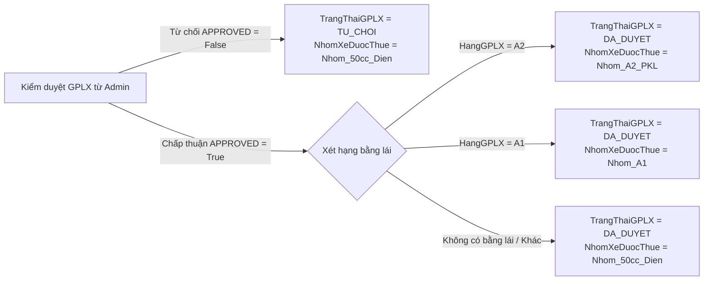
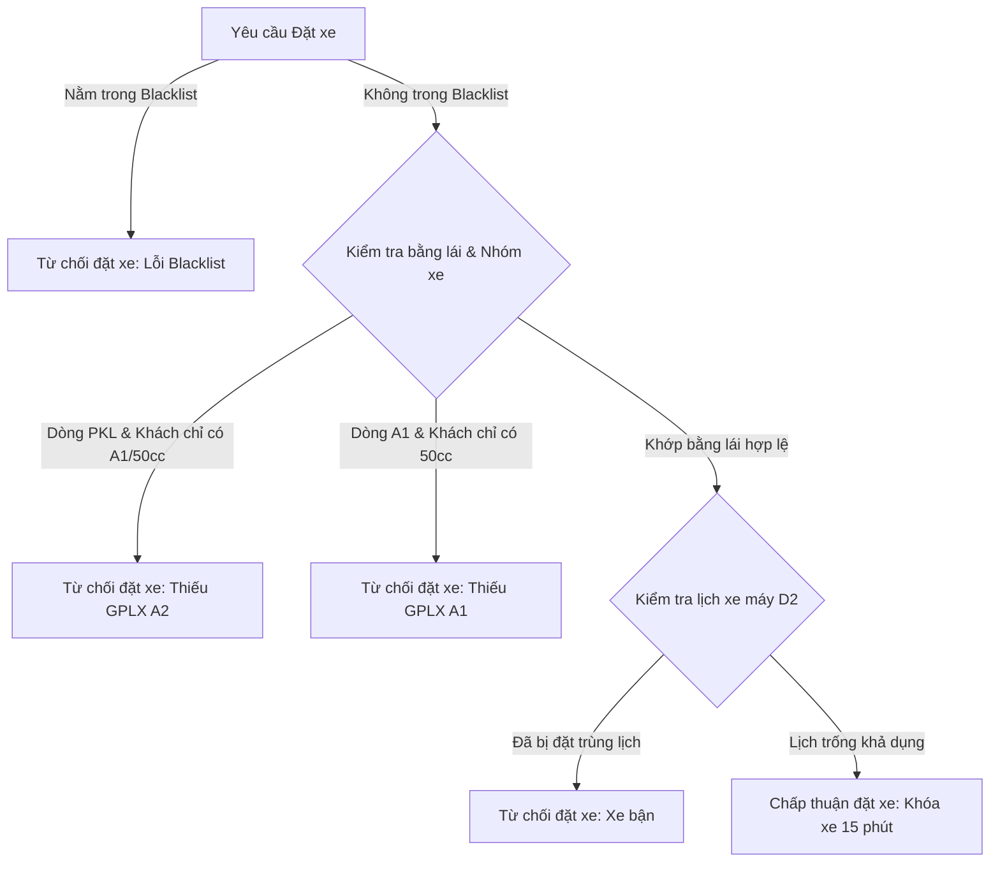
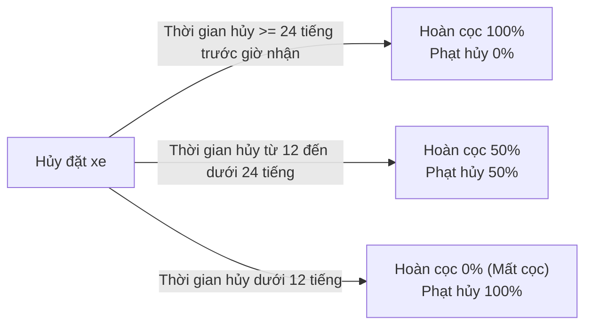
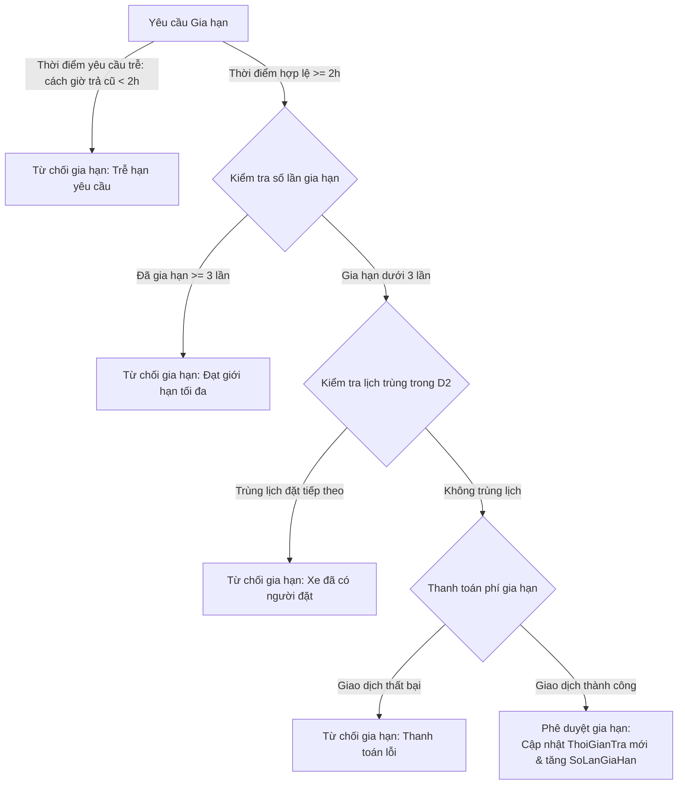
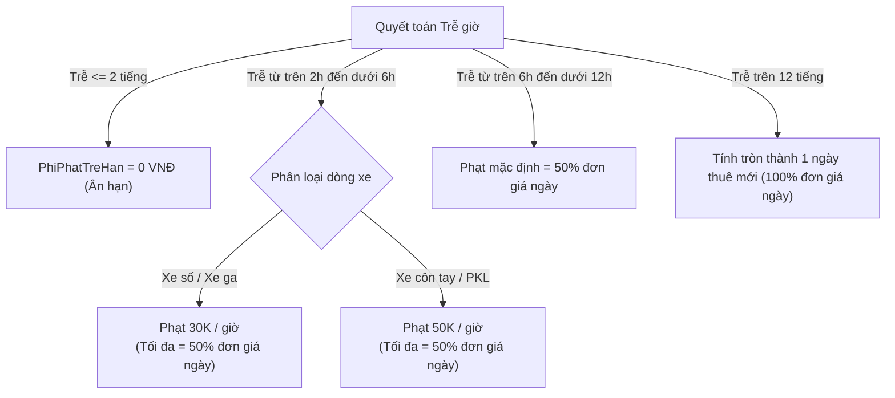
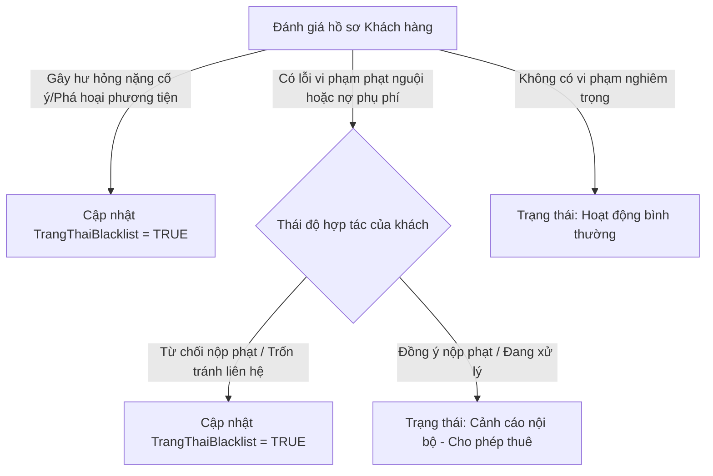
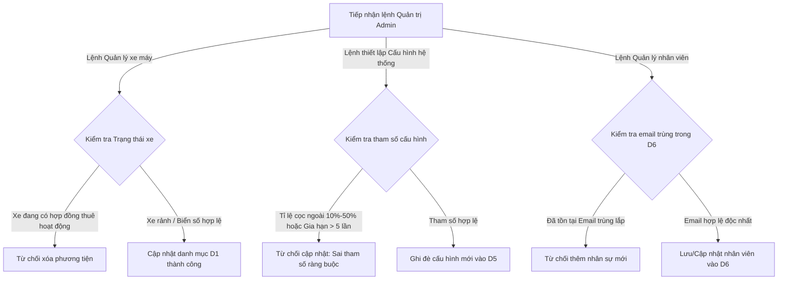

# BÁO CÁO ĐỀ TÀI NHÓM: PHÂN TÍCH VÀ THIẾT KẾ HỆ THỐNG QUẢN LÝ VÀ CHO THUÊ XE MÁY THÔNG MINH (SMARTRENTAL)

---

## MỤC LỤC
1. [CHƯƠNG 1: KHẢO SÁT HIỆN TRẠNG & THU THẬP THÔNG TIN (INFORMATION GATHERING)](#chương-1-khảo-sát-hiện-trạng--thu-thập-thông-tin-information-gathering)
2. [CHƯƠNG 2: TỪ ĐIỂN DỮ LIỆU (DATA DICTIONARY)](#chương-2-từ-điển-dữ-liệu-data-dictionary)
3. [CHƯƠNG 3: ĐẶC TẢ TIẾN TRÌNH (PROCESS SPECIFICATIONS)](#chương-3-đặc-tả-tiến-trình-process-specifications)

---

## CHƯƠNG 1: KHẢO SÁT HIỆN TRẠNG & THU THẬP THÔNG TIN (INFORMATION GATHERING)

### 1.1. Mục tiêu và phạm vi khảo sát
- **Mục tiêu:** Khảo sát, phân tích và thu thập các yêu cầu nghiệp vụ thực tế từ các mô hình cho thuê xe máy hiện hành; xác định các điểm nghẽn trong quy trình vận hành thủ công (như bất cập trong quản lý giấy tờ, theo dõi lịch bảo dưỡng, tính toán phụ phí phát sinh); từ đó thiết lập cơ sở dữ liệu nghiệp vụ ban đầu phục vụ cho giai đoạn phân tích và thiết kế hệ thống.
- **Phạm vi:** Khảo sát được thực hiện dựa trên phương pháp đối sánh tính năng đối với hệ thống tính năng của các website và ứng dụng di động hỗ trợ dịch vụ thuê xe máy đang hoạt động trên thị trường.

### 1.2. Phương pháp thu thập thông tin
Nhóm áp dụng 2 phương pháp thu thập dữ liệu thứ cấp và đánh giá sản phẩm tương đương:
- **a. Nghiên cứu tài liệu:** Phân tích các mẫu hợp đồng dân sự cho thuê xe máy, các bảng quy định phụ phí quá hạn và biên bản bàn giao phương tiện hiện hành trên thị trường.
- **b. Đánh giá sản phẩm tương đương:** Khảo sát luồng tính năng và trải nghiệm người dùng trên 5 nền tảng cho thuê xe máy phổ biến tại Việt Nam bao gồm: Mioto, TravelMotorbike, Tigit Motorbikes, Bike Rental Vietnam, và Motorvina. Từ đó bóc tách các bất cập vận hành để đưa ra đề xuất cải tiến phù hợp cho hệ thống mới.

### 1.3. Tiêu chí đánh giá hệ thống đối thủ (Benchmarking Checklist)
Để có cơ sở đối sánh đồng bộ, nhóm thiết lập bộ khung gồm 5 tiêu chí cốt lõi dùng để quét dữ liệu trên các nền tảng hiện hành:
- **Tiêu chí 1 (Xác thực thông tin):** Hệ thống mục tiêu thực hiện quy trình kiểm tra điều kiện Giấy phép lái xe như thế nào? (Không kiểm tra / Kiểm tra thủ công bằng văn bản tại quầy / Cho phép tải ảnh lên hệ thống để duyệt trực tuyến).
- **Tiêu chí 2 (Khả dụng phương tiện):** Giao diện hệ thống đối thủ có hiển thị trạng thái và phân biệt loại xe theo thời gian thực để ngăn ngừa đặt xe quá hạn hoặc đang sửa chữa không?
- **Tiêu chí 3 (Tương tác hợp đồng):** Người dùng có thể chủ động kéo dài thời gian thuê (Gia hạn) trực tiếp trên giao diện không, hay bắt buộc phải gọi điện về tổng đài?
- **Tiêu chí 4 (Xử lý tài chính động):** Hệ thống đối thủ có công khai bảng tính phụ phí quá hạn chi tiết theo giờ, và có chính sách tự động khấu trừ hoàn tiền khi khách báo trả xe sớm không?
- **Tiêu chí 5 (Quản trị vận hành):** Nền tảng đối thủ có cơ chế tự động theo dõi số km di chuyển thực tế thông qua các kết nối thiết bị phần cứng để cảnh báo bảo dưỡng định kỳ không?

### 1.4. Kết quả khảo sát các hệ thống hiện hành
Dựa vào bộ tiêu chí đánh giá ở mục 1.3, nhóm đã tổng hợp được hiện trạng tính năng cụ thể trên 5 nền tảng:

#### 1.4.1. Kết quả đối sánh chi tiết:
*   **Hệ thống Mioto:**
    *   Xác thực Giấy phép lái xe online: Có hỗ trợ (Xác thực qua ảnh chụp).
    *   Tính năng Gia hạn hợp đồng trên App: Chưa đáp ứng.
    *   Tính năng Hoàn tiền khi trả xe sớm: Chưa đáp ứng.
    *   Đồng bộ số km qua thiết bị IoT: Có hỗ trợ (Theo dõi qua dữ liệu lộ trình xe).
*   **Hệ thống Chungxe:**
    *   Xác thực Giấy phép lái xe online: Có hỗ trợ (Yêu cầu điền thông tin và đối chiếu khi giao xe).
    *   Tính năng Gia hạn hợp đồng trên App: Chưa đáp ứng (Khách hàng phải liên hệ tổng đài thủ công).
    *   Tính năng Hoàn tiền khi trả xe sớm: Chưa đáp ứng.
    *   Đồng bộ số km qua thiết bị IoT: Chưa đáp ứng (Nhân viên chốt số km thủ công trên biên bản).
*   **Hệ thống Tigit Motorbikes:**
    *   Xác thực Giấy phép lái xe online: Có hỗ trợ (Xác thực thông qua cam kết điều khoản hợp đồng đối với bằng quốc tế).
    *   Tính năng Gia hạn hợp đồng trên App: Chưa đáp ứng.
    *   Tính năng Hoàn tiền khi trả xe sớm: Chưa đáp ứng.
    *   Đồng bộ số km qua thiết bị IoT: Chưa đáp ứng (Nhân viên phải chốt số thủ công).
*   **Hệ thống Tuan Motorbike:**
    *   Xác thực Giấy phép lái xe online: Chưa hỗ trợ trực tuyến.
    *   Tính năng Gia hạn hợp đồng trên App: Có hỗ trợ (Xử lý thông qua form gửi yêu cầu gia hạn trên website).
    *   Tính năng Hoàn tiền khi trả xe sớm: Chưa đáp ứng.
    *   Đồng bộ số km qua thiết bị IoT: Chưa đáp ứng (Nhân viên phải chốt số thủ công).
*   **Hệ thống Motorvina:**
    *   Xác thực Giấy phép lái xe online: Chưa hỗ trợ trực tuyến.
    *   Tính năng Gia hạn hợp đồng trên App: Chưa đáp ứng.
    *   Tính năng Hoàn tiền khi trả xe sớm: Chưa đáp ứng.
    *   Đồng bộ số km qua thiết bị IoT: Chưa đáp ứng (Theo dõi lịch trình và bảo dưỡng hoàn toàn bằng tay).

#### 1.4.2. Tỷ lệ đáp ứng chung trên tổng số 5 hệ thống được khảo sát:
*   Tính năng Xác thực Giấy phép lái xe online: Đạt tỷ lệ 60% (3 trên 5 hệ thống đáp ứng).
*   Tính năng Gia hạn hợp đồng trên App: Đạt tỷ lệ 20% (1 trên 5 hệ thống đáp ứng).
*   Tính năng Hoàn tiền khi trả xe sớm: Đạt tỷ lệ 0% (0 trên 5 hệ thống đáp ứng).
*   Tính năng Đồng bộ số km qua IoT: Đạt tỷ lệ 20% (1 trên 5 hệ thống đáp ứng).

#### 1.4.3. Đề xuất yêu cầu hệ thống mới dựa trên kết quả khảo sát:
Từ việc phân tích các điểm nghẽn của các nền tảng đi trước, nhóm định hình các yêu cầu nghiệp vụ cốt lõi mà hệ thống SmartRental bắt buộc phải hỗ trợ:
- **Phân quyền bằng lái khách hàng:** Tự động khóa hoặc mở quyền tiếp cận danh mục xe tương ứng với hạng bằng lái (A1, A) sau khi có kết quả phê duyệt ảnh chụp hệ thống.
- **Kiểm tra lịch thuê của phương tiện:** Khi khách hàng gửi yêu cầu gia hạn, hệ thống cần tự động đối chiếu dòng thời gian, nếu không trùng với lịch đặt trước của khách hàng tiếp theo mới cho phép xác nhận gia hạn.
- **Tính phụ phí và hoàn tiền tự động:** Áp dụng cơ chế tự động tính phụ phí trả muộn lũy tiến theo giờ thực tế và tính toán số tiền hoàn trả lại cho khách khi trả xe sớm theo tỷ lệ thời gian dư.
- **Đồng bộ dữ liệu phần cứng phương tiện:** Cho phép nhận và đồng bộ chỉ số quãng đường di chuyển thực tế từ thiết bị định vị hoặc thiết bị IoT gắn trên xe để tự động đưa ra cảnh báo thời hạn bảo trì phương tiện.

---

## CHƯƠNG 2: TỪ ĐIỂN DỮ LIỆU (DATA DICTIONARY)

### 2.1. DANH MỤC CÁC TÁC NHÂN NGOÀI (EXTERNAL ENTITIES)

| Ký hiệu | Tên Actor | Mô tả |
|----------|-----------|-------|
| **E1** | Khách hàng (Customer) | Người có nhu cầu thuê xe máy. Tìm xe, đặt xe, thanh toán, yêu cầu gia hạn, trả xe sớm, đánh giá dịch vụ. |
| **E2** | Nhân viên cửa hàng (Staff) | Bàn giao xe, kiểm tra tình trạng xe khi trả, ghi nhận sự cố, lập hóa đơn phụ phí, tra cứu lịch sử thuê xe để xử lý phạt nguội ngoài hệ thống. Nhận thông báo đơn mới từ hệ thống để chuẩn bị xe. |
| **E3** | Quản trị viên (Admin) | Quản lý danh mục xe, cấu hình giá thuê/phí phạt (Dynamic Pricing), duyệt GPLX, quản lý tài khoản nhân viên, xem báo cáo doanh thu, quản lý Blacklist. |
| **E4** | Cổng thanh toán (Payment Gateway) | Hệ thống thanh toán trực tuyến bên ngoài (chuyển khoản ngân hàng, ví điện tử) xử lý giao dịch đặt cọc, thanh toán gia hạn và hoàn tiền hủy đơn. |

### 2.2. CÁC KHO DỮ LIỆU (DATA STORES)

#### D1 — Xe_May (Motorcycle Inventory)
> Lưu trữ thông tin toàn bộ xe máy trong cửa hàng. Phân loại rõ ràng theo nhóm dung tích.

| Thuộc tính | Kiểu dữ liệu | Ràng buộc | Mô tả |
|------------|--------------|-----------|-------|
| `MaXe` | VARCHAR(10) | **PK**, NOT NULL, UNIQUE | Mã định danh duy nhất của xe. VD: `XM-001` |
| `BienSo` | VARCHAR(12) | NOT NULL, UNIQUE | Biển số xe. VD: `59-B1 12345` |
| `SoKhung` | VARCHAR(20) | NOT NULL, UNIQUE | Số khung xe |
| `SoMay` | VARCHAR(20) | NOT NULL, UNIQUE | Số máy xe |
| `HangXe` | VARCHAR(30) | NOT NULL | Hãng sản xuất: Honda, Yamaha, Vespa, VinFast... |
| `TenXe` | VARCHAR(50) | NOT NULL | Tên dòng xe. VD: `Honda Vision 110cc` |
| `LoaiXe` | ENUM | NOT NULL | {`Xe_So`, `Xe_Ga`, `Xe_Con_Tay`, `Xe_PKL`, `Xe_Dien`} |
| `PhanKhoi` | INT | NOT NULL | Dung tích xi-lanh (cc). `0` nếu là xe điện |
| `NhomXe` | ENUM | NOT NULL | {`Nhom_50cc_Dien`, `Nhom_A1`, `Nhom_A2_PKL`}. **Tự động phân loại**: PhanKhoi < 50 hoặc LoaiXe = `Xe_Dien` → `Nhom_50cc_Dien`; 50 ≤ PhanKhoi < 175 → `Nhom_A1`; PhanKhoi ≥ 175 → `Nhom_A2_PKL` |
| `DoiXe` | INT | NOT NULL | Năm sản xuất. VD: `2023` |
| `HinhAnhXe` | TEXT | NULL | Danh sách URL hình ảnh xe (JSON array) |
| `TrangThaiXe` | ENUM | NOT NULL, DEFAULT `San_Sang` | {`San_Sang`, `Dang_Thue`, `Dang_Bao_Duong`, `Dang_Sua_Chua`} |
| `MucTieuThuXang` | DECIMAL(4,1) | NULL | Lít/100km. VD: `1.7` |
| `SoMuBaoHiem` | INT | NOT NULL, DEFAULT `2` | Số mũ bảo hiểm đi kèm mặc định |
| `CoAoMua` | BOOLEAN | NOT NULL, DEFAULT `TRUE` | Có kèm áo mưa mặc định hay không |
| `DonGiaNgay` | DECIMAL(12,0) | NOT NULL | Giá thuê cơ bản 1 ngày (VND). VD: `150000` |
| `ODOHienTai` | INT | NOT NULL, DEFAULT `0` | Số ODO hiện tại (km) |
| `NgayTao` | DATETIME | NOT NULL | Ngày thêm xe vào hệ thống |
| `NgayCapNhat` | DATETIME | NOT NULL | Ngày cập nhật thông tin lần cuối |

#### D2 — Hop_Dong_Booking (Booking Contract)
> Lưu trữ toàn bộ vòng đời đơn đặt xe, bao gồm trạng thái gia hạn (tối đa 3 lần), trả xe sớm, và thông tin bàn giao phụ kiện mũ bảo hiểm/áo mưa.

| Thuộc tính | Kiểu dữ liệu | Ràng buộc | Mô tả |
|------------|--------------|-----------|-------|
| `MaBooking` | VARCHAR(15) | **PK**, NOT NULL, UNIQUE | Mã đơn đặt xe. VD: `BK-20260622001` |
| `MaKhachHang` | VARCHAR(10) | **FK** → D3.MaKhachHang, NOT NULL | Khách hàng đặt xe |
| `MaXe` | VARCHAR(10) | **FK** → D1.MaXe, NOT NULL | Xe máy được đặt |
| `ThoiGianNhan` | DATETIME | NOT NULL | Thời gian hẹn nhận xe |
| `ThoiGianTra` | DATETIME | NOT NULL | Thời gian hẹn trả xe (cập nhật khi gia hạn) |
| `ThoiGianTraGoc` | DATETIME | NOT NULL | Thời gian trả xe ban đầu (không thay đổi khi gia hạn) |
| `ThoiGianTraThucTe` | DATETIME | NULL | Thời gian khách trả xe thực tế |
| `SoNgayThue` | INT | NOT NULL | Tổng số ngày thuê (bao gồm gia hạn) |
| `SoNgayThueGoc` | INT | NOT NULL | Số ngày thuê ban đầu |
| `TrangThaiBooking` | ENUM | NOT NULL, DEFAULT `Cho_Xac_Nhan` | {`Cho_Xac_Nhan`, `Cho_Nhan_Xe`, `Dang_Thue`, `Yeu_Cau_Tra_Som`, `Qua_Han`, `Cho_Tra_Xe`, `Dang_Quyet_Toan`, `Hoan_Tat`, `Da_Huy`}. **Lưu ý:** Hệ thống **tự động duyệt** đơn sau khi cọc thành công + kiểm tra lịch xe không trùng. Không có bước Staff duyệt thủ công. |
| `DonGiaApDung` | DECIMAL(12,0) | NOT NULL | Đơn giá ngày áp dụng (đã tính Dynamic Pricing) |
| `TongTienThue` | DECIMAL(15,0) | NOT NULL | Tổng tiền thuê gốc (chưa phụ phí/giảm giá) |
| `PhanTramGiamGia` | DECIMAL(4,1) | DEFAULT `0` | % giảm giá thuê dài ngày. VD: `5.0`, `10.0` |
| `TienGiamGia` | DECIMAL(15,0) | DEFAULT `0` | Số tiền giảm giá (VND) |
| `PhanTramTangGia` | DECIMAL(4,1) | DEFAULT `0` | % tăng giá Dynamic Pricing (Lễ/Tết/Cuối tuần). VD: `15.0`, `30.0` |
| `TienTangGia` | DECIMAL(15,0) | DEFAULT `0` | Số tiền tăng giá Dynamic Pricing (VND) |
| `TienCoc` | DECIMAL(15,0) | NOT NULL | Tiền đặt cọc khách đã thanh toán |
| `PhuongThucCoc` | ENUM | NOT NULL | {`Chuyen_Khoan`, `Vi_Dien_Tu`, `Tien_Mat`} |
| `SoLanGiaHan` | INT | NOT NULL, DEFAULT `0` | Số lần gia hạn đã thực hiện. **Tối đa: 3** |
| `TongTienGiaHan` | DECIMAL(15,0) | DEFAULT `0` | Tổng tiền gia hạn phải trả thêm |
| `CoTraSom` | BOOLEAN | NOT NULL, DEFAULT `FALSE` | Khách có yêu cầu trả xe sớm không |
| `ThoiGianYeuCauTraSom` | DATETIME | NULL | Thời điểm khách gửi yêu cầu trả sớm |
| `PhiPhatTreHan` | DECIMAL(15,0) | DEFAULT `0` | Phí phạt trễ hạn (VND) |
| `PhiDenBuHuHai` | DECIMAL(15,0) | DEFAULT `0` | Tổng phí đền bù hư hại linh kiện |
| `PhiMatPhuKien` | DECIMAL(15,0) | DEFAULT `0` | Phí mất mũ bảo hiểm, áo mưa |
| `TongThanhToan` | DECIMAL(15,0) | NOT NULL | Tổng cuối cùng = TongTienThue - TienGiamGia + TienTangGia + TongTienGiaHan + PhiPhatTreHan + PhiDenBuHuHai + PhiMatPhuKien - TienCoc |
| `ODONhan` | INT | NULL | Số ODO khi bàn giao xe (Check-in) |
| `ODOTra` | INT | NULL | Số ODO khi trả xe (Check-out) |
| `MucXangNhan` | ENUM | NULL | {`Day`, `3_Phan_4`, `1_Phan_2`, `1_Phan_4`, `Gan_Het`} |
| `MucXangTra` | ENUM | NULL | Tương tự MucXangNhan |
| `AnhNgoaiQuanNhan` | TEXT | NULL | URL ảnh chụp ngoại quan khi giao xe (JSON array) |
| `AnhNgoaiQuanTra` | TEXT | NULL | URL ảnh chụp ngoại quan khi trả xe (JSON array) |
| `SoMuBaoHiemGiao` | INT | DEFAULT `0` | Số mũ bảo hiểm thực tế bàn giao lúc Check-in |
| `SoMuBaoHiemTra` | INT | DEFAULT `0` | Số mũ bảo hiểm nhận lại lúc Check-out |
| `CoAoMuaGiao` | BOOLEAN | DEFAULT `FALSE` | Có bàn giao áo mưa kèm theo lúc Check-in |
| `CoAoMuaTra` | BOOLEAN | DEFAULT `FALSE` | Có nhận lại áo mưa kèm theo lúc Check-out |
| `MaNhanVienGiao` | VARCHAR(10) | **FK** → D6.MaNhanVien, NULL | Nhân viên bàn giao xe |
| `MaNhanVienNhan` | VARCHAR(10) | **FK** → D6.MaNhanVien, NULL | Nhân viên nhận lại xe |
| `DanhGiaSao` | INT | NULL | Đánh giá từ 1-5 sao |
| `NoiDungDanhGia` | TEXT | NULL | Nội dung đánh giá của khách |
| `GhiChu` | TEXT | NULL | Ghi chú nội bộ |
| `NgayTao` | DATETIME | NOT NULL | Ngày tạo đơn |
| `NgayCapNhat` | DATETIME | NOT NULL | Lần cập nhật cuối |

#### D3 — Khach_Hang_GPLX (Customer & Driving License)
> Lưu trữ thông tin khách hàng kèm trạng thái xác thực GPLX. Hỗ trợ 2 luồng đăng ký: Có GPLX / Không có GPLX.

| Thuộc tính | Kiểu dữ liệu | Ràng buộc | Mô tả |
|------------|--------------|-----------|-------|
| `MaKhachHang` | VARCHAR(10) | **PK**, NOT NULL, UNIQUE | Mã khách hàng. VD: `KH-001` |
| `HoTen` | NVARCHAR(100) | NOT NULL | Họ và tên đầy đủ |
| `Email` | VARCHAR(100) | UNIQUE, NULL | Email đăng ký |
| `SoDienThoai` | VARCHAR(15) | UNIQUE, NOT NULL | Số điện thoại đăng ký |
| `CCCD` | VARCHAR(12) | UNIQUE, NULL | Số căn cước công dân |
| `DiaChi` | NVARCHAR(200) | NULL | Địa chỉ thường trú |
| `MatKhau` | VARCHAR(255) | NOT NULL | Mật khẩu mã hóa (hashed) |
| `LuaChonGPLX` | ENUM | NOT NULL | {`Co_GPLX`, `Khong_GPLX`}. Lựa chọn khi đăng ký |
| `HangGPLX` | ENUM | NULL | {`A1`, `A2`, `Khong`}. A1: xe dưới 175cc; A2: xe mọi phân khối |
| `SoGPLX` | VARCHAR(12) | UNIQUE, NULL | Số giấy phép lái xe |
| `NgayCapGPLX` | DATE | NULL | Ngày cấp GPLX |
| `NgayHetHanGPLX` | DATE | NULL | Ngày hết hạn GPLX |
| `AnhGPLXMatTruoc` | TEXT | NULL | URL ảnh mặt trước GPLX |
| `AnhGPLXMatSau` | TEXT | NULL | URL ảnh mặt sau GPLX |
| `TrangThaiGPLX` | ENUM | NOT NULL, DEFAULT `Khong_Dang_Ky` | {`Khong_Dang_Ky`, `Cho_Duyet`, `Da_Duyet`, `Tu_Choi`}. `Khong_Dang_Ky` khi chọn "Không có GPLX"; `Cho_Duyet` khi tải ảnh lên chờ Admin; `Da_Duyet` khi Admin xác nhận hợp lệ; `Tu_Choi` khi Admin từ chối |
| `LyDoTuChoiGPLX` | TEXT | NULL | Lý do Admin từ chối GPLX |
| `NhomXeDuocThue` | ENUM | NOT NULL, DEFAULT `Nhom_50cc_Dien` | {`Nhom_50cc_Dien`, `Nhom_A1`, `Nhom_A2_PKL`}. Phụ thuộc vào TrangThaiGPLX và HangGPLX |
| `TrangThaiBlacklist` | BOOLEAN | NOT NULL, DEFAULT `FALSE` | Nằm trong danh sách đen hay không |
| `LyDoBlacklist` | TEXT | NULL | Lý do đưa vào Blacklist |
| `NgayTao` | DATETIME | NOT NULL | Ngày đăng ký tài khoản |
| `NgayCapNhat` | DATETIME | NOT NULL | Lần cập nhật cuối |

#### D4 — Lich_Su_Thue (Rental History & Internal Tracking)
> Lưu vết toàn bộ lịch sử thuê xe phục vụ tra cứu nội bộ (tra biển số + thời gian khi nhận thông báo phạt nguội từ bên ngoài), thống kê doanh thu và quản lý Blacklist.

| Thuộc tính | Kiểu dữ liệu | Ràng buộc | Mô tả |
|------------|--------------|-----------|-------|
| `MaLichSu` | VARCHAR(15) | **PK**, NOT NULL, UNIQUE | Mã bản ghi lịch sử. VD: `LS-001` |
| `MaBooking` | VARCHAR(15) | **FK** → D2.MaBooking, NOT NULL | Tham chiếu đến đơn Booking gốc |
| `MaKhachHang` | VARCHAR(10) | **FK** → D3.MaKhachHang, NOT NULL | Khách hàng thuê xe |
| `MaXe` | VARCHAR(10) | **FK** → D1.MaXe, NOT NULL | Xe máy đã thuê |
| `BienSoXe` | VARCHAR(12) | NOT NULL | Biển số xe (snapshot tại thời điểm thuê) |
| `ThoiGianNhan` | DATETIME | NOT NULL | Thời gian nhận xe thực tế |
| `ThoiGianTra` | DATETIME | NOT NULL | Thời gian trả xe thực tế |
| `TongTienThanhToan` | DECIMAL(15,0) | NOT NULL | Tổng tiền đã thanh toán |
| `GhiChuNoiBo` | TEXT | NULL | Ghi chú nội bộ của NV/Admin (VD: ghi nhận phạt nguội, kết quả thương lượng với khách, tình trạng xử lý bên ngoài) |
| `DanhDauViPham` | BOOLEAN | NOT NULL, DEFAULT `FALSE` | NV/Admin tự đánh dấu bản ghi có liên quan đến vi phạm giao thông (phạt nguội) sau khi tra cứu thủ công |
| `NgayTao` | DATETIME | NOT NULL | Ngày tạo bản ghi |

#### D5 — Cau_Hinh_He_Thong (System Configuration)
> Lưu cấu hình vận hành như bảng đền bù mũ/áo mưa, giá trị phạt giờ, định mức phạt trễ hạn, định mức gia hạn tối đa...

| Thuộc tính | Kiểu dữ liệu | Ràng buộc | Mô tả |
|------------|--------------|-----------|-------|
| `MaCauHinh` | VARCHAR(10) | **PK**, NOT NULL, UNIQUE | Mã cấu hình. VD: `CF-001` |
| `SoLanGiaHanToiDa` | INT | NOT NULL, DEFAULT `3` | Giới hạn số lần gia hạn qua App |
| `DonGiaPhatXeThuong_Gio`| DECIMAL(12,0) | NOT NULL | Phí phạt trễ giờ xe số/ga (VND). VD: `30000` |
| `DonGiaPhatXePKL_Gio` | DECIMAL(12,0) | NOT NULL | Phí phạt trễ giờ xe côn/PKL (VND). VD: `50000` |
| `PhatMatMuBaoHiem` | DECIMAL(12,0) | NOT NULL | Phí phạt mất mũ bảo hiểm. VD: `150000` |
| `PhatMatAoMua` | DECIMAL(12,0) | NOT NULL | Phí phạt mất áo mưa. VD: `50000` |
| `PhanTramTangGiaLe` | DECIMAL(4,1) | NOT NULL | Tỷ lệ tăng giá dịp lễ tết. VD: `30.0` |
| `NgayTao` | DATETIME | NOT NULL | Ngày tạo cấu hình |
| `NgayCapNhat` | DATETIME | NOT NULL | Lần cập nhật cuối |

#### D6 — Nhan_Vien (Staff Account)
> Lưu trữ thông tin tài khoản nhân viên do Admin quản lý.

| Thuộc tính | Kiểu dữ liệu | Ràng buộc | Mô tả |
|------------|--------------|-----------|-------|
| `MaNhanVien` | VARCHAR(10) | **PK**, NOT NULL, UNIQUE | Mã nhân viên. VD: `NV-001` |
| `HoTen` | NVARCHAR(100) | NOT NULL | Họ và tên nhân viên |
| `Email` | VARCHAR(100) | UNIQUE, NOT NULL | Email đăng nhập |
| `SoDienThoai` | VARCHAR(15) | NOT NULL | Số điện thoại |
| `VaiTro` | ENUM | NOT NULL | {`Nhan_Vien`, `Admin`} |
| `TrangThaiTaiKhoan` | ENUM | NOT NULL, DEFAULT `Hoat_Dong` | {`Hoat_Dong`, `Bi_Khoa`} |
| `MatKhau` | VARCHAR(255) | NOT NULL | Mật khẩu mã hóa |
| `NgayTao` | DATETIME | NOT NULL | Ngày tạo tài khoản |

---

### 2.3. CÁC DÒNG DỮ LIỆU (DATA FLOWS)

#### 2.3.1. Luồng dữ liệu liên quan đến Tiến trình 1.0 — Đăng ký & Xác thực GPLX
| Mã | Tên luồng | Nguồn (Source) | Đích (Destination) | Mô tả chi tiết chức năng |
|----|-----------|---------------|--------------------|--------------------------|
| F1.1 | `Yêu cầu đăng ký tài khoản` | E1 (Khách hàng) | P1.0 | Gửi thông tin đăng ký tài khoản gồm: Họ tên, Email, SĐT, lựa chọn GPLX và ảnh chụp 2 mặt GPLX. |
| F1.2 | `Thông tin đăng nhập` | E1 (Khách hàng) | P1.0 | Gửi Email/Số điện thoại và Mật khẩu để yêu cầu đăng nhập hệ thống. |
| F1.3 | `Kết quả đăng nhập` | P1.0 | E1 (Khách hàng) | Trả về token đăng nhập khi xác thực thành công hoặc thông báo lỗi nếu sai mật khẩu. |
| F1.4 | `Hồ sơ GPLX chờ duyệt` | P1.0 | E3 (Admin) | Gửi thông tin ảnh chụp GPLX của khách hàng đến Admin để duyệt thủ công. |
| F1.5 | `Kết quả duyệt GPLX` | E3 (Admin) | P1.0 | Admin gửi kết quả duyệt GPLX (Duyệt/Từ chối kèm lý do). |
| F1.6 | `Thông báo kết quả GPLX` | P1.0 | E1 (Khách hàng) | Hệ thống thông báo kết quả duyệt GPLX và phân hạng nhóm xe khách hàng được phép thuê. |
| F1.7 | `Lưu thông tin khách hàng` | P1.0 | D3 (Khach_Hang_GPLX) | Ghi mới tài khoản hoặc cập nhật trạng thái GPLX và nhóm xe được phép thuê vào kho D3. |
| F1.8 | `Đọc thông tin khách hàng` | D3 (Khach_Hang_GPLX) | P1.0 | Truy vấn thông tin tài khoản phục vụ xác thực đăng nhập hoặc đối chiếu điều kiện thuê xe. |

#### 2.3.2. Luồng dữ liệu liên quan đến Tiến trình 2.0 — Đặt xe trực tuyến & Giữ chỗ
| Mã | Tên luồng | Nguồn (Source) | Đích (Destination) | Mô tả chi tiết chức năng |
|----|-----------|---------------|--------------------|--------------------------|
| F2.1 | `Yêu cầu tìm kiếm xe` | E1 (Khách hàng) | P2.0 | Gửi bộ lọc tìm xe (loại xe, hãng xe, phân khối, khoảng giá, thời gian nhận/trả). |
| F2.2 | `Kết quả tìm kiếm xe` | P2.0 | E1 (Khách hàng) | Trả về danh sách xe máy khả dụng phù hợp với bộ lọc tìm kiếm. |
| F2.3 | `Đọc danh sách xe` | D1 (Xe_May) | P2.0 | Truy vấn thông tin xe máy từ kho D1 phục vụ tìm kiếm và kiểm tra tình trạng xe. |
| F2.4 | `Đọc cấu hình hệ thống` | D5 (Cau_Hinh_He_Thong) | P2.0 | Đọc các tham số giá ngày, tỷ lệ tăng giá động phục vụ tính toán chi phí thuê xe. |
| F2.5 | `Kiểm tra GPLX khách` | D3 (Khach_Hang_GPLX) | P2.0 | Đọc thông tin GPLX và cờ Blacklist để xác thực khách có đủ điều kiện đặt xe hay không. |
| F2.6 | `Yêu cầu đặt xe` | E1 (Khách hàng) | P2.0 | Gửi yêu cầu đặt xe cụ thể kèm dịch vụ đi kèm trong khoảng thời gian xác định. |
| F2.7 | `Yêu cầu hủy đặt xe` | E1 (Khách hàng) | P2.0 | Gửi yêu cầu hủy đơn hàng đã cọc trước giờ nhận xe để nhận lại tiền cọc (sau phạt). |
| F2.8 | `Thông báo khóa xe tạm` | P2.0 | E1 (Khách hàng) | Xác nhận xe đã được khóa giữ chỗ tạm thời 15 phút, yêu cầu khách tiến hành thanh toán. |
| F2.9 | `Thanh toán đặt cọc` | E1 (Khách hàng) | P2.0 | Khách hàng thực hiện thanh toán tiền đặt cọc (30% giá trị đơn hàng). |
| F2.10 | `Lưu đơn đặt xe` | P2.0 | D2 (Hop_Dong_Booking) | Ghi mới đơn đặt xe hoặc cập nhật trạng thái đơn (Chờ nhận xe/Đã hủy) vào kho D2. |
| F2.11 | `Cập nhật trạng thái xe` | P2.0 | D1 (Xe_May) | Cập nhật trạng thái xe máy trong kho D1 (sang "Đang thuê" khi cọc thành công). |
| F2.12 | `Thông báo đơn mới` | P2.0 | E2 (Nhân viên) | Thông báo chi tiết đơn đặt xe đã cọc thành công để nhân viên chuẩn bị xe giao khách. |
| F2.13 | `Thông báo nhắc nhở tự động` | P2.0 | E1 (Khách hàng) | Thông báo nhắc lịch nhận xe trước 2h, nhắc trả xe trước 2h, nhắc trễ giờ nhận xe. |
| F2.14 | `Xác nhận đặt xe` | P2.0 | E1 (Khách hàng) | Gửi xác nhận đặt xe thành công kèm mã booking và hóa đơn đặt cọc cho khách hàng. |
| F2.15 | `Kiểm tra lịch xe trùng` | D2 (Hop_Dong_Booking) | P2.0 | Truy vấn lịch sử booking trong D2 để kiểm tra xe có bị trùng lịch trong khoảng thời gian đặt không. |
| F2.16 | `Yêu cầu giao dịch trực tuyến` | P2.0 | E4 (Cổng thanh toán) | Gửi lệnh thanh toán cọc hoặc yêu cầu hoàn cọc sang cổng thanh toán trực tuyến E4. |
| F2.17 | `Kết quả giao dịch` | E4 (Cổng thanh toán) | P2.0 | Cổng thanh toán phản hồi kết quả giao dịch (Thành công/Thất bại) về hệ thống. |
| F2.18 | `Thông tin booking hợp lệ` | P2.2 | P2.3 | Truyền dữ liệu đơn hàng đã đủ điều kiện thuê sang tiến trình khóa xe giữ chỗ (Luồng nội bộ). |
| F2.19 | `Yêu cầu thanh toán tạm` | P2.3 | P2.4 | Gửi thông tin số tiền cọc cần đóng sang tiến trình thanh toán (Luồng nội bộ). |
| F2.20 | `Xác nhận thanh toán thành công` | P2.4 | P2.5 | Chuyển tín hiệu giao dịch cọc thành công sang tiến trình duyệt đơn và phân phối (Luồng nội bộ). |
| F2.21 | `Hủy booking tạm` | P2.4 | P2.3 | Gửi lệnh giải phóng xe khi khách không hoàn tất cọc quá 15 phút (Luồng nội bộ). |
| F2.22 | `Tạo booking tạm` | P2.3 | D2 (Hop_Dong_Booking) | Ghi nhận trạng thái booking tạm thời (Chờ xác nhận) vào kho D2 để giữ xe (Luồng nội bộ). |
| F2.23 | `Đọc booking nhắc nhở` | D2 (Hop_Dong_Booking) | P2.6 | Quét kho D2 để lọc ra các đơn hàng đến mốc thời gian cần gửi nhắc nhở (Luồng nội bộ). |
| F2.24 | `Yêu cầu hoàn tiền cọc` | P2.5 | P2.4 | Gửi yêu cầu hoàn trả tiền cọc (sau khi trừ phạt hủy đơn) sang tiến trình thanh toán (Luồng nội bộ). |
| F2.25 | `Đọc đơn đặt xe (để hủy)` | D2 (Hop_Dong_Booking) | P2.5 | Đọc thông tin chi tiết đơn booking từ D2 để kiểm tra mốc thời gian và tính toán tiền phạt hủy đơn (Luồng nội bộ). |
| F2.26 | `Cập nhật giao dịch hoàn tiền` | P2.4 | D2 (Hop_Dong_Booking) | Cập nhật thông tin giao dịch hoàn tiền thành công/thất bại từ cổng thanh toán vào đơn đặt xe ở D2 (Luồng nội bộ). |

#### 2.3.3. Luồng dữ liệu liên quan đến Tiến trình 3.0 — Gia hạn & Yêu cầu Trả xe sớm
| Mã | Tên luồng | Nguồn (Source) | Đích (Destination) | Mô tả chi tiết chức năng |
|----|-----------|---------------|--------------------|--------------------------|
| F3.1 | `Yêu cầu gia hạn` | E1 (Khách hàng) | P3.0 | Gửi yêu cầu xin thuê thêm giờ/ngày trực tiếp trên ứng dụng của khách hàng. |
| F3.2 | `Thanh toán gia hạn` | E1 (Khách hàng) | P3.0 | Khách hàng thực hiện thanh toán online phần tiền phụ thu gia hạn. |
| F3.3 | `Đọc booking gia hạn` | D2 (Hop_Dong_Booking) | P3.0 | Đọc thông tin đơn booking hiện tại trong D2 để kiểm tra số lần gia hạn (<3 lần). |
| F3.4 | `Đọc cấu hình gia hạn` | D5 (Cau_Hinh_He_Thong) | P3.0 | Đọc cấu hình gia hạn từ kho D5 để lấy đơn giá phụ thu và quy định giới hạn. |
| F3.5 | `Kiểm tra lịch xe` | D2 (Hop_Dong_Booking) | P3.0 | Kiểm tra xem xe có bị khách hàng khác đặt trước trong khoảng thời gian gia hạn không. |
| F3.6 | `Kết quả gia hạn` | P3.0 | E1 (Khách hàng) | Thông báo kết quả gia hạn thành công hoặc bị từ chối kèm gợi ý xe khác. |
| F3.7 | `Cập nhật gia hạn` | P3.0 | D2 (Hop_Dong_Booking) | Cập nhật thời gian trả xe mới, tăng số lần gia hạn và cộng tiền gia hạn vào D2. |
| F3.8 | `Yêu cầu trả xe sớm` | E1 (Khách hàng) | P3.0 | Gửi thông báo muốn mang trả xe sớm trước thời hạn ít nhất 1 giờ. |
| F3.9 | `Cập nhật trả sớm` | P3.0 | D2 (Hop_Dong_Booking) | Ghi nhận cờ trả sớm CoTraSom = TRUE và cập nhật trạng thái Yêu cầu trả sớm vào D2. |
| F3.10 | `Thông báo trả sớm` | P3.0 | E2 (Nhân viên) | Thông báo cho nhân viên tại quầy chuẩn bị tiếp nhận xe khách trả sớm. |
| F3.11 | `Yêu cầu cập nhật gia hạn` | P3.1 | P3.2 | Gửi tín hiệu đã kiểm tra đủ điều kiện gia hạn sang tiến trình cập nhật và thanh toán (Luồng nội bộ). |
| F3.12 | `Yêu cầu giao dịch gia hạn trực tuyến` | P3.2 | E4 (Cổng thanh toán) | Gửi thông tin thanh toán tiền phụ thu gia hạn sang cổng thanh toán trực tuyến E4. |
| F3.13 | `Kết quả giao dịch gia hạn` | E4 (Cổng thanh toán) | P3.2 | Cổng thanh toán phản hồi kết quả giao dịch thanh toán gia hạn (Thành công/Thất bại) về tiến trình. |
| F3.14 | `Đọc đơn đặt xe (để trả sớm)` | D2 (Hop_Dong_Booking) | P3.3 | Đọc thông tin booking hiện tại từ D2 để kiểm tra điều kiện trả xe sớm (như trạng thái xe phải là Đang thuê). |
| F3.15 | `Kết quả yêu cầu trả sớm` | P3.3 | E1 (Khách hàng) | Trả về thông báo đồng ý tiếp nhận trả xe sớm hoặc từ chối yêu cầu kèm lý do cho khách hàng. |

#### 2.3.5. Luồng dữ liệu liên quan đến Tiến trình 4.0 — Nhận xe & Quyết toán phụ phí
| Mã | Tên luồng | Nguồn (Source) | Đích (Destination) | Mô tả chi tiết chức năng |
|----|-----------|---------------|--------------------|--------------------------|
| F4.1 | `Yêu cầu xem danh sách giao nhận` | E2 (Nhân viên) | P4.0 | Nhân viên yêu cầu xem danh sách xe cần giao (Check-in) hoặc nhận (Check-out) hôm nay. |
| F4.2 | `Đọc danh sách booking trong ngày` | D2 (Hop_Dong_Booking) | P4.0 | Lọc các booking có mốc thời gian nhận/trả xe trong ngày từ kho D2. |
| F4.3 | `Danh sách giao nhận trong ngày` | P4.0 | E2 (Nhân viên) | Hiển thị danh sách công việc giao nhận xe máy trong ngày trên ca làm việc của NV. |
| F4.4 | `Biên bản Check-in` | E2 (Nhân viên) | P4.0 | NV nhập biên bản giao xe (ODO giao, mức xăng giao, ảnh chụp xe, số mũ/áo mưa bàn giao). |
| F4.5 | `Cập nhật Check-in` | P4.0 | D2 (Hop_Dong_Booking) | Ghi nhận thông tin bàn giao xe và chuyển trạng thái booking sang "Đang thuê" trong D2. |
| F4.6 | `Biên bản Check-out` | E2 (Nhân viên) | P4.0 | NV nhập biên bản thu hồi xe (ODO trả, xăng trả, ảnh hư hại, số mũ/áo mưa trả, phí đền bù hư hại/mất). |
| F4.7 | `Đọc booking quyết toán` | D2 (Hop_Dong_Booking) | P4.0 | Truy vấn thông tin đơn thuê gốc từ D2 phục vụ đối chiếu và quyết toán tiền. |
| F4.8 | `Đọc bảng giá phạt và đền bù` | D5 (Cau_Hinh_He_Thong) | P4.0 | Lấy cấu hình phạt mất phụ kiện, phạt trễ giờ từ D5 để tính toán chi phí phạt. |
| F4.9 | `Tính phí phạt trễ hạn` | P4.0 | (Nội bộ) | Logic tính toán chi phí phạt trễ hạn dựa trên số giờ trễ thực tế. |
| F4.10 | `Hóa đơn quyết toán` | P4.0 | E1 (Khách hàng) | Xuất hóa đơn quyết toán chi tiết các khoản chi phí và phụ thu gửi cho khách hàng. |
| F4.11 | `Cập nhật quyết toán` | P4.0 | D2 (Hop_Dong_Booking) | Ghi nhận trạng thái Hoàn tất, cập nhật ODO trả và tổng thanh toán thực tế vào D2. |
| F4.12 | `Giải phóng xe` | P4.0 | D1 (Xe_May) | Chuyển trạng thái xe máy trong D1 về "Sẵn sàng" và cập nhật chỉ số ODO hiện tại của xe. |
| F4.13 | `Lưu lịch sử thuê` | P4.0 | D4 (Lich_Su_Thue) | Sao chép và lưu vết toàn bộ dữ liệu đơn thuê đã hoàn tất sang kho lịch sử D4. |
| F4.14 | `Đánh giá chuyến đi` | E1 (Khách hàng) | P4.0 | Khách hàng gửi điểm số và nhận xét đánh giá dịch vụ sau chuyến đi. |
| F4.15 | `Ghi nhận đánh giá` | P4.5 | D2 (Hop_Dong_Booking) | Lưu thông tin phản hồi của khách hàng vào đơn booking tương ứng trong kho D2 (Luồng nội bộ). |
| F4.16 | `Bàn giao biên bản Check-out` | P4.3 | P4.4 | Chuyển dữ liệu Check-out nghiệm thu sang tiến trình quyết toán để tính hóa đơn (Luồng nội bộ). |
| F4.17 | `Yêu cầu giao dịch quyết toán trực tuyến` | P4.4 | E4 (Cổng thanh toán) | Gửi yêu cầu thanh toán khoản phụ phí chênh lệch hoặc yêu cầu hoàn tiền thừa sang cổng thanh toán trực tuyến E4. |
| F4.18 | `Kết quả giao dịch quyết toán` | E4 (Cổng thanh toán) | P4.4 | Cổng thanh toán phản hồi kết quả giao dịch thanh toán/hoàn tiền quyết toán (Thành công/Thất bại) về tiến trình. |

#### 2.3.5. Luồng dữ liệu liên quan đến Tiến trình 5.0 — Tra cứu Lịch sử thuê & Quản lý Blacklist
| Mã | Tên luồng | Nguồn (Source) | Đích (Destination) | Mô tả chi tiết chức năng |
|----|-----------|---------------|--------------------|--------------------------|
| F5.1 | `Yêu cầu tra cứu lịch sử` | E2 (Nhân viên) / E3 (Admin) | P5.0 | Nhập Biển số xe và khoảng thời gian để tra cứu phục vụ xử lý phạt nguội. |
| F5.2 | `Đọc lịch sử theo biển số` | D4 (Lich_Su_Thue) | P5.0 | Truy vết danh sách chuyến đi của biển số xe tương ứng trong khoảng thời gian từ kho D4. |
| F5.3 | `Đọc thông tin khách hàng` | D3 (Khach_Hang_GPLX) | P5.0 | Đọc thông tin cá nhân và số GPLX của khách thuê xe tương ứng từ kho D3. |
| F5.4 | `Kết quả tra cứu` | P5.0 | E2 (Nhân viên) / E3 (Admin) | Hiển thị kết quả tra cứu thông tin khách hàng vi phạm cho NV/Admin làm việc ngoại tuyến. |
| F5.5 | `Ghi chú vi phạm nội bộ` | E2 (Nhân viên) / E3 (Admin) | P5.0 | NV/Admin gửi ghi chú tiến trình xử lý phạt nguội và cờ đánh dấu vi phạm. |
| F5.6 | `Cập nhật ghi chú lịch sử` | P5.0 | D4 (Lich_Su_Thue) | Lưu vết cờ vi phạm DanhDauViPham = TRUE và ghi chú nội bộ vào bản ghi lịch sử trong D4. |
| F5.7 | `Yêu cầu Blacklist` | E3 (Admin) | P5.0 | Admin yêu cầu đưa khách hàng vi phạm nghiêm trọng vào danh sách đen. |
| F5.8 | `Cập nhật Blacklist` | P5.0 | D3 (Khach_Hang_GPLX) | Cập nhật cờ TrangThaiBlacklist = TRUE kèm lý do chi tiết vào hồ sơ khách hàng ở kho D3. |

#### 2.3.6. Luồng dữ liệu liên quan đến Tiến trình 6.0 — Quản lý Danh mục, Nhân viên & Cấu hình Hệ thống [MỚI]
| Mã | Tên luồng | Nguồn (Source) | Đích (Destination) | Mô tả chi tiết chức năng |
|----|-----------|---------------|--------------------|--------------------------|
| F6.1 | `Yêu cầu cập nhật thông tin xe máy` | E3 (Admin) | P6.0 | Admin gửi lệnh thêm xe mới hoặc chỉnh sửa thông tin xe máy trong danh mục. |
| F6.2 | `Lưu thông tin xe mới` | P6.0 | D1 (Xe_May) | Ghi mới xe hoặc cập nhật thông tin chỉnh sửa xe máy vào kho dữ liệu D1. |
| F6.3 | `Đọc danh sách xe quản trị` | D1 (Xe_May) | P6.0 | Đọc dữ liệu xe máy hiện tại từ kho D1 phục vụ kiểm tra trùng lắp và đối chiếu. |
| F6.4 | `Kết quả cập nhật xe` | P6.0 | E3 (Admin) | Phản hồi thông báo cập nhật thành công hoặc trả về mã lỗi cụ thể cho Admin. |
| F6.5 | `Yêu cầu cập nhật cấu hình hệ thống` | E3 (Admin) | P6.0 | Admin gửi lệnh thay đổi cấu hình vận hành hệ thống (giá, phạt trễ giờ, đền bù). |
| F6.6 | `Lưu cấu hình hệ thống` | P6.0 | D5 (Cau_Hinh_He_Thong) | Ghi đè cấu hình vận hành mới vào kho lưu trữ cấu hình hệ thống D5. |
| F6.7 | `Đọc cấu hình hệ thống quản trị` | D5 (Cau_Hinh_He_Thong) | P6.0 | Đọc thông số cấu hình hiện tại từ D5 phục vụ đối chiếu và hiển thị cho Admin. |
| F6.8 | `Kết quả cập nhật cấu hình` | P6.0 | E3 (Admin) | Phản hồi xác nhận đã áp dụng thành công thiết lập cấu hình hệ thống mới. |
| F6.9 | `Yêu cầu quản lý nhân viên` | E3 (Admin) | P6.0 | Admin gửi lệnh thêm mới, sửa đổi thông tin hoặc khóa tài khoản nhân viên. |
| F6.10 | `Cập nhật thông tin nhân viên` | P6.0 | D6 (Nhan_Vien) | Thực hiện ghi mới hoặc cập nhật thông tin chỉnh sửa tài khoản nhân viên vào kho D6. |
| F6.11 | `Đọc thông tin nhân viên` | D6 (Nhan_Vien) | P6.0 | Truy vấn danh sách và thông tin tài khoản nhân viên từ kho D6 để kiểm tra trùng lặp hoặc hiển thị. |
| F6.12 | `Kết quả quản lý nhân viên` | P6.0 | E3 (Admin) | Phản hồi thông báo cập nhật tài khoản nhân viên thành công hoặc thất bại cho Admin. |

### 2.4. DANH MỤC CÁC PHẦN TỬ DỮ LIỆU (DATA ELEMENT DICTIONARY)

#### 2.4.1. Khóa chính (PK) và Khóa ngoại (FK)

| Thuộc tính | Kiểu dữ liệu | Định dạng / Ví dụ | Ràng buộc | Lưu trữ ở |
|------------|--------------|-------------------|-----------|-----------|
| `MaBooking` | VARCHAR(15) | `BK-20260622001` | PK, UNIQUE, NOT NULL | D2 |
| `MaKhachHang`| VARCHAR(10) | `KH-001` | PK, UNIQUE, NOT NULL | D3 |
| `MaLichSu` | VARCHAR(15) | `LS-001` | PK, UNIQUE, NOT NULL | D4 |
| `MaCauHinh` | VARCHAR(10) | `CF-001` | PK, UNIQUE, NOT NULL | D5 |
| `MaNhanVien` | VARCHAR(10) | `NV-001` | PK, UNIQUE, NOT NULL | D6 |

#### 2.4.2. Các trường ENUM quan trọng

| Tên phần tử | Miền giá trị | Quy tắc nghiệp vụ |
|-------------|-------------|-------------------|
| `TrangThaiBooking` | {`Cho_Xac_Nhan`, `Cho_Nhan_Xe`, `Dang_Thue`, `Yeu_Cau_Tra_Som`, `Qua_Han`, `Cho_Tra_Xe`, `Dang_Quyet_Toan`, `Hoan_Tat`, `Da_Huy`} | Luồng vòng đời: Cho_Xac_Nhan → **Cho_Nhan_Xe** *(tự động duyệt sau cọc + check lịch xe)* → Dang_Thue → (Yeu_Cau_Tra_Som / Qua_Han) → Cho_Tra_Xe → Dang_Quyet_Toan → Hoan_Tat |
| `TrangThaiXe` | {`San_Sang`, `Dang_Thue`, `Dang_Bao_Duong`, `Dang_Sua_Chua`} | Xe chỉ cho thuê khi `San_Sang` |
| `TrangThaiGPLX` | {`Khong_Dang_Ky`, `Cho_Duyet`, `Da_Duyet`, `Tu_Choi`} | Chỉ `Da_Duyet` mới được thuê xe nhóm tương ứng |
| `NhomXe` | {`Nhom_50cc_Dien`, `Nhom_A1`, `Nhom_A2_PKL`} | Phân loại theo PhanKhoi và LoaiXe |
| `HangGPLX` | {`A1`, `A2`, `Khong`} | A1: xe dưới 175cc; A2: xe mọi phân khối |
| `LoaiXe` | {`Xe_So`, `Xe_Ga`, `Xe_Con_Tay`, `Xe_PKL`, `Xe_Dien`} | Ảnh hưởng đến phí phạt trễ giờ |
| `NhomXeDuocThue` | {`Nhom_50cc_Dien`, `Nhom_A1`, `Nhom_A2_PKL`} | Phụ thuộc vào TrangThaiGPLX và HangGPLX |

#### 2.4.3. Các trường tính toán nghiệp vụ

| Tên phần tử | Kiểu | Công thức / Quy tắc |
|-------------|------|---------------------|
| `DonGiaApDung` | DECIMAL(12,0) | = `DonGiaNgay` × (1 + `PhanTramTangGia`/100) |
| `TongTienThue` | DECIMAL(15,0) | = `DonGiaApDung` × `SoNgayThueGoc` |
| `TienGiamGia` | DECIMAL(15,0) | = `TongTienThue` × `PhanTramGiamGia`/100 |
| `TienTangGia` | DECIMAL(15,0) | = `DonGiaNgay` × `SoNgayThueGoc` × `PhanTramTangGia`/100 |
| `PhiPhatTreHan` | DECIMAL(15,0) | Ân hạn 2h: 0đ; Trễ 2-6h: tính theo giờ (Gà/Số: 30K/h, Côn/PKL: 50K/h) nhưng tối đa không quá 1/2 ngày thuê; 6-12h: `DonGiaApDung`/2; >12h: `DonGiaApDung` |
| `TongThanhToan` | DECIMAL(15,0) | = `TongTienThue` - `TienGiamGia` + `TienTangGia` + `TongTienGiaHan` + `PhiPhatTreHan` + `PhiDenBuHuHai` + `PhiMatPhuKien` - `TienCoc` |
| `SoLanGiaHan` | INT | ≤ 3 cho mỗi MaBooking |

### 2.5. KIỂM TRA TÍNH NHẤT QUÁN (CONSISTENCY CHECK)

#### 2.5.1. Kiểm tra Kho dữ liệu không "Mồ côi"

| Kho dữ liệu | Luồng GHI vào (Write) | Luồng ĐỌC ra (Read) | Kết quả |
|-------------|----------------------|---------------------|---------|
| **D1** Xe_May | F2.11 (Cập nhật trạng thái xe), F4.12 (Giải phóng xe), F6.2 (Lưu thông tin xe mới) | F2.3 (Đọc danh sách xe), F6.3 (Đọc danh sách xe quản trị) |  Hợp lệ |
| **D2** Hop_Dong_Booking | F2.10 (Lưu đơn đặt xe), F3.7 (Cập nhật gia hạn), F3.9 (Cập nhật trả sớm), F4.5 (Cập nhật Check-in), F4.11 (Cập nhật quyết toán), F4.15 (Ghi nhận đánh giá), F2.22 (Tạo booking tạm), F2.26 (Cập nhật giao dịch hoàn tiền) | F2.15 (Kiểm tra lịch xe trùng), F3.3 (Đọc booking gia hạn), F3.5 (Kiểm tra lịch xe), F4.2 (Đọc danh sách booking trong ngày), F4.7 (Đọc booking quyết toán), F2.23 (Đọc booking nhắc nhở), F2.25 (Đọc đơn đặt xe (để hủy)), F3.14 (Đọc đơn đặt xe (để trả sớm)) |  Hợp lệ |
| **D3** Khach_Hang_GPLX | F1.7 (Lưu thông tin khách hàng), F5.8 (Cập nhật Blacklist) | F1.8 (Đọc thông tin khách hàng), F2.5 (Kiểm tra GPLX khách), F5.3 (Đọc thông tin khách hàng) |  Hợp lệ |
| **D4** Lich_Su_Thue | F4.13 (Lưu lịch sử thuê), F5.6 (Cập nhật ghi chú lịch sử) | F5.2 (Đọc lịch sử theo biển số) |  Hợp lệ |
| **D5** Cau_Hinh_He_Thong | F6.6 (Lưu cấu hình hệ thống) | F2.4 (Đọc cấu hình hệ thống), F3.4 (Đọc cấu hình gia hạn), F4.8 (Đọc bảng giá phạt và đền bù), F6.7 (Đọc cấu hình hệ thống quản trị) |  Hợp lệ |
| **D6** Nhan_Vien | F6.10 (Cập nhật thông tin nhân viên) | F6.11 (Đọc thông tin nhân viên) |  Hợp lệ |

#### 2.5.2. Kiểm tra luồng không hợp lệ
-  Không có luồng dữ liệu trực tiếp giữa 2 Actor (E↔E) mà không qua Tiến trình.
-  Không có luồng dữ liệu trực tiếp giữa 2 Kho dữ liệu (D↔D) mà không qua Tiến trình.
-  Không có luồng dữ liệu trực tiếp giữa Actor và Kho dữ liệu mà không qua Tiến trình.
-  Mọi Tiến trình đều có ít nhất 1 luồng vào và 1 luồng ra.

---

## CHƯƠNG 3: ĐẶC TẢ TIẾN TRÌNH (PROCESS SPECIFICATIONS)

### 3.1. TIẾN TRÌNH 1.0 — ĐĂNG KÝ & XÁC THỰC GPLX

#### 3.1.1. Structured English (Ngôn ngữ cấu trúc)
<pre style="background-color: transparent; color: black; border: none; font-family: monospace; white-space: pre-wrap; margin: 10px 0; font-size: 14px;">
PROCESS 1.0: Đăng ký & Xác thực GPLX
BEGIN
    RECEIVE F1.1: Yêu cầu đăng ký tài khoản (HoTen, Email, SoDienThoai, HangGPLX, AnhGPLXMatTruoc, AnhGPLXMatSau)
    
    // Bước 1: Kiểm tra tính hợp lệ dữ liệu đầu vào cơ bản
    IF Email không đúng định dạng HOẶC SoDienThoai không phải dạng số THEN
        SEND Thông báo lỗi "Dữ liệu đầu vào không hợp lệ" to Khách hàng E1
        TERMINATE PROCESS
    ENDIF

    // Bước 2: Kiểm tra trùng lặp tài khoản
    READ D3: Khach_Hang_GPLX WHERE D3.Email = Email OR D3.SoDienThoai = SoDienThoai
    IF Tìm thấy bản ghi tương ứng trong D3 THEN
        SEND Thông báo lỗi "Tài khoản đã tồn tại trên hệ thống" to Khách hàng E1
        TERMINATE PROCESS
    ELSE
        // Ghi nhận tài khoản mới chờ Admin duyệt GPLX
        WRITE D3: Khach_Hang_GPLX
            VALUES (MaKhachHang = AutoGen, HoTen, Email, SoDienThoai, TrangThaiGPLX = 'CHO_DUYET', HangGPLX)
        SEND F1.4: Hồ sơ GPLX chờ duyệt to Admin E3
    ENDIF

    // Bước 3: Tiếp nhận lệnh kiểm duyệt từ Admin
    RECEIVE F1.5: Kết quả duyệt GPLX (MaKhachHang, LuachonDuyet ∈ {APPROVED, REJECTED}, LyDoTuChoi)
    
    IF LuachonDuyet = APPROVED THEN
        // Phân loại nhóm xe được phép thuê dựa trên hạng bằng lái
        IF HangGPLX = 'A2' THEN
            SET NhomXeDuocThue = 'Nhom_A2_PKL' (Được phép thuê tất cả các loại xe)
        ELSE IF HangGPLX = 'A1' THEN
            SET NhomXeDuocThue = 'Nhom_A1' (Được phép thuê xe dưới 175cc và xe điện)
        ELSE
            SET NhomXeDuocThue = 'Nhom_50cc_Dien' (Chỉ được phép thuê xe dưới 50cc hoặc xe điện)
        ENDIF
        
        // Cập nhật trạng thái duyệt trong kho dữ liệu
        UPDATE D3: Khach_Hang_GPLX
            SET TrangThaiGPLX = 'DA_DUYET',
                NhomXeDuocThue = NhomXeDuocThue
            WHERE D3.MaKhachHang = MaKhachHang
            
        SEND F1.6: Thông báo kết quả GPLX (TrangThaiGPLX = APPROVED, NhomXeDuocThue) to Khách hàng E1
    ELSE
        // Trường hợp bị từ chối
        UPDATE D3: Khach_Hang_GPLX
            SET TrangThaiGPLX = 'TU_CHOI',
                LyDoTuChoiGPLX = LyDoTuChoi,
                NhomXeDuocThue = 'Nhom_50cc_Dien'
            WHERE D3.MaKhachHang = MaKhachHang
            
        SEND F1.6: Thông báo kết quả GPLX (TrangThaiGPLX = REJECTED, LyDoTuChoi) to Khách hàng E1
    ENDIF
END
</pre>

#### 3.1.2. Decision Table (Bảng quyết định)
| Điều kiện (Conditions) | Q1 | Q2 | Q3 | Q4 |
| :--- | :---: | :---: | :---: | :---: |
| Admin duyệt GPLX thành công (`APPROVED`)? | Y | Y | Y | N |
| Hạng GPLX hiện tại của khách hàng là gì? | A2 | A1 | Không/Hạng khác | Bất kỳ |
| **Hành động (Actions)** | | | | |
| Cập nhật `TrangThaiGPLX = DA_DUYET` | X | X | X | |
| Cập nhật `TrangThaiGPLX = TU_CHOI` | | | | X |
| Gán nhóm xe được thuê = `Nhom_A2_PKL` | X | | | |
| Gán nhóm xe được thuê = `Nhom_A1` | | X | | |
| Gán nhóm xe được thuê = `Nhom_50cc_Dien` | | | X | X |

#### 3.1.3. Decision Tree (Cây quyết định)

---

### 3.2. TIẾN TRÌNH 2.0 — ĐẶT XE TRỰC TUYẾN & GIỮ CHỖ

#### 3.2.1. Structured English (Ngôn ngữ cấu trúc)
<pre style="background-color: transparent; color: black; border: none; font-family: monospace; white-space: pre-wrap; margin: 10px 0; font-size: 14px;">
PROCESS 2.0: Đặt xe trực tuyến & Giữ chỗ
BEGIN
    // Xử lý Tìm kiếm xe máy khả dụng
    IF RECEIVE F2.1: Yêu cầu tìm kiếm xe THEN
        READ D1: Xe_May WHERE TrangThaiXe = 'San_Sang' AND (LoaiXe, HangXe, PhanKhoi khớp bộ lọc)
        READ D5: Cau_Hinh_He_Thong (Đọc bảng giá cơ bản)
        SEND F2.2: Kết quả tìm kiếm xe to Khách hàng E1
    ENDIF

    // Xử lý Đặt xe giữ chỗ
    IF RECEIVE F2.6: Yêu cầu đặt xe (MaKhachHang, MaXe, ThoiGianNhan, ThoiGianTra) THEN
        // Kiểm tra Blacklist
        READ D3: Khach_Hang_GPLX WHERE D3.MaKhachHang = MaKhachHang
        IF D3.TrangThaiBlacklist = TRUE THEN
            SEND Thông báo lỗi "Tài khoản nằm trong danh sách hạn chế" to Khách hàng E1
            TERMINATE PROCESS
        ENDIF

        // Kiểm tra phân quyền GPLX đối với nhóm xe máy đã chọn
        READ D1: Xe_May WHERE D1.MaXe = MaXe
        IF D1.NhomXe = 'Nhom_A2_PKL' AND D3.NhomXeDuocThue != 'Nhom_A2_PKL' THEN
            SEND Thông báo lỗi "Yêu cầu GPLX hạng A2 để đặt dòng xe này" to Khách hàng E1
            TERMINATE PROCESS
        ELSE IF D1.NhomXe = 'Nhom_A1' AND D3.NhomXeDuocThue = 'Nhom_50cc_Dien' THEN
            SEND Thông báo lỗi "Yêu cầu GPLX hạng A1 hoặc A2 để đặt dòng xe này" to Khách hàng E1
            TERMINATE PROCESS
        ENDIF

        // Kiểm tra lịch trùng phương tiện
        READ D2: Hop_Dong_Booking WHERE D2.MaXe = MaXe AND TrangThaiBooking != 'DA_HUY'
            AND (ThoiGianNhan < D2.ThoiGianTra AND ThoiGianTra > D2.ThoiGianNhan)
        IF Tìm thấy lịch trùng THEN
            SEND Thông báo lỗi "Xe đã được đặt trong khoảng thời gian này" to Khách hàng E1
            TERMINATE PROCESS
        ENDIF

        // Tạo đơn hàng tạm, giữ xe 15 phút
        WRITE D2: Hop_Dong_Booking
            VALUES (MaBooking = AutoGen, MaKhachHang, MaXe, ThoiGianNhan, ThoiGianTra, TrangThaiBooking = 'CHO_THANH_TOAN_COC', ThoiGianTao = CurrentTime)
        UPDATE D1: Xe_May SET TrangThaiXe = 'Dang_Thue' WHERE D1.MaXe = MaXe
        SEND F2.8: Thông báo khóa xe tạm (15 phút chờ cọc) to Khách hàng E1

        // Tính toán tiền đặt cọc (30% tổng tiền thuê)
        READ D5: Cau_Hinh_He_Thong (Đọc thông số chiết khấu dài ngày và phụ thu ngày lễ)
        SET DonGia = D1.DonGiaMoiNgay
        SET SoNgay = ThoiGianTra - ThoiGianNhan
        SET TongTienThue = DonGia * SoNgay
        IF SoNgay >= 14 THEN APPLY Chiết khấu dài ngày 15%
        ELSE IF SoNgay >= 7 THEN APPLY Chiết khấu dài ngày 10%
        ELSE IF SoNgay >= 3 THEN APPLY Chiết khấu dài ngày 5%
        ENDIF
        IF ThoiGianNhan thuộc Ngày Lễ/Tết THEN APPLY Phụ thu giá ngày lễ +30%
        ENDIF
        SET TienCoc = TongTienThue * 30%

        // Giao dịch thanh toán cọc trực tuyến
        SEND F2.16: Yêu cầu giao dịch trực tuyến (TienCoc, MaBooking, LoaiGiaoDich = 'Dat_Coc') to Cổng thanh toán E4
        RECEIVE F2.17: Kết quả giao dịch (MaBooking, TrangThaiGD)
        
        IF TrangThaiGD = 'Thanh_Cong' THEN
            UPDATE D2: Hop_Dong_Booking SET TrangThaiBooking = 'CHO_NHAN_XE' WHERE D2.MaBooking = MaBooking
            SEND F2.14: Xác nhận đặt xe thành công to Khách hàng E1
            SEND F2.12: Thông báo đơn mới to Nhân viên E2 chuẩn bị bàn giao
        ELSE
            // Giao dịch thất bại hoặc quá 15 phút không thanh toán
            UPDATE D2: Hop_Dong_Booking SET TrangThaiBooking = 'DA_HUY' WHERE D2.MaBooking = MaBooking
            UPDATE D1: Xe_May SET TrangThaiXe = 'San_Sang' WHERE D1.MaXe = MaXe
            SEND Thông báo lỗi "Giao dịch cọc thất bại hoặc hết hạn giữ chỗ" to Khách hàng E1
        ENDIF
    ENDIF

    // Xử lý Hủy đặt xe và tính hoàn tiền cọc
    IF RECEIVE F2.7: Yêu cầu hủy đặt xe (MaBooking) THEN
        READ D2: Hop_Dong_Booking WHERE D2.MaBooking = MaBooking
        SET ThoiGianTruocNhan = D2.ThoiGianNhan - CurrentTime
        
        // Tính tiền hoàn cọc dựa trên mốc thời gian hủy
        IF ThoiGianTruocNhan >= 24 giờ THEN
            SET TiLeHoan = 100%
        ELSE IF ThoiGianTruocNhan >= 12 giờ AND ThoiGianTruocNhan < 24 giờ THEN
            SET TiLeHoan = 50%
        ELSE
            SET TiLeHoan = 0%
        ENDIF
        
        SET TienHoanCoc = D2.TienCoc * TiLeHoan
        SET TienPhatHuy = D2.TienCoc * (100% - TiLeHoan)

        // Thực hiện lệnh hoàn tiền trực tuyến qua Cổng thanh toán E4 nếu số tiền hoàn > 0
        IF TienHoanCoc > 0 THEN
            SEND F2.16: Yêu cầu giao dịch trực tuyến (TienHoanCoc, MaBooking, LoaiGiaoDich = 'Hoan_Tien') to Cổng thanh toán E4
            RECEIVE F2.17: Kết quả giao dịch (MaBooking, TrangThaiGD = 'Thanh_Cong')
        ENDIF

        // Cập nhật trạng thái đơn hàng và giải phóng phương tiện
        UPDATE D2: Hop_Dong_Booking 
            SET TrangThaiBooking = 'DA_HUY', 
                TienHoanCoc = TienHoanCoc, 
                TienPhatTreHan = TienPhatHuy
            WHERE D2.MaBooking = MaBooking
        UPDATE D1: Xe_May SET TrangThaiXe = 'San_Sang' WHERE D1.MaXe = D2.MaXe
        
        SEND F2.26: Cập nhật giao dịch hoàn tiền to D2
        SEND Thông báo xác nhận hủy và kết quả hoàn tiền to Khách hàng E1
    ENDIF
END
</pre>

#### 3.2.2. Decision Table (Bảng quyết định)
##### Bảng A: Xét duyệt hợp lệ yêu cầu đặt xe
| Điều kiện (Conditions) | Q1 | Q2 | Q3 | Q4 | Q5 |
| :--- | :---: | :---: | :---: | :---: | :---: |
| Khách hàng nằm trong Blacklist (`D3.TrangThaiBlacklist = TRUE`)? | Y | N | N | N | N |
| Nhóm xe máy đã đặt là loại nào? | Bất kỳ | PKL (A2) | A1 (110-150cc) | A1 | PKL (A2) |
| Nhóm xe khách được phép thuê (`D3.NhomXeDuocThue`)? | Bất kỳ | Nhom_A1 | Nhom_50cc_Dien | Nhom_A1 | Nhom_A2_PKL |
| Trùng lịch thuê xe khác trong kho `D2`? | Bất kỳ | N | N | Y | N |
| **Hành động (Actions)** | | | | |
| Từ chối đặt xe, xuất thông báo lỗi phù hợp | X | X | X | X | |
| Chấp nhận đặt xe, chuyển trạng thái xe sang giữ chỗ tạm | | | | | X |

##### Bảng B: Xác định chính sách hoàn cọc khi hủy đặt xe
| Điều kiện (Conditions) | Q1 | Q2 | Q3 |
| :--- | :---: | :---: | :---: |
| Khoảng thời gian hủy đơn trước giờ nhận xe ($H$)? | $H \ge 24h$ | $12h \le H < 24h$ | $H < 12h$ |
| **Hành động (Actions)** | | | |
| Chấp nhận hoàn trả tiền cọc cho khách hàng | 100% | 50% | 0% (Không hoàn) |
| Áp dụng phạt hủy đặt xe | 0% | 50% | 100% |
| Chuyển trạng thái đơn đặt xe sang `DA_HUY` | X | X | X |
| Cập nhật trạng thái xe máy sang `San_Sang` | X | X | X |

#### 3.2.3. Decision Tree (Cây quyết định)
##### Cây quyết định xét duyệt đặt xe:

##### Cây quyết định chính sách hoàn cọc:

---

### 3.3. TIẾN TRÌNH 3.0 — GIA HẠN & YÊU CẦU TRẢ XE SỚM

#### 3.3.1. Structured English (Ngôn ngữ cấu trúc)
<pre style="background-color: transparent; color: black; border: none; font-family: monospace; white-space: pre-wrap; margin: 10px 0; font-size: 14px;">
PROCESS 3.0: Gia hạn & Yêu cầu Trả xe sớm
BEGIN
    // Xử lý Gia hạn thuê xe máy trực tuyến
    IF RECEIVE F3.1: Yêu cầu gia hạn (MaBooking, SoNgayGiaHanThem, ThoiGianTraMoi) THEN
        READ D2: Hop_Dong_Booking WHERE D2.MaBooking = MaBooking
        
        // Bước 1: Kiểm tra điều kiện thời gian gửi yêu cầu
        SET ThoiGianConLai = D2.ThoiGianTra - CurrentTime
        IF ThoiGianConLai < 2 giờ THEN
            SEND Thông báo lỗi "Phải yêu cầu gia hạn trước giờ trả xe cũ tối thiểu 2 tiếng" to Khách hàng E1
            TERMINATE PROCESS
        ENDIF

        // Bước 2: Kiểm tra số lần đã gia hạn
        IF D2.SoLanGiaHan >= 3 THEN
            SEND Thông báo lỗi "Vượt quá giới hạn gia hạn tối đa (3 lần)" to Khách hàng E1
            TERMINATE PROCESS
        ENDIF

        // Bước 3: Kiểm tra lịch xe trùng trong tương lai
        READ D2: Hop_Dong_Booking AS D2_Other 
            WHERE D2_Other.MaXe = D2.MaXe 
              AND D2_Other.MaBooking != MaBooking 
              AND D2_Other.TrangThaiBooking != 'DA_HUY'
              AND (D2.ThoiGianTra < D2_Other.ThoiGianTra AND ThoiGianTraMoi > D2_Other.ThoiGianNhan)
        IF Tìm thấy lịch trùng THEN
            SEND Thông báo lỗi "Xe đã được đặt lịch bởi khách hàng tiếp theo, không thể gia hạn" to Khách hàng E1
            TERMINATE PROCESS
        ENDIF

        // Bước 4: Tính chi phí phụ thu gia hạn
        READ D5: Cau_Hinh_He_Thong (Đọc bảng giá ngày của xe)
        SET ChiPhiGiaHan = D2.DonGiaApDung * SoNgayGiaHanThem

        // Bước 5: Thực hiện thanh toán trực tuyến phần tiền phụ thu gia hạn
        SEND F3.12: Yêu cầu giao dịch gia hạn trực tuyến (ChiPhiGiaHan, MaBooking) to Cổng thanh toán E4
        RECEIVE F3.13: Kết quả giao dịch gia hạn (MaBooking, TrangThaiGD)
        
        IF TrangThaiGD = 'Thanh_Cong' THEN
            // Cập nhật thông tin gia hạn thành công vào đơn hàng
            UPDATE D2: Hop_Dong_Booking
                SET ThoiGianTra = ThoiGianTraMoi,
                    SoLanGiaHan = D2.SoLanGiaHan + 1,
                    TongTienGiaHan = D2.TongTienGiaHan + ChiPhiGiaHan
                WHERE D2.MaBooking = MaBooking
            SEND F3.6: Kết quả gia hạn (Thành công) to Khách hàng E1
        ELSE
            SEND F3.6: Kết quả gia hạn (Thất bại do giao dịch không thành công) to Khách hàng E1
        ENDIF
    ENDIF

    // Xử lý thông báo Yêu cầu trả xe sớm
    IF RECEIVE F3.8: Yêu cầu trả xe sớm (MaBooking, ThoiGianMuonTra) THEN
        READ D2: Hop_Dong_Booking WHERE D2.MaBooking = MaBooking
        
        // Bước 1: Kiểm tra trạng thái đơn đặt xe hiện tại
        IF D2.TrangThaiBooking != 'Dang_Thue' THEN
            SEND F3.15: Kết quả yêu cầu trả sớm (Thất bại: Đơn xe không ở trạng thái đang thuê) to Khách hàng E1
            TERMINATE PROCESS
        ENDIF

        // Bước 2: Kiểm tra thời gian báo trước (tối thiểu 1 tiếng)
        SET ThoiGianBaoTruoc = ThoiGianMuonTra - CurrentTime
        IF ThoiGianBaoTruoc < 1 giờ THEN
            SEND F3.15: Kết quả yêu cầu trả sớm (Thất bại: Phải báo trước tối thiểu 1 tiếng trước giờ muốn trả thực tế) to Khách hàng E1
            TERMINATE PROCESS
        ENDIF

        // Bước 3: Ghi nhận thông báo trả sớm hợp lệ
        UPDATE D2: Hop_Dong_Booking
            SET CoTraSom = TRUE,
                TrangThaiBooking = 'YEU_CAU_TRA_SOM'
            WHERE D2.MaBooking = MaBooking
            
        SEND F3.10: Thông báo trả sớm to Nhân viên E2 chuẩn bị tiếp nhận xe
        SEND F3.15: Kết quả yêu cầu trả sớm (Thành công: Yêu cầu đã được ghi nhận) to Khách hàng E1
    ENDIF
END
</pre>

#### 3.3.2. Decision Table (Bảng quyết định)
##### Bảng A: Xét duyệt yêu cầu gia hạn thuê xe máy
| Điều kiện (Conditions) | Q1 | Q2 | Q3 | Q4 | Q5 |
| :--- | :---: | :---: | :---: | :---: | :---: |
| Thời gian yêu cầu cách giờ trả cũ $\ge 2$ tiếng? | N | Y | Y | Y | Y |
| Số lần đã gia hạn trước đó của booking này ($N$)? | Bất kỳ | $N \ge 3$ | $N < 3$ | $N < 3$ | $N < 3$ |
| Xe bị trùng lịch của khách hàng khác tiếp theo? | Bất kỳ | Bất kỳ | Y | N | N |
| Kết quả giao dịch thanh toán phụ phí gia hạn? | Bất kỳ | Bất kỳ | Bất kỳ | Thất bại | Thành công |
| **Hành động (Actions)** | | | | | |
| Từ chối gia hạn, hiển thị lỗi tương ứng | X | X | X | X | |
| Cập nhật giờ trả mới, tăng số lần gia hạn +1 và lưu D2 | | | | | X |

##### Bảng B: Xét duyệt yêu cầu báo trả xe sớm
| Điều kiện (Conditions) | Q1 | Q2 | Q3 |
| :--- | :---: | :---: | :---: |
| Trạng thái đơn booking hiện tại là `Dang_Thue`? | N | Y | Y |
| Thời gian báo trước giờ trả thực tế muốn trả $\ge 1$ tiếng? | Bất kỳ | N | Y |
| **Hành động (Actions)** | | | |
| Từ chối ghi nhận yêu cầu trả xe sớm | X | X | |
| Cập nhật cờ `CoTraSom = TRUE` & `TrangThaiBooking = YEU_CAU_TRA_SOM` | | | X |
| Gửi thông báo điều phối tiếp nhận xe cho Nhân viên quầy | | | X |

#### 3.3.3. Decision Tree (Cây quyết định)

---

### 3.4. TIẾN TRÌNH 4.0 — NHẬN XE & QUYẾT TOÁN PHỤ PHÍ

#### 3.4.1. Structured English (Ngôn ngữ cấu trúc)
<pre style="background-color: transparent; color: black; border: none; font-family: monospace; white-space: pre-wrap; margin: 10px 0; font-size: 14px;">
PROCESS 4.0: Nhận xe & Quyết toán phụ phí
BEGIN
    // 1. NGHIỆP VỤ CHECK-IN (BÀN GIAO PHƯƠNG TIỆN)
    IF RECEIVE F4.4: Biên bản Check-in (MaBooking, ODONhan, MucXangNhan, AnhNgoaiQuanNhan, DanhSachPhuKienGiao) THEN
        UPDATE D2: Hop_Dong_Booking
            SET TrangThaiBooking = 'Dang_Thue',
                ODONhan = ODONhan,
                MucXangNhan = MucXangNhan,
                PhuKienGiao = DanhSachPhuKienGiao
            WHERE D2.MaBooking = MaBooking
        UPDATE D1: Xe_May SET TrangThaiXe = 'Dang_Thue' WHERE D1.MaXe = D2.MaXe
        SEND F4.5: Cập nhật Check-in thành công to D2
        TERMINATE PROCESS
    ENDIF

    // 2. NGHIỆP VỤ CHECK-OUT & QUYẾT TOÁN TÀI CHÍNH
    IF RECEIVE F4.6: Biên bản Check-out (MaBooking, ODOTra, MucXangTra, PhiDenBuHuHai, SoPhuKienThuHoi) THEN
        READ D2: Hop_Dong_Booking WHERE D2.MaBooking = MaBooking
        READ D1: Xe_May WHERE D1.MaXe = D2.MaXe
        READ D5: Cau_Hinh_He_Thong (Đọc thông số đơn giá đền bù phụ kiện và biểu phí phạt trễ giờ)

        // Bước 2.1: Tính toán phí phạt trễ giờ trả xe (HoursLate)
        SET ThoiGianTre = CurrentTime - D2.ThoiGianTra
        SET PhiPhatTreHan = 0
        
        IF ThoiGianTre > 0 THEN
            SET HoursLate = ThoiGianTre quy đổi ra giờ
            IF HoursLate <= 2 THEN
                SET PhiPhatTreHan = 0  // Thời gian ân hạn
            ELSE IF HoursLate > 2 AND HoursLate <= 6 THEN
                IF D1.LoaiXe = 'Xe_So' OR D1.LoaiXe = 'Xe_Ga' THEN
                    SET DonGiaPhatGio = 30000
                ELSE
                    SET DonGiaPhatGio = 50000
                ENDIF
                SET PhiPhatTreHan = HoursLate * DonGiaPhatGio
                // Phạt tối đa theo giờ không vượt quá nửa đơn giá thuê ngày
                IF PhiPhatTreHan > (D2.DonGiaApDung / 2) THEN
                    SET PhiPhatTreHan = D2.DonGiaApDung / 2
                ENDIF
            ELSE IF HoursLate > 6 AND HoursLate <= 12 THEN
                SET PhiPhatTreHan = D2.DonGiaApDung / 2
            ELSE
                // Trễ từ trên 12 tiếng tính thành 1 ngày thuê mới
                SET PhiPhatTreHan = D2.DonGiaApDung
            ENDIF
        ENDIF

        // Bước 2.2: Tính phí đền bù phụ kiện bị mất
        SET PhiMatPhuKien = 0
        IF SoPhuKienThuHoi < D2.PhuKienGiao THEN
            SET SoMuBaoHiemMat = D2.PhuKienGiao.SoMuBaoHiem - SoPhuKienThuHoi.SoMuBaoHiem
            SET PhiMatPhuKien = SoMuBaoHiemMat * D5.DonGiaPhatMatMuBaoHiem
        ENDIF

        // Bước 2.3: Tính tổng chi phí quyết toán cuối cùng (TongThanhToan)
        SET TongQuyetToan = D2.TongTienThue - D2.TienGiamGia + D2.TienTangGia + D2.TongTienGiaHan + PhiPhatTreHan + PhiDenBuHuHai + PhiMatPhuKien
        SET TongThanhToan = TongQuyetToan - D2.TienCoc

        // Bước 2.4: Xử lý giao dịch tài chính chênh lệch trực tuyến
        IF TongThanhToan > 0 THEN
            SEND F4.17: Yêu cầu giao dịch quyết toán trực tuyến (TongThanhToan, MaBooking, Loai = 'Thu_Them') to Cổng thanh toán E4
            RECEIVE F4.18: Kết quả giao dịch quyết toán (MaBooking, TrangThaiGD = 'Thanh_Cong')
        ELSE IF TongThanhToan < 0 THEN
            SET TienHoan = AbsoluteValue(TongThanhToan)
            SEND F4.17: Yêu cầu giao dịch quyết toán trực tuyến (TienHoan, MaBooking, Loai = 'Hoan_Tra') to Cổng thanh toán E4
            RECEIVE F4.18: Kết quả giao dịch quyết toán (MaBooking, TrangThaiGD = 'Thanh_Cong')
        ENDIF

        // Bước 2.5: Cập nhật trạng thái phương tiện và lưu trữ hồ sơ
        UPDATE D2: Hop_Dong_Booking
            SET TrangThaiBooking = 'Hoan_Tat',
                PhiPhatTreHan = PhiPhatTreHan,
                PhiMatPhuKien = PhiMatPhuKien,
                TongThanhToan = TongQuyetToan,
                ODOTra = ODOTra,
                MucXangTra = MucXangTra
            WHERE D2.MaBooking = MaBooking

        UPDATE D1: Xe_May
            SET TrangThaiXe = 'San_Sang',
                OdoHienTai = ODOTra
            WHERE D1.MaXe = D2.MaXe

        // Lưu trữ lịch sử chuyến đi sang kho lưu trữ D4
        WRITE D4: Lich_Su_Thue
            VALUES (MaLichSu = AutoGen, MaBooking, MaKhachHang = D2.MaKhachHang, MaXe = D2.MaXe, ThoiGianNhan = D2.ThoiGianNhan, ThoiGianTra = CurrentTime, TongThanhToan = TongQuyetToan)

        SEND F4.10: Hóa đơn quyết toán to Khách hàng E1
        SEND F4.12: Giải phóng xe thành công to D1
        SEND F4.13: Lưu lịch sử thuê thành công to D4
    ENDIF
END
</pre>

#### 3.4.2. Decision Table (Bảng quyết định)
##### Quy định tính phí phạt trả trễ hạn phương tiện (PhiPhatTreHan)
| Điều kiện (Conditions) | Q1 | Q2 | Q3 | Q4 | Q5 |
| :--- | :---: | :---: | :---: | :---: | :---: |
| Thời gian trả xe thực tế trễ bao lâu ($HoursLate$)? | $HoursLate \le 2h$ | $2h < HoursLate \le 6h$ | $2h < HoursLate \le 6h$ | $6h < HoursLate \le 12h$ | $HoursLate > 12h$ |
| Loại xe máy đang thuê là gì? | Bất kỳ | Xe số / Xe ga | Côn tay / PKL | Bất kỳ | Bất kỳ |
| **Hành động (Actions)** | | | | | |
| Miễn phí phạt trễ giờ (Thời gian ân hạn) | X | | | | |
| Tính phạt: $HoursLate \times 30,000$ VNĐ (Tối đa = 50% đơn giá ngày) | | X | | | |
| Tính phạt: $HoursLate \times 50,000$ VNĐ (Tối đa = 50% đơn giá ngày) | | | X | | |
| Phạt mặc định bằng 50% đơn giá ngày thuê của xe | | | | X | |
| Phạt tính tròn bằng 1 ngày thuê mới (100% đơn giá ngày) | | | | | X |

#### 3.4.3. Decision Tree (Cây quyết định)

---

### 3.5. TIẾN TRÌNH 5.0 — TRA CỨU LỊCH SỬ THUÊ & QUẢN LÝ BLACKLIST

#### 3.5.1. Structured English (Ngôn ngữ cấu trúc)
<pre style="background-color: transparent; color: black; border: none; font-family: monospace; white-space: pre-wrap; margin: 10px 0; font-size: 14px;">
PROCESS 5.0: Tra cứu Lịch sử thuê & Quản lý Blacklist
BEGIN
    // Xử lý tra cứu lịch sử vi phạm giao thông (Phạt nguội)
    IF RECEIVE F5.1: Yêu cầu tra cứu lịch sử (BienSoXe, KhoangThoiGian_Tu, KhoangThoiGian_Den) THEN
        // Bước 1: Tra cứu bản ghi lịch sử thuê xe tương ứng trong kho D4
        READ D4: Lich_Su_Thue AS D4_Rec
            WHERE D4_Rec.BienSoXe = BienSoXe
              AND (D4_Rec.ThoiGianNhan <= KhoangThoiGian_Den AND D4_Rec.ThoiGianTra >= KhoangThoiGian_Tu)
              
        IF Tìm thấy bản ghi lịch sử thỏa mãn THEN
            // Bước 2: Đọc thông tin cá nhân khách hàng tương ứng từ kho D3
            READ D3: Khach_Hang_GPLX WHERE D3.MaKhachHang = D4_Rec.MaKhachHang
            SET Kết_Quả_Tra_Cứu = {Thông tin khách hàng D3, Thông tin chuyến đi D4_Rec}
            SEND F5.4: Kết quả tra cứu to Nhân viên E2 / Admin E3
        ELSE
            SEND Thông báo lỗi "Không tìm thấy dữ liệu thuê xe trùng khớp với thời gian vi phạm" to NV/Admin
        ENDIF
    ENDIF

    // Xử lý ghi nhận và ghi chú phạt nguội nội bộ
    IF RECEIVE F5.5: Ghi chú vi phạm nội bộ (MaLichSu, GhiChuLoiViPham, MucTienPhatNguoi) THEN
        UPDATE D4: Lich_Su_Thue
            SET DanhdauViPham = TRUE,
                GhiChuNoiBo = GhiChuLoiViPham,
                TienPhatNguoiPhatSinh = MucTienPhatNguoi
            WHERE D4.MaLichSu = MaLichSu
        SEND F5.6: Cập nhật ghi chú lịch sử thành công to D4
    ENDIF

    // Xử lý cập nhật danh sách đen (Blacklist) khách hàng
    IF RECEIVE F5.7: Yêu cầu Blacklist (MaKhachHang, LyDoDưaVaoBlacklist) THEN
        READ D3: Khach_Hang_GPLX WHERE D3.MaKhachHang = MaKhachHang
        
        // Cập nhật trạng thái Blacklist của khách hàng trong kho D3
        UPDATE D3: Khach_Hang_GPLX
            SET TrangThaiBlacklist = TRUE,
                LyDoBlacklist = LyDoDưaVaoBlacklist
            WHERE D3.MaKhachHang = MaKhachHang
            
        SEND F5.8: Cập nhật Blacklist thành công to D3
        SEND Thông báo tài khoản bị hạn chế do vi phạm to Khách hàng E1 (qua hệ thống)
    ENDIF
END
</pre>

#### 3.5.2. Decision Table (Bảng quyết định)
##### Quy định xử lý phân loại trạng thái Blacklist khách hàng
| Điều kiện (Conditions) | Q1 | Q2 | Q3 | Q4 |
| :--- | :---: | :---: | :---: | :---: |
| Có biên bản xác nhận vi phạm giao thông (Phạt nguội) chưa xử lý? | Y | Y | N | N |
| Khách hàng từ chối hợp tác nộp phạt/thanh toán phụ phí quá hạn? | Y | N | Y | N |
| Gây hư hỏng nghiêm trọng cho xe và có hành vi phá hoại? | Bất kỳ | Bất kỳ | Y | N |
| **Hành động (Actions)** | | | | |
| Đưa khách hàng vào danh sách đen (`TrangThaiBlacklist = TRUE`) | X | | X | |
| Ghi nhận cảnh báo nội bộ, yêu cầu ký cam kết bổ sung | | X | | |
| Duy trì trạng thái hoạt động bình thường của tài khoản khách | | | | X |

#### 3.5.3. Decision Tree (Cây quyết định)

---

### 3.6. TIẾN TRÌNH 6.0 — QUẢN LÝ DANH MỤC, NHÂN VIÊN & CẤU HÌNH HỆ THỐNG

#### 3.6.1. Structured English (Ngôn ngữ cấu trúc)
<pre style="background-color: transparent; color: black; border: none; font-family: monospace; white-space: pre-wrap; margin: 10px 0; font-size: 14px;">
PROCESS 6.0: Quản lý Danh mục, Nhân viên & Cấu hình Hệ thống
BEGIN
    // 1. QUẢN LÝ DANH MỤC XE MÁY (P6.1)
    IF RECEIVE F6.1: Yêu cầu cập nhật thông tin xe máy (HanhDong ∈ {ADD, UPDATE, DELETE}, BienSoXe, SoKhung, SoMay, DonGiaNgay, TenXe, LoaiXe) THEN
        IF HanhDong = ADD THEN
            // Kiểm tra trùng lắp dữ liệu xe
            READ D1: Xe_May WHERE D1.BienSo = BienSoXe OR D1.SoKhung = SoKhung OR D1.SoMay = SoMay
            IF Tìm thấy bản ghi trùng lặp THEN
                SEND F6.4: Kết quả cập nhật xe (Thất bại: Biển số, số khung hoặc số máy đã tồn tại) to Admin E3
                TERMINATE PROCESS
            ENDIF
            // Thêm xe máy mới vào kho
            WRITE D1: Xe_May
                VALUES (MaXe = AutoGen, BienSoXe, SoKhung, SoMay, DonGiaNgay, TenXe, LoaiXe, TrangThaiXe = 'San_Sang')
        ELSE IF HanhDong = UPDATE THEN
            UPDATE D1: Xe_May
                SET DonGiaMoiNgay = DonGiaNgay,
                    TenXe = TenXe,
                    LoaiXe = LoaiXe
                WHERE D1.BienSo = BienSoXe
        ELSE IF HanhDong = DELETE THEN
            // Chỉ được xóa xe khi xe đang không trong hợp đồng thuê
            READ D1: Xe_May WHERE D1.BienSo = BienSoXe
            IF D1.TrangThaiXe = 'Dang_Thue' THEN
                SEND F6.4: Kết quả cập nhật xe (Thất bại: Xe đang trong hợp đồng thuê hoạt động) to Admin E3
                TERMINATE PROCESS
            ENDIF
            DELETE D1: Xe_May WHERE D1.BienSo = BienSoXe
        ENDIF
        SEND F6.4: Kết quả cập nhật xe (Thành công) to Admin E3
    ENDIF

    // 2. QUẢN LÝ TÀI KHOẢN NHÂN VIÊN (P6.2)
    IF RECEIVE F6.9: Yêu cầu quản lý nhân viên (HanhDong ∈ {CREATE, UPDATE, LOCK}, MaNhanVien, HoTen, Email, SoDienThoai, QuyenHan) THEN
        IF HanhDong = CREATE THEN
            READ D6: Nhan_Vien WHERE D6.Email = Email OR D6.SoDienThoai = SoDienThoai
            IF Tìm thấy bản ghi trùng lặp THEN
                SEND F6.12: Kết quả quản lý nhân viên (Thất bại: Email hoặc Số điện thoại nhân viên trùng lặp) to Admin E3
                TERMINATE PROCESS
            ENDIF
            WRITE D6: Nhan_Vien
                VALUES (MaNhanVien = AutoGen, HoTen, Email, SoDienThoai, QuyenHan, TrangThaiTaiKhoan = 'ACTIVE')
        ELSE IF HanhDong = UPDATE THEN
            UPDATE D6: Nhan_Vien
                SET HoTen = HoTen,
                    QuyenHan = QuyenHan
                WHERE D6.MaNhanVien = MaNhanVien
        ELSE IF HanhDong = LOCK THEN
            UPDATE D6: Nhan_Vien
                SET TrangThaiTaiKhoan = 'LOCKED'
                WHERE D6.MaNhanVien = MaNhanVien
        ENDIF
        SEND F6.12: Kết quả quản lý nhân viên (Thành công) to Admin E3
    ENDIF

    // 3. QUẢN LÝ CẤU HÌNH HỆ THỐNG (P6.3)
    IF RECEIVE F6.5: Yêu cầu cập nhật cấu hình hệ thống (BieuPhiPhatGio, DonGiaMatMuBaoHiem, TiLeDatCoc, GioHanGiaHanToiDa) THEN
        // Xác thực logic nghiệp vụ tham số cấu hình
        IF TiLeDatCoc < 10% OR TiLeDatCoc > 50% THEN
            SEND F6.8: Kết quả cập nhật cấu hình (Thất bại: Tỉ lệ đặt cọc phải nằm trong khoảng từ 10% đến 50%) to Admin E3
            TERMINATE PROCESS
        ENDIF
        IF GioHanGiaHanToiDa > 5 THEN
            SEND F6.8: Kết quả cập nhật cấu hình (Thất bại: Giới hạn gia hạn tối đa không được vượt quá 5 lần) to Admin E3
            TERMINATE PROCESS
        ENDIF

        // Lưu cấu hình hợp lệ vào kho dữ liệu cấu hình D5
        UPDATE D5: Cau_Hinh_He_Thong
            SET BieuPhiPhatGio = BieuPhiPhatGio,
                DonGiaPhatMatMuBaoHiem = DonGiaMatMuBaoHiem,
                TiLeDatCoc = TiLeDatCoc,
                GioHanGiaHanToiDa = GioHanGiaHanToiDa
            WHERE MaCauHinh = 'CF-001'
            
        SEND F6.8: Kết quả cập nhật cấu hình (Thành công) to Admin E3
    ENDIF
END
</pre>

#### 3.6.2. Decision Table (Bảng quyết định)
##### Quy định phê duyệt cập nhật cấu hình hệ thống và tài khoản nhân sự
| Điều kiện (Conditions) | Q1 | Q2 | Q3 | Q4 |
| :--- | :---: | :---: | :---: | :---: |
| Tỷ lệ đặt cọc nằm trong khoảng $[10\%, 50\%]$? | N | Y | Y | Y |
| Giới hạn số lần gia hạn tối đa của hệ thống $\le 5$ lần? | Bất kỳ | N | Y | Y |
| Email nhân sự mới thêm chưa có trong kho `D6`? | Bất kỳ | Bất kỳ | N | Y |
| **Hành động (Actions)** | | | | |
| Từ chối cập nhật cấu hình, báo lỗi tham số vượt giới hạn | X | X | | |
| Từ chối thêm nhân viên mới, báo lỗi trùng tài khoản | | | X | |
| Ghi đè cấu hình mới vào kho D5 và phản hồi thành công | | | | X |
| Ghi nhận thông tin tài khoản nhân sự mới vào kho D6 | | | | X |

#### 3.6.3. Decision Tree (Cây quyết định)

