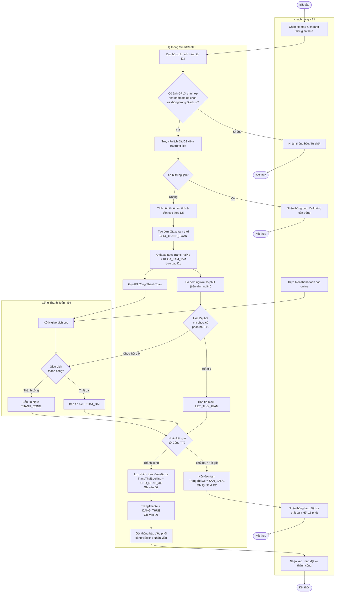
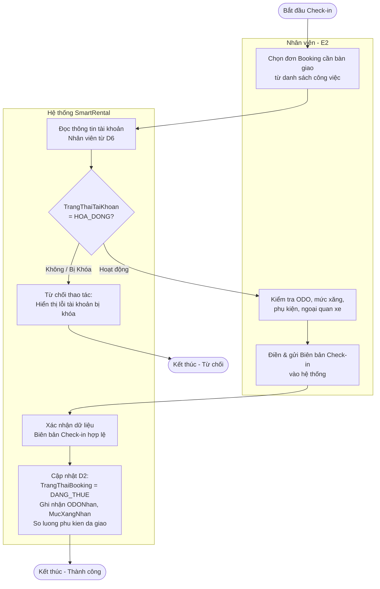
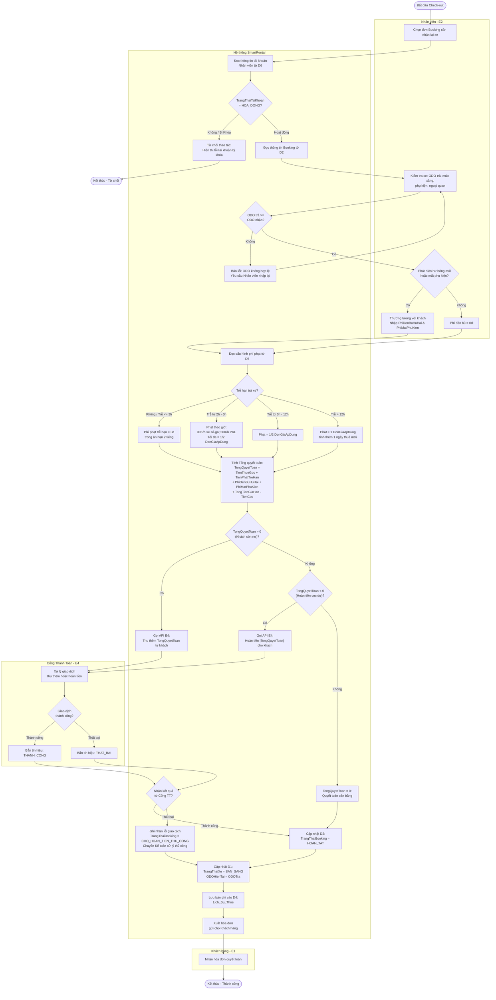
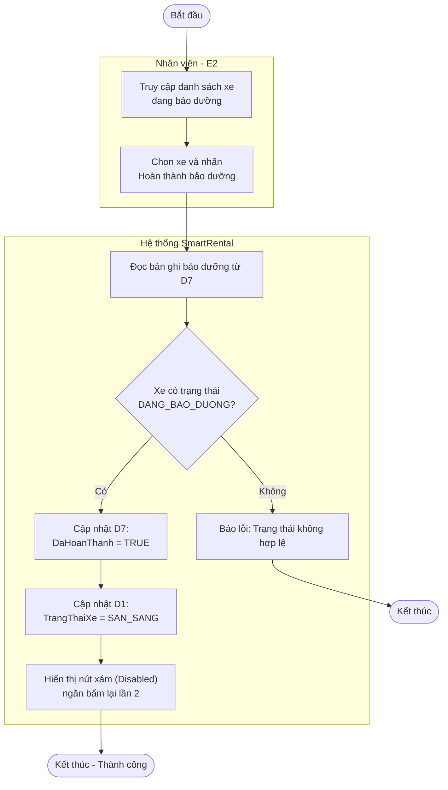
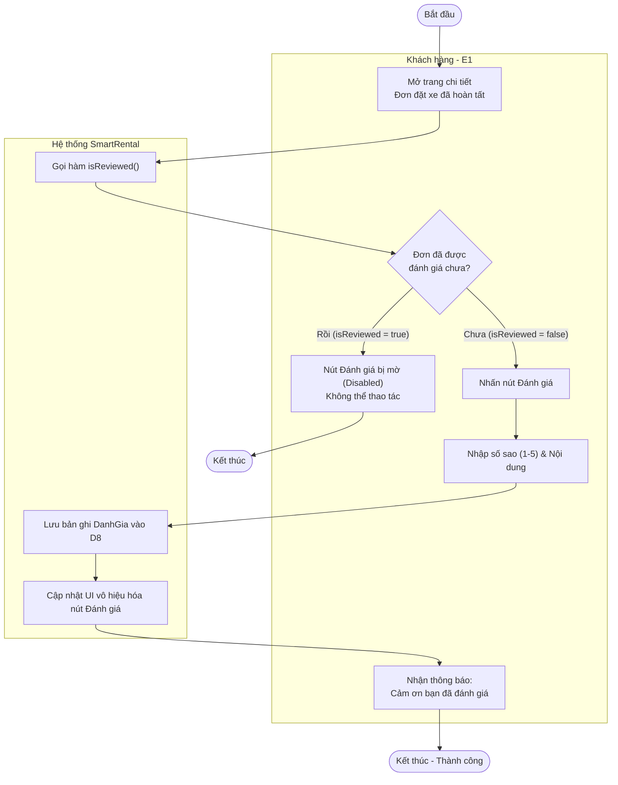

# TÀI LIỆU THIẾT KẾ: SƠ ĐỒ HOẠT ĐỘNG (ACTIVITY DIAGRAMS)

## 1. LUỒNG ĐẶT XE & KHÓA PHƯƠNG TIỆN TẠM THỜI 15 PHÚT

---

## 2. LUỒNG GIA HẠN THUÊ XE TRÊN ỨNG DỤNG (EXTENSION LOGIC)

---

## 3. LUỒNG CHECK-IN, CHECK-OUT & QUYẾT TOÁN PHỤ PHÍ LŨY TIẾN

### 3.1. Phân đoạn Bàn giao xe (Check-in)

### 3.2. Phân đoạn Nhận lại xe & Quyết toán (Check-out)

---

## 4. LUỒNG ĐĂNG KÝ VÀ DUYỆT GPLX (MANUAL APPROVAL)

Mô tả luồng hệ thống ghi nhận ảnh GPLX và Nhân viên/Admin thực hiện duyệt thủ công để cấp quyền thuê xe.

---

## 5. LUỒNG HOÀN THÀNH BẢO DƯỠNG XE

---

## 6. LUỒNG ĐÁNH GIÁ CHUYẾN ĐI

---

> **Ghi chú tổng hợp:**
> - Tất cả mã trạng thái (`TrangThaiBooking`, `TrangThaiXe`, `TrangThaiGPLX`, `NhomXeDuocThue`) được sử dụng **đồng nhất 100%** với Từ điển dữ liệu (D1–D6).
> - Sơ đồ 4 (GPLX Auto-Unlock) thể hiện việc Admin/Nhân viên can thiệp vào luồng cấp quyền.
> - Sơ đồ 3 Check-out đảm bảo hệ thống **chỉ giải phóng xe và đóng đơn sau khi nhận tín hiệu phản hồi từ Cổng thanh toán**, không bỏ qua bước xác nhận giao dịch.
