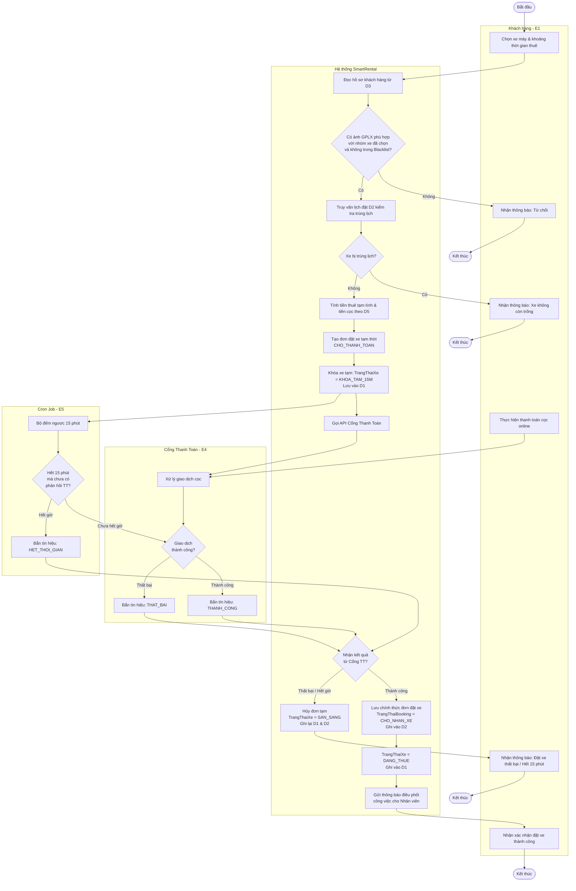
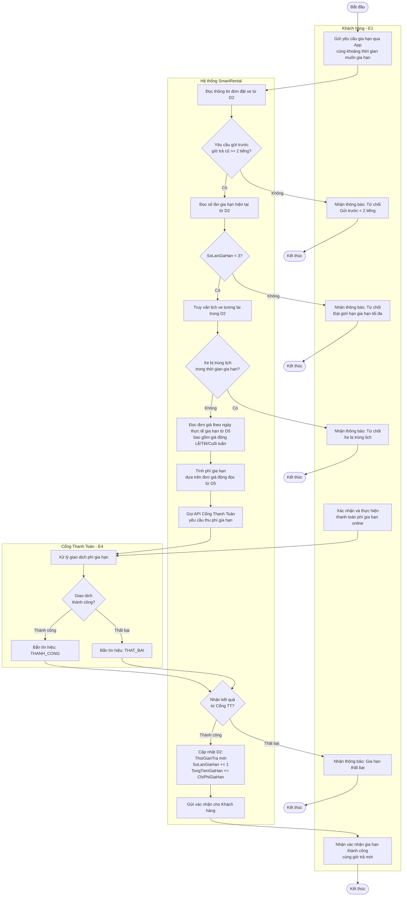
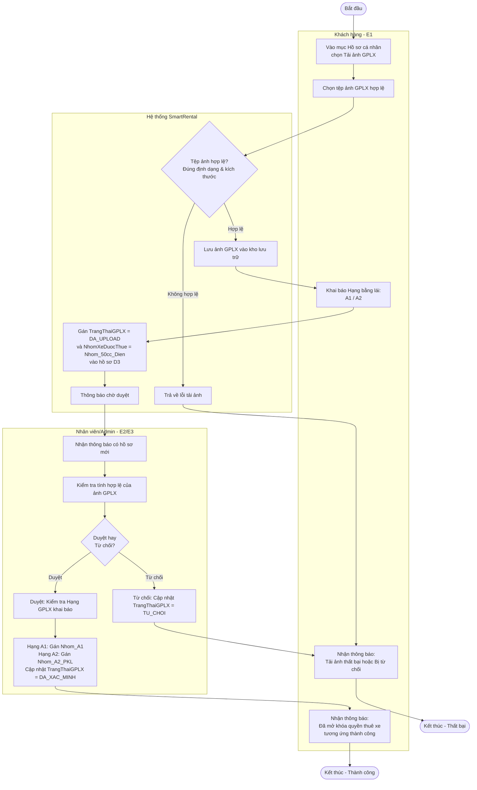

# TÀI LIỆU THIẾT KẾ: SƠ ĐỒ HOẠT ĐỘNG (ACTIVITY DIAGRAMS)

## 1. LUỒNG ĐẶT XE & KHÓA PHƯƠNG TIỆN TẠM THỜI 15 PHÚT



---

## 2. LUỒNG GIA HẠN THUÊ XE TRÊN ỨNG DỤNG (EXTENSION LOGIC)



---

## 3. LUỒNG CHECK-IN, CHECK-OUT & QUYẾT TOÁN PHỤ PHÍ LŨY TIẾN

### 3.1. Phân đoạn Bàn giao xe (Check-in)


### 3.2. Phân đoạn Nhận lại xe & Quyết toán (Check-out)

```mermaid
graph TB
    Start2([Bắt đầu Check-out])

    subgraph E2_CO [Nhân viên - E2]
        NV1[Chọn đơn Booking cần nhận lại xe]
        NV2[Kiểm tra xe: ODO trả, mức xăng,\nphụ kiện, ngoại quan]
        NV3{Phát hiện hư hỏng mới\nhoặc mất phụ kiện?}
        NV4[Thương lượng với khách\nNhập PhiDenBuHuHai & PhiMatPhuKien]
        NV5[Phí đền bù = 0đ]
    end

    subgraph SYS_CO [Hệ thống SmartRental]
        S1[Đọc thông tin tài khoản\nNhân viên từ D6]
        S2{TrangThaiTaiKhoan\n= HOA_DONG?}
        S3[Từ chối thao tác:\nHiển thị lỗi tài khoản bị khóa]
        S4[Đọc thông tin Booking từ D2]
        S5{ODO trả >=\nODO nhận?}
        S6[Báo lỗi: ODO không hợp lệ\nYêu cầu Nhân viên nhập lại]
        S7[Đọc cấu hình phí phạt từ D5]
        S8{Trễ hạn trả xe?}
        S9[Phí phạt trễ hạn = 0đ\ntrong ân hạn 2 tiếng]
        S10[Phạt theo giờ:\n30K/h xe số-ga; 50K/h PKL\nTối đa = 1/2 DonGiaApDung]
        S11[Phạt = 1/2 DonGiaApDung]
        S12[Phạt = 1 DonGiaApDung\ntính thêm 1 ngày thuê mới]
        S13[Tính Tổng quyết toán:\nTongQuyetToan =\nTienThueGoc + TienPhatTreHan\n+ PhiDenBuHuHai + PhiMatPhuKien\n+ TongTienGiaHan - TienCoc]
        S14{TongQuyetToan > 0\n(Khách còn nợ)?}
        S15{TongQuyetToan < 0\n(Hoàn tiền cọc dư)?}
        S16[TongQuyetToan = 0:\nQuyết toán cân bằng]
        S17[Gọi API E4:\nThu thêm TongQuyetToan từ khách]
        S18[Gọi API E4:\nHoàn tiền |TongQuyetToan| cho khách]
        S19{Nhận kết quả\ntừ Cổng TT?}
        S20[Ghi nhận lỗi giao dịch\nTrangThaiBooking = CHO_HOAN_TIEN_THU_CONG\nChuyển Kế toán xử lý thủ công]
        S21[Cập nhật D2:\nTrangThaiBooking = HOAN_TAT]
        S22[Cập nhật D1:\nTrangThaiXe = SAN_SANG\nODOHienTai = ODOTra]
        S23[Lưu bản ghi vào D4:\nLich_Su_Thue]
        S24[Xuất hóa đơn\ngửi cho Khách hàng]
    end

    subgraph E4_CO [Cổng Thanh Toán - E4]
        P1[Xử lý giao dịch\nthu thêm hoặc hoàn tiền]
        P2{Giao dịch\nthành công?}
        P3[Bắn tín hiệu: THANH_CONG]
        P4[Bắn tín hiệu: THAT_BAI]
    end

    subgraph E1_CO [Khách hàng - E1]
        KH1[Nhận hóa đơn quyết toán]
    end

    %% Flow
    Start2 --> NV1 --> S1 --> S2
    S2 -- Không / Bị Khóa --> S3 --> End_CO_Reject([Kết thúc - Từ chối])
    S2 -- Hoạt động --> S4 --> NV2 --> S5
    S5 -- Không --> S6 --> NV2
    S5 -- Có --> NV3
    NV3 -- Có --> NV4 --> S7
    NV3 -- Không --> NV5 --> S7
    S7 --> S8
    S8 -- Không / Trễ <= 2h --> S9 --> S13
    S8 -- Trễ từ 2h - 6h --> S10 --> S13
    S8 -- Trễ từ 6h - 12h --> S11 --> S13
    S8 -- Trễ > 12h --> S12 --> S13
    S13 --> S14
    S14 -- Có --> S17 --> P1
    S14 -- Không --> S15
    S15 -- Có --> S18 --> P1
    S15 -- Không --> S16 --> S21

    P1 --> P2
    P2 -- Thành công --> P3 --> S19
    P2 -- Thất bại --> P4 --> S19
    S19 -- Thành công --> S21
    S19 -- Thất bại --> S20
    S20 --> S22

    S21 --> S22 --> S23 --> S24 --> KH1 --> End_CO_OK([Kết thúc - Thành công])
```

---

## 4. LUỒNG ĐĂNG KÝ VÀ DUYỆT GPLX (MANUAL APPROVAL)

Mô tả luồng hệ thống ghi nhận ảnh GPLX và Nhân viên/Admin thực hiện duyệt thủ công để cấp quyền thuê xe.



---

## 5. LUỒNG HOÀN THÀNH BẢO DƯỠNG XE

```mermaid
graph TB
    Start([Bắt đầu])

    subgraph E2_BD [Nhân viên - E2]
        BD1[Truy cập danh sách xe\nđang bảo dưỡng]
        BD2[Chọn xe và nhấn\nHoàn thành bảo dưỡng]
    end

    subgraph SYS_BD [Hệ thống SmartRental]
        S1[Đọc bản ghi bảo dưỡng từ D7]
        S2{Xe có trạng thái\nDANG_BAO_DUONG?}
        S3[Báo lỗi: Trạng thái không hợp lệ]
        S4[Cập nhật D7:\nDaHoanThanh = TRUE]
        S5[Cập nhật D1:\nTrangThaiXe = SAN_SANG]
        S6[Hiển thị nút xám (Disabled)\nngăn bấm lại lần 2]
    end

    %% Flow
    Start --> BD1 --> BD2 --> S1 --> S2
    S2 -- Không --> S3 --> End1([Kết thúc])
    S2 -- Có --> S4 --> S5 --> S6 --> End2([Kết thúc - Thành công])
```

---

## 6. LUỒNG ĐÁNH GIÁ CHUYẾN ĐI

```mermaid
graph TB
    Start([Bắt đầu])

    subgraph E1_Rating [Khách hàng - E1]
        R1[Mở trang chi tiết\nĐơn đặt xe đã hoàn tất]
        R2{Đơn đã được\nđánh giá chưa?}
        R3[Nút Đánh giá bị mờ (Disabled)\nKhông thể thao tác]
        R4[Nhấn nút Đánh giá]
        R5[Nhập số sao (1-5) & Nội dung]
        R6[Nhận thông báo:\nCảm ơn bạn đã đánh giá]
    end

    subgraph SYS_Rating [Hệ thống SmartRental]
        S1[Gọi hàm isReviewed()]
        S2[Lưu bản ghi DanhGia vào D8]
        S3[Cập nhật UI vô hiệu hóa nút Đánh giá]
    end

    %% Flow
    Start --> R1 --> S1 --> R2
    R2 -- Rồi (isReviewed = true) --> R3 --> End1([Kết thúc])
    R2 -- Chưa (isReviewed = false) --> R4 --> R5 --> S2 --> S3 --> R6 --> End2([Kết thúc - Thành công])
```

---

> **Ghi chú tổng hợp:**
> - Tất cả mã trạng thái (`TrangThaiBooking`, `TrangThaiXe`, `TrangThaiGPLX`, `NhomXeDuocThue`) được sử dụng **đồng nhất 100%** với Từ điển dữ liệu (D1–D6).
> - Sơ đồ 4 (GPLX Auto-Unlock) thể hiện việc Admin/Nhân viên can thiệp vào luồng cấp quyền.
> - Sơ đồ 3 Check-out đảm bảo hệ thống **chỉ giải phóng xe và đóng đơn sau khi nhận tín hiệu phản hồi từ Cổng thanh toán**, không bỏ qua bước xác nhận giao dịch.
