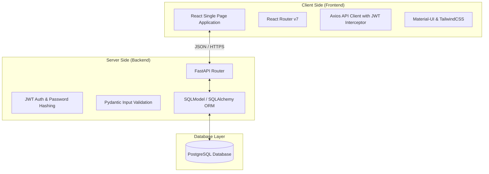

# TÀI LIỆU ĐẶC TẢ KIẾN TRÚC HỆ THỐNG (SYSTEM ARCHITECTURE)

Tài liệu này mô tả chi tiết kiến trúc phần mềm, cấu trúc thư mục, các công nghệ sử dụng và các cơ chế bảo mật/tối ưu hóa của hệ thống cho thuê xe máy **SmartRental**.

---

## 1. TỔNG QUAN KIẾN TRÚC (ARCHITECTURE OVERVIEW)

Hệ thống được thiết kế theo mô hình **Client-Server** truyền thống, chia tách độc lập phần giao diện (Frontend) và phần xử lý logic/cơ sở dữ liệu (Backend) thông qua chuẩn giao tiếp **RESTful API**.



---

## 2. CÔNG NGHỆ & THƯ VIỆN SỬ DỤNG (TECHNOLOGY STACK)

### 2.1. Phân hệ Giao diện (Frontend)
- **Core Framework:** React 19 & TypeScript (đảm bảo tính chặt chẽ về mặt kiểu dữ liệu ở Client).
- **Build Tool:** Vite 8 (tối ưu tốc độ dev server và đóng gói sản phẩm).
- **Styling:** TailwindCSS (cho bố cục linh hoạt và tiện dụng) phối hợp với Material-UI (MUI v9) để cung cấp các component giao diện đồng bộ, chuyên nghiệp.
- **Routing:** React Router v7 để quản lý chuyển trang Single Page App và phân quyền truy cập router.
- **HTTP Client:** Axios (cấu hình interceptor để tự động chèn JWT token vào header `Authorization`).

### 2.2. Phân hệ Máy chủ (Backend)
- **Core Framework:** FastAPI (Python 3.9+) - mang lại hiệu năng cao nhờ hỗ trợ non-blocking Asynchronous (async/await) và tự động tạo tài liệu OpenAPI (Swagger).
- **ORM & Validation:** SQLModel (kết hợp sức mạnh của SQLAlchemy ORM để truy vấn DB và Pydantic v2 để tự động xác thực/kiểm duyệt dữ liệu đầu vào).
- **Database:** PostgreSQL (hệ quản trị cơ sở dữ liệu quan hệ mạnh mẽ, đảm bảo tính toàn vẹn dữ liệu ACID).
- **Database Driver:** `psycopg2` kết nối trực tiếp với Postgres.

---

## 3. CẤU TRÚC THƯ MỤC DỰ ÁN (FOLDER STRUCTURE)

### 3.1. Cấu trúc Backend (`Coding/back-end/`)
```text
back-end/
├── app/
│   ├── api/                  # Các router định nghĩa API Endpoints
│   │   ├── auth.py           # Xác thực, đăng ký, đăng nhập
│   │   ├── bookings.py       # Quản lý đặt xe của khách hàng
│   │   ├── config.py         # Thiết lập biểu phí của Admin
│   │   ├── dashboard.py      # Thống kê số liệu doanh thu Admin
│   │   ├── deps.py           # Dependency Injection (Auth, Database Session)
│   │   ├── motorbikes.py     # Quản lý danh mục xe máy
│   │   ├── ratings.py        # Quản lý đánh giá sao
│   │   └── staff.py          # Nghiệp vụ của Staff (Check-in, Check-out, Duyệt GPLX)
│   ├── core/
│   │   └── security.py       # Hash mật khẩu (Bcrypt) và sinh JWT Token
│   ├── database.py           # Thiết lập kết nối engine và session PostgreSQL
│   ├── models.py             # Định nghĩa Database Models (SQLModel)
│   ├── schemas.py            # Định nghĩa Pydantic Schemas & Validators
│   └── main.py               # Khởi tạo ứng dụng FastAPI và thiết lập CORS
├── fix_enum.py               # Script di trú (migration) cập nhật Enum PostgreSQL
├── test_api.py               # Script test tích hợp API tự động
└── requirements.txt          # Khai báo các thư viện Python cần dùng
```

### 3.2. Cấu trúc Frontend (`Coding/front-end/`)
```text
front-end/
├── src/
│   ├── components/           # Các component UI tái sử dụng (Navbar, ProtectedRoute)
│   ├── pages/                # Các trang giao diện ứng với 3 vai trò
│   │   ├── Login.tsx         # Trang đăng nhập chung cho cả 3 vai trò
│   │   ├── Register.tsx      # Form đăng ký của Khách hàng
│   │   ├── Search.tsx        # Trang chủ tìm kiếm và lọc xe của Khách
│   │   ├── MotorbikeDetail.tsx # Chi tiết xe và form đặt xe
│   │   ├── Profile.tsx       # Cập nhật thông tin và upload GPLX của Khách
│   │   ├── MyBookings.tsx    # Danh sách đơn hàng, thanh toán cọc và đánh giá
│   │   ├── StaffWorklist.tsx # Danh sách việc cần giao/nhận của Nhân viên
│   │   ├── AdminCheckIn.tsx  # Giao diện bàn giao xe (Check-in)
│   │   ├── AdminCheckOut.tsx # Giao diện nhận lại xe & quyết toán (Check-out)
│   │   ├── StaffGPLXReview.tsx # Giao diện nhân viên duyệt GPLX
│   │   ├── AdminDashboard.tsx # Báo cáo số liệu doanh thu trực quan cho Admin
│   │   ├── MotorbikeManager.tsx # Admin quản lý danh sách xe máy
│   │   ├── CustomerManager.tsx  # Admin quản lý khách hàng & Blacklist
│   │   ├── StaffManager.tsx     # Admin quản lý nhân viên cửa hàng
│   │   ├── MaintenanceManager.tsx # Admin quản lý lịch trình bảo dưỡng xe
│   │   └── ConfigManager.tsx    # Admin cấu hình biểu phí phạt hệ thống
│   ├── services/
│   │   └── api.ts            # Khởi tạo Axios instance & gắn JWT token tự động
│   ├── App.tsx               # Cấu hình Routing và phân quyền route
│   ├── index.css             # Thiết lập CSS nền tảng (Tailwind)
│   └── main.tsx              # Điểm khởi chạy ứng dụng React
```

---

## 4. CƠ CHẾ BẢO MẬT & PHÂN QUYỀN (SECURITY & AUTHORIZATION)

### 4.1. Mã hóa mật khẩu (Password Hashing)
Hệ thống sử dụng thuật toán **Bcrypt** để băm mật khẩu khách hàng và nhân viên trước khi lưu xuống cơ sở dữ liệu. Mật khẩu lưu trữ dưới dạng text băm một chiều không thể giải mã ngược, ngăn ngừa rò rỉ thông tin ngay cả khi cơ sở dữ liệu bị truy cập trái phép.

### 4.2. Xác thực và phân quyền dựa trên Token (JWT Authentication)
- Sau khi đăng nhập thành công, máy chủ sinh ra một chuỗi **JWT Token** (chứa thông tin mã định danh và vai trò của tài khoản) có thời hạn hiệu lực.
- Frontend lưu token này vào `localStorage` và tự động đính kèm vào tiêu đề `Authorization: Bearer <Token>` trong tất cả các request gửi đến Backend.
- Backend sử dụng cơ chế **Dependency Injection** của FastAPI để xác thực chữ ký token và kiểm tra quyền truy cập (Authorization) cho từng endpoint:
  - `@router.post` đặt xe $\to$ Yêu cầu quyền `Khach_Hang`.
  - `@router.post` check-in/check-out $\to$ Yêu cầu quyền `Nhan_Vien` hoặc `Admin`.
  - `@router.put` cấu hình hệ thống $\to$ Bắt buộc quyền `Admin`.

---

## 5. CƠ CHẾ TỐI ƯU HÓA DỮ LIỆU & TRANSACTION

### 5.1. Chống lỗi Race-Condition khi đặt xe trùng lịch (Row-Level Locking)
Để giải quyết bài toán hai khách hàng đặt cùng một chiếc xe máy tại cùng một khoảng thời gian trùng nhau:
- Backend thực hiện khóa dòng dữ liệu của chiếc xe máy đó trong cơ sở dữ liệu thông qua chỉ thị `with_for_update()` trong SQL:
  ```python
  stmt_xe = select(XeMay).where(XeMay.MaXe == booking_in.MaXe).with_for_update()
  ```
- Tiến trình đặt xe thứ hai sẽ bị chặn lại cho đến khi transaction của tiến trình thứ nhất hoàn tất. Lúc này hệ thống kiểm tra lại lịch trùng và từ chối đặt xe thứ hai một cách an toàn.

### 5.2. Chuẩn hóa cơ sở dữ liệu (Database Normalization)
Cơ sở dữ liệu được thiết kế đạt chuẩn **3NF**:
- Các thuộc tính trùng lặp được tách thành các bảng danh mục tham chiếu (ví dụ: `DM_LoaiXe`, `DM_NhomXe`).
- Các chi phí phạt và hóa đơn phát sinh được tách thành bảng riêng biệt (`Hoa_Don_Quyet_Toan`), liên kết thông qua khóa ngoại (`MaBooking`).
- Sử dụng các chỉ mục (Indexes) trên các cột được truy vấn thường xuyên như biển số xe (`BienSoXe`) và thời gian nhận/trả để tối ưu hóa tốc độ tìm kiếm phương tiện.
