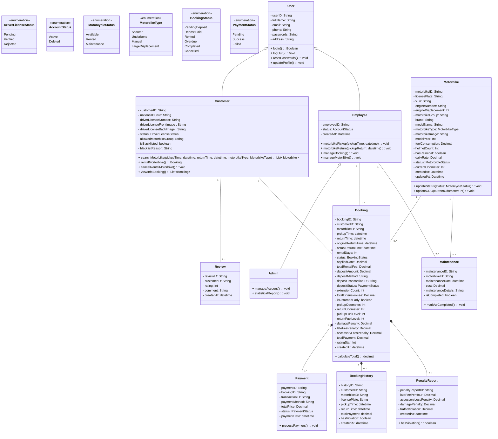

# TÀI LIỆU THIẾT KẾ: SƠ ĐỒ LỚP CHI TIẾT (DOMAIN MODEL)

Tài liệu này mô tả sơ đồ lớp lĩnh vực nghiệp vụ của hệ thống cho thuê xe máy. Sơ đồ tập trung biểu diễn các thực thể thông tin trong thế giới thực, các thuộc tính, các phương thức xử lý kỹ thuật nghiệp vụ chính và mối liên kết giữa các thực thể
---

## 1. SƠ ĐỒ LỚP TỔNG QUAN

---

## 2. BẢNG ĐỐI CHIẾU LỚP ENTITY VÀ KHO DỮ LIỆU

| Class Entity | Kho dữ liệu (Database Table) | Ghi chú |
|---|---|---|
| `User` | *(Lớp trừu tượng)* | Không có bảng vật lý độc lập, dữ liệu được phân bổ hoặc dùng chung cho các lớp con. |
| `Customer` | D3 — Khach_Hang | Chứa hồ sơ cá nhân cơ bản, thông tin giấy phép lái xe và trạng thái vi phạm (Blacklist). |
| `Employee` | D6 — Nhan_Vien | Thông tin tài khoản nhân viên vận hành của cửa hàng. |
| `Admin` | D6 — Nhan_Vien | Dùng chung bảng với `Employee` (phân biệt thông qua trường phân quyền/vai trò). |
| `Motorbike` | D1 — Xe_May | Lưu giữ thông tin chi tiết về phương tiện, phân khối, thiết bị đi kèm và trạng thái hiện tại. |
| `Booking` | D2 — Hop_Dong_Booking | Lưu giữ thông tin giao dịch đặt thuê xe của khách xuyên suốt vòng đời. |
| `Payment` | E4 — Payment | Ghi nhận chi tiết các giao dịch tài chính (thanh toán cọc, quyết toán). |
| `Review` | D8 — Danh_Gia | Phản hồi điểm số và ý kiến đánh giá từ khách hàng. |
| `BookingHistory` | D4 — Lich_Su_Thue | Bản ghi tĩnh lưu giữ dữ liệu thuê xe đã hoàn tất phục vụ thống kê và tra cứu nhanh. |
| `PenaltyReport` | D12 — Phieu_Phat | Lưu trữ chi tiết các khoản phạt phát sinh (trễ giờ, mất phụ kiện, hư hỏng, vi phạm giao thông). |
| `Maintenance` | D7 — Bao_Duong | Nhật ký ghi nhận hoạt động bảo dưỡng, chi phí và trạng thái sửa chữa xe máy. |

---

## 3. ĐẶC TẢ CHI TIẾT CÁC LỚP (CLASS SPECIFICATIONS)

### 3.1. Các lớp Người dùng (Actor Entities)

**a) Lớp `User` (Người dùng)**
- **Mô tả:** Lớp trừu tượng (Abstract) cung cấp nền tảng thông tin định danh và bảo mật cơ bản cho mọi đối tượng tương tác với hệ thống.
- **Trách nhiệm chính:**
  - Lưu trữ thông tin cá nhân cốt lõi (ID, Họ tên, Email, SĐT, Mật khẩu, Địa chỉ).
  - Cung cấp các hành động chung: Đăng nhập (`login`), Đăng xuất (`logOut`), Đặt lại mật khẩu (`resetPasswords`) và Cập nhật hồ sơ (`updateProfile`).

**b) Lớp `Customer` (Khách hàng)**
- **Mô tả:** Kế thừa từ `User`. Đại diện cho khách hàng sử dụng dịch vụ thuê xe. Quản lý thêm dữ liệu về Giấy phép lái xe (GPLX) và điểm tín nhiệm.
- **Trách nhiệm chính:**
  - Lưu trữ trạng thái xác thực GPLX và kiểm soát danh sách đen (`isBlacklisted`, `blacklistReason`).
  - Thực hiện các hành động nghiệp vụ: Tìm kiếm xe trống (`searchMotorbike`), Đặt thuê xe (`rentalMortorbike`), Hủy đơn (`cancelRentalMotorbike`) và Xem danh sách đơn thuê (`viewInfoBooking`).

**c) Lớp `Employee` (Nhân viên)**
- **Mô tả:** Kế thừa từ `User`. Đại diện cho nhân viên vận hành trực tiếp tại tiệm xe.
- **Trách nhiệm chính:**
  - Quản lý trạng thái tài khoản làm việc (`AccountStatus`).
  - Thực hiện các nghiệp vụ thực tế: Xử lý giao xe cho khách (`motorbikePickup`), Nhận lại xe (`motorbikeReturn`), Quản lý tổng quan các đơn đặt xe (`manageBooking`) và Quản lý tình trạng xe máy (`manageMotorBike`).

**d) Lớp `Admin` (Quản trị viên)**
- **Mô tả:** Kế thừa từ `Employee`. Đại diện cho cấp quản lý cao nhất của hệ thống.
- **Trách nhiệm chính:**
  - Cung cấp đặc quyền: Quản lý tài khoản toàn hệ thống (`manageAccount`) và Xuất báo cáo thống kê doanh thu/hoạt động (`statisticalReport`).

---

### 3.2. Các lớp Thực thể Nghiệp vụ (Domain/Entity Classes)

**a) Lớp `Motorbike` (Xe máy)**
- **Mô tả:** Đại diện cho một phương tiện xe máy cụ thể trong kho xe của tiệm.
- **Trách nhiệm chính:**
  - Quản lý định danh phương tiện (Biển số, Số khung, Số máy, Đời xe, Phân khối).
  - Quản lý trang thiết bị đi kèm (số lượng mũ bảo hiểm, áo mưa) và mức tiêu hao nhiên liệu.
  - Cung cấp hàm để tự động cập nhật trạng thái xe (`updateStatus`) và số Kilomet đã đi (`updateODO`).

**b) Lớp `Booking` (Hợp đồng Thuê xe)**
- **Mô tả:** Thực thể cốt lõi (Trung tâm) liên kết Khách hàng, Xe máy và Nhân viên phụ trách trong một giao dịch thuê xe cụ thể.
- **Trách nhiệm chính:**
  - Theo dõi mốc thời gian (nhận xe, trả dự kiến, trả thực tế) và thông số kỹ thuật lúc giao nhận (ODO, mức xăng).
  - Quản lý các loại phí phức tạp: Tiền cọc, Phí gia hạn, Phí đền bù, Phí trễ hạn.
  - Cung cấp hàm tính toán tổng chi phí cuối cùng của hợp đồng (`calculateTotal`).

**c) Lớp `Payment` (Thanh toán)**
- **Mô tả:** Ghi nhận thông tin một giao dịch tài chính phát sinh trong vòng đời của `Booking` (có quan hệ Composition với Booking).
- **Trách nhiệm chính:**
  - Ghi nhận mã giao dịch, số tiền, phương thức thanh toán và trạng thái từ cổng thanh toán (Pending/Success/Failed).
  - Xử lý tiến trình thanh toán thực tế (`processPayment`).

**d) Lớp `Review` (Đánh giá)**
- **Mô tả:** Ý kiến đóng góp và phản hồi từ phía `Customer` sau khi kết thúc chuyến đi.
- **Trách nhiệm chính:**
  - Lưu giữ điểm số đánh giá (rating) và nội dung bình luận (comment) của khách hàng.

**e) Lớp `BookingHistory` (Lịch sử thuê xe)**
- **Mô tả:** Bản lưu trữ tĩnh (Snapshot) của các đơn thuê đã hoàn thành (có quan hệ Composition với Booking).
- **Trách nhiệm chính:**
  - Tóm tắt dữ liệu cốt lõi (Thời gian, Tổng tiền, Biển số xe) và đánh dấu xem chuyến đi đó có phát sinh vi phạm hay không (`hasViolation`) để truy vấn nhanh.

**f) Lớp `PenaltyReport` (Biên bản vi phạm/Phiếu phạt)**
- **Mô tả:** Hồ sơ chi tiết lưu trữ các khoản phạt phát sinh (có quan hệ Composition với Booking).
- **Trách nhiệm chính:**
  - Bóc tách minh bạch các loại phí phạt: Phạt trễ giờ (`lateFeePerHour`), Phạt mất phụ kiện (`accessoryLossPenalty`), Phạt hư hỏng (`damagePenalty`) và Vi phạm luật giao thông (`trafficViolation`).
  - Kiểm tra xem biên bản này có thực sự chứa vi phạm nào không (`hasViolation`).

**g) Lớp `Maintenance` (Bảo dưỡng)**
- **Mô tả:** Thực thể ghi nhận một hoạt động bảo trì, sửa chữa định kỳ hoặc đột xuất của `Motorbike`.
- **Trách nhiệm chính:**
  - Ghi nhận thời gian, chi phí (`cost`), chi tiết các hạng mục thay thế (`maintenanceDetails`).
  - Cung cấp hàm để chuyển trạng thái phiếu bảo dưỡng thành đã hoàn tất (`markAsCompleted`).