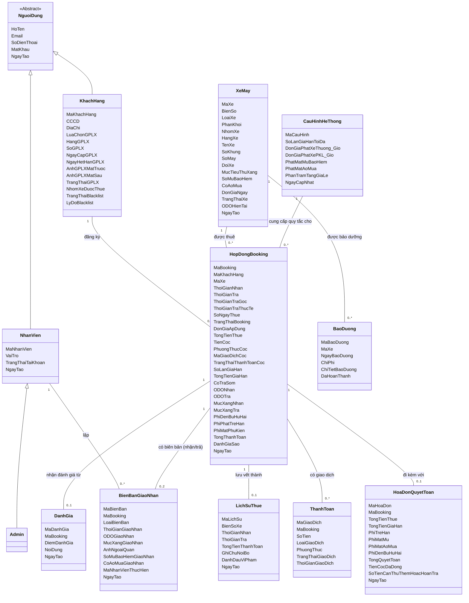

# TÀI LIỆU THIẾT KẾ: SƠ ĐỒ LỚP CHI TIẾT (DOMAIN MODEL)

Tài liệu này mô tả sơ đồ lớp lĩnh vực nghiệp vụ (Domain Model / Conceptual Class Diagram) của hệ thống cho thuê xe máy. Sơ đồ tập trung biểu diễn các thực thể thông tin trong thế giới thực, các thuộc tính nghiệp vụ chính và mối liên kết giữa các thực thể, hoàn toàn loại bỏ các yếu tố cài đặt công nghệ như lớp điều phối (Controllers) và các phương thức xử lý kỹ thuật.

---

## 1. SƠ ĐỒ LỚP TỔNG QUAN (DOMAIN MODEL)

---

## 2. BẢNG ĐỐI CHIẾU LỚP ENTITY VÀ KHO DỮ LIỆU

| Class Entity | Kho dữ liệu (Database Table) | Ghi chú |
|---|---|---|
| `XeMay` | D1 — Xe_May | Lưu giữ thông tin phương tiện trong kho xe. |
| `HopDongBooking` | D2 — Hop_Dong_Booking | Lưu giữ thông tin giao dịch đặt thuê xe của khách. |
| `HoaDonQuyetToan` | D10 — Hoa_Don_Quyet_Toan | Dữ liệu tính toán chi phí thực tế tại thời điểm trả xe. |
| `BienBanGiaoNhan` | D11 — Bien_Ban_Giao_Nhan | Biên bản ghi nhận tình trạng xe khi giao hoặc nhận xe thực tế. |
| `KhachHang` | D3 — Khach_Hang_GPLX | Chứa hồ sơ cá nhân và trạng thái bằng lái xe của khách hàng. |
| `LichSuThue` | D4 — Lich_Su_Thue | Bản ghi phi cấu trúc lưu giữ dữ liệu thuê xe phục vụ thống kê lịch sử. |
| `CauHinhHeThong` | D5 — Cau_Hinh_He_Thong | Bản ghi tham chiếu các quy tắc phạt và hệ số tăng giá toàn cục. |
| `NhanVien` | D6 — Nhan_Vien | Thông tin tài khoản nhân viên của cửa hàng. |
| `BaoDuong` | D7 — Bao_Duong | Nhật ký ghi nhận hoạt động bảo dưỡng sửa chữa xe máy. |
| `DanhGia` | D8 — Danh_Gia | Phản hồi điểm số và ý kiến đánh giá từ khách hàng. |
| `ThanhToan` | E4 — Payment | Giao dịch tài chính (cọc, gia hạn, quyết toán, hoàn cọc). |

---

## 3. ĐẶC TẢ CHI TIẾT CÁC LỚP (CLASS SPECIFICATIONS)

### 3.1. Các lớp Người dùng (Actor Entities)

**a) Lớp `KhachHang` (Customer)**
- **Mô tả:** Đại diện cho khách hàng sử dụng dịch vụ thuê xe máy. Lớp này quản lý hồ sơ thông tin cá nhân và thông tin giấy phép lái xe để phân loại nhóm xe được phép đặt.
- **Trách nhiệm chính:**
  - Khai báo thông tin cá nhân cơ bản và cập nhật hình ảnh Giấy phép lái xe (GPLX).
  - Yêu cầu và theo dõi trạng thái các đơn đặt xe, gia hạn, trả xe sớm hoặc hủy đơn thuê.

**b) Lớp `NhanVien` (Staff)**
- **Mô tả:** Đại diện cho nhân viên vận hành tại tiệm xe máy.
- **Trách nhiệm chính:**
  - Kiểm tra điều kiện bàn giao xe thực tế và xác nhận Biên bản giao nhận xe (Check-in).
  - Tiếp nhận xe khi trả, ghi nhận hư hỏng thực tế và tạo Biên bản nhận lại xe (Check-out).
  - Hỗ trợ duyệt nhanh ảnh GPLX do khách hàng tải lên.
  - Cập nhật thông tin bảo dưỡng định kỳ cho phương tiện.

**c) Lớp `Admin`**
- **Mô tả:** Đại diện cho quản trị viên hệ thống (kế thừa từ `NhanVien`).
- **Trách nhiệm chính:**
  - Quản lý danh mục phương tiện trong kho xe máy.
  - Quản lý hồ sơ và cấp tài khoản nhân viên tiệm xe.
  - Cập nhật các thông số cấu hình biểu phí phạt và hệ số tăng giá lễ tết của hệ thống.
  - Đưa khách hàng vi phạm nghiêm trọng vào danh sách đen (Blacklist).

---

### 3.2. Các lớp Thực thể Nghiệp vụ (Domain/Entity Classes)

**a) Lớp `XeMay` (Motorcycle)**
- **Mô tả:** Đại diện cho một phương tiện xe máy cụ thể trong kho xe của tiệm.
- **Trách nhiệm chính:**
  - Quản lý thông tin đăng ký pháp lý của xe (biển số, số khung, số máy) và trạng thái hiện tại (sẵn sàng, đang thuê, đang bảo dưỡng, khóa tạm thời).
  - Quản lý trang thiết bị đi kèm (số lượng mũ bảo hiểm, áo mưa) và chỉ số ODO thực tế.

**b) Lớp `HopDongBooking` (Booking Contract)**
- **Mô tả:** Thực thể cốt lõi ghi nhận một giao dịch thuê xe cụ thể xuyên suốt vòng đời từ khi đặt cọc đến khi hoàn tất quyết toán.
- **Trách nhiệm chính:**
  - Liên kết chặt chẽ thông tin khách hàng thuê xe, phương tiện được thuê, thời gian thuê và giá trị hợp đồng.
  - Theo dõi trạng thái tiến trình của hợp đồng (Chờ thanh toán cọc, Chờ nhận xe, Đang thuê, Quá hạn, Chờ quyết toán, Hoàn tất hoặc Đã hủy).

**c) Lớp `HoaDonQuyetToan` (Financial Settlement)**
- **Mô tả:** Thực thể ghi nhận thông tin tài chính chi tiết tại thời điểm quyết toán thanh lý hợp đồng.
- **Trách nhiệm chính:**
  - Ghi nhận chi tiết doanh thu thực tế, tiền cọc đã đóng, và phụ thu phát sinh (phạt trễ giờ, đền bù mất phụ kiện bảo hiểm/áo mưa, đền bù hư hỏng ngoại quan).
  - Xác định tổng số tiền cuối cùng cần phải thu thêm từ khách hàng hoặc hoàn trả lại cho khách hàng.

**d) Lớp `BienBanGiaoNhan` (Handover Record)**
- **Mô tả:** Tài liệu lưu trữ tình trạng vật lý thực tế của xe máy tại các thời điểm chuyển giao quyền sở hữu xe (giao xe cho khách hoặc nhận lại xe từ khách).
- **Trách nhiệm chính:**
  - Ghi nhận ODO thực tế, mức xăng trong bình, tình trạng hư hỏng ngoại quan bằng hình ảnh tại thời điểm giao/nhận xe.
  - Ghi nhận số lượng mũ bảo hiểm và tình trạng áo mưa thực tế được chuyển giao.

**e) Lớp `BaoDuong` (Maintenance)**
- **Mô tả:** Thực thể ghi nhận một hoạt động bảo trì, bảo dưỡng định kỳ hoặc sửa chữa đột xuất của phương tiện.
- **Trách nhiệm chính:**
  - Ghi nhận thời gian, tổng chi phí thực tế và chi tiết các hạng mục phụ tùng thay thế/sửa chữa của xe máy.

**f) Lớp `DanhGia` (Review)**
- **Mô tả:** Ý kiến đóng góp và phản hồi từ phía khách hàng sau khi kết thúc chuyến đi.
- **Trách nhiệm chính:**
  - Lưu giữ điểm số đánh giá (sao) và nội dung ý kiến đóng góp của khách hàng dành cho một mã đơn đặt xe cụ thể.

**g) Lớp `ThanhToan` (Payment)**
- **Mô tả:** Ghi nhận thông tin một giao dịch tài chính phát sinh trong vòng đời hợp đồng.
- **Trách nhiệm chính:**
  - Ghi nhận mã giao dịch, số tiền chuyển khoản/tiền mặt, mục đích thanh toán (đặt cọc, gia hạn, quyết toán, hoàn tiền cọc) và trạng thái giao dịch từ phía cổng thanh toán.

**h) Lớp `LichSuThue` (Rental History)**
- **Mô tả:** Bản lưu trữ tĩnh đóng vai trò như một Snapshot của đơn thuê đã hoàn thành để phục vụ tra cứu nhanh mà không cần truy vấn ngược cơ sở dữ liệu lớn.
- **Trách nhiệm chính:**
  - Lưu trữ tổng tiền thuê, khoảng thời gian thực tế, biển số xe và đánh dấu khách hàng có vi phạm quy định (nếu có) để phục vụ chấm điểm tín nhiệm khách hàng.

**i) Lớp `CauHinhHeThong` (System Settings)**
- **Mô tả:** Chứa các hằng số và cấu hình định giá toàn cục do quản trị viên thiết lập.
- **Trách nhiệm chính:**
  - Cung cấp các thông số biểu phí phạt (phạt trả trễ theo giờ cho xe thường, phạt trả trễ cho xe phân khối lớn, phạt mất phụ kiện) làm căn cứ tính toán cho hóa đơn quyết toán.
