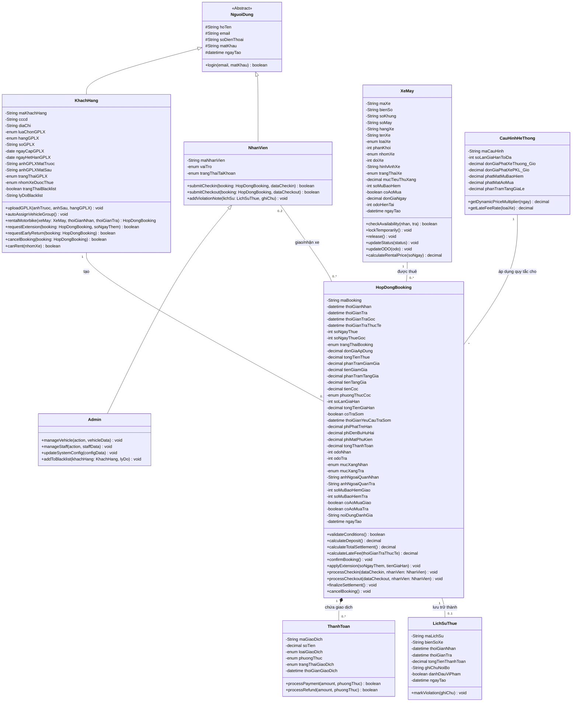

# TÀI LIỆU THIẾT KẾ: SƠ ĐỒ LỚP CHI TIẾT (CLASS DIAGRAM)

**Quy ước Access Modifier:**
- `-` (private): Thuộc tính dữ liệu.
- `+` (public): Phương thức giao tiếp (Messages).
- `#` (protected): Thuộc tính dùng chung trong lớp cha.

---

## 1. SƠ ĐỒ LỚP TỔNG QUAN (DOMAIN MODEL)

---

## 2. BẢNG ĐỐI CHIẾU LỚP ENTITY VÀ KHO DỮ LIỆU

| Class Entity | Kho dữ liệu (Database Table) | Ghi chú |
|---|---|---|
| `XeMay` | D1 — Xe_May | Tự chứa các hàm kiểm tra lịch trống và tính giá ngày. |
| `HopDongBooking` | D2 — Hop_Dong_Booking | Chứa toàn bộ logic tính tổng tiền, tính phí trễ, và quy trình check-in/out. |
| `KhachHang` | D3 — Khach_Hang_GPLX | Điểm neo (Entry point) khi khách hàng tương tác với hệ thống. |
| `LichSuThue` | D4 — Lich_Su_Thue | Bản ghi offline. |
| `CauHinhHeThong` | D5 — Cau_Hinh_He_Thong | Cung cấp thông số cấu hình chung. |
| `NhanVien` | D6 — Nhan_Vien | Quản lý tác nhân nhân viên. |
| `ThanhToan` | Lớp trừu tượng (Interface với E4) | Tương tác trực tiếp với Cổng thanh toán (E4). |

---

## 3. ĐẶC TẢ CHI TIẾT CÁC LỚP (CLASS SPECIFICATIONS)

### 3.1. Các lớp Người dùng (Actor Classes)

**a) Lớp `KhachHang` (Customer)**
- **Mô tả:** Đại diện cho khách hàng sử dụng dịch vụ thuê xe. Lớp này quản lý thông tin cá nhân, hồ sơ bằng lái và là nơi khởi tạo các luồng nghiệp vụ chính.
- **Trách nhiệm (Responsibilities):** 
  - Khởi tạo quá trình đặt xe mới.
  - Quản lý và tự động phân quyền theo loại Giấy phép lái xe (GPLX).
  - Khởi tạo các yêu cầu gia hạn, trả sớm hoặc hủy hợp đồng.
- **Phương thức chính:**
  - `uploadGPLX()`: Tải lên và lưu trữ thông tin bằng lái.
  - `autoAssignVehicleGroup()`: Tự động tính toán và gán nhóm xe (50cc/A1/A2) dựa trên thông tin GPLX.
  - `rentalMotorbike()`: Khởi tạo một đối tượng `HopDongBooking` mới.
  - `requestExtension()`: Gửi thông điệp tới `HopDongBooking` để yêu cầu gia hạn số ngày thuê.

**b) Lớp `NhanVien` (Staff)**
- **Mô tả:** Đại diện cho nhân viên vận hành tại cửa hàng.
- **Trách nhiệm:** 
  - Tương tác với đối tượng `HopDongBooking` để thực hiện check-in và check-out.
  - Ghi nhận thông tin thực tế của xe (ODO, mức xăng, tình trạng ngoại quan) tại thời điểm bàn giao.
- **Phương thức chính:**
  - `submitCheckin()`: Xác nhận bàn giao xe cho khách.
  - `submitCheckout()`: Xác nhận thu hồi xe và tạo dữ liệu quyết toán.

**c) Lớp `Admin`**
- **Mô tả:** Đại diện cho quản trị viên, kế thừa từ `NhanVien`.
- **Trách nhiệm:** 
  - Quản lý danh mục xe, tài khoản nhân viên.
  - Cấu hình các thông số hệ thống.
  - Đưa khách hàng vi phạm vào Blacklist.

### 3.2. Các lớp Thực thể Nghiệp vụ (Business Classes)

**a) Lớp `XeMay` (Motorcycle)**
- **Mô tả:** Đại diện cho một phương tiện cho thuê trong hệ thống.
- **Trách nhiệm:** 
  - Quản lý trạng thái và tính khả dụng của chính nó.
  - Tự động tính toán giá thuê cơ bản dựa trên thông tin của xe.
- **Phương thức chính:**
  - `checkAvailability(nhan, tra)`: Tự kiểm tra xem xe có trống lịch trong khoảng thời gian được yêu cầu hay không.
  - `lockTemporarily()`: Khóa trạng thái xe trong 15 phút khi chờ thanh toán cọc.
  - `calculateRentalPrice(soNgay)`: Tính tổng tiền thuê cơ bản dựa trên đơn giá ngày của xe.

**b) Lớp `HopDongBooking` (Booking Contract)**
- **Mô tả:** Đây là lớp cốt lõi (Core Entity) trong Domain Model, lưu trữ toàn bộ trạng thái và thông tin của một lần thuê xe.
- **Trách nhiệm:** 
  - Lưu giữ thông tin giao dịch, xe máy, khách hàng.
  - Chứa logic tính toán tiền cọc, phụ phí trễ hạn, đền bù hư hại và tổng quyết toán.
  - Xử lý các nghiệp vụ vòng đời hợp đồng (check-in, check-out, gia hạn, trả sớm).
- **Phương thức chính:**
  - `validateConditions()`: Kiểm tra tính hợp lệ trước khi tạo hợp đồng (GPLX hợp lệ, lịch trống).
  - `calculateDeposit()`: Tự động tính toán số tiền cọc cần thanh toán.
  - `calculateLateFee(thoiGianTraThucTe)`: Tự động áp dụng các mốc tính phí phạt theo thời gian trễ (trễ 2h-6h, 6h-12h, >12h).
  - `calculateTotalSettlement()`: Tổng hợp tất cả các chi phí (tiền thuê, gia hạn, phạt, đền bù) và khấu trừ tiền cọc để ra số tiền thanh toán cuối cùng.
  - `applyExtension()`: Cập nhật lịch trình trả xe mới và tính toán cộng dồn tiền gia hạn.
  - `processCheckin() / processCheckout()`: Xử lý dữ liệu do nhân viên cung cấp tại thời điểm giao/nhận xe.

**c) Lớp `ThanhToan` (Payment)**
- **Mô tả:** Đối tượng trung gian (Interface object) làm việc với Cổng thanh toán ngoại vi (E4).
- **Trách nhiệm:** Thực hiện và ghi nhận trạng thái các giao dịch tài chính (thanh toán cọc, thanh toán gia hạn, quyết toán, hoàn tiền).
- **Phương thức chính:**
  - `processPayment()`: Gọi API thực hiện thanh toán trực tuyến.
  - `processRefund()`: Gọi API thực hiện hoàn tiền (VD: khi khách hủy đơn hợp lệ).

**d) Lớp `LichSuThue` (Rental History)**
- **Mô tả:** Bản lưu trữ (Snapshot) dạng Read-Only của một hợp đồng đã hoàn tất.
- **Trách nhiệm:** Lưu vết lịch sử phục vụ tra cứu offline, báo cáo thống kê và xử lý phạt nguội về sau.

**e) Lớp `CauHinhHeThong` (System Settings)**
- **Mô tả:** Đối tượng cấu hình toàn cục (Singleton).
- **Trách nhiệm:** Cung cấp các thông số chung (phí phạt giờ, phí mất phụ kiện, tỷ lệ tăng giá Lễ/Tết) để các thực thể khác như `HopDongBooking` gọi và sử dụng trong quá trình tính toán.
