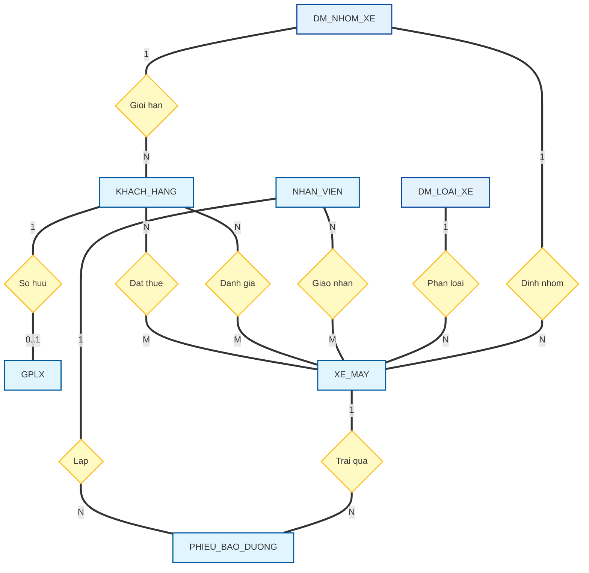

# TÀI LIỆU THIẾT KẾ: MÔ HÌNH KHÁI NIỆM THỰC THỂ QUAN HỆ (ER CONCEPTUAL MODEL)

Tài liệu này trình bày **Mô hình Khái niệm Thực thể Quan hệ (ER Conceptual Model)** của Hệ thống Quản lý và Cho thuê xe máy Thông minh. 

Mô hình ER Khái niệm (Conceptual Model) thể hiện góc nhìn nghiệp vụ thuần túy của thế giới thực, mô tả các **Thực thể (Entities)**, **Thuộc tính khái niệm (Attributes)** và **Mối quan hệ (Relationships)** giữa chúng mà không bị ràng buộc bởi cấu trúc bảng vật lý, khóa ngoại kỹ thuật (FK), hay các thực thể trung gian do chuẩn hóa dữ liệu.

---

## 1. PHÂN BIỆT ER CONCEPTUAL MODEL VS ERD CONCEPTUAL MODEL

Để đảm bảo tính chính xác trong thiết kế hệ thống, cần làm rõ sự khác biệt giữa hai khái niệm này:

| Đặc điểm so sánh | Mô hình ER Khái niệm (ER Conceptual Model) | Sơ đồ ER Khái niệm (ERD Conceptual) |
| :--- | :--- | :--- |
| **Bản chất** | Là một **mô hình dữ liệu trừu tượng** mô tả thực tế nghiệp vụ (Semantic model). | Là **bản vẽ/sơ đồ** trực quan hóa mô hình khái niệm đó (thường dùng ký hiệu Chen hoặc Chân chim). |
| **Mối quan hệ Nhiều-Nhiều (N-N)** | **Giữ nguyên** mối quan hệ Nhiều-Nhiều trực tiếp giữa các thực thể thực (ví dụ: Khách hàng đặt thuê Xe máy). | Đôi khi đã bắt đầu tách hoặc biểu diễn dưới dạng sơ đồ để dễ chuyển sang mức logic. |
| **Khóa ngoại (FK)** | **Hoàn toàn không tồn tại** khái niệm Khóa ngoại. Các mối quan hệ được mô tả bằng động từ liên kết. | Có thể xuất hiện dưới dạng đường nối liên kết (nhưng chưa cấu trúc thành cột FK). |
| **Bảng trung gian (Junction Table)** | **Không có**. Chỉ chứa các thực thể thực tế ngoài đời thực (Khách hàng, Xe máy), không chứa thực thể giao dịch kỹ thuật (như `Hop_Dong_Booking` hay `Lich_Su_Thue`). | Có thể hiển thị các thực thể trung gian nếu sơ đồ được vẽ sát với mô hình logic. |

---

## 2. SƠ ĐỒ MÔ HÌNH ER KHÁI NIỆM (ER CONCEPTUAL DIAGRAM)

Dưới đây là sơ đồ mô tả mối quan hệ thực tế giữa các thực thể cốt lõi của hệ thống, sử dụng mối quan hệ Nhiều-Nhiều (N-N) trực tiếp và lược bỏ hoàn toàn các thực thể trung gian kỹ thuật:

> [!NOTE]
> * **Quy ước ký hiệu bản số:** 
>   * Ký tự `N` và `M` đều đại diện cho khái niệm **"Nhiều" (Many)** trong mối quan hệ Nhiều - Nhiều. Việc dùng hai ký tự khác nhau (`N` và `M`) để chỉ ra rằng số lượng phần tử tham gia ở hai đầu không bắt buộc phải bằng nhau (ví dụ: $N$ xe máy và $M$ khách hàng).
>   * Theo chuẩn học thuật **Chen's Notation**, các chữ số bản số (`1`, `N`, `M`, `0..1`) **nên được ghi sát phía Thực thể (Entity)** để biểu thị trực quan số lượng phiên bản của thực thể đó liên kết với thực thể còn lại. *(Trong sơ đồ Mermaid trên, nhãn được hiển thị ở giữa đường nối do giới hạn hiển thị tự động của công cụ vẽ).*
> * **Chuyển đổi mô hình:**
>   * Mối quan hệ **Đặt thuê (N-N)** và **Đánh giá (N-N)** giữa `KHACH_HANG` và `XE_MAY` là quan hệ khái niệm ngoài đời thực. Khi chuyển sang mô hình Logic/Vật lý, các quan hệ N-N này sẽ được rã thành các thực thể giao dịch trung gian là `Hop_Dong_Booking` và `Danh_Gia`.
>   * Tương tự, mối quan hệ **Giao nhận xe (N-N)** giữa `NHAN_VIEN` và `XE_MAY` sẽ được hiện thực hóa bằng thực thể trung gian `Bien_Ban_Giao_Nhan`.

---

## 3. CÁC THỰC THỂ KHÁI NIỆM VÀ THUỘC TÍNH (ENTITIES & ATTRIBUTES)

Trong mô hình khái niệm, thuộc tính chỉ bao gồm tên gọi mang tính nghiệp vụ, không đi kèm kiểu dữ liệu vật lý (như `varchar`, `int`) và không có khóa ngoại (`FK`).

### 3.1. Thực thể Khách hàng (`KHACH_HANG`)
* **Mô tả:** Người đăng ký tài khoản và thuê xe máy.
* **Thuộc tính:**
  * `MaKhachHang` *(Thuộc tính định danh)*
  * `HoTen`
  * `Email`
  * `SoDienThoai`
  * `CCCD`
  * `DiaChi`
  * `TrangThaiBlacklist`

### 3.2. Thực thể Giấy phép lái xe (`GPLX`)
* **Mô tả:** Giấy phép hợp lệ của khách hàng để đủ điều kiện thuê các dòng xe phân khối lớn.
* **Thuộc tính:**
  * `SoGPLX` *(Thuộc tính định danh)*
  * `HangGPLX`
  * `NgayCap`
  * `NgayHetHan`
  * `AnhGPLXMatTruoc`
  * `AnhGPLXMatSau`

### 3.3. Thực thể Xe máy (`XE_MAY`)
* **Mô tả:** Các phương tiện xe máy thuộc quyền sở hữu của cửa hàng cho thuê.
* **Thuộc tính:**
  * `MaXe` *(Thuộc tính định danh)*
  * `BienSo`
  * `SoKhung`
  * `SoMay`
  * `HangXe`
  * `TenXe`
  * `DungTichPhanKhoi`
  * `DoiXe`
  * `DonGiaNgay`
  * `ChiSoODOHienTai`
  * `TrangThaiXe`

### 3.4. Thực thể Nhân viên (`NHAN_VIEN`)
* **Mô tả:** Nhân sự quản trị hoặc nhân viên giao nhận làm việc tại cửa hàng.
* **Thuộc tính:**
  * `MaNhanVien` *(Thuộc tính định danh)*
  * `HoTen`
  * `Email`
  * `SoDienThoai`
  * `VaiTro` (Nhân viên / Quản trị viên)

### 3.5. Thực thể Phiếu bảo dưỡng (`PHIEU_BAO_DUONG`)
* **Mô tả:** Ghi nhận thông tin bảo trì xe định kỳ hoặc sửa chữa hỏng hóc.
* **Thuộc tính:**
  * `SoPhieuBaoDuong` *(Thuộc tính định danh)*
  * `NgayBaoDuong`
  * `ChiPhiBaoDuong`
  * `NoiDungBaoDuong`
  * `TrangThaiHoanThanh`

---

## 4. ĐẶC TẢ CHI TIẾT MỐI QUAN HỆ KHÁI NIỆM (RELATIONSHIPS)

### 4.1. Mối quan hệ Đặt thuê (`Dat_Thue`)
* **Loại quan hệ:** Nhiều - Nhiều (**N - N**) giữa `KHACH_HANG` và `XE_MAY`.
* **Thuộc tính liên kết:**
  * `ThoiGianNhanXeDuKien`
  * `ThoiGianTraXeDuKien`
  * `SoTienDatCoc`
  * `TrangThaiThanhToanCoc`
  * `TongTienQuyetToan`
* **Mô tả nghiệp vụ:** Một khách hàng có thể đặt thuê nhiều xe máy khác nhau theo thời gian và một chiếc xe máy cũng có thể được thuê bởi nhiều khách hàng khác nhau tại các thời điểm khác nhau.

### 4.2. Mối quan hệ Giao nhận xe (`Giao_Nhan_Xe`)
* **Loại quan hệ:** Nhiều - Nhiều (**N - N**) giữa `NHAN_VIEN` và `XE_MAY`.
* **Thuộc tính liên kết:**
  * `ThoiGianGiaoNhanThucTe`
  * `TinhTrangXeKhiGiao` (ODO, Xăng, Ngoại quan)
  * `TinhTrangXeKhiNhan` (ODO, Xăng, Ngoại quan, Hư hại phát sinh)
* **Mô tả nghiệp vụ:** Nhân viên thực hiện bàn giao xe cho khách hàng hoặc tiếp nhận xe do khách hàng trả lại. Một nhân viên có thể giao/nhận nhiều xe và một chiếc xe máy có thể được giao/nhận bởi các nhân viên khác nhau tùy theo ca trực.

### 4.3. Mối quan hệ Sở hữu GPLX (`So_Huu_GPLX`)
* **Loại quan hệ:** 1 - 0..1 (**1 - 1**) giữa `KHACH_HANG` và `GPLX`.
* **Mô tả nghiệp vụ:** Một khách hàng chỉ có tối đa một giấy phép lái xe được lưu trữ trên hệ thống. GPLX này phải thuộc về duy nhất khách hàng đó.

### 4.4. Mối quan hệ Trải qua bảo dưỡng (`Trai_Qua_Bao_Duong`)
* **Loại quan hệ:** 1 - Nhiều (**1 - N**) giữa `XE_MAY` và `PHIEU_BAO_DUONG`.
* **Mô tả nghiệp vụ:** Một chiếc xe máy có thể trải qua nhiều đợt bảo dưỡng khác nhau theo thời gian. Mỗi phiếu bảo dưỡng chỉ ghi nhận thông tin cho duy nhất một chiếc xe máy cụ thể.
