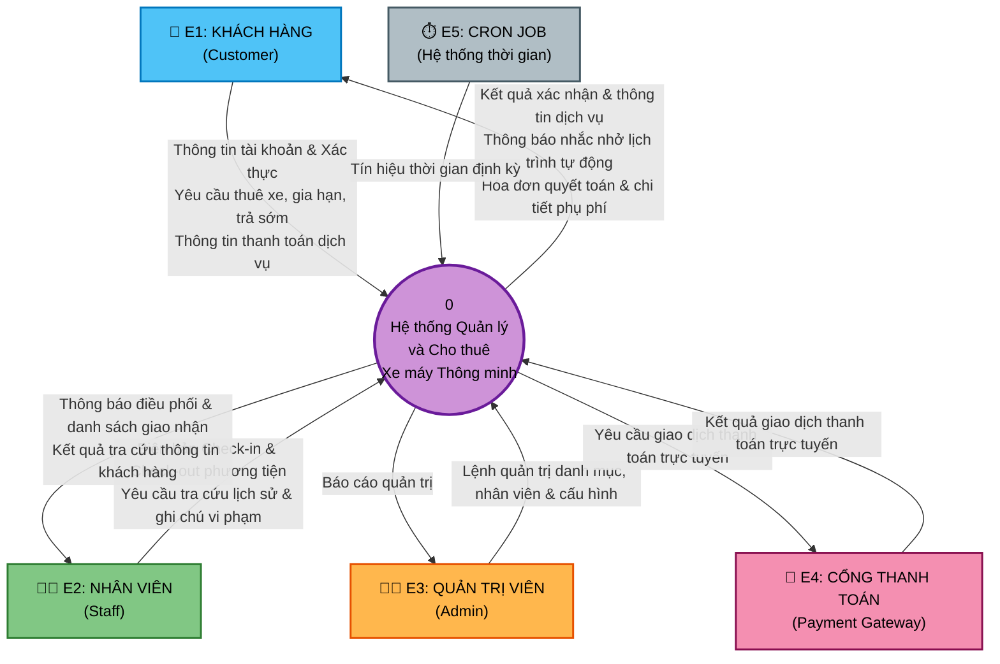
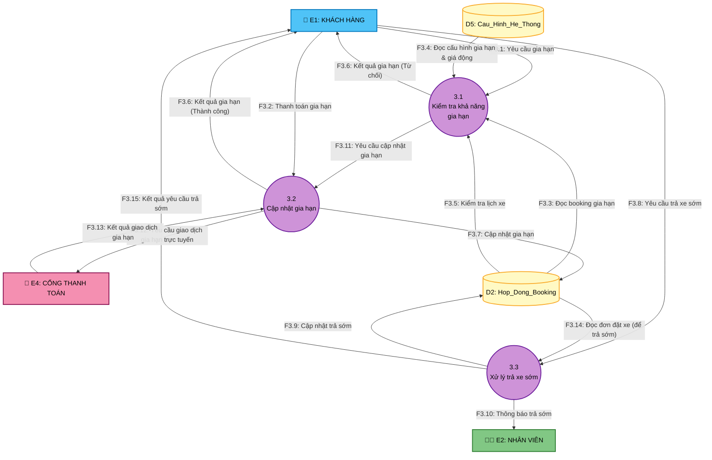
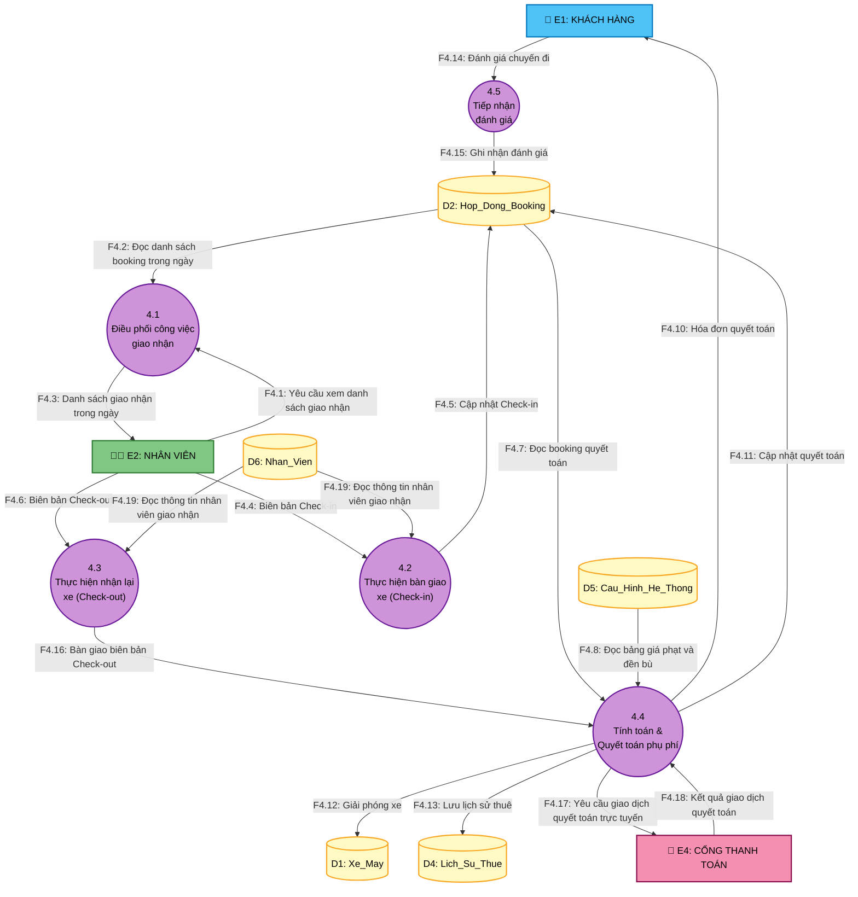
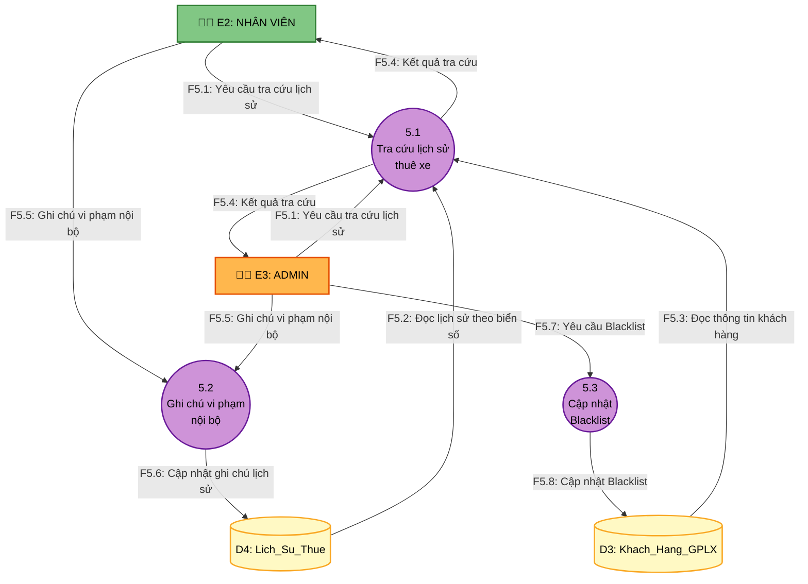
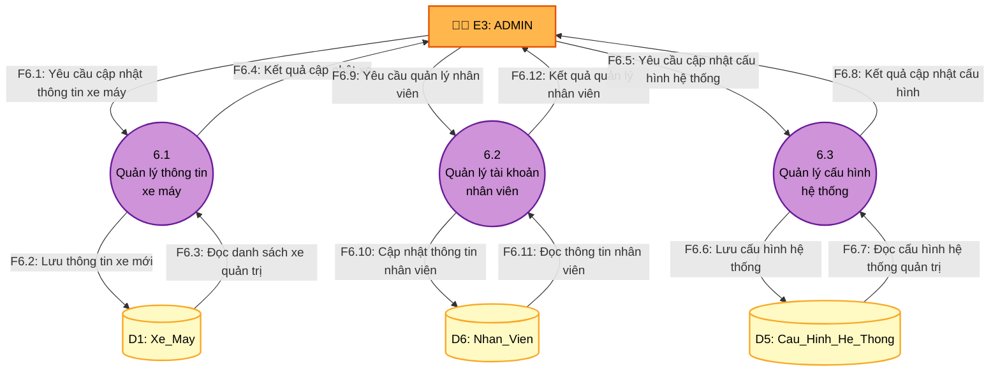

# 📊 SƠ ĐỒ LUỒNG DỮ LIỆU (DATA FLOW DIAGRAMS)
## Hệ thống Quản lý và Cho thuê xe máy Thông minh

---

## 1. SƠ ĐỒ NGỮ CẢNH (CONTEXT DIAGRAM — DFD LEVEL -1)



### Bảng tổng hợp luồng dữ liệu — Sơ đồ Ngữ cảnh (Context Diagram)

1. **Thông tin tài khoản & Xác thực** (Khách hàng `E1` → Hệ thống `P0`):
   - *Mô tả:* Chứa toàn bộ thông tin đăng ký tài khoản mới và thông tin xác thực đăng nhập của khách hàng.
   - *Bao hàm:* 
     - `F1.1: Yêu cầu đăng ký tài khoản` (HoTen, Email, SoDienThoai, LuaChonGPLX, AnhGPLXMatTruoc, AnhGPLXMatSau, HangGPLX, SoGPLX, NgayCapGPLX, NgayHetHanGPLX).
     - `F1.2: Thông tin đăng nhập` (Email/SoDienThoai, MatKhau).

2. **Yêu cầu thuê xe, gia hạn, trả sớm** (Khách hàng `E1` → Hệ thống `P0`):
   - *Mô tả:* Các tương tác trực tiếp của khách hàng nhằm đặt xe, thay đổi hợp đồng hoặc gửi phản hồi.
   - *Bao hàm:*
     - `F2.1: Yêu cầu tìm kiếm xe` (LoaiXe, HangXe, PhanKhoi, KhoangGia_Min, KhoangGia_Max, ThoiGianNhan, ThoiGianTra).
     - `F2.6: Yêu cầu đặt xe` (MaKhachHang, MaXe, ThoiGianNhan, ThoiGianTra, DichVuDiKem[]).
     - `F2.7: Yêu cầu hủy đặt xe` (MaBooking).
     - `F3.1: Yêu cầu gia hạn` (MaBooking, SoNgayGiaHanThem, ThoiGianTraMoi).
     - `F3.8: Yêu cầu trả xe sớm` (MaBooking, ThoiGianMuonTra).
     - `F4.14: Đánh giá chuyến đi` (MaBooking, DanhGiaSao, NoiDungDanhGia).

3. **Thông tin thanh toán dịch vụ** (Khách hàng `E1` → Hệ thống `P0`):
   - *Mô tả:* Tài liệu/thông tin xác nhận việc khách hàng đã thực hiện thanh toán qua ứng dụng.
   - *Bao hàm:*
     - `F2.9: Thanh toán đặt cọc` (MaBooking, TienCoc, PhuongThucCoc).
     - `F3.2: Thanh toán gia hạn` (MaBooking, SoTienGiaHan, PhuongThucCoc).

4. **Kết quả xác nhận & thông tin dịch vụ** (Hệ thống `P0` → Khách hàng `E1`):
   - *Mô tả:* Kết quả trả về cho khách hàng từ các yêu cầu dịch vụ.
   - *Bao hàm:*
     - `F1.3: Kết quả đăng nhập` (Xác thực thành công / thông báo sai tài khoản mật khẩu).
     - `F2.2: Kết quả tìm kiếm xe` (Danh sách xe máy khả dụng).
     - `F2.8: Thông báo khóa xe tạm` (MaXe, ThoiGianKhoaTam = 15 phút).
     - `F2.14: Xác nhận đặt xe` (MaBooking, TrangThaiBooking, DonGiaApDung, TongTienThue, TienCoc).
     - `F3.6: Kết quả gia hạn` (KetQua, TienGiaHanThem, GoiYXeThayTe).
     - `F3.15: Kết quả yêu cầu trả sớm` (Thông báo đồng ý/từ chối yêu cầu trả sớm).

5. **Thông báo nhắc nhở lịch trình tự động** (Hệ thống `P0` → Khách hàng `E1`):
   - *Mô tả:* Các thông báo đẩy tự động từ hệ thống để nhắc lịch trình.
   - *Bao hàm:*
     - `F2.13: Thông báo nhắc nhở tự động` (Nhắc nhận xe trước 2h, nhắc trả xe trước 2h, nhắc hết giờ hẹn trả xe).

6. **Hóa đơn quyết toán & chi tiết phụ phí** (Hệ thống `P0` → Khách hàng `E1`):
   - *Mô tả:* Hóa đơn chi tiết các khoản chi phí khi hoàn tất chuyến đi.
   - *Bao hàm:*
     - `F4.10: Hóa đơn quyết toán` (MaBooking, TongTienThue, TienGiamGia, TienTangGia, TongTienGiaHan, PhiPhatTreHan, PhiDenBuHuHai, PhiMatPhuKien, TienCoc, TongThanhToan).

7. **Biên bản Check-in & Check-out phương tiện** (Nhân viên `E2` → Hệ thống `P0`):
   - *Mô tả:* Biên bản do nhân viên lập tại quầy khi giao xe hoặc nhận lại xe từ khách.
   - *Bao hàm:*
     - `F4.4: Biên bản Check-in` (MaBooking, ODONhan, MucXangNhan, AnhNgoaiQuanNhan[], Phụ kiện giao).
     - `F4.6: Biên bản Check-out` (MaBooking, ODOTra, MucXangTra, AnhNgoaiQuanTra[], Phụ kiện trả, Phí đền bù hư hại, Phí mất phụ kiện).

8. **Yêu cầu tra cứu lịch sử & ghi chú vi phạm** (Nhân viên `E2` → Hệ thống `P0`):
   - *Mô tả:* Các yêu cầu truy vấn dữ liệu từ nhân viên để phục vụ vận hành hàng ngày và rà soát lỗi vi phạm.
   - *Bao hàm:*
     - `F4.1: Yêu cầu xem danh sách giao nhận` (NgayTruyVan, MaNhanVien).
     - `F5.1: Yêu cầu tra cứu lịch sử` (BienSoXe, KhoangThoiGian).
     - `F5.5: Ghi chú vi phạm nội bộ` (MaLichSu, GhiChuNoiBo, DanhDauViPham = TRUE).

9. **Thông báo điều phối & danh sách giao nhận** (Hệ thống `P0` → Nhân viên `E2`):
   - *Mô tả:* Các thông báo từ hệ thống giúp nhân viên nắm được đầu việc cần thực hiện.
   - *Bao hàm:*
     - `F2.12: Thông báo đơn mới` (Thông tin đơn xe đã cọc thành công để chuẩn bị xe).
     - `F3.10: Thông báo trả sớm` (Thông tin khách hàng muốn trả xe sớm trước thời hạn).
     - `F4.3: Danh sách giao nhận trong ngày` (Danh sách các đơn bàn giao và nghiệm thu trong ca làm việc).

10. **Kết quả tra cứu thông tin khách hàng** (Hệ thống `P0` → Nhân viên `E2`):
    - *Mô tả:* Dữ liệu lịch sử thuê xe và thông tin khách hàng tương ứng được trả về sau khi tra cứu.
    - *Bao hàm:*
      - `F5.4: Kết quả tra cứu` (Thông tin khách hàng & thông tin chuyến đi đã thực hiện).

11. **Lệnh quản trị danh mục, nhân viên & cấu hình** (Quản trị viên `E3` → Hệ thống `P0`):
    - *Mô tả:* Các lệnh thay đổi cấu hình hoặc cập nhật danh mục từ Admin.
    - *Bao hàm:*
      - `F5.7: Yêu cầu Blacklist` (Đưa khách hàng vi phạm nghiêm trọng vào danh sách đen).
      - `F6.1: Yêu cầu cập nhật thông tin xe máy` (Thêm, sửa, xóa thông tin xe trong `D1`).
      - `F6.5: Yêu cầu cập nhật cấu hình hệ thống` (Thiết lập giá ngày, bảng đền bù, phí phạt trễ hạn trong `D5`).
      - `F6.9: Yêu cầu quản lý nhân viên` (Tạo mới, khóa, phân quyền nhân viên trong `D6`).

12. **Báo cáo quản trị** (Hệ thống `P0` → Quản trị viên `E3`):
    - *Mô tả:* Dữ liệu báo cáo tài chính và thông tin hệ thống được gửi tới Admin.
    - *Bao hàm:*
      - `F5.4: Kết quả tra cứu` (Đối với tài khoản Admin tra cứu).
      - `F6.4: Kết quả cập nhật xe` (Phản hồi cập nhật danh mục xe máy).
      - `F6.8: Kết quả cập nhật cấu hình` (Phản hồi cập nhật cấu hình vận hành).
      - `F6.12: Kết quả quản lý nhân viên` (Phản hồi kết quả cập nhật danh sách nhân viên).

13. **Yêu cầu giao dịch thanh toán trực tuyến** (Hệ thống `P0` → Cổng thanh toán `E4`):
    - *Mô tả:* Yêu cầu xử lý thanh toán cọc/gia hạn hoặc hoàn trả tiền cọc gửi sang ngân hàng/ví điện tử.
    - *Bao hàm:*
      - `F2.16: Yêu cầu giao dịch trực tuyến` (SoTien, MaBooking, LoaiGiaoDich ∈ {Dat_Coc, Hoan_Tien}).
      - `F3.12: Yêu cầu giao dịch gia hạn trực tuyến` (SoTien, MaBooking).
      - `F4.17: Yêu cầu giao dịch quyết toán trực tuyến` (SoTien, MaBooking).

14. **Kết quả giao dịch thanh toán trực tuyến** (Cổng thanh toán `E4` → Hệ thống `P0`):
    - *Mô tả:* Tín hiệu xác nhận giao dịch đã được thực hiện thành công hay thất bại.
    - *Bao hàm:*
      - `F2.17: Kết quả giao dịch` (MaBooking, SoTien, TrangThaiGD ∈ {Thanh_Cong, That_Bai}).
      - `F3.13: Kết quả giao dịch gia hạn` (MaBooking, SoTien, TrangThaiGD ∈ {Thanh_Cong, That_Bai}).
      - `F4.18: Kết quả giao dịch quyết toán` (MaBooking, SoTien, TrangThaiGD ∈ {Thanh_Cong, That_Bai}).

15. **Tín hiệu thời gian định kỳ** (Cron Job `E5` → Hệ thống `P0`):
    - *Mô tả:* Tín hiệu thời gian tự động để kích hoạt các tiến trình.
    - *Bao hàm:*
      - `F2.27: Kích hoạt định kỳ` (Tín hiệu kích hoạt tiến trình P2.6 mỗi 5-10 phút).

---

## 2. SƠ ĐỒ DFD MỨC 0 (LEVEL 0 DFD)

```mermaid
graph TB
    %% ╔══════════════════════════════════════════════╗
    %% ║           EXTERNAL ENTITIES                  ║
    %% ╚══════════════════════════════════════════════╝
    E1["👤 E1: KHÁCH HÀNG"]
    E2["🧑‍💼 E2: NHÂN VIÊN"]
    E3["👨‍💻 E3: ADMIN"]
    E4["🏦 E4: CỔNG THANH TOÁN"]
    E5["⏱️ E5: CRON JOB"]

    %% ╔══════════════════════════════════════════════╗
    %% ║              PROCESSES                       ║
    %% ╚══════════════════════════════════════════════╝
    P1(("1.0\nĐăng ký, Đăng nhập\n& Cấp quyền GPLX"))
    P2(("2.0\nĐặt xe trực tuyến\n& Giữ chỗ"))
    P3(("3.0\nGia hạn &\nYêu cầu Trả xe sớm"))
    P4(("4.0\nNhận xe &\nQuyết toán phụ phí"))
    P5(("5.0\nTra cứu Lịch sử thuê\n& Quản lý Blacklist"))
    P6(("6.0\nQuản lý Danh mục\n& Cấu hình Hệ thống"))

    %% ╔══════════════════════════════════════════════╗
    %% ║             DATA STORES                      ║
    %% ╚══════════════════════════════════════════════╝
    D1[("D1: Xe_May")]
    D2[("D2: Hop_Dong_Booking")]
    D3[("D3: Khach_Hang_GPLX")]
    D4[("D4: Lich_Su_Thue")]
    D5[("D5: Cau_Hinh_He_Thong")]
    D6[("D6: Nhan_Vien")]

    %% ╔══════════════════════════════════════════════╗
    %% ║    P1.0 — ĐĂNG KÝ, ĐĂNG NHẬP & XÁC THỰC       ║
    %% ╚══════════════════════════════════════════════╝
    E1 -->|"F1.1: Yêu cầu đăng ký tài khoản\n(Thông tin + Ảnh GPLX)"| P1
    E1 -->|"F1.2: Thông tin đăng nhập"| P1
    P1 -->|"F1.3: Kết quả đăng nhập"| E1
    P1 -->|"F1.7: Lưu thông tin KH\n(Auto phân quyền GPLX)"| D3
    D3 -->|"F1.8: Đọc thông tin KH"| P1
    E2 -->|"F1.9: Yêu cầu đăng nhập quản trị"| P1
    E3 -->|"F1.9: Yêu cầu đăng nhập quản trị"| P1
    P1 -->|"F1.10: Kết quả đăng nhập quản trị"| E2
    P1 -->|"F1.10: Kết quả đăng nhập quản trị"| E3
    D6 -->|"F1.11: Đọc thông tin xác thực NV/Admin"| P1

    %% ╔══════════════════════════════════════════════╗
    %% ║    P2.0 — ĐẶT XE TRỰC TUYẾN & GIỮ CHỖ      ║
    %% ╚══════════════════════════════════════════════╝
    E1 -->|"F2.1: Yêu cầu tìm kiếm xe"| P2
    P2 -->|"F2.2: Kết quả tìm kiếm xe"| E1
    D1 -->|"F2.3: Đọc danh sách xe"| P2
    D5 -->|"F2.4: Đọc cấu hình & giá động"| P2
    D3 -->|"F2.5: Kiểm tra quyền thuê xe"| P2
    E1 -->|"F2.6: Yêu cầu đặt xe"| P2
    E1 -->|"F2.7: Yêu cầu hủy đặt xe"| P2
    P2 -->|"F2.8: Thông báo khóa xe tạm"| E1
    E1 -->|"F2.9: Thanh toán đặt cọc"| P2
    P2 -->|"F2.10: Lưu đơn đặt xe (Auto Confirm)"| D2
    P2 -->|"F2.11: Cập nhật trạng thái xe"| D1
    P2 -->|"F2.12: Thông báo đơn mới"| E2
    P2 -->|"F2.13: Thông báo nhắc nhở tự động"| E1
    P2 -->|"F2.14: Xác nhận đặt xe"| E1
    D2 -->|"F2.15: Kiểm tra lịch xe trùng"| P2
    P2 -->|"F2.16: Giao dịch cọc/hoàn tiền"| E4
    E4 -->|"F2.17: Kết quả giao dịch"| P2
    E5 -->|"F2.27: Kích hoạt định kỳ"| P2

    %% ╔══════════════════════════════════════════════╗
    %% ║   P3.0 — GIA HẠN & YÊU CẦU TRẢ XE SỚM      ║
    %% ╚══════════════════════════════════════════════╝
    E1 -->|"F3.1: Yêu cầu gia hạn"| P3
    E1 -->|"F3.2: Thanh toán gia hạn"| P3
    D2 -->|"F3.3: Đọc đơn gia hạn"| P3
    D5 -->|"F3.4: Đọc giá động ngày gia hạn"| P3
    P3 -->|"F3.6: Kết quả gia hạn"| E1
    P3 -->|"F3.7: Cập nhật gia hạn"| D2
    E1 -->|"F3.8: Yêu cầu trả xe sớm"| P3
    P3 -->|"F3.9: Cập nhật trả sớm"| D2
    P3 -->|"F3.10: Thông báo trả sớm"| E2
    P3 -->|"F3.12: Giao dịch gia hạn trực tuyến"| E4
    E4 -->|"F3.13: Kết quả giao dịch gia hạn"| P3

    %% ╔══════════════════════════════════════════════╗
    %% ║  P4.0 — NHẬN XE & QUYẾT TOÁN PHỤ PHÍ        ║
    %% ╚══════════════════════════════════════════════╝
    E2 -->|"F4.1: Yêu cầu xem danh sách giao nhận"| P4
    D2 -->|"F4.2: Đọc booking trong ngày"| P4
    P4 -->|"F4.3: Danh sách công việc NV"| E2
    E2 -->|"F4.4: Biên bản Check-in (ODO/Xăng)"| P4
    P4 -->|"F4.5: Cập nhật trạng thái Đang thuê"| D2
    E2 -->|"F4.6: Biên bản Check-out (ODO/Xăng)"| P4
    D5 -->|"F4.8: Đọc cấu hình phạt/đền bù"| P4
    P4 -->|"F4.10: Hóa đơn quyết toán"| E1
    P4 -->|"F4.11: Đóng đơn hàng"| D2
    P4 -->|"F4.12: Giải phóng xe"| D1
    P4 -->|"F4.13: Lưu lịch sử thuê"| D4
    E1 -->|"F4.14: Đánh giá chuyến đi"| P4
    P4 -->|"F4.17: Lệnh hoàn tiền/thu thêm (Auto API)"| E4
    E4 -->|"F4.18: Kết quả quyết toán"| P4
    D6 -->|"F4.19: Kiểm tra trạng thái NV"| P4

    %% ╔══════════════════════════════════════════════╗
    %% ║  P5.0 — TRA CỨU LỊCH SỬ THUÊ & BLACKLIST    ║
    %% ╚══════════════════════════════════════════════╝
    E2 -->|"F5.1: Tra cứu vi phạm phạt nguội"| P5
    E3 -->|"F5.1: Tra cứu vi phạm phạt nguội"| P5
    D4 -->|"F5.2: Đọc lịch sử theo biển số"| P5
    D3 -->|"F5.3: Đọc thông tin KH"| P5
    P5 -->|"F5.4: Kết quả tra cứu"| E2
    P5 -->|"F5.4: Kết quả tra cứu"| E3
    E2 -->|"F5.5: Ghi chú vi phạm nội bộ"| P5
    P5 -->|"F5.6: Cập nhật ghi chú lịch sử"| D4
    E3 -->|"F5.7: Yêu cầu Blacklist"| P5
    P5 -->|"F5.8: Cập nhật Blacklist"| D3

    %% ╔══════════════════════════════════════════════╗
    %% ║  P6.0 — QUẢN LÝ DANH MỤC & CẤU HÌNH         ║
    %% ╚══════════════════════════════════════════════╝
    E3 -->|"F6.1: Cập nhật thông tin xe máy"| P6
    P6 -->|"F6.2: Lưu thông tin xe mới"| D1
    D1 -->|"F6.3: Đọc danh sách xe quản trị"| P6
    P6 -->|"F6.4: Kết quả cập nhật xe"| E3
    E3 -->|"F6.5: Thiết lập giá động & phí phạt"| P6
    P6 -->|"F6.6: Lưu cấu hình hệ thống"| D5
    D5 -->|"F6.7: Đọc cấu hình quản trị"| P6
    P6 -->|"F6.8: Kết quả cập nhật cấu hình"| E3
    E3 -->|"F6.9: Quản lý tài khoản NV"| P6
    P6 -->|"F6.10: Cập nhật thông tin NV"| D6
    D6 -->|"F6.11: Đọc thông tin nhân viên"| P6
    P6 -->|"F6.12: Kết quả quản lý nhân viên"| E3

    %% ╔══════════════════════════════════════════════╗
    %% ║               STYLES                         ║
    %% ╚══════════════════════════════════════════════╝
    style E1 fill:#4FC3F7,stroke:#0277BD,color:#000,stroke-width:2px
    style E2 fill:#81C784,stroke:#2E7D32,color:#000,stroke-width:2px
    style E3 fill:#FFB74D,stroke:#E65100,color:#000,stroke-width:2px
    style E4 fill:#F48FB1,stroke:#880E4F,color:#000,stroke-width:2px
    style E5 fill:#B0BEC5,stroke:#455A64,color:#000,stroke-width:2px
    style P1 fill:#CE93D8,stroke:#6A1B9A,color:#000,stroke-width:2px
    style P2 fill:#CE93D8,stroke:#6A1B9A,color:#000,stroke-width:2px
    style P3 fill:#CE93D8,stroke:#6A1B9A,color:#000,stroke-width:2px
    style P4 fill:#CE93D8,stroke:#6A1B9A,color:#000,stroke-width:2px
    style P5 fill:#CE93D8,stroke:#6A1B9A,color:#000,stroke-width:2px
    style P6 fill:#CE93D8,stroke:#6A1B9A,color:#000,stroke-width:2px
```



---

## 3. MA TRẬN TRUY XUẤT LUỒNG DỮ LIỆU — TIẾN TRÌNH — KHO DỮ LIỆU

### 3.1. Ma trận Tiến trình ↔ Kho dữ liệu

| Tiến trình | D1: Xe_May | D2: Hop_Dong_Booking | D3: Khach_Hang_GPLX | D4: Lich_Su_Thue | D5: Cau_Hinh_He_Thong | D6: Nhan_Vien |
|:---:|:---:|:---:|:---:|:---:|:---:|:---:|
| **P1.0** Đăng ký, Đăng nhập & GPLX | — | — | **R/W** | — | — | **R** |
| **P2.0** Đặt xe & Giữ chỗ | **R/W** | **R/W** | **R** | — | **R** | — |
| **P3.0** Gia hạn & Trả xe sớm | — | **R/W** | — | — | **R** | — |
| **P4.0** Nhận xe & Quyết toán | **W** | **R/W** | — | **W** | **R** | **R** |
| **P5.0** Tra cứu LS thuê & Blacklist | — | — | **R/W** | **R/W** | — | **R/W** |
| **P6.0** Quản lý Danh mục & Cấu hình | **R/W** | — | — | — | **R/W** | **R/W** |

> **R** = Đọc (Read) | **W** = Ghi (Write) | **R/W** = Đọc và Ghi

### 3.2. Ma trận Tiến trình ↔ Tác nhân ngoài

| | E1: Khách hàng | E2: Nhân viên | E3: Admin | E4: Cổng TT | E5: Cron Job |
|---|:---:|:---:|:---:|:---:|:---:|
| **P1.0** Đăng ký, Đăng nhập & GPLX | **IN/OUT** | **IN/OUT** | **IN/OUT** | — | — |
| **P2.0** Đặt xe & Giữ chỗ | **IN/OUT** | **OUT** | — | **IN/OUT** | **IN** |
| **P3.0** Gia hạn & Trả xe sớm | **IN/OUT** | **OUT** | — | — | — |
| **P4.0** Nhận xe & Quyết toán | **IN/OUT** | **IN/OUT** | — | — | — |
| **P5.0** Tra cứu LS thuê & Blacklist | — | **IN/OUT** | **IN/OUT** | — | — |
| **P6.0** Quản lý Danh mục & Cấu hình | — | — | **IN/OUT** | — | — |

> **IN** = Luồng từ Actor vào Process | **OUT** = Luồng từ Process ra Actor

---

## 4. MÔ TẢ CHI TIẾT 6 TIẾN TRÌNH (PROCESS SPECIFICATIONS)

### P1.0 — Đăng ký & Xác thực GPLX

| Thuộc tính | Chi tiết |
|-----------|---------|
| **Mã tiến trình** | 1.0 |
| **Tên** | Đăng ký & Xác thực GPLX |
| **Mô tả** | Tiếp nhận đăng ký tài khoản khách hàng. Tự động ghi nhận ảnh GPLX (nếu có) và phân loại quyền thuê xe ngay lập tức mà không cần Admin duyệt. |
| **Luồng vào** | `F1.1: Yêu cầu đăng ký tài khoản` (từ KH), `F1.2: Thông hiện đăng nhập` (từ KH), `F1.8: Đọc thông tin khách hàng` (từ D3) |
| **Luồng ra** | `F1.3: Kết quả đăng nhập` (đến KH), `F1.7: Lưu thông tin khách hàng` (đến D3) |
| **Logic xử lý** | 1. Nhận thông tin đăng ký → Xác thực Email/SĐT duy nhất trong D3.<br>2. Nếu khách hàng tải ảnh GPLX → Hệ thống tự động gán `TrangThaiGPLX` = `Da_Upload` → Dựa vào hạng bằng lái khách khai báo, hệ thống tự động cập nhật `NhomXeDuocThue` tương ứng vào D3 và thông báo tài khoản sẵn sàng.<br>3. Nếu chọn "Không có GPLX": Gán `TrangThaiGPLX` = `Khong_Dang_Ky` và `NhomXeDuocThue` = `Nhom_50cc_Dien`. Ghi toàn bộ vào D3. Không gửi hồ sơ đi đâu để duyệt cả.<br>4. Xác thực Đăng nhập: Đóng vai trò là "Cổng bảo mật". Đọc từ D3 cho Khách hàng và D6 cho Nhân viên/Admin. Nếu tài khoản trong D6 có `TrangThaiTaiKhoan` = `Bi_Khoa`, hệ thống phải trả về thông báo lỗi dù mật khẩu đúng. Nếu khớp -> trả về token đăng nhập thành công (`F1.3`). |

---

### P2.0 — Đặt xe trực tuyến & Giữ chỗ

| Thuộc tính | Chi tiết |
|-----------|---------|
| **Mã tiến trình** | 2.0 |
| **Tên** | Đặt xe trực tuyến & Giữ chỗ |
| **Mô tả** | Xử lý tìm kiếm xe máy khả dụng, kiểm tra GPLX đã duyệt (A1/A2), kiểm tra lịch xe không trùng, tính giá động (Lễ/Tết 30%), giảm giá dài ngày, khóa xe tạm 15 phút, tự động duyệt đơn sau khi cọc thành công, xử lý hủy đơn hàng và hoàn cọc trực tuyến. |
| **Luồng vào** | `F2.1: Yêu cầu tìm kiếm xe` (từ KH), `F2.3: Đọc danh sách xe` (từ D1), `F2.4: Đọc cấu hình hệ thống` (từ D5), `F2.5: Kiểm tra GPLX khách` (từ D3), `F2.6: Yêu cầu đặt xe` (từ KH), `F2.7: Yêu cầu hủy đặt xe` (từ KH), `F2.9: Thanh toán đặt cọc` (từ KH), `F2.15: Kiểm tra lịch xe trùng` (từ D2), `F2.17: Kết quả giao dịch` (từ Cổng TT), `F2.25: Đọc đơn đặt xe (để hủy)` (từ D2), `F2.27: Kích hoạt định kỳ` (từ Cron Job) |
| **Luồng ra** | `F2.2: Kết quả tìm kiếm xe` (đến KH), `F2.8: Thông báo khóa xe tạm` (đến KH), `F2.10: Lưu đơn đặt xe` (đến D2), `F2.11: Cập nhật trạng thái xe` (đến D1), `F2.12: Thông báo đơn mới` (đến NV), `F2.13: Thông báo nhắc nhở tự động` (đến KH), `F2.14: Xác nhận đặt xe` (đến KH), `F2.16: Yêu cầu giao dịch trực tuyến` (đến Cổng TT), `F2.26: Cập nhật giao dịch hoàn tiền` (đến D2) |
| **Logic xử lý** | 1. Nhận yêu cầu tìm kiếm xe → Đọc D1 truy vấn xe khả dụng (`TrangThaiXe = San_Sang`) → Trả kết quả.<br>2. Nhận yêu cầu đặt xe: Đọc trạng thái GPLX khách từ D3 (`F2.5`):<br>&nbsp;&nbsp;• Nếu xe thuộc nhóm `Nhom_A2_PKL` yêu cầu GPLX hạng `A2`. Nếu không thỏa → Từ chối.<br>&nbsp;&nbsp;• Nếu xe thuộc nhóm `Nhom_A1` yêu cầu GPLX hạng `A1` hoặc `A2`. Nếu không thỏa → Từ chối.<br>&nbsp;&nbsp;• Nếu xe thuộc nhóm `Nhom_50cc_Dien` → Không yêu cầu GPLX.<br>&nbsp;&nbsp;• Nếu khách trong Blacklist (`TrangThaiBlacklist = TRUE`) → Từ chối.<br>&nbsp;&nbsp;• Kiểm tra lịch xe trùng trong D2 (`F2.15`) -> Nếu trùng -> Từ chối. Nếu trống -> Ghi nhận đơn tạm thời, khóa xe tạm 15 phút (`F2.8`) chờ thanh toán cọc.<br>3. Tính toán tiền thuê: Đọc bảng giá, cấu hình giảm giá dài ngày và giá động lễ tết/cuối tuần từ D5. Tính toán `TienCoc`. Gửi yêu cầu cọc đến Cổng TT (`F2.16`).<br>4. Nhận kết quả cọc (`F2.17`):<br>&nbsp;&nbsp;• **Thành công:** Tự động hoàn toàn (không có NV duyệt), cập nhật ngay lập tức D2 (`TrangThaiBooking = CHO_NHAN_XE`), cập nhật D1 (`TrangThaiXe = Dang_Thue`), gửi xác nhận KH (`F2.14`), thông báo NV chuẩn bị xe (`F2.12`).<br>&nbsp;&nbsp;• **Thất bại/Quá 15 phút:** Hủy đơn tạm, giải phóng xe.<br>5. Xử lý yêu cầu hủy đơn từ khách (`F2.7`): Đọc booking từ D2 (`F2.25`), tính số giờ trước giờ nhận xe:<br>&nbsp;&nbsp;• Hủy trước > 24h: Hoàn cọc 100%.<br>&nbsp;&nbsp;• Hủy trước từ 12-24h: Hoàn cọc 50%, phạt 50%.<br>&nbsp;&nbsp;• Hủy trước < 12h: Phạt 100%.<br>&nbsp;&nbsp;• Hệ thống tự động gửi yêu cầu hoàn tiền (`F2.16: Hoan_Tien`) sang E4. Cập nhật D2 (`TrangThaiBooking = DA_HUY`) và giải phóng xe D1 (`TrangThaiXe = San_Sang`). Nhận kết quả giao dịch hoàn tiền từ E4 (`F2.17`) và cập nhật vào D2 (`F2.26`).<br>6. Cron Job E5 định kỳ gửi tín hiệu (`F2.27`) kích hoạt hệ thống nhắc nhở tự động, quét `D2` để phát thông báo `F2.13` cho các đơn sát giờ hẹn. |

---

### P3.0 — Gia hạn & Yêu cầu Trả xe sớm

| Thuộc tính | Chi tiết |
|-----------|---------|
| **Mã tiến trình** | 3.0 |
| **Tên** | Gia hạn & Yêu cầu Trả xe sớm |
| **Mô tả** | Xử lý yêu cầu gia hạn thời gian thuê (trước 2h, tối đa 3 lần, kiểm tra lịch trùng) và yêu cầu trả xe sớm (trước ≥ 1 tiếng). Hỗ trợ thanh toán tiền gia hạn online trực tuyến. |
| **Luồng vào** | `F3.1: Yêu cầu gia hạn` (từ KH), `F3.2: Thanh toán gia hạn` (từ KH), `F3.3: Đọc booking gia hạn` (từ D2), `F3.4: Đọc cấu hình gia hạn và bảng giá động theo ngày` (từ D5), `F3.5: Kiểm tra lịch xe` (từ D2), `F3.8: Yêu cầu trả xe sớm` (từ KH), `F3.13: Kết quả giao dịch gia hạn` (từ Cổng TT), `F3.14: Đọc đơn đặt xe (để trả sớm)` (từ D2) |
| **Luồng ra** | `F3.6: Kết quả gia hạn` (đến KH), `F3.7: Cập nhật gia hạn` (đến D2), `F3.9: Cập nhật trả sớm` (đến D2), `F3.10: Thông báo trả sớm` (đến NV), `F3.12: Yêu cầu giao dịch gia hạn trực tuyến` (đến Cổng TT), `F3.15: Kết quả yêu cầu trả sớm` (đến KH) |
| **Logic xử lý** | **Gia hạn (chỉ KH thao tác qua App):**<br>1. Kiểm tra yêu cầu gửi trước giờ trả cũ ≥ 2 tiếng.<br>2. Kiểm tra `SoLanGiaHan` < 3 (đọc giới hạn tối đa từ D5). Nếu vượt -> Từ chối (`F3.6`).<br>3. Truy vấn D2 (`F3.5`) xem xe có bị trùng lịch đặt của người khác trong thời gian gia hạn không. Nếu trùng -> Từ chối, đề xuất đổi xe tại quầy.<br>4. Nếu hợp lệ -> Tính tiền gia hạn dựa trên đơn giá của chính ngày thực tế gia hạn đó (đọc bảng giá động/Lễ Tết từ D5) -> KH thanh toán online (`F3.2`) -> Gửi yêu cầu giao dịch gia hạn trực tuyến (`F3.12`) đến Cổng TT -> Nhận kết quả giao dịch (`F3.13`). Nếu thành công -> Cập nhật D2 (`ThoiGianTra` mới, `SoLanGiaHan += 1`, `TongTienGiaHan += ChiPhiGiaHan`) -> Thông báo thành công (`F3.6`). Nếu thất bại -> Từ chối gia hạn.<br>**Trả xe sớm:**<br>1. Đọc đơn đặt xe từ D2 (`F3.14`) để kiểm tra trạng thái đơn phải là `DANG_THUE`. Nếu không thỏa mãn (ví dụ: đã quá giờ trả hoặc trễ giờ trả mà không gia hạn) -> Từ chối yêu cầu và gửi phản hồi lỗi cho khách hàng (`F3.15`).<br>2. Kiểm tra thời điểm gửi yêu cầu phải trước thời gian muốn trả thực tế (`ThoiGianMuonTra`) ít nhất 1 tiếng. Nếu không thỏa mãn -> Từ chối và phản hồi lỗi cho khách hàng (`F3.15`).<br>3. Nếu hợp lệ -> Cập nhật D2: `CoTraSom = TRUE`, `TrangThaiBooking = YEU_CAU_TRA_SOM`. Gửi thông báo đến NV (`F3.10`) chuẩn bị tiếp nhận và gửi kết quả xác nhận thành công cho khách hàng (`F3.15`). |

---

### P4.0 — Nhận xe & Quyết toán phụ phí

| Thuộc tính | Chi tiết |
|-----------|---------|
| **Mã tiến trình** | 4.0 |
| **Tên** | Nhận xe & Quyết toán phụ phí |
| **Mô tả** | Cung cấp danh sách công việc giao/nhận xe trong ngày cho nhân viên. Xử lý Check-in (bàn giao xe), Check-out (nhận lại xe), quyết toán phụ phí: đền bù hư hại, mất phụ kiện, phạt trễ hạn lũy tiến. Thực hiện kiểm tra tính hợp lệ và quyền hạn hoạt động của nhân viên trước các tác vụ bàn giao/nhận xe. |
| **Luồng vào** | `F4.1: Yêu cầu xem danh sách giao nhận` (từ NV), `F4.2: Đọc danh sách booking trong ngày` (từ D2), `F4.4: Biên bản Check-in` (từ NV), `F4.6: Biên bản Check-out` (từ NV), `F4.7: Đọc booking quyết toán` (từ D2), `F4.8: Đọc bảng giá phạt và đền bù` (từ D5), `F4.14: Đánh giá chuyến đi` (từ KH), `F4.19: Đọc thông tin nhân viên giao nhận` (từ D6) |
| **Luồng ra** | `F4.3: Danh sách giao nhận trong ngày` (đến NV), `F4.5: Cập nhật Check-in` (đến D2), `F4.10: Hóa đơn quyết toán` (đến KH), `F4.11: Cập nhật quyết toán` (đến D2), `F4.12: Giải phóng xe` (đến D1), `F4.13: Lưu lịch sử thuê` (đến D4) |
| **Logic xử lý** | **Xem danh sách công việc:**<br>1. NV mở Dashboard truy vấn công việc hôm nay.<br>2. Hệ thống đọc D2 lọc các Booking cần Giao/Nhận trả kết quả cho NV.<br>**Check-in:**<br>1. Hệ thống đọc thông tin tài khoản nhân viên từ D6 (`F4.19`) để kiểm tra tính hợp lệ. Nếu tài khoản không tồn tại hoặc ở trạng thái bị khóa (`Bi_Khoa`) -> Từ chối thực hiện thao tác.<br>2. Nếu tài khoản hoạt động (`Hoat_Dong`), NV ghi nhận biên bản Check-in: ODONhan, MucXangNhan, chụp ảnh ngoại quan, giao phụ kiện.<br>3. Cập nhật D2: TrangThaiBooking = `Dang_Thue`. Cập nhật số lượng phụ kiện đã giao vào Booking D2.<br>**Check-out:**<br>1. Hệ thống đọc thông tin tài khoản nhân viên từ D6 (`F4.19`) để kiểm tra. Nếu tài khoản không hợp lệ hoặc bị khóa (`Bi_Khoa`) -> Từ chối thực hiện thao tác.<br>2. Nếu tài khoản hợp lệ, NV kiểm tra xe: ODOTra, MucXangTra, vết hư hại mới, phụ kiện trả lại.<br>3. NV trao đổi trực tiếp với khách, thống nhất và nhập mức phí đền bù (PhiDenBuHuHai, PhiMatPhuKien) vào biên bản.<br>4. Tính PhiPhatTreHan (đọc cấu hình từ D5):<br>&nbsp;&nbsp;• Trễ ≤ 2h: 0đ (ân hạn)<br>&nbsp;&nbsp;• Trễ từ trên 2 tiếng đến dưới 6 tiếng: Áp dụng phí phạt tính theo giờ: Xe số/ga: 30K/h; Côn tay/PKL: 50K/h. Tối đa không vượt quá DonGiaApDung / 2.<br>&nbsp;&nbsp;• Trễ từ 6 tiếng đến dưới 12 tiếng: Phí phạt bằng DonGiaApDung / 2.<br>&nbsp;&nbsp;• Trễ từ 12 tiếng trở lên: Tính tròn thành 1 ngày thuê mới (Phí phạt bằng DonGiaApDung).<br>5. TongThanhToan = TongTienThue - TienGiamGia + TienTangGia + TongTienGiaHan + PhiPhatTreHan + PhiDenBuHuHai + PhiMatPhuKien - TienCoc<br>6. Xuất hóa đơn cho KH (`F4.10`) → Cập nhật D2 (`Hoan_Tat`) → Cập nhật D1 (`San_Sang`, cập nhật ODO hiện tại = ODOTra) → Lưu D4 (`F4.13`). |

---

### P5.0 — Tra cứu Lịch sử thuê & Quản lý Blacklist

| Thuộc tính | Chi tiết |
|-----------|---------|
| **Mã tiến trình** | 5.0 |
| **Tên** | Tra cứu Lịch sử thuê & Quản lý Blacklist |
| **Mô tả** | Hỗ trợ Nhân viên/Admin tra cứu lịch sử thuê xe nội bộ theo biển số và khoảng thời gian (phục vụ xử lý phạt nguội offline, thống kê). Quản lý danh sách Blacklist khách hàng vi phạm nghiêm trọng. |
| **Luồng vào** | `F5.1: Yêu cầu tra cứu lịch sử` (từ NV/Admin), `F5.2: Đọc lịch sử theo biển số` (từ D4), `F5.3: Đọc thông tin khách hàng` (từ D3), `F5.5: Ghi chú vi phạm nội bộ` (từ NV/Admin), `F5.7: Yêu cầu Blacklist` (từ Admin) |
| **Luồng ra** | `F5.4: Kết quả tra cứu` (đến NV/Admin), `F5.6: Cập nhật ghi chú lịch sử` (đến D4), `F5.8: Cập nhật Blacklist` (đến D3) |
| **Logic xử lý** | 1. NV/Admin nhập tiêu chí tra cứu: {BienSoXe, KhoangThoiGian_Tu, KhoangThoiGian_Den}<br>2. Truy vấn D4: Tìm bản ghi Lich_Su_Thue có BienSoXe VÀ khoảng thời gian giao nhau với [ThoiGianNhan, ThoiGianTra]<br>&nbsp;&nbsp;• **Nếu tìm thấy:** Truy D3 lấy thông tin KH → Hiển thị kết quả cho NV/Admin<br>&nbsp;&nbsp;• **Nếu không tìm thấy:** Hiển thị thông báo `Khong_Tim_Thay`<br>3. NV/Admin có thể ghi chú nội bộ (GhiChuNoiBo) và đánh dấu vi phạm (DanhDauViPham = TRUE) vào bản ghi D4<br>4. NV/Admin có quyền yêu cầu đưa khách hàng vào Blacklist → Cập nhật D3 (TrangThaiBlacklist = TRUE, LyDoBlacklist) |

---

### P6.0 — Quản lý Danh mục, Nhân viên & Cấu hình Hệ thống [MỚI]

| Thuộc tính | Chi tiết |
|-----------|---------|
| **Mã tiến trình** | 6.0 |
| **Tên** | Quản lý Danh mục, Nhân viên & Cấu hình Hệ thống |
| **Mô tả** | Tiến trình chuyên dụng dành cho Quản trị viên nhằm kiểm soát và quản lý danh mục đội xe máy, tài khoản nhân viên vận hành và thiết lập các tham số cấu hình định giá động/phạt trễ hạn/đền bù toàn cục của hệ thống. |
| **Luồng vào** | `F6.1: Yêu cầu cập nhật thông tin xe máy` (từ Admin), `F6.3: Đọc danh sách xe quản trị` (từ D1), `F6.5: Yêu cầu cập nhật cấu hình hệ thống` (từ Admin), `F6.7: Đọc cấu hình hệ thống quản trị` (từ D5), `F6.9: Yêu cầu quản lý nhân viên` (từ Admin), `F6.11: Đọc thông tin nhân viên` (từ D6) |
| **Luồng ra** | `F6.2: Lưu thông tin xe mới` (đến D1), `F6.4: Kết quả cập nhật xe` (đến Admin), `F6.6: Lưu cấu hình hệ thống` (đến D5), `F6.8: Kết quả cập nhật cấu hình` (đến Admin), `F6.10: Cập nhật thông tin nhân viên` (đến D6), `F6.12: Kết quả quản lý nhân viên` (đến Admin) |
| **Logic xử lý** | **Quản lý danh mục xe:**<br>1. Admin gửi thông tin xe máy mới/sửa đổi (`F6.1`).<br>2. Hệ thống kiểm tra tính hợp lệ của biển số, số khung, số máy có bị trùng lặp trong D1 (`F6.3`) hay không.<br>3. Nếu hợp lệ, lưu trữ thông tin xe vào D1 (`F6.2`) và trả kết quả thành công (`F6.4`). Nếu lỗi, từ chối cập nhật và trả báo lỗi.<br>**Quản lý nhân viên:**<br>1. Admin gửi thông tin nhân viên mới/chỉnh sửa hoặc yêu cầu khóa tài khoản (`F6.9`).<br>2. Hệ thống kiểm tra tính hợp lệ của tài khoản trong D6 (`F6.11`).<br>3. Nếu hợp lệ, lưu hoặc cập nhật thông tin vào D6 (`F6.10`) và gửi kết quả xác nhận (`F6.12`) cho Admin.<br>**Quản lý cấu hình hệ thống:**<br>1. Admin gửi yêu cầu thay đổi thiết lập cấu hình vận hành mới (`F6.5`).<br>2. Hệ thống thực hiện cập nhật ghi đè các tham số thiết lập (giá trị phạt, số lần gia hạn tối đa, giá phạt phụ kiện) vào kho D5 (`F6.6`) và trả kết quả xác nhận (`F6.8`) cho Admin. |

---

## 5. SƠ ĐỒ PHÂN RÃ MỨC 1 (LEVEL 1 DFD)

Sơ đồ DFD Mức 1 phân rã chi tiết 6 tiến trình cốt lõi ở Mức 0 nhằm mô tả chi tiết luồng xử lý và các dòng dữ liệu nội bộ (internal flows) phát sinh giữa các tiến trình con.

5.1. Tiến trình 1.0 — Đăng ký, Đăng nhập & Quản lý GPLX (Tự động)
Sơ đồ này làm rõ quy trình: Khách hàng đăng ký và tải ảnh lên là hệ thống tự động cấp quyền thuê xe dựa trên dữ liệu khai báo, đồng thời xử lý xác thực tập trung cho cả 3 nhóm người dùng.
```mermaid
graph TB
    %% === ACTORS ===
    E1["👤 E1: KHÁCH HÀNG"]
    E2["🧑‍💼 E2: NHÂN VIÊN"]
    E3["👨‍💻 E3: ADMIN"]

    %% === DATA STORES ===
    D3[("D3: Khach_Hang_GPLX")]
    D6[("D6: Nhan_Vien")]

    %% === SUB-PROCESSES ===
    P11(("1.1\nTiếp nhận Đăng ký\n& Cấp quyền GPLX"))
    P12(("1.2\nXác thực\nĐăng nhập"))

    %% === FLOWS - REGISTRATION & AUTO GPLX ===
    E1 -->|"F1.1: Yêu cầu đăng ký tài khoản\n(Thông tin + Ảnh GPLX)"| P11
    P11 -->|"F1.7: Lưu thông tin khách hàng\n(Trạng thái GPLX: DA_UPLOAD\n+ Tự động gán Nhóm xe)"| D3
    P11 -.->|"F1.12: Thông báo tài khoản sẵn sàng"| E1
    
    %% === FLOWS - AUTHENTICATION ===
    E1 -->|"F1.2: Thông tin đăng nhập KH"| P12
    E2 -->|"F1.9: Thông tin đăng nhập Quản trị"| P12
    E3 -->|"F1.9: Thông tin đăng nhập Quản trị"| P12

    D3 -->|"F1.8: Đọc thông tin đối chiếu KH"| P12
    D6 -->|"F1.11: Đọc thông tin đối chiếu NV/Admin"| P12

    P12 -->|"F1.3: Kết quả đăng nhập KH"| E1
    P12 -->|"F1.10: Kết quả đăng nhập Quản trị"| E2
    P12 -->|"F1.10: Kết quả đăng nhập Quản trị"| E3

    %% === STYLES ===
    style E1 fill:#4FC3F7,stroke:#0277BD,color:#000,stroke-width:2px
    style E2 fill:#81C784,stroke:#2E7D32,color:#000,stroke-width:2px
    style E3 fill:#FFB74D,stroke:#E65100,color:#000,stroke-width:2px
    style P11 fill:#CE93D8,stroke:#6A1B9A,color:#000,stroke-width:2px
    style P12 fill:#CE93D8,stroke:#6A1B9A,color:#000,stroke-width:2px
    style D3 fill:#FFF9C4,stroke:#F9A825,color:#000,stroke-width:2px
    style D6 fill:#FFF9C4,stroke:#F9A825,color:#000,stroke-width:2px
*   **P1.1 (Tiếp nhận Đăng ký & Cấp quyền GPLX):** Tiếp nhận thông tin đăng ký (`F1.1`). Nếu khách hàng chọn "Có GPLX" và đính kèm ảnh, hệ thống tự động gán `TrangThaiGPLX = DA_UPLOAD` và dựa vào hạng GPLX khai báo (A1 hoặc A2) để gán `NhomXeDuocThue` tương ứng. Nếu chọn "Không có GPLX", gán `TrangThaiGPLX = KHONG_DANG_KY` và `NhomXeDuocThue = Nhom_50cc_Dien`. Toàn bộ thông tin được ghi trực tiếp vào `D3` (`F1.7`), và thông báo tài khoản sẵn sàng (`F1.12`) mà không cần gửi hồ sơ chờ duyệt.
*   **P1.2 (Xác thực Đăng nhập):** Đóng vai trò là "Cổng bảo mật". Tiến trình đọc thông tin đối chiếu từ `D3` cho Khách hàng và `D6` cho Nhân viên/Admin. Trong quá trình xác thực, nếu tài khoản Nhân viên/Admin trong `D6` có `TrangThaiTaiKhoan = Bi_Khoa`, hệ thống sẽ trả về lỗi ngay cả khi mật khẩu hợp lệ. Nếu hợp lệ, hệ thống trả về kết quả đăng nhập thành công.

---

### 5.2. Tiến trình 2.0 — Đặt xe trực tuyến & Giữ chỗ

Sơ đồ phân rã mức 1 cho tiến trình 2.0 làm rõ quy trình tìm kiếm xe, xác thực GPLX & Blacklist, tự động khóa giữ xe tạm thời 15 phút, quy trình thanh toán cọc thông qua cổng thanh toán, tự động duyệt đơn và lên lịch nhắc nhở.

```mermaid
graph TB
    %% === ACTORS ===
    E1["👤 E1: KHÁCH HÀNG"]
    E2["🧑‍💼 E2: NHÂN VIÊN"]
    E4["🏦 E4: CỔNG THANH TOÁN"]
    E5["⏱️ E5: CRON JOB"]

    %% === DATA STORES ===
    D1[("D1: Xe_May")]
    D2[("D2: Hop_Dong_Booking")]
    D3[("D3: Khach_Hang_GPLX")]
    D5[("D5: Cau_Hinh_He_Thong")]

    %% === SUB-PROCESSES ===
    P21(("2.1\nTìm kiếm &\nTra cứu xe"))
    P22(("2.2\nKiểm tra điều kiện\n& Tính toán giá"))
    P23(("2.3\nGiữ chỗ &\nKhóa xe tạm"))
    P24(("2.4\nXử lý\nThanh toán & Hoàn cọc"))
    P25(("2.5\nXác nhận đặt xe\n& Hủy/Hoàn tiền"))
    P26(("2.6\nTự động gửi\nnhắc nhở"))

    %% === FLOWS ===
    E1 -->|"F2.1: Yêu cầu tìm kiếm xe"| P21
    D1 -->|"F2.3: Đọc danh sách xe"| P21
    P21 -->|"F2.2: Kết quả tìm kiếm xe"| E1

    E1 -->|"F2.6: Yêu cầu đặt xe"| P22
    D3 -->|"F2.5: Kiểm tra GPLX khách"| P22
    D2 -->|"F2.15: Kiểm tra lịch xe trùng"| P22
    D5 -->|"F2.4: Đọc cấu hình hệ thống"| P22
    P22 -->|"F2.18: Thông tin booking hợp lệ"| P23

    P23 -->|"F2.22: Tạo booking tạm"| D2
    P23 -->|"F2.8: Thông báo khóa xe tạm"| E1
    P23 -->|"F2.19: Yêu cầu thanh toán tạm"| P24

    E1 -->|"F2.9: Thanh toán đặt cọc"| P24
    P24 -->|"F2.16: Yêu cầu giao dịch trực tuyến\n(Đặt cọc / Hoàn tiền)"| E4
    E4 -->|"F2.17: Kết quả giao dịch"| P24
    P24 -->|"F2.20: Xác nhận thanh toán thành công"| P25
    P24 -->|"F2.21: Hủy booking tạm"| P23

    E1 -->|"F2.7: Yêu cầu hủy đặt xe"| P25
    D2 -->|"F2.25: Đọc đơn đặt xe (để hủy)"| P25
    P25 -->|"F2.10: Lưu đơn đặt xe (Cập nhật Chờ nhận xe / Đã hủy)"| D2
    P25 -->|"F2.11: Cập nhật trạng thái xe (Đang thuê / Sẵn sàng)"| D1
    P25 -->|"F2.14: Xác nhận đặt xe / Xác nhận hủy"| E1
    P25 -->|"F2.12: Thông báo đơn mới"| E2
    P25 -->|"F2.24: Yêu cầu hoàn tiền cọc"| P24
    P24 -->|"F2.26: Cập nhật giao dịch hoàn tiền"| D2

    E5 -->|"F2.27: Kích hoạt quét D2 định kỳ (5-10 phút)"| P26
    D2 -->|"F2.23: Đọc booking nhắc nhở"| P26
    P26 -->|"F2.13: Thông báo nhắc nhở tự động"| E1

    %% === STYLES ===
    style E1 fill:#4FC3F7,stroke:#0277BD,color:#000,stroke-width:2px
    style E2 fill:#81C784,stroke:#2E7D32,color:#000,stroke-width:2px
    style E4 fill:#F48FB1,stroke:#880E4F,color:#000,stroke-width:2px
    style E5 fill:#B0BEC5,stroke:#455A64,color:#000,stroke-width:2px
    style P21 fill:#CE93D8,stroke:#6A1B9A,color:#000,stroke-width:2px
    style P22 fill:#CE93D8,stroke:#6A1B9A,color:#000,stroke-width:2px
    style P23 fill:#CE93D8,stroke:#6A1B9A,color:#000,stroke-width:2px
    style P24 fill:#CE93D8,stroke:#6A1B9A,color:#000,stroke-width:2px
    style P25 fill:#CE93D8,stroke:#6A1B9A,color:#000,stroke-width:2px
    style P26 fill:#CE93D8,stroke:#6A1B9A,color:#000,stroke-width:2px
    style D1 fill:#FFF9C4,stroke:#F9A825,color:#000,stroke-width:2px
    style D2 fill:#FFF9C4,stroke:#F9A825,color:#000,stroke-width:2px
    style D3 fill:#FFF9C4,stroke:#F9A825,color:#000,stroke-width:2px
    style D5 fill:#FFF9C4,stroke:#F9A825,color:#000,stroke-width:2px
```

*   **P2.1 (Tìm kiếm & Tra cứu xe):** Tiếp nhận bộ lọc tìm kiếm (`F2.1`), đối chiếu danh sách xe máy khả dụng trong kho `D1` (`F2.3`) và hiển thị kết quả cho khách hàng (`F2.2`).
*   **P2.2 (Kiểm tra điều kiện & Tính toán giá):** Khi nhận yêu cầu đặt xe (`F2.6`), kiểm tra GPLX của khách từ `D3` (`F2.5`) xem có phù hợp với nhóm xe yêu cầu (A1/A2/Xe dưới 50cc). Đọc cấu hình định giá từ `D5` (`F2.4`) để tính giá thuê và tiền cọc. Đọc `D2` (`F2.15`) để kiểm tra xung đột lịch. Nếu hợp lệ, truyền sang `P2.3` qua luồng nội bộ `F2.18`.
*   **P2.3 (Giữ chỗ & Khóa xe tạm):** Dựa trên `F2.18`, ghi nhận booking tạm thời (`TrangThaiBooking = Cho_Xac_Nhan`) vào `D2` (`F2.22`), phát thông báo khóa giữ xe tạm thời 15 phút (`F2.8`) đến khách hàng và gửi yêu cầu thanh toán (`F2.19`) sang `P2.4`.
*   **P2.4 (Xử lý Thanh toán & Hoàn cọc):** Tiếp nhận chứng từ thanh toán cọc (`F2.9`), gửi yêu cầu giao dịch (`F2.16`) sang cổng thanh toán `E4` và nhận lại kết quả (`F2.17`). Gửi tín hiệu thành công (`F2.20`) cho `P2.5`, hoặc tín hiệu hủy giữ chỗ (`F2.21`) cho `P2.3` nếu giao dịch thất bại/quá hạn. Tiếp nhận yêu cầu hoàn tiền (`F2.24`) từ `P2.5` để gửi lệnh hoàn tiền (`F2.16`) sang `E4`, nhận lại kết quả hoàn tiền (`F2.17`) và cập nhật chi tiết giao dịch hoàn tiền vào `D2` (`F2.26`).
*   **P2.5 (Xác nhận đặt xe & Hủy/Hoàn tiền):** Khi nhận tín hiệu cọc thành công (`F2.20`), hệ thống ngay lập tức chuyển trạng thái booking thành `Cho_Nhan_Xe` trong `D2` (`F2.10`) và cập nhật trạng thái xe thành `Dang_Thue` trong `D1` (`F2.11`) một cách tự động 100% (không có bước Staff duyệt chen ngang), gửi xác nhận đặt xe (`F2.14`) đến khách và gửi thông báo đơn mới (`F2.12`) đến nhân viên. Khi nhận yêu cầu hủy đặt xe (`F2.7`), tiến trình tính toán tiền phạt và tự động gửi yêu cầu hoàn tiền (`F2.24`) sang `P2.4`.
*   **P2.6 (Tự động gửi nhắc nhở):** Được kích hoạt định kỳ 5-10 phút bởi Cron Job (`F2.27`), tiến trình quét đọc thông tin các booking sắp đến hạn từ `D2` (`F2.23`) để gửi các thông báo nhắc nhở tự động (`F2.13`) đến khách hàng.

---

### 5.3. Tiến trình 3.0 — Gia hạn & Yêu cầu Trả xe sớm

Sơ đồ phân rã mức 1 cho tiến trình 3.0 chi tiết hóa quy trình tự động gia hạn hợp đồng qua ứng dụng (kiểm tra hạn mức gia hạn, trùng lịch) và luồng xử lý yêu cầu trả xe sớm.



*   **P3.1 (Kiểm tra khả năng gia hạn):** Tiếp nhận yêu cầu gia hạn (`F3.1`), đọc thông tin booking gốc từ `D2` (`F3.3`) để đối chiếu số lần gia hạn hiện tại (phải < 3 lần). Đọc cấu hình giới hạn gia hạn và bảng giá động theo ngày từ `D5` (`F3.4`) để tính toán lại số tiền phụ thu theo giá trị thực tế của ngày gia hạn. Đồng thời đọc `D2` (`F3.5`) để kiểm tra xe có bị trùng lịch thuê của khách hàng khác.
    *   *Không hợp lệ / Trùng lịch:* Gửi phản hồi từ chối gia hạn (`F3.6`) cho khách hàng.
    *   *Hợp lệ:* Truyền thông tin phê duyệt (`F3.11`) sang tiến trình 3.2.
*   **P3.2 (Cập nhật gia hạn):** Nhận lệnh gia hạn hợp lệ `F3.11`, nhận thông tin thanh toán tiền gia hạn phụ thu (`F3.2`). Tiến trình gửi yêu cầu giao dịch gia hạn (`F3.12`) đến Cổng thanh toán `E4`, nhận kết quả giao dịch (`F3.13`), và nếu thành công, tiến hành cập nhật lại thời gian trả xe mới (`ThoiGianTra`), số lần gia hạn (`SoLanGiaHan += 1`) cùng tổng tiền gia hạn phụ thu vào kho booking `D2` (`F3.7`), đồng thời gửi thông báo xác nhận gia hạn thành công (`F3.6`) cho khách hàng.
*   **P3.3 (Xử lý trả xe sớm):** Tiếp nhận yêu cầu trả xe sớm trước thời hạn ít nhất 1 giờ (`F3.8`). Tiến trình đọc đơn đặt xe tương ứng từ `D2` (`F3.14`) để kiểm tra trạng thái đơn phải là `DANG_THUE`. Nếu không thỏa mãn (ví dụ: đã quá giờ trả hoặc trễ giờ trả mà không gia hạn), hoặc nếu thời điểm gửi yêu cầu cách giờ trả mong muốn dưới 1 tiếng, gửi phản hồi lỗi cho khách hàng (`F3.15`). Nếu hợp lệ, cập nhật cờ `CoTraSom = TRUE` và chuyển đổi trạng thái booking thành `YEU_CAU_TRA_SOM` trong `D2` (`F3.9`), đồng thời gửi thông báo điều phối trả xe sớm (`F3.10`) đến nhân viên tại quầy và gửi kết quả xác nhận thành công (`F3.15`) cho khách hàng.

---

### 5.4. Tiến trình 4.0 — Nhận xe & Quyết toán phụ phí

Sơ đồ phân rã mức 1 cho tiến trình 4.0 làm rõ quy trình quản lý danh sách công việc giao nhận trong ngày, quy trình Check-in giao xe, quy trình Check-out nhận lại xe, thuật toán tự động tính toán phụ phí phạt muộn lũy tiến và tổng quyết toán hợp đồng.



*   **P4.1 (Điều phối công việc giao nhận):** Nhân viên gửi yêu cầu truy vấn danh sách công việc giao nhận trong ngày (`F4.1`). Tiến trình đọc dữ liệu đơn thuê từ `D2` (`F4.2`) có mốc thời gian trong ngày và trả về danh sách phân phối cụ thể (`F4.3`).
*   **P4.2 (Thực hiện bàn giao xe - Check-in):** Khi tiến hành giao xe, nhân viên cửa hàng điền biên bản bàn giao gồm chỉ số ODO giao, mức xăng giao, phụ kiện đi kèm và ảnh ngoại quan (`F4.4`). Tiến trình đọc thông tin tài khoản nhân viên từ `D6` (`F4.19`) để kiểm tra trạng thái. Nếu tài khoản nhân viên hoạt động (`Hoat_Dong`), tiến trình cập nhật thông tin Check-in và chuyển trạng thái booking sang `DANG_THUE` trong `D2` (`F4.5`). Nếu bị khóa, hệ thống từ chối Check-in.
*   **P4.3 (Thực hiện nhận lại xe - Check-out):** Khi khách trả xe, nhân viên nghiệm thu xe và điền biên bản nhận lại (`F4.6`). Tiến trình đọc thông tin tài khoản nhân viên từ `D6` (`F4.19`) để kiểm tra trạng thái hoạt động. Nếu tài khoản nhân viên hoạt động, tiến trình chuyển biên bản Check-out sang tiến trình 4.4 qua luồng `F4.16` để thực hiện quyết toán. Nếu bị khóa, hệ thống từ chối Check-out.
*   **P4.4 (Tính toán & Quyết toán phụ phí):** Tiếp nhận dữ liệu biên bản trả xe `F4.16`, đọc chi tiết hợp đồng từ `D2` (`F4.7`) và đọc cấu hình bảng giá phạt/đền bù từ `D5` (`F4.8`) để thực hiện:
    *   Tính toán thời gian trễ hạn và áp dụng logic phạt muộn lũy tiến (trễ dưới 2h ân hạn, trễ 2-6h phạt theo giờ nhưng tối đa không quá 1/2 ngày thuê xe, trễ 6-12h phạt 1/2 ngày, trễ trên 12h phạt 1 ngày thuê).
    *   Tính tổng chi phí quyết toán dựa trên công thức nghiệp vụ (Tiền thuê gốc + Tăng giá ngày lễ - Giảm giá thuê dài ngày + Tiền gia hạn + Phí phạt trễ hạn + Phí đền bù hư hại/mất phụ kiện - Tiền cọc).
    *   Nếu tổng quyết toán chênh lệch, đặc biệt là trường hợp cần hoàn tiền cọc dư cho khách, hệ thống TỰ ĐỘNG gọi API và gửi yêu cầu giao dịch quyết toán/hoàn tiền (`F4.17`) sang Cổng thanh toán `E4` mà không cần sự can thiệp thủ công của nhân viên. Sau khi nhận kết quả giao dịch thành công (`F4.18`), tiến hành xuất hóa đơn quyết toán (`F4.10`), cập nhật booking thành `HOAN_TAT` trong `D2` (`F4.11`), cập nhật trạng thái xe thành `SAN_SANG` và ODO trong `D1` (`F4.12`), lưu vào lịch sử thuê `D4` (`F4.13`).
*   **P4.5 (Tiếp nhận đánh giá):** Nhận thông tin đánh giá chất lượng dịch vụ (`F4.14`) của khách hàng gửi sau chuyến đi để cập nhật ghi nhận (`F4.15`) vào kho `D2`.

---

### 5.5. Tiến trình 5.0 — Tra cứu Lịch sử thuê & Quản lý Blacklist

Sơ đồ phân rã mức 1 cho tiến trình 5.0 làm rõ quy trình tra cứu dữ liệu thuê xe phục vụ nghiệp vụ xử lý vi phạm giao thông (phạt nguội) và kiểm soát danh sách đen (Blacklist).



*   **P5.1 (Tra cứu lịch sử thuê xe):** Nhân viên hoặc Admin gửi yêu cầu tra cứu (`F5.1`) bao gồm biển số xe và khoảng thời gian vi phạm giao thông. Tiến trình thực hiện truy vấn đối chiếu lịch sử thuê trong `D4` (`F5.2`), đồng thời đọc thông tin cá nhân khách hàng trong `D3` (`F5.3`) để xuất kết quả đối chiếu (`F5.4`). **Lưu ý:** Hệ thống chỉ xuất dữ liệu cung cấp thông tin người dùng phương tiện hỗ trợ việc nhân viên đi đóng phạt nguội; việc đi đóng phạt thực tế là quy trình thủ công ngoài hệ thống.
*   **P5.2 (Ghi chú vi phạm nội bộ):** Nhân viên hoặc Admin gửi thông tin ghi nhận lỗi vi phạm phạt nguội (`F5.5`) để lưu vết trực tiếp vào bản ghi lịch sử thuê tương ứng trong `D4` (`F5.6`) dưới dạng `DanhDauViPham = TRUE` VÀ ghi chú nội bộ.
*   **P5.3 (Cập nhật Blacklist):** Tiếp nhận yêu cầu đưa khách hàng vi phạm nghiêm trọng vào danh sách đen từ Admin (`F5.7`). Tiến trình cập nhật lại cờ `TrangThaiBlacklist = TRUE` cùng lý do chi tiết vào hồ sơ khách hàng trong kho `D3` (`F5.8`).

---

### 5.6. Tiến trình 6.0 — Quản lý Danh mục, Nhân viên & Cấu hình Hệ thống [MỚI]

Sơ đồ phân rã mức 1 cho tiến trình 6.0 làm rõ quy trình quản lý thông tin xe máy, quản lý tài khoản nhân viên và quản lý cấu hình hệ thống của Admin.



*   **P6.1 (Quản lý thông tin xe máy):** Tiếp nhận yêu cầu cập nhật thông tin xe máy từ Admin (`F6.1`), đối chiếu danh sách xe hiện tại trong `D1` (`F6.3`) để kiểm tra tính hợp lệ (biển số/số khung không trùng), tiến hành lưu thông tin xe mới/đã chỉnh sửa vào `D1` (`F6.2`) và phản hồi kết quả cập nhật (`F6.4`) về cho Admin.
*   **P6.2 (Quản lý tài khoản nhân viên):** Tiếp nhận yêu cầu quản lý nhân viên từ Admin (`F6.9`). Tiến trình kiểm tra thông tin nhân viên hiện tại trong `D6` (`F6.11`), thực hiện lưu mới hoặc chỉnh sửa/khóa tài khoản nhân viên vào `D6` (`F6.10`), và gửi thông báo kết quả (`F6.12`) cho Admin.
*   **P6.3 (Quản lý cấu hình hệ thống):** Tiếp nhận yêu cầu điều chỉnh các tham số cấu hình hệ thống từ Admin (`F6.5`), đọc thông tin cấu hình hiện tại từ `D5` (`F6.7`) để ghi đè cấu hình mới vào `D5` (`F6.6`) và phản hồi kết quả xác nhận (`F6.8`) về cho Admin.

---

> **Ghi chú tổng hợp:**
> - Tất cả tên luồng dữ liệu (F1.1 → F6.12), kho dữ liệu (D1 → D6), và thuộc tính được sử dụng **đồng nhất 100%** với tài liệu [Từ điển dữ liệu](file:///Users/vqd2k6/Desktop/PTTKHT-UTH/Project-KTHP/docs/data-dictionary.md).
> - Mã Mermaid.js sử dụng cú pháp `graph TB` (Top-Bottom), có thể nhúng trực tiếp vào báo cáo Markdown hoặc render qua Mermaid Live Editor.
> - **Nghiệp vụ phạt nguội giao thông** là quy trình dân sự bên ngoài. Hệ thống chỉ hỗ trợ tra cứu lịch sử thuê (P5.0) để NV/Admin tự xử lý offline với cơ quan chức năng và khách hàng.
