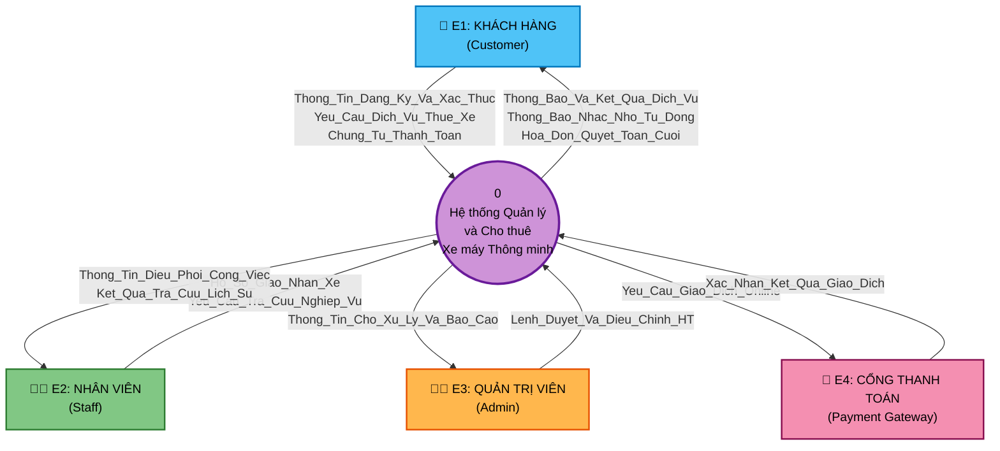
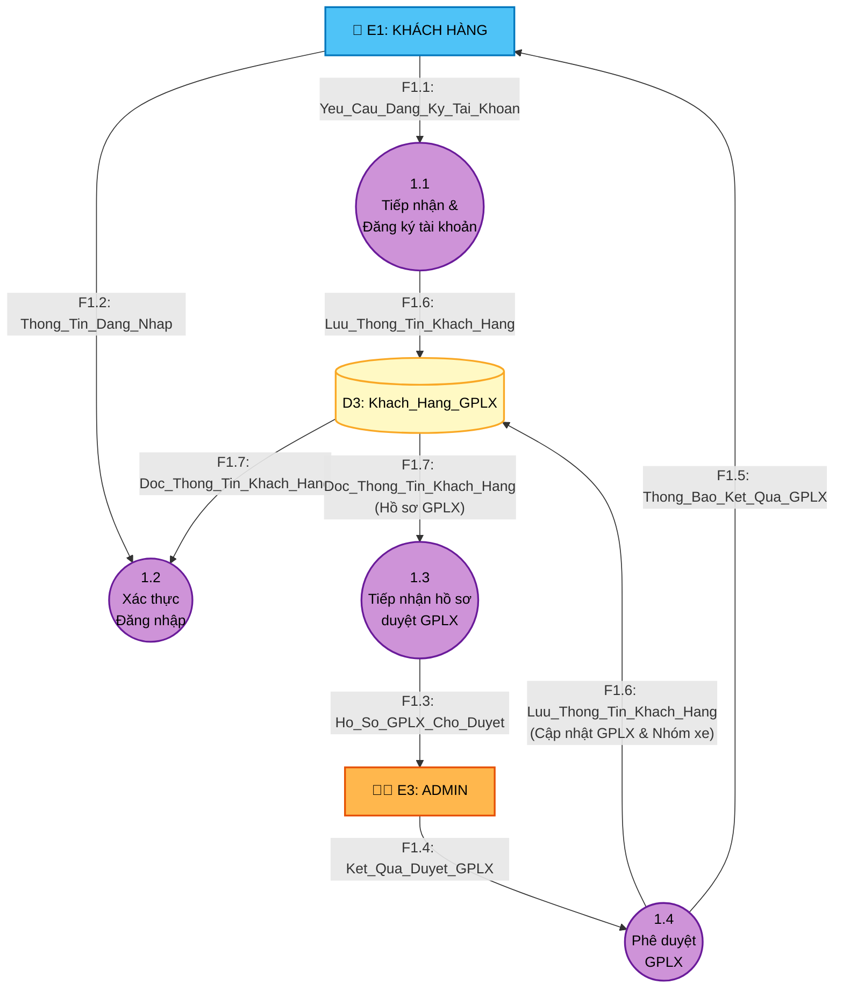
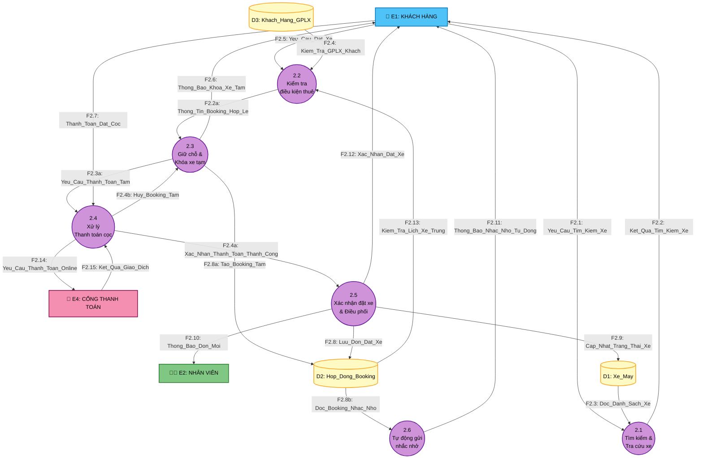
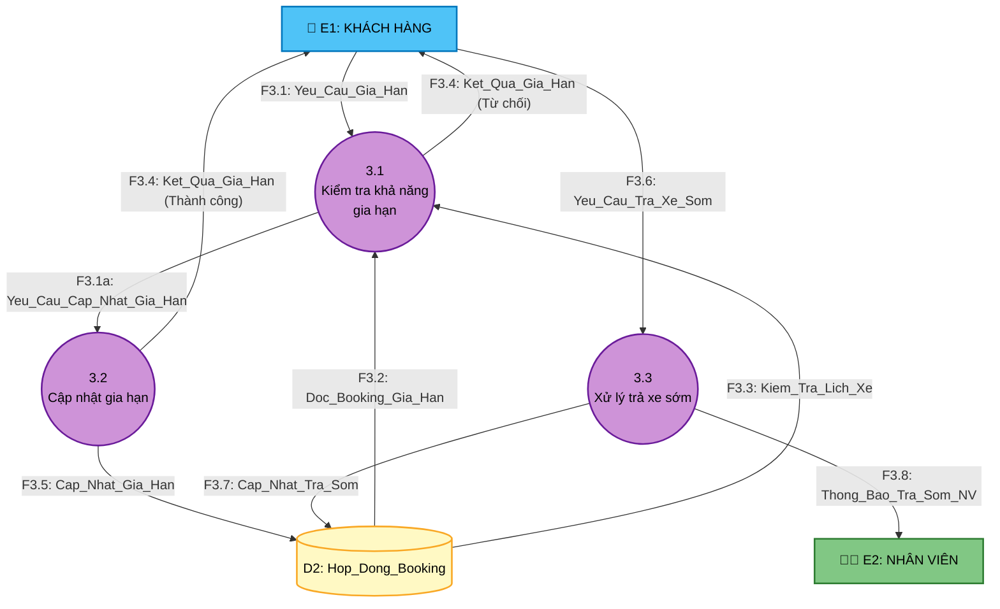
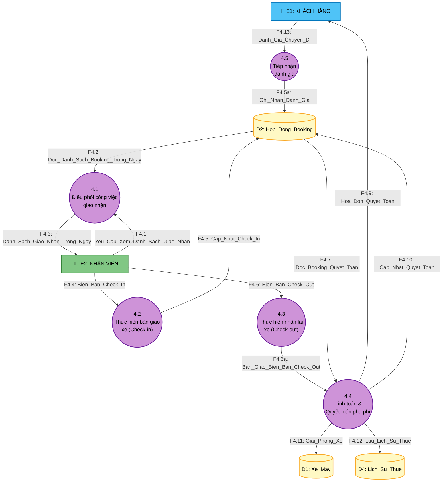
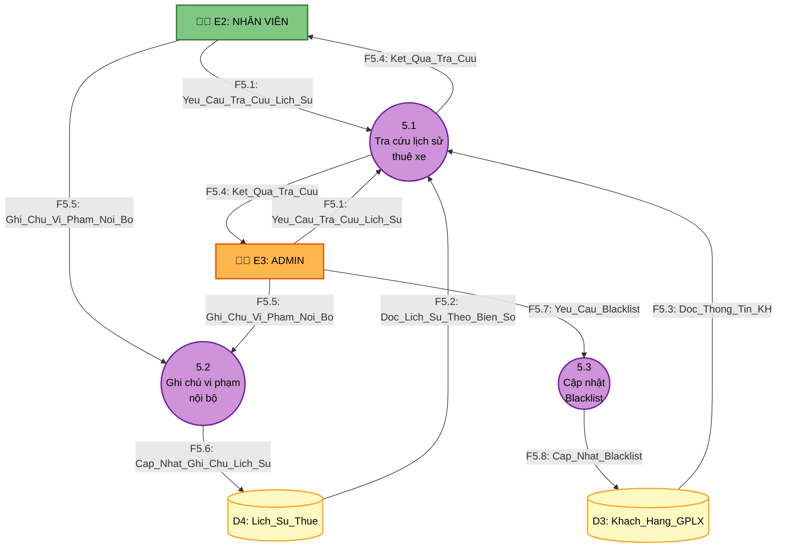

# 📊 SƠ ĐỒ LUỒNG DỮ LIỆU (DATA FLOW DIAGRAMS)
## Hệ thống Quản lý và Cho thuê xe máy Thông minh

> **Quy ước ký hiệu DFD trong Mermaid.js:**
> - **Hình chữ nhật `[ ]`**: Thực thể ngoài (External Entity / Actor)
> - **Hình tròn bo `(( ))`**: Tiến trình xử lý (Process)
> - **Hình mở 2 đầu `[( )]`**: Kho dữ liệu (Data Store) — sử dụng `stadium-shaped` node
> - **Mũi tên `-->`**: Dòng dữ liệu (Data Flow) với nhãn mô tả

---

## 1. SƠ ĐỒ NGỮ CẢNH (CONTEXT DIAGRAM — DFD LEVEL -1)

Sơ đồ ngữ cảnh mô tả hệ thống như **một tiến trình tổng thể duy nhất** tương tác với 4 tác nhân bên ngoài.

> **Ghi chú:** Cơ quan Công an không phải là Actor của hệ thống. Việc xử lý phạt nguội giao thông là quy trình dân sự bên ngoài — Nhân viên/Admin tự tra cứu lịch sử thuê xe trên hệ thống rồi thương lượng với khách hàng offline.

### Bảng tổng hợp luồng dữ liệu — Sơ đồ Ngữ cảnh

| Tác nhân | Hướng | Luồng ở Context (Gom nhóm) | Hướng chi tiết ở Level 0 | Bao gồm các luồng chi tiết ở Level 0 |
| :--- | :---: | :--- | :---: | :--- |
| **E1: KHÁCH HÀNG** | E1 → P0 | `Thong_Tin_Dang_Ky_Va_Xac_Thuc` | E1 → P1.0 | F1.1 (Yêu cầu đăng ký, ảnh GPLX), F1.2 (Đăng nhập) |
| | E1 → P0 | `Yeu_Cau_Dich_Vu_Thue_Xe` | E1 → P2.0, P3.0, P4.0 | F2.1 (Tìm kiếm), F2.5 (Đặt xe), F3.1 (Gia hạn), F3.6 (Trả sớm), F4.13 (Đánh giá) |
| | E1 → P0 | `Chung_Tu_Thanh_Toan` | E1 → P2.0 | F2.7 (Thanh toán cọc) |
| | P0 → E1 | `Thong_Bao_Va_Ket_Qua_Dich_Vu` | P1.0, P2.0, P3.0 → E1 | F1.5 (Kết quả GPLX), F2.2 (Kết quả tìm xe), F2.6 (Khóa xe tạm), F2.12 (Xác nhận đặt xe), F3.4 (Kết quả gia hạn) |
| | P0 → E1 | `Thong_Bao_Nhac_Nho_Tu_Dong` | P2.0 → E1 | F2.11 (Nhắc nhận/trả xe/hết giờ) |
| | P0 → E1 | `Hoa_Don_Quyet_Toan_Cuoi` | P4.0 → E1 | F4.9 (Hóa đơn gồm phí phạt, đền bù, tổng thanh toán) |
| **E2: NHÂN VIÊN** | E2 → P0 | `Ho_So_Giao_Nhan_Xe` | E2 → P4.0 | F4.4 (Biên bản Check-in), F4.6 (Biên bản Check-out/Hư hại) |
| | E2 → P0 | `Yeu_Cau_Tra_Cuu_Nghiep_Vu` | E2 → P4.0, P5.0 | F4.1 (Xem DS công việc), F5.1 (Tra cứu lịch sử), F5.5 (Ghi chú vi phạm) |
| | P0 → E2 | `Thong_Tin_Dieu_Phoi_Cong_Viec` | P2.0, P3.0, P4.0 → E2 | F2.10 (Đơn mới), F3.8 (Thông báo trả sớm), F4.3 (Danh sách giao nhận trong ngày) |
| | P0 → E2 | `Ket_Qua_Tra_Cuu_Lich_Su` | P5.0 → E2 | F5.4 (Kết quả tra cứu thông tin khách & xe) |
| **E3: ADMIN** | E3 → P0 | `Lenh_Duyet_Va_Dieu_Chinh_HT` | E3 → P1.0, P5.0 | F1.4 (Duyệt GPLX), F5.7 (Yêu cầu Blacklist), và các lệnh cấu hình (giá, xe, nhân viên) |
| | P0 → E3 | `Thong_Tin_Cho_Xu_Ly_Va_Bao_Cao` | P1.0 → E3 | F1.3 (Hồ sơ GPLX chờ duyệt), báo cáo doanh thu, danh sách cần Blacklist |
| **E4: CỔNG THANH TOÁN** | P0 → E4 | `Yeu_Cau_Giao_Dich_Online` | P2.0 → E4 | F2.14 (Yêu cầu Thanh toán/Hoàn tiền) |
| | E4 → P0 | `Xac_Nhan_Ket_Qua_Giao_Dich` | E4 → P2.0 | F2.15 (Kết quả Thành công/Thất bại) |

---

## 2. SƠ ĐỒ DFD MỨC 0 (LEVEL 0 DFD)

Sơ đồ DFD mức 0 phân rã tiến trình tổng thể thành **5 tiến trình con** kết nối với **4 tác nhân ngoài** và **4 kho dữ liệu**.

```mermaid
graph TB
    %% ╔══════════════════════════════════════════════╗
    %% ║           EXTERNAL ENTITIES                  ║
    %% ╚══════════════════════════════════════════════╝
    E1["👤 E1: KHÁCH HÀNG"]
    E2["🧑‍💼 E2: NHÂN VIÊN"]
    E3["👨‍💻 E3: ADMIN"]
    E4["🏦 E4: CỔNG THANH TOÁN"]

    %% ╔══════════════════════════════════════════════╗
    %% ║              PROCESSES                       ║
    %% ╚══════════════════════════════════════════════╝
    P1(("1.0\nĐăng ký &\nXác thực GPLX"))
    P2(("2.0\nĐặt xe trực tuyến\n& Giữ chỗ"))
    P3(("3.0\nGia hạn &\nYêu cầu Trả xe sớm"))
    P4(("4.0\nNhận xe &\nQuyết toán phụ phí"))
    P5(("5.0\nTra cứu Lịch sử thuê\n& Quản lý Blacklist"))

    %% ╔══════════════════════════════════════════════╗
    %% ║             DATA STORES                      ║
    %% ╚══════════════════════════════════════════════╝
    D1[("D1: Xe_May")]
    D2[("D2: Hop_Dong_Booking")]
    D3[("D3: Khach_Hang_GPLX")]
    D4[("D4: Lich_Su_Thue")]

    %% ╔══════════════════════════════════════════════╗
    %% ║    P1.0 — ĐĂNG KÝ & XÁC THỰC GPLX          ║
    %% ╚══════════════════════════════════════════════╝
    E1 -->|"F1.1: Yeu_Cau_Dang_Ky_Tai_Khoan\n(HoTen, Email, SoDienThoai,\nLuaChonGPLX, AnhGPLX)"| P1
    E1 -->|"F1.2: Thong_Tin_Dang_Nhap"| P1
    P1 -->|"F1.3: Ho_So_GPLX_Cho_Duyet"| E3
    E3 -->|"F1.4: Ket_Qua_Duyet_GPLX\n(Da_Duyet / Tu_Choi)"| P1
    P1 -->|"F1.5: Thong_Bao_Ket_Qua_GPLX\n(NhomXeDuocThue)"| E1
    P1 -->|"F1.6: Luu_Thong_Tin_KH"| D3
    D3 -->|"F1.7: Doc_Thong_Tin_KH"| P1

    %% ╔══════════════════════════════════════════════╗
    %% ║    P2.0 — ĐẶT XE TRỰC TUYẾN & GIỮ CHỖ      ║
    %% ╚══════════════════════════════════════════════╝
    E1 -->|"F2.1: Yeu_Cau_Tim_Kiem_Xe\n(LoaiXe, HangXe, PhanKhoi)"| P2
    P2 -->|"F2.2: Ket_Qua_Tim_Kiem_Xe"| E1
    D1 -->|"F2.3: Doc_Danh_Sach_Xe"| P2
    D3 -->|"F2.4: Kiem_Tra_GPLX_Khach\n(TrangThaiGPLX, NhomXeDuocThue)"| P2
    E1 -->|"F2.5: Yeu_Cau_Dat_Xe\n(MaXe, ThoiGian, DichVu)"| P2
    P2 -->|"F2.6: Thong_Bao_Khoa_Xe_Tam\n(15 phút giữ chỗ)"| E1
    E1 -->|"F2.7: Thanh_Toan_Dat_Coc"| P2
    P2 -->|"F2.8: Luu_Don_Dat_Xe"| D2
    P2 -->|"F2.9: Cap_Nhat_Trang_Thai_Xe\n(Dang_Thue)"| D1
    P2 -->|"F2.10: Thong_Bao_Don_Moi\n(Thông tin chuẩn bị xe)"| E2
    P2 -->|"F2.11: Thong_Bao_Nhac_Nho_Tu_Dong\n(Trước nhận 2h / Trước trả 2h\n/ Hết giờ hẹn)"| E1
    P2 -->|"F2.12: Xac_Nhan_Dat_Xe\n(MaBooking, DonGia,\nGiamGia, TangGia)"| E1
    D2 -->|"F2.13: Kiem_Tra_Lich_Xe_Trung\n(Booking cùng MaXe?)"| P2
    P2 -->|"F2.14: Yeu_Cau_Thanh_Toan_Online\n(Dat_Coc / Gia_Han / Hoan_Tien)"| E4
    E4 -->|"F2.15: Ket_Qua_Giao_Dich\n(Thanh_Cong / That_Bai)"| P2

    %% ╔══════════════════════════════════════════════╗
    %% ║   P3.0 — GIA HẠN & YÊU CẦU TRẢ XE SỚM      ║
    %% ╚══════════════════════════════════════════════╝
    E1 -->|"F3.1: Yeu_Cau_Gia_Han\n(SoNgay/GioThem)"| P3
    D2 -->|"F3.2: Doc_Booking_Gia_Han\n(SoLanGiaHan ≤ 3)"| P3
    D2 -->|"F3.3: Kiem_Tra_Lich_Xe\n(Trùng lịch?)"| P3
    P3 -->|"F3.4: Ket_Qua_Gia_Han\n(Thanh_Cong / Tu_Choi)"| E1
    P3 -->|"F3.5: Cap_Nhat_Gia_Han\n(ThoiGianTra mới,\nSoLanGiaHan+1)"| D2
    E1 -->|"F3.6: Yeu_Cau_Tra_Xe_Som\n(trước ≥ 1 tiếng)"| P3
    P3 -->|"F3.7: Cap_Nhat_Tra_Som\n(CoTraSom=TRUE)"| D2
    P3 -->|"F3.8: Thong_Bao_Tra_Som_NV"| E2

    %% ╔══════════════════════════════════════════════╗
    %% ║  P4.0 — NHẬN XE & QUYẾT TOÁN PHỤ PHÍ        ║
    %% ╚══════════════════════════════════════════════╝
    E2 -->|"F4.1: Yeu_Cau_Xem_Danh_Sach_Giao_Nhan"| P4
    D2 -->|"F4.2: Doc_Danh_Sach_Booking_Trong_Ngay"| P4
    P4 -->|"F4.3: Danh_Sach_Giao_Nhan_Trong_Ngay"| E2
    E2 -->|"F4.4: Bien_Ban_Check_In\n(ODO, Xăng, Ảnh ngoại quan,\nPhụ kiện giao)"| P4
    P4 -->|"F4.5: Cap_Nhat_Check_In\n(TrangThai=Dang_Thue)"| D2
    E2 -->|"F4.6: Bien_Ban_Check_Out\n(ODO, Xăng, Hư hại, Phí đền bù)"| P4
    D2 -->|"F4.7: Doc_Booking_Quyet_Toan"| P4
    P4 -->|"F4.9: Hoa_Don_Quyet_Toan\n(PhiPhat, DenBu, TongTT)"| E1
    P4 -->|"F4.10: Cap_Nhat_Quyet_Toan\n(TrangThai=Hoan_Tat)"| D2
    P4 -->|"F4.11: Giai_Phong_Xe\n(TrangThai=San_Sang)"| D1
    P4 -->|"F4.12: Luu_Lich_Su_Thue"| D4
    E1 -->|"F4.13: Danh_Gia_Chuyen_Di\n(Sao, NhanXet)"| P4

    %% ╔══════════════════════════════════════════════╗
    %% ║  P5.0 — TRA CỨU LỊCH SỬ THUÊ & BLACKLIST    ║
    %% ╚══════════════════════════════════════════════╝
    E2 -->|"F5.1: Yeu_Cau_Tra_Cuu_Lich_Su\n(BienSoXe, KhoangThoiGian)"| P5
    D4 -->|"F5.2: Doc_Lich_Su_Theo_Bien_So"| P5
    D3 -->|"F5.3: Doc_Thong_Tin_KH\n(HoTen, CCCD, SoGPLX)"| P5
    P5 -->|"F5.4: Ket_Qua_Tra_Cuu\n(ThongTinKhachHang, ThongTinThue)"| E2
    E2 -->|"F5.5: Ghi_Chu_Vi_Pham_Noi_Bo"| P5
    P5 -->|"F5.6: Cap_Nhat_Ghi_Chu_Lich_Su"| D4
    E3 -->|"F5.7: Yeu_Cau_Blacklist\n(MaKH, LyDo)"| P5
    P5 -->|"F5.8: Cap_Nhat_Blacklist"| D3

    %% ╔══════════════════════════════════════════════╗
    %% ║               STYLES                         ║
    %% ╚══════════════════════════════════════════════╝
    style E1 fill:#4FC3F7,stroke:#0277BD,color:#000,stroke-width:2px
    style E2 fill:#81C784,stroke:#2E7D32,color:#000,stroke-width:2px
    style E3 fill:#FFB74D,stroke:#E65100,color:#000,stroke-width:2px
    style E4 fill:#F48FB1,stroke:#880E4F,color:#000,stroke-width:2px

    style P1 fill:#CE93D8,stroke:#6A1B9A,color:#000,stroke-width:2px
    style P2 fill:#CE93D8,stroke:#6A1B9A,color:#000,stroke-width:2px
    style P3 fill:#CE93D8,stroke:#6A1B9A,color:#000,stroke-width:2px
    style P4 fill:#CE93D8,stroke:#6A1B9A,color:#000,stroke-width:2px
    style P5 fill:#CE93D8,stroke:#6A1B9A,color:#000,stroke-width:2px

    style D1 fill:#FFF9C4,stroke:#F9A825,color:#000,stroke-width:2px
    style D2 fill:#FFF9C4,stroke:#F9A825,color:#000,stroke-width:2px
    style D3 fill:#FFF9C4,stroke:#F9A825,color:#000,stroke-width:2px
    style D4 fill:#FFF9C4,stroke:#F9A825,color:#000,stroke-width:2px
    style D5 fill:#FFF9C4,stroke:#F9A825,color:#000,stroke-width:2px
```

---

## 3. MA TRẬN TRUY XUẤT LUỒNG DỮ LIỆU — TIẾN TRÌNH — KHO DỮ LIỆU

### 3.1. Ma trận Tiến trình ↔ Kho dữ liệu

| Tiến trình | D1: Xe_May | D2: Hop_Dong_Booking | D3: Khach_Hang_GPLX | D4: Lich_Su_Thue |
|:---:|:---:|:---:|:---:|:---:|
| **P1.0** Đăng ký & Xác thực GPLX | — | — | **R/W** | — |
| **P2.0** Đặt xe & Giữ chỗ | **R/W** | **R/W** | **R** | — |
| **P3.0** Gia hạn & Trả xe sớm | — | **R/W** | — | — |
| **P4.0** Nhận xe & Quyết toán | **W** | **R/W** | — | **W** |
| **P5.0** Tra cứu LS thuê & Blacklist | — | — | **R/W** | **R/W** |

> **R** = Đọc (Read) | **W** = Ghi (Write) | **R/W** = Đọc và Ghi

### 3.2. Ma trận Tiến trình ↔ Tác nhân ngoài

| | E1: Khách hàng | E2: Nhân viên | E3: Admin | E4: Cổng TT |
|---|:---:|:---:|:---:|:---:|
| **P1.0** Đăng ký & Xác thực GPLX | **IN/OUT** | — | **IN/OUT** | — |
| **P2.0** Đặt xe & Giữ chỗ | **IN/OUT** | **OUT** | — | **IN/OUT** |
| **P3.0** Gia hạn & Trả xe sớm | **IN/OUT** | **OUT** | — | — |
| **P4.0** Nhận xe & Quyết toán | **IN/OUT** | **IN/OUT** | — | — |
| **P5.0** Tra cứu LS thuê & Blacklist | — | **IN/OUT** | **IN/OUT** | — |

> **IN** = Luồng từ Actor vào Process | **OUT** = Luồng từ Process ra Actor

---

## 4. MÔ TẢ CHI TIẾT 5 TIẾN TRÌNH (PROCESS SPECIFICATIONS)

### P1.0 — Đăng ký & Xác thực GPLX

| Thuộc tính | Chi tiết |
|-----------|---------|
| **Mã tiến trình** | 1.0 |
| **Tên** | Đăng ký & Xác thực GPLX |
| **Mô tả** | Tiếp nhận đăng ký tài khoản khách hàng với 2 luồng: Có GPLX / Không GPLX. Quản lý quy trình duyệt ảnh GPLX bởi Admin. Phân loại quyền thuê xe. |
| **Luồng vào** | F1.1 (Yêu cầu đăng ký), F1.2 (Đăng nhập), F1.4 (Kết quả duyệt GPLX từ Admin), F1.7 (Đọc KH từ D3) |
| **Luồng ra** | F1.3 (Hồ sơ GPLX chờ duyệt cho Admin), F1.5 (Thông báo kết quả GPLX cho KH), F1.6 (Lưu KH vào D3) |
| **Logic xử lý** | 1. Nhận thông tin đăng ký → Xác thực Email/SĐT duy nhất 2. **Nếu** LuaChonGPLX = `Co_GPLX` → Lưu ảnh GPLX → TrangThaiGPLX = `Cho_Duyet` → Gửi Admin duyệt 3. **Nếu** LuaChonGPLX = `Khong_GPLX` → TrangThaiGPLX = `Khong_Dang_Ky` → NhomXeDuocThue = `Nhom_50cc_Dien` 4. Khi Admin duyệt: TrangThaiGPLX = `Da_Duyet` → NhomXeDuocThue = `Nhom_Tren_50cc` (nếu HangGPLX ∈ {A1, A2}) 5. Khi Admin từ chối: TrangThaiGPLX = `Tu_Choi` → NhomXeDuocThue = `Nhom_50cc_Dien` |

---

### P2.0 — Đặt xe trực tuyến & Giữ chỗ

| Thuộc tính | Chi tiết |
|-----------|---------|
| **Mã tiến trình** | 2.0 |
| **Tên** | Đặt xe trực tuyến & Giữ chỗ |
| **Mô tả** | Xử lý tìm kiếm xe, kiểm tra GPLX đã duyệt, **kiểm tra lịch xe không trùng**, tính giá động (Lễ/Tết 15%-30%), giảm giá dài ngày, khóa xe tạm 15 phút, **tự động duyệt đơn** sau khi cọc thành công, gửi thông báo nhắc nhở tự động. |
| **Luồng vào** | F2.1 (Tìm kiếm), F2.3 (Đọc xe từ D1), F2.4 (Kiểm tra GPLX từ D3), F2.5 (Đặt xe), F2.7 (Thanh toán cọc), F2.13 (Kiểm tra lịch xe trùng từ D2), F2.15 (Kết quả giao dịch từ Cổng TT) |
| **Luồng ra** | F2.2 (Kết quả tìm kiếm), F2.6 (Khóa xe tạm 15'), F2.8 (Lưu đơn vào D2 — tự động duyệt), F2.9 (Cập nhật xe D1), F2.10 (Thông báo NV chuẩn bị xe), F2.11 (Nhắc nhở tự động), F2.12 (Xác nhận đặt xe), F2.14 (Yêu cầu thanh toán đến Cổng TT) |
| **Logic xử lý** | 1. Nhận yêu cầu tìm kiếm → Truy vấn D1 theo bộ lọc → Trả kết quả 2. Khi KH đặt xe: Kiểm tra TrangThaiGPLX từ D3 &nbsp;&nbsp;• **Nếu** NhomXe_Xe = `Nhom_Tren_50cc` **VÀ** NhomXeDuocThue_KH ≠ `Nhom_Tren_50cc` → **Từ chối** &nbsp;&nbsp;• **Nếu** KH trong Blacklist (TrangThaiBlacklist = TRUE) → **Từ chối** &nbsp;&nbsp;• **Nếu** hợp lệ → Kiểm tra lịch xe trùng (F2.13: truy vấn D2 xem có Booking khác cùng MaXe trùng khoảng thời gian?) → Nếu **trùng** → Từ chối. Nếu **không trùng** → Khóa xe tạm 15 phút → Chờ thanh toán cọc 3. Tính giá: DonGiaApDung = DonGiaNgay × (1 + PhanTramTangGia/100) 4. Giảm giá dài ngày: Thuê > 3 ngày giảm 5%, > 7 ngày giảm 10% 5. Gửi yêu cầu thanh toán đến Cổng TT (F2.14) → Nhận kết quả (F2.15) &nbsp;&nbsp;• **Thanh_Cong:** Tạo MaBooking → Lưu D2 (TrangThaiBooking = `Cho_Nhan_Xe` — **tự động duyệt**) → Cập nhật D1 (TrangThaiXe = `Dang_Thue`) → Gửi Xác nhận cho KH (F2.12) → Thông báo NV chuẩn bị xe (F2.10) &nbsp;&nbsp;• **That_Bai:** Giải phóng xe khỏi khóa tạm → Thông báo KH thanh toán thất bại 6. Lên lịch gửi Thong_Bao_Nhac_Nho_Tu_Dong: trước nhận 2h, trước trả 2h, hết giờ hẹn |

---

### P3.0 — Gia hạn & Yêu cầu Trả xe sớm

| Thuộc tính | Chi tiết |
|-----------|---------|
| **Mã tiến trình** | 3.0 |
| **Tên** | Gia hạn & Yêu cầu Trả xe sớm |
| **Mô tả** | Xử lý yêu cầu gia hạn (trước 2h, tối đa 3 lần, kiểm tra lịch trùng) và yêu cầu trả xe sớm (trước ≥ 1 tiếng). **Chỉ khách hàng** thao tác gia hạn qua ứng dụng — không hỗ trợ gia hạn thủ công để đảm bảo minh bạch. |
| **Luồng vào** | F3.1 (Yêu cầu gia hạn từ KH), F3.2 (Đọc booking từ D2), F3.3 (Kiểm tra lịch xe từ D2), F3.6 (Yêu cầu trả sớm từ KH) |
| **Luồng ra** | F3.4 (Kết quả gia hạn cho KH), F3.5 (Cập nhật gia hạn vào D2), F3.7 (Cập nhật trả sớm vào D2), F3.8 (Thông báo trả sớm cho NV) |
| **Logic xử lý** | **Gia hạn (chỉ KH thao tác qua app):** 1. Kiểm tra yêu cầu gửi trước giờ trả ≥ 2 tiếng 2. Kiểm tra SoLanGiaHan < 3 3. Truy vấn D2: Có Booking khác cùng MaXe trùng khoảng thời gian? &nbsp;&nbsp;• **TH1 (Xe trống):** Tính tiền gia hạn → KH thanh toán online → Hệ thống tự động cập nhật D2 (ThoiGianTra mới, SoLanGiaHan+1) &nbsp;&nbsp;• **TH2 (Trùng lịch):** Từ chối → Gợi ý xe thay thế hoặc trả đúng hẹn **Trả sớm:** 1. Kiểm tra yêu cầu gửi trước ≥ 1 tiếng 2. Cập nhật D2: CoTraSom = TRUE, TrangThaiBooking = `Yeu_Cau_Tra_Som` 3. Gửi thông báo cho NV tại điểm trả |

---

### P4.0 — Nhận xe & Quyết toán phụ phí

| Thuộc tính | Chi tiết |
|-----------|---------|
| **Mã tiến trình** | 4.0 |
| **Tên** | Nhận xe & Quyết toán phụ phí |
| **Mô tả** | Cung cấp danh sách công việc giao/nhận xe trong ngày cho nhân viên. Xử lý Check-in (bàn giao xe), Check-out (nhận lại xe), quyết toán phụ phí: đền bù hư hại, mất phụ kiện, phạt trễ hạn lũy tiến. |
| **Luồng vào** | F4.1 (Yêu cầu xem DS giao nhận từ NV), F4.2 (Đọc DS booking trong ngày từ D2), F4.4 (Biên bản Check-in), F4.6 (Biên bản Check-out kèm phí đền bù), F4.7 (Booking quyết toán từ D2), F4.13 (Đánh giá chuyến đi) |
| **Luồng ra** | F4.3 (Danh sách giao/nhận cho NV), F4.5 (Cập nhật Check-in vào D2), F4.9 (Hóa đơn cho KH), F4.10 (Cập nhật quyết toán D2), F4.11 (Giải phóng xe D1), F4.12 (Lưu lịch sử D4) |
| **Logic xử lý** | **Xem danh sách công việc:** 1. NV mở Dashboard truy vấn công việc hôm nay. 2. Hệ thống đọc D2 lọc các Booking cần Giao/Nhận trả kết quả cho NV. **Check-in:** 1. NV ghi nhận: ODONhan, MucXangNhan, chụp ảnh ngoại quan, giao phụ kiện 2. Cập nhật D2: TrangThaiBooking = `Dang_Thue` **Check-out:** 1. NV kiểm tra: ODOTra, MucXangTra, vết hư hại mới, phụ kiện trả lại 2. NV trao đổi trực tiếp với khách, thống nhất và nhập mức phí đền bù (PhiDenBuHuHai, PhiMatPhuKien) vào biên bản. 3. Tính PhiPhatTreHan: &nbsp;&nbsp;• Trễ ≤ 2h: 0đ (ân hạn) &nbsp;&nbsp;• Trễ 2-6h: DonGiaPhat_Gio × số giờ trễ (Xe số/ga: 30K/h; Côn tay/PKL: 50K/h) &nbsp;&nbsp;• Trễ 6-12h: DonGiaApDung / 2 &nbsp;&nbsp;• Trễ > 12h: DonGiaApDung × 1 4. TongThanhToan = TongTienThue - TienGiamGia + TienTangGia + TongTienGiaHan + PhiPhatTreHan + PhiDenBuHuHai + PhiMatPhuKien - TienCoc 5. Xuất hóa đơn cho KH → Cập nhật D2 (Hoan_Tat) → Cập nhật D1 (San_Sang) → Lưu D4 |

---

### P5.0 — Tra cứu Lịch sử thuê & Quản lý Blacklist

| Thuộc tính | Chi tiết |
|-----------|---------|
| **Mã tiến trình** | 5.0 |
| **Tên** | Tra cứu Lịch sử thuê & Quản lý Blacklist |
| **Mô tả** | Hỗ trợ Nhân viên/Admin tra cứu lịch sử thuê xe nội bộ theo biển số và khoảng thời gian (phục vụ xử lý phạt nguội offline, thống kê). Quản lý danh sách Blacklist khách hàng vi phạm nghiêm trọng. **Lưu ý:** Nghiệp vụ phạt nguội giao thông là quy trình dân sự bên ngoài — hệ thống chỉ hỗ trợ tra cứu thông tin, việc thương lượng/đóng phạt/khởi kiện diễn ra ngoài hệ thống. |
| **Luồng vào** | F5.1 (Yêu cầu tra cứu từ NV/Admin), F5.2 (Lịch sử thuê từ D4), F5.3 (Thông tin KH từ D3), F5.5 (Ghi chú vi phạm nội bộ từ NV/Admin), F5.7 (Yêu cầu Blacklist từ NV/Admin) |
| **Luồng ra** | F5.4 (Kết quả tra cứu cho NV/Admin), F5.6 (Cập nhật ghi chú vào D4), F5.8 (Cập nhật Blacklist vào D3) |
| **Logic xử lý** | 1. NV/Admin nhập tiêu chí tra cứu: {BienSoXe, KhoangThoiGian_Tu, KhoangThoiGian_Den} 2. Truy vấn D4: Tìm bản ghi Lich_Su_Thue có BienSoXe VÀ khoảng thời gian giao nhau với [ThoiGianNhan, ThoiGianTra] &nbsp;&nbsp;• **Nếu tìm thấy:** Truy D3 lấy thông tin KH → Hiển thị kết quả cho NV/Admin &nbsp;&nbsp;• **Nếu không tìm thấy:** Hiển thị thông báo `Khong_Tim_Thay` 3. NV/Admin có thể ghi chú nội bộ (GhiChuNoiBo) và đánh dấu vi phạm (DanhDauViPham = TRUE) vào bản ghi D4 4. NV/Admin có quyền yêu cầu đưa khách hàng vào Blacklist → Cập nhật D3 (TrangThaiBlacklist = TRUE, LyDoBlacklist) **Quy trình offline:** Chủ xe mang Hợp đồng thuê + CCCD khách đến cơ quan Công an để trình báo và chuyển trách nhiệm. Nếu khách không hợp tác, chủ xe chủ động nộp phạt rồi khởi kiện dân sự. |

---

## 5. SƠ ĐỒ PHÂN RÃ MỨC 1 (LEVEL 1 DFD)

Sơ đồ DFD Mức 1 phân rã chi tiết 5 tiến trình cốt lõi ở Mức 0 nhằm mô tả chi tiết luồng xử lý và các dòng dữ liệu nội bộ (internal flows) phát sinh giữa các tiến trình con.

### 5.1. Tiến trình 1.0 — Đăng ký & Xác thực GPLX

Sơ đồ phân rã mức 1 cho tiến trình 1.0 làm rõ quy trình đăng ký, xác thực đăng nhập, lưu trữ hồ sơ ảnh GPLX và quy trình phê duyệt của Admin.

*   **P1.1 (Tiếp nhận & Đăng ký tài khoản):** Tiếp nhận yêu cầu đăng ký (`F1.1`), kiểm tra SĐT/Email trùng lặp, mã hóa mật khẩu và khởi tạo tài khoản mới vào kho `D3` qua luồng `F1.6`.
*   **P1.2 (Xác thực Đăng nhập):** Tiếp nhận thông tin đăng nhập của khách hàng (`F1.2`), truy vấn thông tin đối chiếu từ `D3` qua luồng `F1.7` để cấp quyền truy cập.
*   **P1.3 (Tiếp nhận hồ sơ duyệt GPLX):** Định kỳ đọc từ `D3` (`F1.7`) các tài khoản có trạng thái GPLX là `Cho_Duyet` để gom hồ sơ chờ duyệt gửi đến Admin (`E3`) qua luồng `F1.3`.
*   **P1.4 (Phê duyệt GPLX):** Tiếp nhận lệnh phê duyệt hoặc từ chối từ Admin (`F1.4`). Tiến trình cập nhật lại trạng thái GPLX và nhóm xe được phép thuê (`NhomXeDuocThue`) tương ứng vào kho `D3` (`F1.6`), đồng thời gửi thông báo kết quả kiểm duyệt (`F1.5`) cho khách hàng (`E1`).

---

### 5.2. Tiến trình 2.0 — Đặt xe trực tuyến & Giữ chỗ

Sơ đồ phân rã mức 1 cho tiến trình 2.0 làm rõ quy trình tìm kiếm xe, xác thực GPLX & Blacklist, tự động khóa giữ xe tạm thời 15 phút, quy trình thanh toán cọc thông qua cổng thanh toán, tự động duyệt đơn và lên lịch nhắc nhở.

*   **P2.1 (Tìm kiếm & Tra cứu xe):** Tiếp nhận bộ lọc tìm kiếm (`F2.1`), đối chiếu danh sách xe khả dụng trong kho `D1` (`F2.3`) và hiển thị cho khách hàng (`F2.2`).
*   **P2.2 (Kiểm tra điều kiện thuê):** Khi nhận yêu cầu đặt xe (`F2.5`), kiểm tra xem GPLX của khách đã được duyệt và nhóm xe có tương thích không qua `D3` (`F2.4`). Đồng thời đọc danh sách booking trong `D2` (`F2.13`) để kiểm tra xung đột lịch. Nếu hợp lệ, truyền thông tin sang tiến trình giữ chỗ qua luồng nội bộ `F2.2a`.
*   **P2.3 (Giữ chỗ & Khóa xe tạm):** Dựa trên luồng kích hoạt `F2.2a`, tiến trình ghi nhận một booking tạm thời (`TrangThaiBooking = Cho_Xac_Nhan`) vào kho `D2` (`F2.8a`), phát thông báo khóa giữ xe tạm thời 15 phút (`F2.6`) đến khách hàng và phát yêu cầu thanh toán cọc (`F2.3a`) gửi đến tiến trình 2.4.
*   **P2.4 (Xử lý Thanh toán cọc):** Tiếp nhận chứng từ thanh toán (`F2.7`), gửi yêu cầu giao dịch (`F2.14`) sang cổng thanh toán trực tuyến `E4` và nhận lại kết quả giao dịch (`F2.15`).
    *   *Giao dịch thành công:* Gửi tín hiệu xác nhận thanh toán (`F2.4a`) cho tiến trình 2.5.
    *   *Giao dịch thất bại / Quá hạn 15 phút:* Gửi tín hiệu hủy giữ chỗ (`F2.4b`) để tiến trình 2.3 giải phóng xe.
*   **P2.5 (Xác nhận đặt xe & Điều phối):** Khi nhận tín hiệu thanh toán thành công (`F2.4a`), tiến trình đổi trạng thái booking thành `Cho_Nhan_Xe` (tự động duyệt) trong `D2` (`F2.8`), cập nhật trạng thái xe thành `Dang_Thue` trong `D1` (`F2.9`), gửi xác nhận đặt xe (`F2.12`) đến khách hàng và gửi thông báo đơn mới (`F2.10`) đến nhân viên để chuẩn bị bàn giao xe.
*   **P2.6 (Tự động gửi nhắc nhở):** Đọc thông tin các booking sắp đến hạn từ `D2` (`F2.8b`) để tự động lên lịch gửi các thông báo nhắc nhở (`F2.11`) đến khách hàng trước 2 giờ (lúc nhận/trả) hoặc khi quá hạn nhận xe.

---

### 5.3. Tiến trình 3.0 — Gia hạn & Yêu cầu Trả xe sớm

Sơ đồ phân rã mức 1 cho tiến trình 3.0 chi tiết hóa quy trình tự động gia hạn hợp đồng qua ứng dụng (kiểm tra hạn mức gia hạn, trùng lịch) và luồng xử lý yêu cầu trả xe sớm.

*   **P3.1 (Kiểm tra khả năng gia hạn):** Tiếp nhận yêu cầu gia hạn (`F3.1`), đọc thông tin booking gốc từ `D2` (`F3.2`) để đối chiếu số lần gia hạn hiện tại (phải < 3 lần). Đồng thời đọc `D2` (`F3.3`) để kiểm tra xe có bị trùng lịch thuê của khách hàng khác trong khoảng thời gian gia hạn không.
    *   *Không hợp lệ / Trùng lịch:* Gửi phản hồi từ chối gia hạn (`F3.4`) cho khách hàng.
    *   *Hợp lệ:* Truyền thông tin phê duyệt (`F3.1a`) sang tiến trình 3.2.
*   **P3.2 (Cập nhật gia hạn):** Nhận lệnh gia hạn hợp lệ `F3.1a`, tính tiền gia hạn phụ thu (khách thanh toán qua app), cập nhật lại thời gian trả xe mới (`ThoiGianTra`) và số lần gia hạn (`SoLanGiaHan += 1`) vào kho booking `D2` (`F3.5`), đồng thời gửi thông báo xác nhận thành công (`F3.4`) cho khách hàng.
*   **P3.3 (Xử lý trả xe sớm):** Tiếp nhận yêu cầu trả xe sớm trước thời hạn ít nhất 1 giờ (`F3.6`). Tiến trình cập nhật cờ `CoTraSom = TRUE` và chuyển đổi trạng thái booking thành `Yeu_Cau_Tra_Som` trong `D2` (`F3.7`), đồng thời gửi thông báo điều phối trả xe sớm (`F3.8`) đến nhân viên tại quầy.

---

### 5.4. Tiến trình 4.0 — Nhận xe & Quyết toán phụ phí

Sơ đồ phân rã mức 1 cho tiến trình 4.0 làm rõ quy trình quản lý danh sách công việc giao nhận trong ngày, quy trình Check-in giao xe, quy trình Check-out nhận lại xe, thuật toán tự động tính toán phụ phí phạt muộn lũy tiến và tổng quyết toán hợp đồng.

*   **P4.1 (Điều phối công việc giao nhận):** Nhân viên gửi yêu cầu truy vấn danh sách công việc giao nhận trong ngày (`F4.1`). Tiến trình đọc dữ liệu đơn thuê từ `D2` (`F4.2`) có mốc thời gian trong ngày và trả về danh sách phân phối cụ thể (`F4.3`).
*   **P4.2 (Thực hiện bàn giao xe - Check-in):** Khi tiến hành giao xe, nhân viên cửa hàng kiểm tra trực quan và điền biên bản bàn giao gồm chỉ số ODO giao, mức xăng giao, phụ kiện đi kèm và ảnh ngoại quan (`F4.4`). Tiến trình cập nhật thông tin Check-in và chuyển trạng thái booking sang `Dang_Thue` trong `D2` (`F4.5`).
*   **P4.3 (Thực hiện nhận lại xe - Check-out):** Khi khách trả xe, nhân viên tiến hành nghiệm thu xe và điền biên bản nhận lại gồm chỉ số ODO trả, mức xăng trả, các vết trầy xước/hư hỏng mới, phụ kiện trả lại và mức phí đền bù hư hại thống nhất với khách (`F4.6`). Bản ghi Check-out này được chuyển giao nội bộ qua luồng `F4.3a`.
*   **P4.4 (Tính toán & Quyết toán phụ phí):** Tiếp nhận dữ liệu biên bản trả xe `F4.3a`, đồng thời đọc chi tiết hợp đồng ban đầu từ `D2` (`F4.7`) để thực hiện:
    *   Tính toán thời gian trễ hạn và áp dụng logic phạt muộn lũy tiến (trễ dưới 2h ân hạn, trễ 2-6h phạt theo giờ, trễ 6-12h phạt 1/2 ngày, trễ trên 12h phạt 1 ngày thuê).
    *   Tính tổng chi phí quyết toán dựa trên công thức nghiệp vụ (Tiền thuê gốc + Tăng giá ngày lễ - Giảm giá thuê dài ngày + Tiền gia hạn + Phí phạt trễ hạn + Phí đền bù hư hại/mất phụ kiện - Tiền cọc).
    *   Xuất hóa đơn quyết toán (`F4.9`) gửi cho khách hàng, cập nhật booking thành `Hoan_Tat` trong `D2` (`F4.10`), cập nhật trạng thái xe thành `San_Sang` và chỉ số ODO hiện tại trong `D1` (`F4.11`), đồng thời lưu bản ghi tổng hợp kết quả sang kho lịch sử thuê `D4` (`F4.12`).
*   **P4.5 (Tiếp nhận đánh giá):** Nhận thông tin đánh giá chất lượng dịch vụ (`F4.13`) của khách hàng gửi sau chuyến đi để cập nhật ghi nhận (`F4.5a`) vào kho `D2`.

---

### 5.5. Tiến trình 5.0 — Tra cứu Lịch sử thuê & Quản lý Blacklist

Sơ đồ phân rã mức 1 cho tiến trình 5.0 làm rõ quy trình tra cứu dữ liệu thuê xe phục vụ nghiệp vụ xử lý vi phạm giao thông (phạt nguội) và kiểm soát danh sách đen (Blacklist).

*   **P5.1 (Tra cứu lịch sử thuê xe):** Nhân viên hoặc Admin gửi yêu cầu tra cứu (`F5.1`) bao gồm biển số xe và khoảng thời gian vi phạm giao thông. Tiến trình thực hiện truy vấn đối chiếu lịch sử thuê trong `D4` (`F5.2`), đồng thời đọc thông tin cá nhân khách hàng trong `D3` (`F5.3`) để xuất kết quả đối chiếu (`F5.4`) hỗ trợ nhân viên cửa hàng làm việc ngoại tuyến với cơ quan công an hoặc khách hàng.
*   **P5.2 (Ghi chú vi phạm nội bộ):** Nhân viên hoặc Admin gửi thông tin ghi nhận lỗi vi phạm phạt nguội (`F5.5`) để lưu vết trực tiếp vào bản ghi lịch sử thuê tương ứng trong `D4` (`F5.6`) dưới dạng `DanhDauViPham = TRUE` và ghi chú nội bộ.
*   **P5.3 (Cập nhật Blacklist):** Tiếp nhận yêu cầu đưa khách hàng vi phạm nghiêm trọng vào danh sách đen từ Admin (`F5.7`). Tiến trình cập nhật lại cờ `TrangThaiBlacklist = TRUE` cùng lý do chi tiết vào hồ sơ khách hàng trong kho `D3` (`F5.8`).

---

> **Ghi chú tổng hợp:**
> - Tất cả tên luồng dữ liệu (F1.1 → F5.8), kho dữ liệu (D1 → D5), và thuộc tính được sử dụng **đồng nhất 100%** với tài liệu [Từ điển dữ liệu](file:///Users/vqd2k6/Desktop/PTTKHT-UTH/Project-KTHP/docs/data-dictionary.md).
> - Mã Mermaid.js sử dụng cú pháp `graph TB` (Top-Bottom), có thể nhúng trực tiếp vào báo cáo Markdown hoặc render qua Mermaid Live Editor.
> - **Nghiệp vụ phạt nguội giao thông** là quy trình dân sự bên ngoài. Hệ thống chỉ hỗ trợ tra cứu lịch sử thuê (P5.0) để NV/Admin tự xử lý offline với cơ quan chức năng và khách hàng.
