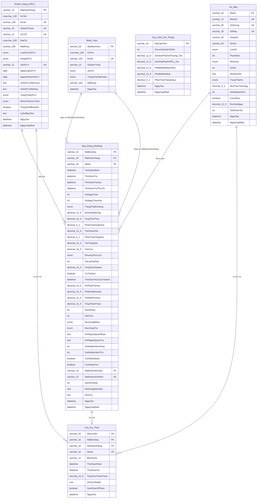

# TÀI LIỆU THIẾT KẾ: SƠ ĐỒ QUAN HỆ THỰC THỂ VẬT LÝ (PHYSICAL ERD)

## 1. SƠ ĐỒ ERD VẬT LÝ (PHYSICAL ERD DIAGRAM)



---

## 2. QUY ĐỊNH KÝ HIỆU & KIỂU DỮ LIỆU VẬT LÝ (SQL SCHEMA)

- `varchar_XX` $\to$ `VARCHAR(XX)`
- `nvarchar_XX` $\to$ `NVARCHAR(XX)`
- `decimal_XX_Y` $\to$ `DECIMAL(XX, Y)`
- `enum` $\to$ `ENUM(...)`
- `text` $\to$ `TEXT`

---

## 3. THIẾT KẾ CHI TIẾT CÁC BẢNG CƠ SỞ DỮ LIỆU

### 3.1. Bảng `Xe_May` (Motorcycles)
*   **Mã SQL tạo bảng:**
```sql
CREATE TABLE Xe_May (
    MaXe VARCHAR(10) PRIMARY KEY,
    BienSo VARCHAR(12) NOT NULL UNIQUE,
    SoKhung VARCHAR(20) NOT NULL UNIQUE,
    SoMay VARCHAR(20) NOT NULL UNIQUE,
    HangXe VARCHAR(30) NOT NULL,
    TenXe VARCHAR(50) NOT NULL,
    LoaiXe ENUM('Xe_So', 'Xe_Ga', 'Xe_Con_Tay', 'Xe_PKL', 'Xe_Dien') NOT NULL,
    PhanKhoi INT NOT NULL CHECK (PhanKhoi >= 0),
    NhomXe ENUM('Nhom_50cc_Dien', 'Nhom_A1', 'Nhom_A2_PKL') NOT NULL,
    DoiXe INT NOT NULL CHECK (DoiXe >= 1900),
    HinhAnhXe TEXT, -- Lưu mảng JSON các URL
    TrangThaiXe ENUM('San_Sang', 'Dang_Thue', 'KHOA_TAM_15M', 'Dang_Bao_Duong', 'Dang_Sua_Chua') NOT NULL DEFAULT 'San_Sang',
    MucTieuThuXang DECIMAL(4,1) NULL CHECK (MucTieuThuXang >= 0),
    SoMuBaoHiem INT NOT NULL DEFAULT 2,
    CoAoMua BOOLEAN NOT NULL DEFAULT TRUE,
    DonGiaNgay DECIMAL(12,0) NOT NULL CHECK (DonGiaNgay > 0),
    ODOHienTai INT NOT NULL DEFAULT 0 CHECK (ODOHienTai >= 0),
    NgayTao DATETIME NOT NULL DEFAULT CURRENT_TIMESTAMP,
    NgayCapNhat DATETIME NOT NULL DEFAULT CURRENT_TIMESTAMP ON UPDATE CURRENT_TIMESTAMP
);
```

### 3.2. Bảng `Khach_Hang_GPLX` (Customers)
*   **Mã SQL tạo bảng:**
```sql
CREATE TABLE Khach_Hang_GPLX (
    MaKhachHang VARCHAR(10) PRIMARY KEY,
    HoTen VARCHAR(100) CHARACTER SET utf8mb4 NOT NULL,
    Email VARCHAR(100) UNIQUE NULL,
    SoDienThoai VARCHAR(15) UNIQUE NOT NULL,
    CCCD VARCHAR(12) UNIQUE NULL,
    DiaChi VARCHAR(200) CHARACTER SET utf8mb4 NULL,
    MatKhau VARCHAR(255) NOT NULL,
    LuaChonGPLX ENUM('Co_GPLX', 'Khong_GPLX') NOT NULL,
    HangGPLX ENUM('A1', 'A2', 'Khong') NULL,
    SoGPLX VARCHAR(12) UNIQUE NULL,
    NgayCapGPLX DATE NULL,
    NgayHetHanGPLX DATE NULL,
    AnhGPLXMatTruoc TEXT NULL,
    AnhGPLXMatSau TEXT NULL,
    TrangThaiGPLX ENUM('Khong_Dang_Ky', 'Da_Upload') NOT NULL DEFAULT 'Khong_Dang_Ky',
    NhomXeDuocThue ENUM('Nhom_50cc_Dien', 'Nhom_A1', 'Nhom_A2_PKL') NOT NULL DEFAULT 'Nhom_50cc_Dien',
    TrangThaiBlacklist BOOLEAN NOT NULL DEFAULT FALSE,
    LyDoBlacklist TEXT NULL,
    NgayTao DATETIME NOT NULL DEFAULT CURRENT_TIMESTAMP,
    NgayCapNhat DATETIME NOT NULL DEFAULT CURRENT_TIMESTAMP ON UPDATE CURRENT_TIMESTAMP
);
```

### 3.3. Bảng `Nhan_Vien` (Staff & Admin Accounts)
*   **Mã SQL tạo bảng:**
```sql
CREATE TABLE Nhan_Vien (
    MaNhanVien VARCHAR(10) PRIMARY KEY,
    HoTen VARCHAR(100) CHARACTER SET utf8mb4 NOT NULL,
    Email VARCHAR(100) UNIQUE NOT NULL,
    SoDienThoai VARCHAR(15) NOT NULL,
    VaiTro ENUM('Nhan_Vien', 'Admin') NOT NULL,
    TrangThaiTaiKhoan ENUM('Hoat_Dong', 'Bi_Khoa') NOT NULL DEFAULT 'Hoat_Dong',
    MatKhau VARCHAR(255) NOT NULL,
    NgayTao DATETIME NOT NULL DEFAULT CURRENT_TIMESTAMP
);
```

### 3.4. Bảng `Hop_Dong_Booking` (Rentals)
*   **Mã SQL tạo bảng:**
```sql
CREATE TABLE Hop_Dong_Booking (
    MaBooking VARCHAR(15) PRIMARY KEY,
    MaKhachHang VARCHAR(10) NOT NULL,
    MaXe VARCHAR(10) NOT NULL,
    ThoiGianNhan DATETIME NOT NULL,
    ThoiGianTra DATETIME NOT NULL,
    ThoiGianTraGoc DATETIME NOT NULL,
    ThoiGianTraThucTe DATETIME NULL,
    SoNgayThue INT NOT NULL CHECK (SoNgayThue > 0),
    SoNgayThueGoc INT NOT NULL CHECK (SoNgayThueGoc > 0),
    TrangThaiBooking ENUM('Cho_Thanh_Toan_Coc', 'Cho_Nhan_Xe', 'Dang_Thue', 'Yeu_Cau_Tra_Som', 'Qua_Han', 'Cho_Tra_Xe', 'Dang_Quyet_Toan', 'Hoan_Tat', 'Da_Huy') NOT NULL DEFAULT 'Cho_Thanh_Toan_Coc',
    DonGiaApDung DECIMAL(12,0) NOT NULL,
    TongTienThue DECIMAL(15,0) NOT NULL,
    PhanTramGiamGia DECIMAL(4,1) DEFAULT 0 CHECK (PhanTramGiamGia >= 0),
    TienGiamGia DECIMAL(15,0) DEFAULT 0,
    PhanTramTangGia DECIMAL(4,1) DEFAULT 0 CHECK (PhanTramTangGia >= 0),
    TienTangGia DECIMAL(15,0) DEFAULT 0,
    TienCoc DECIMAL(15,0) NOT NULL,
    PhuongThucCoc ENUM('Chuyen_Khoan', 'Vi_Dien_Tu', 'Tien_Mat') NOT NULL,
    SoLanGiaHan INT NOT NULL DEFAULT 0 CHECK (SoLanGiaHan <= 3),
    TongTienGiaHan DECIMAL(15,0) DEFAULT 0,
    CoTraSom BOOLEAN NOT NULL DEFAULT FALSE,
    ThoiGianYeuCauTraSom DATETIME NULL,
    PhiPhatTreHan DECIMAL(15,0) DEFAULT 0,
    PhiDenBuHuHai DECIMAL(15,0) DEFAULT 0,
    PhiMatPhuKien DECIMAL(15,0) DEFAULT 0,
    TongThanhToan DECIMAL(15,0) NOT NULL,
    ODONhan INT NULL,
    ODOTra INT NULL,
    MucXangNhan ENUM('Day', '3_Phan_4', '1_Phan_2', '1_Phan_4', 'Gan_Het') NULL,
    MucXangTra ENUM('Day', '3_Phan_4', '1_Phan_2', '1_Phan_4', 'Gan_Het') NULL,
    AnhNgoaiQuanNhan TEXT NULL,
    AnhNgoaiQuanTra TEXT NULL,
    SoMuBaoHiemGiao INT DEFAULT 0,
    SoMuBaoHiemTra INT DEFAULT 0,
    CoAoMuaGiao BOOLEAN DEFAULT FALSE,
    CoAoMuaTra BOOLEAN DEFAULT FALSE,
    MaNhanVienGiao VARCHAR(10) NULL,
    MaNhanVienNhan VARCHAR(10) NULL,
    DanhGiaSao INT NULL CHECK (DanhGiaSao BETWEEN 1 AND 5),
    NoiDungDanhGia TEXT NULL,
    GhiChu TEXT NULL,
    NgayTao DATETIME NOT NULL DEFAULT CURRENT_TIMESTAMP,
    NgayCapNhat DATETIME NOT NULL DEFAULT CURRENT_TIMESTAMP ON UPDATE CURRENT_TIMESTAMP,

    FOREIGN KEY (MaKhachHang) REFERENCES Khach_Hang_GPLX(MaKhachHang),
    FOREIGN KEY (MaXe) REFERENCES Xe_May(MaXe),
    FOREIGN KEY (MaNhanVienGiao) REFERENCES Nhan_Vien(MaNhanVien),
    FOREIGN KEY (MaNhanVienNhan) REFERENCES Nhan_Vien(MaNhanVien)
);
```

### 3.5. Bảng `Lich_Su_Thue` (Rental History)
*   **Mã SQL tạo bảng:**
```sql
CREATE TABLE Lich_Su_Thue (
    MaLichSu VARCHAR(15) PRIMARY KEY,
    MaBooking VARCHAR(15) NOT NULL,
    MaKhachHang VARCHAR(10) NOT NULL,
    MaXe VARCHAR(10) NOT NULL,
    BienSoXe VARCHAR(12) NOT NULL,
    ThoiGianNhan DATETIME NOT NULL,
    ThoiGianTra DATETIME NOT NULL,
    TongTienThanhToan DECIMAL(15,0) NOT NULL,
    GhiChuNoiBo TEXT NULL,
    DanhDauViPham BOOLEAN NOT NULL DEFAULT FALSE,
    NgayTao DATETIME NOT NULL DEFAULT CURRENT_TIMESTAMP,

    FOREIGN KEY (MaKhachHang) REFERENCES Khach_Hang_GPLX(MaKhachHang),
    FOREIGN KEY (MaXe) REFERENCES Xe_May(MaXe),
    FOREIGN KEY (MaBooking) REFERENCES Hop_Dong_Booking(MaBooking)
);
```

### 3.6. Bảng `Cau_Hinh_He_Thong` (System Settings)
*   **Mã SQL tạo bảng:**
```sql
CREATE TABLE Cau_Hinh_He_Thong (
    MaCauHinh VARCHAR(10) PRIMARY KEY,
    SoLanGiaHanToiDa INT NOT NULL DEFAULT 3 CHECK (SoLanGiaHanToiDa >= 0),
    DonGiaPhatXeThuong_Gio DECIMAL(12,0) NOT NULL CHECK (DonGiaPhatXeThuong_Gio >= 0),
    DonGiaPhatXePKL_Gio DECIMAL(12,0) NOT NULL CHECK (DonGiaPhatXePKL_Gio >= 0),
    PhatMatMuBaoHiem DECIMAL(12,0) NOT NULL CHECK (PhatMatMuBaoHiem >= 0),
    PhatMatAoMua DECIMAL(12,0) NOT NULL CHECK (PhatMatAoMua >= 0),
    PhanTramTangGiaLe DECIMAL(4,1) NOT NULL CHECK (PhanTramTangGiaLe >= 0),
    NgayTao DATETIME NOT NULL DEFAULT CURRENT_TIMESTAMP,
    NgayCapNhat DATETIME NOT NULL DEFAULT CURRENT_TIMESTAMP ON UPDATE CURRENT_TIMESTAMP
);
```

---

## 4. CÁC RÀNG BUỘC TOÀN VẸN VÀ LOGIC DATABASE (DATA INTEGRITY)

1.  **Ràng buộc khóa ngoại (Foreign Key Constraints):**
    *   Mọi đơn thuê (`Hop_Dong_Booking`) bắt buộc phải tham chiếu đến một Khách hàng (`Khach_Hang_GPLX`) và một Xe máy (`Xe_May`) hợp lệ trong hệ thống.
    *   Mã nhân viên giao (`MaNhanVienGiao`) và mã nhân viên nhận (`MaNhanVienNhan`) nếu khác `NULL` phải tồn tại trong bảng `Nhan_Vien`.
2.  **Ràng buộc Unique (Sự duy nhất):**
    *   `BienSo`, `SoKhung`, `SoMay` của `Xe_May` bắt buộc không được phép trùng lặp.
    *   `Email`, `SoDienThoai`, `CCCD`, `SoGPLX` của `Khach_Hang_GPLX` bắt buộc duy nhất toàn cục.
3.  **Ràng buộc Logic nghiệp vụ (CHECK Constraints):**
    *   Số lần gia hạn qua App tối đa: `CHECK (SoLanGiaHan <= 3)`.
    *   Giá trị thanh toán và số ODO không âm: `CHECK (ODOHienTai >= 0)`, `CHECK (DonGiaNgay > 0)`.
    *   Đánh giá dịch vụ giới hạn trong khoảng 1 đến 5 sao: `CHECK (DanhGiaSao BETWEEN 1 AND 5)`.
