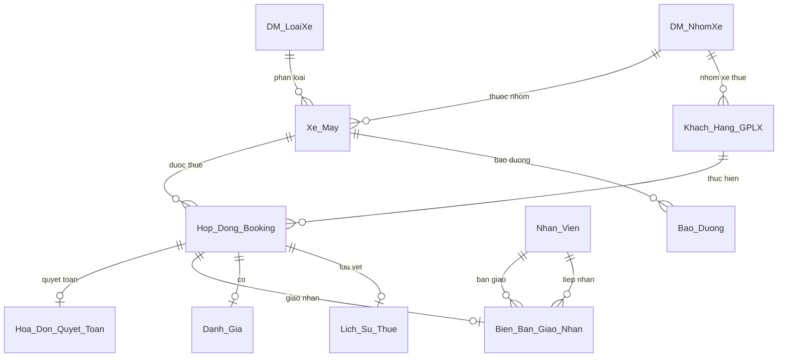
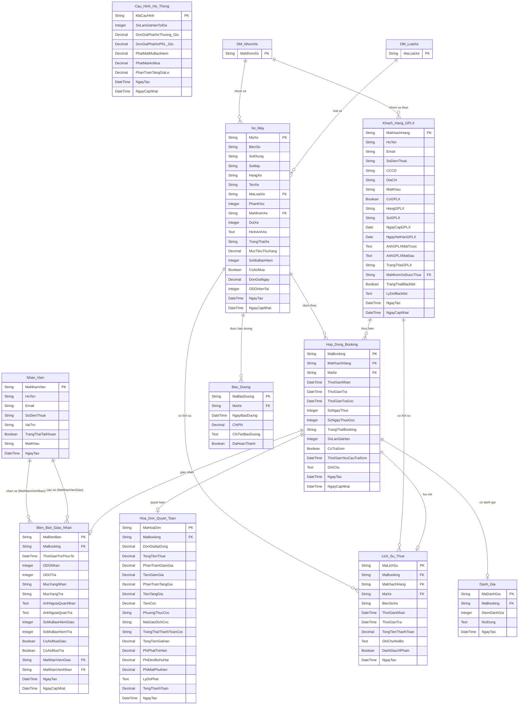
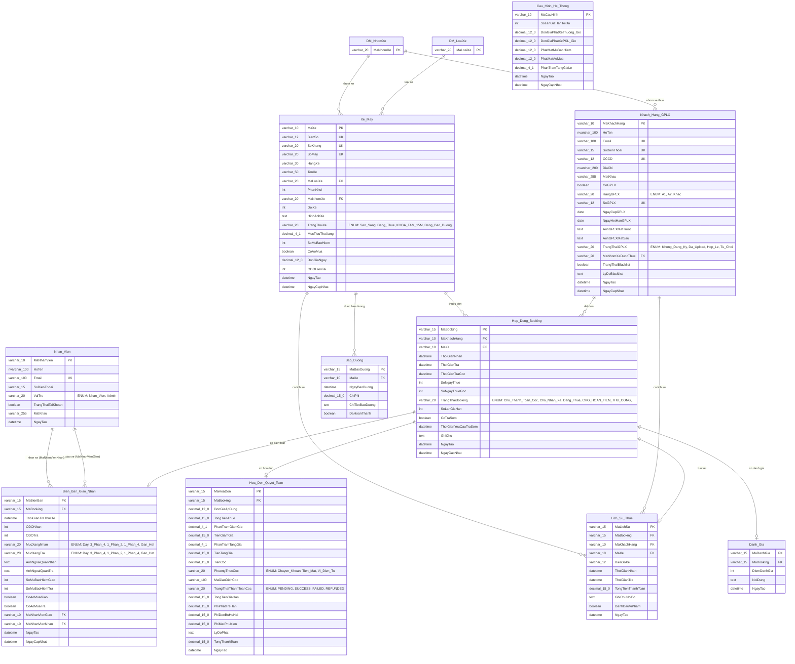

# TÀI LIỆU THIẾT KẾ CƠ SỞ DỮ LIỆU: CÁC MỨC SƠ ĐỒ ERD

Tài liệu này trình bày thiết kế cơ sở dữ liệu của Hệ thống Quản lý và Cho thuê xe máy Thông minh qua 3 cấp độ: Khái niệm (Conceptual), Logic (Logical), và Vật lý (Physical).

---

## 1. SƠ ĐỒ ERD MỨC KHÁI NIỆM (CONCEPTUAL ERD)

Sơ đồ ở mức khái niệm rất tổng quát, chỉ hiển thị **Tên các thực thể (Entity)** và **Mối quan hệ nghiệp vụ chính (Relationship)** giữa chúng. Sơ đồ này không chứa khóa chính (PK), khóa ngoại (FK) hay bất kỳ thuộc tính chi tiết nào, giúp người xem dễ dàng nắm bắt bức tranh toàn cảnh của hệ thống.



---

## 2. SƠ ĐỒ ERD MỨC LOGIC (LOGICAL ERD)

Sơ đồ ở mức logic chi tiết hơn, thể hiện **Tên thực thể**, **Mối quan hệ**, và **Tất cả các thuộc tính** thuộc thực thể đó, bao gồm ký hiệu Khóa chính (PK) và Khóa ngoại (FK). Kiểu dữ liệu ở đây được trừu tượng hóa thành các kiểu logic độc lập với DBMS (như String, Integer, Decimal, DateTime, Boolean, Text, Date).



---

## 3. SƠ ĐỒ ERD MỨC VẬT LÝ (PHYSICAL ERD)

Sơ đồ ở mức vật lý cực kỳ chi tiết, dùng trực tiếp để sinh mã và triển khai cơ sở dữ liệu thật. Sơ đồ chứa đầy đủ **Tên thực thể**, **Các khóa chính (PK) / Khóa ngoại (FK) / Ràng buộc (UK)**, và **Kiểu dữ liệu vật lý chính xác** tương thích với hệ quản trị CSDL (ví dụ: varchar, nvarchar, decimal, datetime, int, boolean).



---

## 4. QUY ĐỊNH KÝ HIỆU & KIỂU DỮ LIỆU VẬT LÝ (SQL SCHEMA)

- `varchar_XX` $\to$ `VARCHAR(XX)`
- `nvarchar_XX` $\to$ `NVARCHAR(XX)`
- `decimal_XX_Y` $\to$ `DECIMAL(XX, Y)`
- Lookup tables (Danh mục) được dùng thay cho `ENUM(...)` để chuẩn hóa dữ liệu theo chuẩn 3NF, dễ dàng mở rộng động.
- `text` $\to$ `TEXT`

---

## 3. THIẾT KẾ CHI TIẾT CÁC BẢNG CƠ SỞ DỮ LIỆU

*(Ghi chú: Để tinh gọn đặc tả SQL, các bảng danh mục (DM_...) mặc định có 1 cột Primary Key là Mã và 1 cột Tên mô tả. Dưới đây là đặc tả SQL cho các bảng nghiệp vụ chính).*

### 3.1. Bảng `Xe_May` (Motorcycles)
*   **Mã SQL tạo bảng:**
```sql
CREATE TABLE Xe_May (
    MaXe VARCHAR(10) PRIMARY KEY,
    BienSo VARCHAR(12) NOT NULL UNIQUE,
    SoKhung VARCHAR(20) NOT NULL UNIQUE,
    SoMay VARCHAR(20) NOT NULL UNIQUE,
    HangXe VARCHAR(30) NOT NULL,
    TenXe VARCHAR(50) NOT NULL,
    MaLoaiXe VARCHAR(20) NOT NULL,
    PhanKhoi INT NOT NULL CHECK (PhanKhoi >= 0),
    MaNhomXe VARCHAR(20) NOT NULL,
    DoiXe INT NOT NULL CHECK (DoiXe >= 1900),
    HinhAnhXe TEXT, -- Lưu mảng JSON các URL
    TrangThaiXe VARCHAR(20) NOT NULL DEFAULT 'San_Sang',
    MucTieuThuXang DECIMAL(4,1) NULL CHECK (MucTieuThuXang >= 0),
    SoMuBaoHiem INT NOT NULL DEFAULT 2,
    CoAoMua BOOLEAN NOT NULL DEFAULT TRUE,
    DonGiaNgay DECIMAL(12,0) NOT NULL CHECK (DonGiaNgay > 0),
    ODOHienTai INT NOT NULL DEFAULT 0 CHECK (ODOHienTai >= 0),
    NgayTao DATETIME NOT NULL DEFAULT CURRENT_TIMESTAMP,
    NgayCapNhat DATETIME NOT NULL DEFAULT CURRENT_TIMESTAMP ON UPDATE CURRENT_TIMESTAMP,
    FOREIGN KEY (MaLoaiXe) REFERENCES DM_LoaiXe(MaLoaiXe),
    FOREIGN KEY (MaNhomXe) REFERENCES DM_NhomXe(MaNhomXe)
);
```

### 3.2. Bảng `Khach_Hang_GPLX` (Customers)
*   **Mã SQL tạo bảng:**
```sql
CREATE TABLE Khach_Hang_GPLX (
    MaKhachHang VARCHAR(10) PRIMARY KEY,
    HoTen VARCHAR(100) CHARACTER SET utf8mb4 NOT NULL,
    Email VARCHAR(100) UNIQUE NULL,
    SoDienThoai VARCHAR(15) UNIQUE NOT NULL,
    CCCD VARCHAR(12) UNIQUE NULL,
    DiaChi VARCHAR(200) CHARACTER SET utf8mb4 NULL,
    MatKhau VARCHAR(255) NOT NULL,
    CoGPLX BOOLEAN NOT NULL DEFAULT FALSE,
    HangGPLX VARCHAR(20) NULL,
    SoGPLX VARCHAR(12) UNIQUE NULL,
    NgayCapGPLX DATE NULL,
    NgayHetHanGPLX DATE NULL,
    AnhGPLXMatTruoc TEXT NULL,
    AnhGPLXMatSau TEXT NULL,
    TrangThaiGPLX VARCHAR(20) NOT NULL DEFAULT 'Khong_Dang_Ky',
    MaNhomXeDuocThue VARCHAR(20) NOT NULL DEFAULT 'Nhom_50cc_Dien',
    TrangThaiBlacklist BOOLEAN NOT NULL DEFAULT FALSE,
    LyDoBlacklist TEXT NULL,
    NgayTao DATETIME NOT NULL DEFAULT CURRENT_TIMESTAMP,
    NgayCapNhat DATETIME NOT NULL DEFAULT CURRENT_TIMESTAMP ON UPDATE CURRENT_TIMESTAMP,
    FOREIGN KEY (MaNhomXeDuocThue) REFERENCES DM_NhomXe(MaNhomXe),
    CONSTRAINT chk_NgayGPLX CHECK (NgayHetHanGPLX > NgayCapGPLX)
);
```

### 3.3. Bảng `Nhan_Vien` (Staff & Admin Accounts)
*   **Mã SQL tạo bảng:**
```sql
CREATE TABLE Nhan_Vien (
    MaNhanVien VARCHAR(10) PRIMARY KEY,
    HoTen VARCHAR(100) CHARACTER SET utf8mb4 NOT NULL,
    Email VARCHAR(100) UNIQUE NOT NULL,
    SoDienThoai VARCHAR(15) NOT NULL,
    VaiTro VARCHAR(20) NOT NULL,
    TrangThaiTaiKhoan BOOLEAN NOT NULL DEFAULT TRUE,
    MatKhau VARCHAR(255) NOT NULL,
    NgayTao DATETIME NOT NULL DEFAULT CURRENT_TIMESTAMP
);
```

### 3.4. Bảng `Hop_Dong_Booking` (Rentals)
*   **Mã SQL tạo bảng:**
```sql
CREATE TABLE Hop_Dong_Booking (
    MaBooking VARCHAR(15) PRIMARY KEY,
    MaKhachHang VARCHAR(10) NOT NULL,
    MaXe VARCHAR(10) NOT NULL,
    ThoiGianNhan DATETIME NOT NULL,
    ThoiGianTra DATETIME NOT NULL,
    ThoiGianTraGoc DATETIME NOT NULL,
    SoNgayThue INT NOT NULL CHECK (SoNgayThue > 0),
    SoNgayThueGoc INT NOT NULL CHECK (SoNgayThueGoc > 0),
    TrangThaiBooking VARCHAR(20) NOT NULL DEFAULT 'Cho_Thanh_Toan_Coc',
    SoLanGiaHan INT NOT NULL DEFAULT 0 CHECK (SoLanGiaHan <= 3),
    CoTraSom BOOLEAN NOT NULL DEFAULT FALSE,
    ThoiGianYeuCauTraSom DATETIME NULL,
    GhiChu TEXT NULL,
    NgayTao DATETIME NOT NULL DEFAULT CURRENT_TIMESTAMP,
    NgayCapNhat DATETIME NOT NULL DEFAULT CURRENT_TIMESTAMP ON UPDATE CURRENT_TIMESTAMP,

    FOREIGN KEY (MaKhachHang) REFERENCES Khach_Hang_GPLX(MaKhachHang),
    FOREIGN KEY (MaXe) REFERENCES Xe_May(MaXe),
    CONSTRAINT chk_ThoiGianThue CHECK (ThoiGianTra > ThoiGianNhan),
    CONSTRAINT chk_ThoiGianTraGoc CHECK (ThoiGianTraGoc >= ThoiGianNhan)
);
```

### 3.5. Bảng `Hoa_Don_Quyet_Toan` (Financial Records)
*   **Mã SQL tạo bảng:**
```sql
CREATE TABLE Hoa_Don_Quyet_Toan (
    MaHoaDon VARCHAR(15) PRIMARY KEY,
    MaBooking VARCHAR(15) NOT NULL UNIQUE,
    DonGiaApDung DECIMAL(12,0) NOT NULL CHECK (DonGiaApDung >= 0),
    TongTienThue DECIMAL(15,0) NOT NULL CHECK (TongTienThue >= 0),
    PhanTramGiamGia DECIMAL(4,1) DEFAULT 0 CHECK (PhanTramGiamGia >= 0),
    TienGiamGia DECIMAL(15,0) DEFAULT 0 CHECK (TienGiamGia >= 0),
    PhanTramTangGia DECIMAL(4,1) DEFAULT 0 CHECK (PhanTramTangGia >= 0),
    TienTangGia DECIMAL(15,0) DEFAULT 0 CHECK (TienTangGia >= 0),
    TienCoc DECIMAL(15,0) NOT NULL CHECK (TienCoc >= 0),
    PhuongThucCoc VARCHAR(20) NOT NULL,
    MaGiaoDichCoc VARCHAR(100) NULL,
    TrangThaiThanhToanCoc VARCHAR(20) NOT NULL DEFAULT 'PENDING',
    TongTienGiaHan DECIMAL(15,0) DEFAULT 0 CHECK (TongTienGiaHan >= 0),
    PhiPhatTreHan DECIMAL(15,0) DEFAULT 0 CHECK (PhiPhatTreHan >= 0),
    PhiDenBuHuHai DECIMAL(15,0) DEFAULT 0 CHECK (PhiDenBuHuHai >= 0),
    PhiMatPhuKien DECIMAL(15,0) DEFAULT 0 CHECK (PhiMatPhuKien >= 0),
    LyDoPhat TEXT NULL,
    TongThanhToan DECIMAL(15,0) NOT NULL CHECK (TongThanhToan >= 0),
    NgayTao DATETIME NOT NULL DEFAULT CURRENT_TIMESTAMP,

    FOREIGN KEY (MaBooking) REFERENCES Hop_Dong_Booking(MaBooking)
);
```

### 3.6. Bảng `Bien_Ban_Giao_Nhan` (Check-in / Check-out Records)
*   **Mã SQL tạo bảng:**
```sql
CREATE TABLE Bien_Ban_Giao_Nhan (
    MaBienBan VARCHAR(15) PRIMARY KEY,
    MaBooking VARCHAR(15) NOT NULL UNIQUE,
    ThoiGianTraThucTe DATETIME NULL,
    ODONhan INT NULL,
    ODOTra INT NULL,
    MucXangNhan VARCHAR(20) NULL,
    MucXangTra VARCHAR(20) NULL,
    AnhNgoaiQuanNhan TEXT NULL,
    AnhNgoaiQuanTra TEXT NULL,
    SoMuBaoHiemGiao INT DEFAULT 0,
    SoMuBaoHiemTra INT DEFAULT 0,
    CoAoMuaGiao BOOLEAN DEFAULT FALSE,
    CoAoMuaTra BOOLEAN DEFAULT FALSE,
    MaNhanVienGiao VARCHAR(10) NULL,
    MaNhanVienNhan VARCHAR(10) NULL,
    NgayTao DATETIME NOT NULL DEFAULT CURRENT_TIMESTAMP,
    NgayCapNhat DATETIME NOT NULL DEFAULT CURRENT_TIMESTAMP ON UPDATE CURRENT_TIMESTAMP,

    FOREIGN KEY (MaBooking) REFERENCES Hop_Dong_Booking(MaBooking),
    FOREIGN KEY (MaNhanVienGiao) REFERENCES Nhan_Vien(MaNhanVien),
    FOREIGN KEY (MaNhanVienNhan) REFERENCES Nhan_Vien(MaNhanVien)
);
```

### 3.7. Bảng `Lich_Su_Thue` (Rental History)
*   **Mã SQL tạo bảng:**
```sql
CREATE TABLE Lich_Su_Thue (
    MaLichSu VARCHAR(15) PRIMARY KEY,
    MaBooking VARCHAR(15) NOT NULL,
    MaKhachHang VARCHAR(10) NOT NULL,
    MaXe VARCHAR(10) NOT NULL,
    BienSoXe VARCHAR(12) NOT NULL,
    ThoiGianNhan DATETIME NOT NULL,
    ThoiGianTra DATETIME NOT NULL,
    TongTienThanhToan DECIMAL(15,0) NOT NULL,
    GhiChuNoiBo TEXT NULL,
    DanhDauViPham BOOLEAN NOT NULL DEFAULT FALSE,
    NgayTao DATETIME NOT NULL DEFAULT CURRENT_TIMESTAMP,

    FOREIGN KEY (MaKhachHang) REFERENCES Khach_Hang_GPLX(MaKhachHang),
    FOREIGN KEY (MaXe) REFERENCES Xe_May(MaXe),
    FOREIGN KEY (MaBooking) REFERENCES Hop_Dong_Booking(MaBooking)
);
```

### 3.8. Bảng `Bao_Duong` (Maintenance Records)
*   **Mã SQL tạo bảng:**
```sql
CREATE TABLE Bao_Duong (
    MaBaoDuong VARCHAR(15) PRIMARY KEY,
    MaXe VARCHAR(10) NOT NULL,
    NgayBaoDuong DATETIME NOT NULL,
    ChiPhi DECIMAL(15,0) NOT NULL CHECK (ChiPhi >= 0),
    ChiTietBaoDuong TEXT NOT NULL,
    DaHoanThanh BOOLEAN NOT NULL DEFAULT FALSE,
    
    FOREIGN KEY (MaXe) REFERENCES Xe_May(MaXe)
);
```

### 3.9. Bảng `Danh_Gia` (Reviews/Ratings)
*   **Mã SQL tạo bảng:**
```sql
CREATE TABLE Danh_Gia (
    MaDanhGia VARCHAR(15) PRIMARY KEY,
    MaBooking VARCHAR(15) NOT NULL UNIQUE,
    DiemDanhGia INT NOT NULL CHECK (DiemDanhGia BETWEEN 1 AND 5),
    NoiDung TEXT NULL,
    NgayTao DATETIME NOT NULL DEFAULT CURRENT_TIMESTAMP,
    
    FOREIGN KEY (MaBooking) REFERENCES Hop_Dong_Booking(MaBooking)
);
```

### 3.10. Bảng `Cau_Hinh_He_Thong` (System Settings)
*   **Mã SQL tạo bảng:**
```sql
CREATE TABLE Cau_Hinh_He_Thong (
    MaCauHinh VARCHAR(10) PRIMARY KEY,
    SoLanGiaHanToiDa INT NOT NULL DEFAULT 3 CHECK (SoLanGiaHanToiDa >= 0),
    DonGiaPhatXeThuong_Gio DECIMAL(12,0) NOT NULL CHECK (DonGiaPhatXeThuong_Gio >= 0),
    DonGiaPhatXePKL_Gio DECIMAL(12,0) NOT NULL CHECK (DonGiaPhatXePKL_Gio >= 0),
    PhatMatMuBaoHiem DECIMAL(12,0) NOT NULL CHECK (PhatMatMuBaoHiem >= 0),
    PhatMatAoMua DECIMAL(12,0) NOT NULL CHECK (PhatMatAoMua >= 0),
    PhanTramTangGiaLe DECIMAL(4,1) NOT NULL CHECK (PhanTramTangGiaLe >= 0),
    NgayTao DATETIME NOT NULL DEFAULT CURRENT_TIMESTAMP,
    NgayCapNhat DATETIME NOT NULL DEFAULT CURRENT_TIMESTAMP ON UPDATE CURRENT_TIMESTAMP
);
```

---

## 4. CÁC RÀNG BUỘC TOÀN VẸN VÀ LOGIC DATABASE (DATA INTEGRITY)

1.  **Ràng buộc khóa ngoại (Foreign Key Constraints):**
    *   Mọi đơn thuê (`Hop_Dong_Booking`) bắt buộc phải tham chiếu đến một Khách hàng (`Khach_Hang_GPLX`) và một Xe máy (`Xe_May`) hợp lệ trong hệ thống.
    *   Mã nhân viên giao (`MaNhanVienGiao`) và mã nhân viên nhận (`MaNhanVienNhan`) nếu khác `NULL` phải tồn tại trong bảng `Nhan_Vien`.
    *   Nhóm xe và loại xe (động) được liên kết qua khóa ngoại tới bảng `DM_NhomXe`, `DM_LoaiXe`.
    *   Các trạng thái tĩnh (Booking, GPLX, Xe, Vai Trò, Thanh Toán) đã được chuẩn hóa thành VARCHAR (lưu trữ Enum trực tiếp thay vì FK) để tối ưu hóa hiệu năng, giảm JOINs.
2.  **Ràng buộc Unique (Sự duy nhất):**
    *   `BienSo`, `SoKhung`, `SoMay` của `Xe_May` bắt buộc không được phép trùng lặp.
    *   `Email`, `SoDienThoai`, `CCCD`, `SoGPLX` của `Khach_Hang_GPLX` bắt buộc duy nhất toàn cục.
3.  **Ràng buộc Logic nghiệp vụ (CHECK Constraints):**
    *   Số lần gia hạn qua App tối đa: `CHECK (SoLanGiaHan <= 3)`.
    *   Giá trị thanh toán và số ODO không âm: `CHECK (ODOHienTai >= 0)`, `CHECK (DonGiaNgay > 0)`.
    *   Đánh giá dịch vụ giới hạn trong khoảng 1 đến 5 sao: `CHECK (DanhGiaSao BETWEEN 1 AND 5)`.
