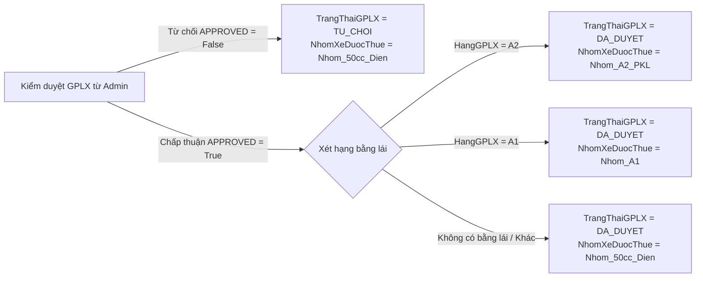
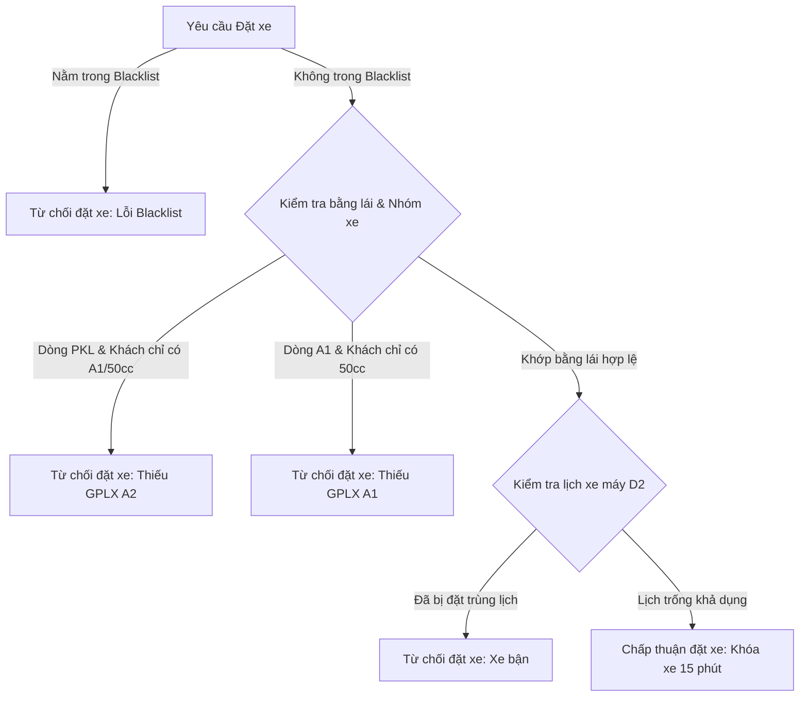
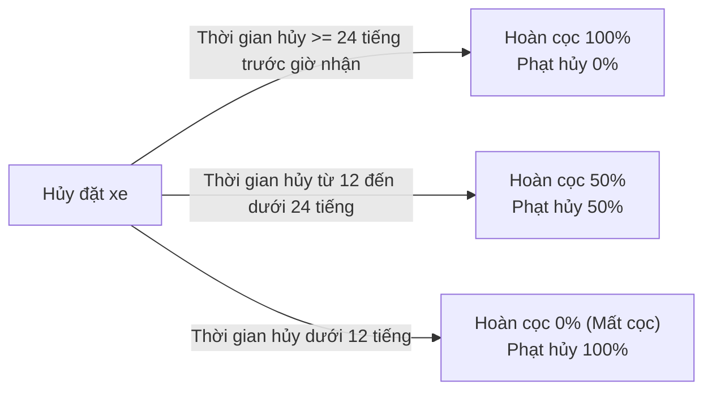
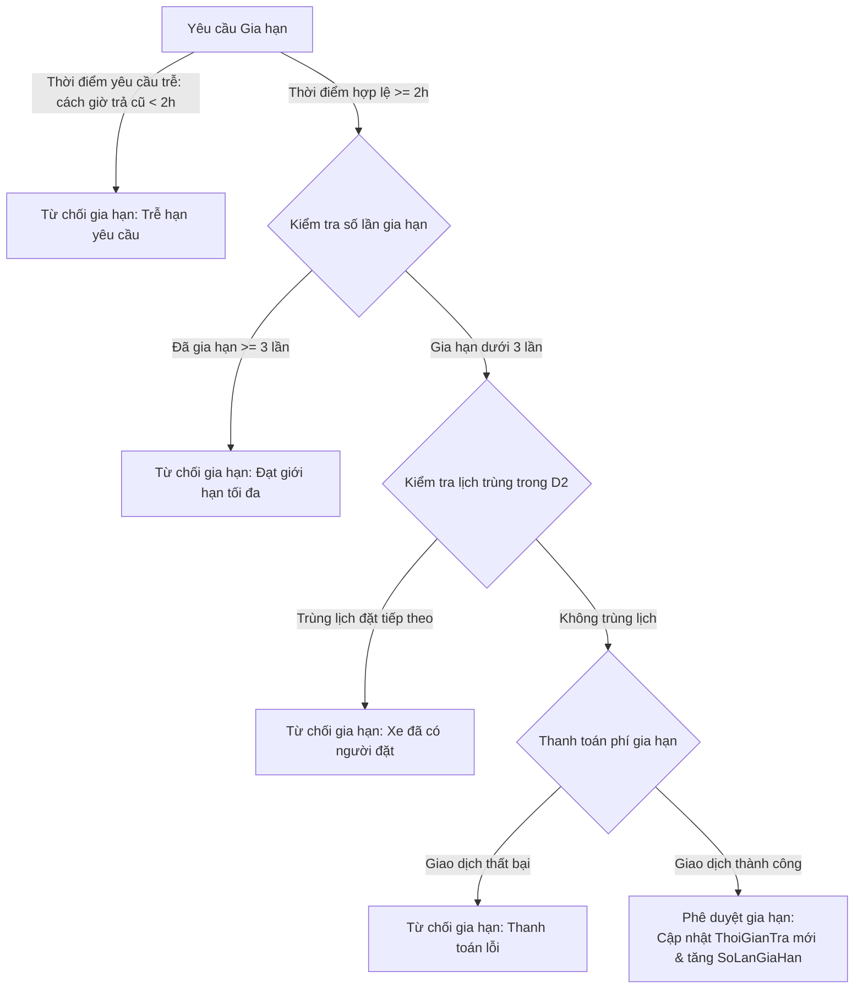
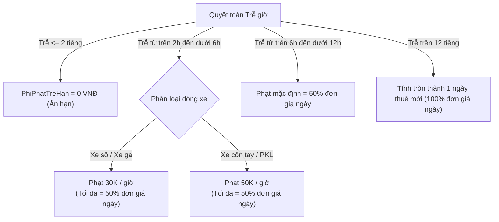
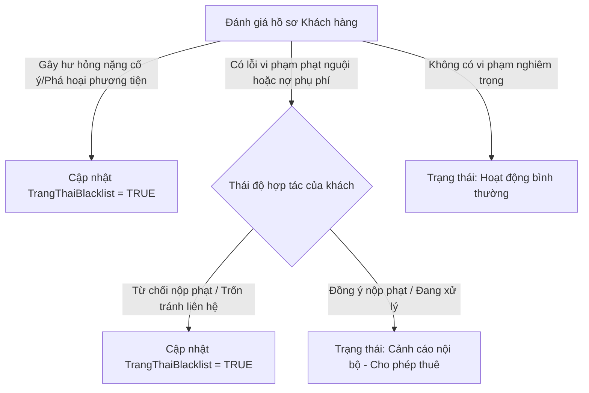
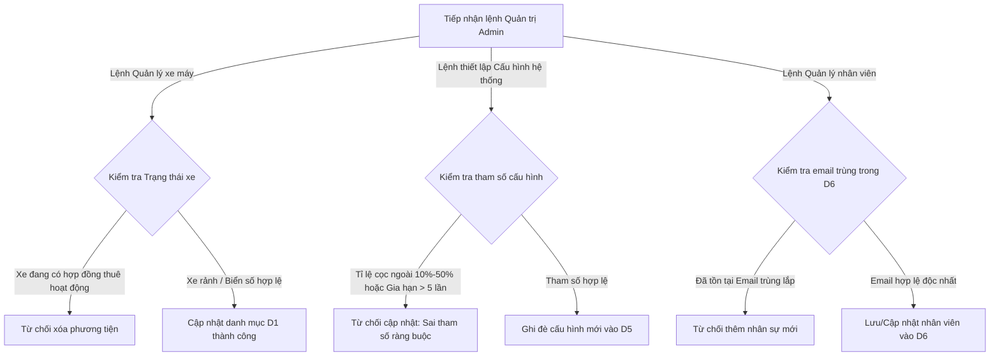

# ĐẶC TẢ TIẾN TRÌNH (PROCESS SPECIFICATIONS — PS)

Tài liệu này chứa đặc tả chi tiết cho toàn bộ 6 tiến trình cốt lõi của Hệ thống Quản lý và Cho thuê Xe máy Thông minh. Mỗi tiến trình được đặc tả bằng ba công cụ chuẩn:
1. **Structured English (Ngôn ngữ cấu trúc)**
2. **Decision Table (Bảng quyết định)**
3. **Decision Tree (Cây quyết định)**

---

## 1. TIẾN TRÌNH 1.0 — ĐĂNG KÝ & XÁC THỰC GPLX

### 1.1. Structured English (Ngôn ngữ cấu trúc)

```text
PROCESS 1.0: Đăng ký & Xác thực GPLX
BEGIN
    RECEIVE F1.1: Yêu cầu đăng ký tài khoản (HoTen, Email, SoDienThoai, HangGPLX, AnhGPLXMatTruoc, AnhGPLXMatSau)
    
    // Bước 1: Kiểm tra tính hợp lệ dữ liệu đầu vào cơ bản
    IF Email không đúng định dạng HOẶC SoDienThoai không phải dạng số THEN
        SEND Thông báo lỗi "Dữ liệu đầu vào không hợp lệ" to Khách hàng E1
        TERMINATE PROCESS
    ENDIF

    // Bước 2: Kiểm tra trùng lặp tài khoản
    READ D3: Khach_Hang_GPLX
        WHERE D3.Email = Email OR D3.SoDienThoai = SoDienThoai
    IF Tìm thấy bản ghi tương ứng trong D3 THEN
        SEND Thông báo lỗi "Tài khoản đã tồn tại trên hệ thống" to Khách hàng E1
        TERMINATE PROCESS
    ELSE
        // Ghi nhận tài khoản mới chờ Admin duyệt GPLX
        WRITE D3: Khach_Hang_GPLX
            VALUES (MaKhachHang = AutoGen, HoTen, Email, SoDienThoai, TrangThaiGPLX = 'CHO_DUYET', HangGPLX)
        SEND F1.4: Hồ sơ GPLX chờ duyệt to Admin E3
    ENDIF

    // Bước 3: Tiếp nhận lệnh kiểm duyệt từ Admin
    RECEIVE F1.5: Kết quả duyệt GPLX (MaKhachHang, LuachonDuyet ∈ {APPROVED, REJECTED}, LyDoTuChoi)
    
    IF LuachonDuyet = APPROVED THEN
        // Phân loại nhóm xe được phép thuê dựa trên hạng bằng lái
        IF HangGPLX = 'A2' THEN
            SET NhomXeDuocThue = 'Nhom_A2_PKL' (Được phép thuê tất cả các loại xe)
        ELSE IF HangGPLX = 'A1' THEN
            SET NhomXeDuocThue = 'Nhom_A1' (Được phép thuê xe dưới 175cc và xe điện)
        ELSE
            SET NhomXeDuocThue = 'Nhom_50cc_Dien' (Chỉ được phép thuê xe dưới 50cc hoặc xe điện)
        ENDIF
        
        // Cập nhật trạng thái duyệt trong kho dữ liệu
        UPDATE D3: Khach_Hang_GPLX
            SET TrangThaiGPLX = 'DA_DUYET',
                NhomXeDuocThue = NhomXeDuocThue
            WHERE D3.MaKhachHang = MaKhachHang
            
        SEND F1.6: Thông báo kết quả GPLX (TrangThaiGPLX = APPROVED, NhomXeDuocThue) to Khách hàng E1
    ELSE
        // Trường hợp bị từ chối
        UPDATE D3: Khach_Hang_GPLX
            SET TrangThaiGPLX = 'TU_CHOI',
                LyDoTuChoiGPLX = LyDoTuChoi,
                NhomXeDuocThue = 'Nhom_50cc_Dien'
            WHERE D3.MaKhachHang = MaKhachHang
            
        SEND F1.6: Thông báo kết quả GPLX (TrangThaiGPLX = REJECTED, LyDoTuChoi) to Khách hàng E1
    ENDIF
END
```

### 1.2. Decision Table (Bảng quyết định)

Bảng quyết định dưới đây thể hiện quy tắc phân hạng nhóm xe được phép thuê của khách hàng sau khi Admin tiến hành duyệt hồ sơ bằng lái:

| Điều kiện (Conditions) | Q1 | Q2 | Q3 | Q4 |
| :--- | :---: | :---: | :---: | :---: |
| Admin duyệt GPLX thành công (`APPROVED`)? | Y | Y | Y | N |
| Hạng GPLX hiện tại của khách hàng là gì? | A2 | A1 | Không/Hạng khác | Bất kỳ |
| **Hành động (Actions)** | | | | |
| Cập nhật `TrangThaiGPLX = DA_DUYET` | X | X | X | |
| Cập nhật `TrangThaiGPLX = TU_CHOI` | | | | X |
| Gán nhóm xe được thuê = `Nhom_A2_PKL` | X | | | |
| Gán nhóm xe được thuê = `Nhom_A1` | | X | | |
| Gán nhóm xe được thuê = `Nhom_50cc_Dien` | | | X | X |

### 1.3. Decision Tree (Cây quyết định)



---

## 2. TIẾN TRÌNH 2.0 — ĐẶT XE TRỰC TUYẾN & GIỮ CHỖ

### 2.1. Structured English (Ngôn ngữ cấu trúc)

```text
PROCESS 2.0: Đặt xe trực tuyến & Giữ chỗ
BEGIN
    // Xử lý Tìm kiếm xe máy khả dụng
    IF RECEIVE F2.1: Yêu cầu tìm kiếm xe THEN
        READ D1: Xe_May WHERE TrangThaiXe = 'San_Sang' AND (LoaiXe, HangXe, PhanKhoi khớp bộ lọc)
        READ D5: Cau_Hinh_He_Thong (Đọc bảng giá cơ bản)
        SEND F2.2: Kết quả tìm kiếm xe to Khách hàng E1
    ENDIF

    // Xử lý Đặt xe giữ chỗ
    IF RECEIVE F2.6: Yêu cầu đặt xe (MaKhachHang, MaXe, ThoiGianNhan, ThoiGianTra) THEN
        // Kiểm tra Blacklist
        READ D3: Khach_Hang_GPLX WHERE D3.MaKhachHang = MaKhachHang
        IF D3.TrangThaiBlacklist = TRUE THEN
            SEND Thông báo lỗi "Tài khoản nằm trong danh sách hạn chế" to Khách hàng E1
            TERMINATE PROCESS
        ENDIF

        // Kiểm tra phân quyền GPLX đối với nhóm xe máy đã chọn
        READ D1: Xe_May WHERE D1.MaXe = MaXe
        IF D1.NhomXe = 'Nhom_A2_PKL' AND D3.NhomXeDuocThue != 'Nhom_A2_PKL' THEN
            SEND Thông báo lỗi "Yêu cầu GPLX hạng A2 để đặt dòng xe này" to Khách hàng E1
            TERMINATE PROCESS
        ELSE IF D1.NhomXe = 'Nhom_A1' AND D3.NhomXeDuocThue = 'Nhom_50cc_Dien' THEN
            SEND Thông báo lỗi "Yêu cầu GPLX hạng A1 hoặc A2 để đặt dòng xe này" to Khách hàng E1
            TERMINATE PROCESS
        ENDIF

        // Kiểm tra lịch trùng phương tiện
        READ D2: Hop_Dong_Booking WHERE D2.MaXe = MaXe AND TrangThaiBooking != 'DA_HUY'
            AND (ThoiGianNhan < D2.ThoiGianTra AND ThoiGianTra > D2.ThoiGianNhan)
        IF Tìm thấy lịch trùng THEN
            SEND Thông báo lỗi "Xe đã được đặt trong khoảng thời gian này" to Khách hàng E1
            TERMINATE PROCESS
        ENDIF

        // Tạo đơn hàng tạm, giữ xe 15 phút
        WRITE D2: Hop_Dong_Booking
            VALUES (MaBooking = AutoGen, MaKhachHang, MaXe, ThoiGianNhan, ThoiGianTra, TrangThaiBooking = 'CHO_THANH_TOAN_COC', ThoiGianTao = CurrentTime)
        UPDATE D1: Xe_May SET TrangThaiXe = 'Dang_Thue' WHERE D1.MaXe = MaXe
        SEND F2.8: Thông báo khóa xe tạm (15 phút chờ cọc) to Khách hàng E1

        // Tính toán tiền đặt cọc (30% tổng tiền thuê)
        READ D5: Cau_Hinh_He_Thong (Đọc thông số chiết khấu dài ngày và phụ thu ngày lễ)
        SET DonGia = D1.DonGiaMoiNgay
        SET SoNgay = ThoiGianTra - ThoiGianNhan
        SET TongTienThue = DonGia * SoNgay
        IF SoNgay >= 14 THEN APPLY Chiết khấu dài ngày 15%
        ELSE IF SoNgay >= 7 THEN APPLY Chiết khấu dài ngày 10%
        ELSE IF SoNgay >= 3 THEN APPLY Chiết khấu dài ngày 5%
        ENDIF
        IF ThoiGianNhan thuộc Ngày Lễ/Tết THEN APPLY Phụ thu giá ngày lễ +30%
        ENDIF
        SET TienCoc = TongTienThue * 30%

        // Giao dịch thanh toán cọc trực tuyến
        SEND F2.16: Yêu cầu giao dịch trực tuyến (TienCoc, MaBooking, LoaiGiaoDich = 'Dat_Coc') to Cổng thanh toán E4
        RECEIVE F2.17: Kết quả giao dịch (MaBooking, TrangThaiGD)
        
        IF TrangThaiGD = 'Thanh_Cong' THEN
            UPDATE D2: Hop_Dong_Booking SET TrangThaiBooking = 'CHO_NHAN_XE' WHERE D2.MaBooking = MaBooking
            SEND F2.14: Xác nhận đặt xe thành công to Khách hàng E1
            SEND F2.12: Thông báo đơn mới to Nhân viên E2 chuẩn bị bàn giao
        ELSE
            // Giao dịch thất bại hoặc quá 15 phút không thanh toán
            UPDATE D2: Hop_Dong_Booking SET TrangThaiBooking = 'DA_HUY' WHERE D2.MaBooking = MaBooking
            UPDATE D1: Xe_May SET TrangThaiXe = 'San_Sang' WHERE D1.MaXe = MaXe
            SEND Thông báo lỗi "Giao dịch cọc thất bại hoặc hết hạn giữ chỗ" to Khách hàng E1
        ENDIF
    ENDIF

    // Xử lý Hủy đặt xe và tính hoàn tiền cọc
    IF RECEIVE F2.7: Yêu cầu hủy đặt xe (MaBooking) THEN
        READ D2: Hop_Dong_Booking WHERE D2.MaBooking = MaBooking
        SET ThoiGianTruocNhan = D2.ThoiGianNhan - CurrentTime
        
        // Tính tiền hoàn cọc dựa trên mốc thời gian hủy
        IF ThoiGianTruocNhan >= 24 giờ THEN
            SET TiLeHoan = 100%
        ELSE IF ThoiGianTruocNhan >= 12 giờ AND ThoiGianTruocNhan < 24 giờ THEN
            SET TiLeHoan = 50%
        ELSE
            SET TiLeHoan = 0%
        ENDIF
        
        SET TienHoanCoc = D2.TienCoc * TiLeHoan
        SET TienPhatHuy = D2.TienCoc * (100% - TiLeHoan)

        // Thực hiện lệnh hoàn tiền trực tuyến qua Cổng thanh toán E4 nếu số tiền hoàn > 0
        IF TienHoanCoc > 0 THEN
            SEND F2.16: Yêu cầu giao dịch trực tuyến (TienHoanCoc, MaBooking, LoaiGiaoDich = 'Hoan_Tien') to Cổng thanh toán E4
            RECEIVE F2.17: Kết quả giao dịch (MaBooking, TrangThaiGD = 'Thanh_Cong')
        ENDIF

        // Cập nhật trạng thái đơn hàng và giải phóng phương tiện
        UPDATE D2: Hop_Dong_Booking 
            SET TrangThaiBooking = 'DA_HUY', 
                TienHoanCoc = TienHoanCoc, 
                TienPhatTreHan = TienPhatHuy
            WHERE D2.MaBooking = MaBooking
        UPDATE D1: Xe_May SET TrangThaiXe = 'San_Sang' WHERE D1.MaXe = D2.MaXe
        
        SEND F2.26: Cập nhật giao dịch hoàn tiền to D2
        SEND Thông báo xác nhận hủy và kết quả hoàn tiền to Khách hàng E1
    ENDIF
END
```

### 2.2. Decision Table (Bảng quyết định)

#### Bảng A: Xét duyệt hợp lệ yêu cầu đặt xe
| Điều kiện (Conditions) | Q1 | Q2 | Q3 | Q4 | Q5 |
| :--- | :---: | :---: | :---: | :---: | :---: |
| Khách hàng nằm trong Blacklist (`D3.TrangThaiBlacklist = TRUE`)? | Y | N | N | N | N |
| Nhóm xe máy đã đặt là loại nào? | Bất kỳ | PKL (A2) | A1 (110-150cc) | A1 | PKL (A2) |
| Nhóm xe khách được phép thuê (`D3.NhomXeDuocThue`)? | Bất kỳ | Nhom_A1 | Nhom_50cc_Dien | Nhom_A1 | Nhom_A2_PKL |
| Trùng lịch thuê xe khác trong kho `D2`? | Bất kỳ | N | N | Y | N |
| **Hành động (Actions)** | | | | |
| Từ chối đặt xe, xuất thông báo lỗi phù hợp | X | X | X | X | |
| Chấp nhận đặt xe, chuyển trạng thái xe sang giữ chỗ tạm | | | | | X |

#### Bảng B: Xác định chính sách hoàn cọc khi hủy đặt xe
| Điều kiện (Conditions) | Q1 | Q2 | Q3 |
| :--- | :---: | :---: | :---: |
| Khoảng thời gian hủy đơn trước giờ nhận xe ($H$)? | $H \ge 24h$ | $12h \le H < 24h$ | $H < 12h$ |
| **Hành động (Actions)** | | | |
| Chấp nhận hoàn trả tiền cọc cho khách hàng | 100% | 50% | 0% (Không hoàn) |
| Áp dụng phạt hủy đặt xe | 0% | 50% | 100% |
| Chuyển trạng thái đơn đặt xe sang `DA_HUY` | X | X | X |
| Cập nhật trạng thái xe máy sang `San_Sang` | X | X | X |

### 2.3. Decision Tree (Cây quyết định)

#### Cây quyết định xét duyệt đặt xe:


#### Cây quyết định chính sách hoàn cọc khi hủy đơn:


---

## 3. TIẾN TRÌNH 3.0 — GIA HẠN & YÊU CẦU TRẢ XE SỚM

### 3.1. Structured English (Ngôn ngữ cấu trúc)

```text
PROCESS 3.0: Gia hạn & Yêu cầu Trả xe sớm
BEGIN
    // Xử lý Gia hạn thuê xe máy trực tuyến
    IF RECEIVE F3.1: Yêu cầu gia hạn (MaBooking, SoNgayGiaHanThem, ThoiGianTraMoi) THEN
        READ D2: Hop_Dong_Booking WHERE D2.MaBooking = MaBooking
        
        // Bước 1: Kiểm tra điều kiện thời gian gửi yêu cầu
        SET ThoiGianConLai = D2.ThoiGianTra - CurrentTime
        IF ThoiGianConLai < 2 giờ THEN
            SEND Thông báo lỗi "Phải yêu cầu gia hạn trước giờ trả xe cũ tối thiểu 2 tiếng" to Khách hàng E1
            TERMINATE PROCESS
        ENDIF

        // Bước 2: Kiểm tra số lần đã gia hạn
        IF D2.SoLanGiaHan >= 3 THEN
            SEND Thông báo lỗi "Vượt quá giới hạn gia hạn tối đa (3 lần)" to Khách hàng E1
            TERMINATE PROCESS
        ENDIF

        // Bước 3: Kiểm tra lịch xe trùng trong tương lai
        READ D2: Hop_Dong_Booking AS D2_Other 
            WHERE D2_Other.MaXe = D2.MaXe 
              AND D2_Other.MaBooking != MaBooking 
              AND D2_Other.TrangThaiBooking != 'DA_HUY'
              AND (D2.ThoiGianTra < D2_Other.ThoiGianTra AND ThoiGianTraMoi > D2_Other.ThoiGianNhan)
        IF Tìm thấy lịch trùng THEN
            SEND Thông báo lỗi "Xe đã được đặt lịch bởi khách hàng tiếp theo, không thể gia hạn" to Khách hàng E1
            TERMINATE PROCESS
        ENDIF

        // Bước 4: Tính chi phí phụ thu gia hạn
        READ D5: Cau_Hinh_He_Thong (Đọc bảng giá ngày của xe)
        SET ChiPhiGiaHan = D2.DonGiaApDung * SoNgayGiaHanThem

        // Bước 5: Thực hiện thanh toán trực tuyến phần tiền phụ thu gia hạn
        SEND F3.12: Yêu cầu giao dịch gia hạn trực tuyến (ChiPhiGiaHan, MaBooking) to Cổng thanh toán E4
        RECEIVE F3.13: Kết quả giao dịch gia hạn (MaBooking, TrangThaiGD)
        
        IF TrangThaiGD = 'Thanh_Cong' THEN
            // Cập nhật thông tin gia hạn thành công vào đơn hàng
            UPDATE D2: Hop_Dong_Booking
                SET ThoiGianTra = ThoiGianTraMoi,
                    SoLanGiaHan = D2.SoLanGiaHan + 1,
                    TongTienGiaHan = D2.TongTienGiaHan + ChiPhiGiaHan
                WHERE D2.MaBooking = MaBooking
            SEND F3.6: Kết quả gia hạn (Thành công) to Khách hàng E1
        ELSE
            SEND F3.6: Kết quả gia hạn (Thất bại do giao dịch không thành công) to Khách hàng E1
        ENDIF
    ENDIF

    // Xử lý thông báo Yêu cầu trả xe sớm
    IF RECEIVE F3.8: Yêu cầu trả xe sớm (MaBooking, ThoiGianMuonTra) THEN
        READ D2: Hop_Dong_Booking WHERE D2.MaBooking = MaBooking
        
        // Bước 1: Kiểm tra trạng thái đơn đặt xe hiện tại
        IF D2.TrangThaiBooking != 'Dang_Thue' THEN
            SEND F3.15: Kết quả yêu cầu trả sớm (Thất bại: Đơn xe không ở trạng thái đang thuê) to Khách hàng E1
            TERMINATE PROCESS
        ENDIF

        // Bước 2: Kiểm tra thời gian báo trước (tối thiểu 1 tiếng)
        SET ThoiGianBaoTruoc = ThoiGianMuonTra - CurrentTime
        IF ThoiGianBaoTruoc < 1 giờ THEN
            SEND F3.15: Kết quả yêu cầu trả sớm (Thất bại: Phải báo trước tối thiểu 1 tiếng trước giờ muốn trả thực tế) to Khách hàng E1
            TERMINATE PROCESS
        ENDIF

        // Bước 3: Ghi nhận thông báo trả sớm hợp lệ
        UPDATE D2: Hop_Dong_Booking
            SET CoTraSom = TRUE,
                TrangThaiBooking = 'YEU_CAU_TRA_SOM'
            WHERE D2.MaBooking = MaBooking
            
        SEND F3.10: Thông báo trả sớm to Nhân viên E2 chuẩn bị tiếp nhận xe
        SEND F3.15: Kết quả yêu cầu trả sớm (Thành công: Yêu cầu đã được ghi nhận) to Khách hàng E1
    ENDIF
END
```

### 3.2. Decision Table (Bảng quyết định)

#### Bảng A: Xét duyệt yêu cầu gia hạn thuê xe máy
| Điều kiện (Conditions) | Q1 | Q2 | Q3 | Q4 | Q5 |
| :--- | :---: | :---: | :---: | :---: | :---: |
| Thời gian yêu cầu cách giờ trả cũ $\ge 2$ tiếng? | N | Y | Y | Y | Y |
| Số lần đã gia hạn trước đó của booking này ($N$)? | Bất kỳ | $N \ge 3$ | $N < 3$ | $N < 3$ | $N < 3$ |
| Xe bị trùng lịch của khách hàng khác tiếp theo? | Bất kỳ | Bất kỳ | Y | N | N |
| Kết quả giao dịch thanh toán phụ phí gia hạn? | Bất kỳ | Bất kỳ | Bất kỳ | Thất bại | Thành công |
| **Hành động (Actions)** | | | | | |
| Từ chối gia hạn, hiển thị lỗi tương ứng | X | X | X | X | |
| Cập nhật giờ trả mới, tăng số lần gia hạn +1 và lưu D2 | | | | | X |

#### Bảng B: Xét duyệt yêu cầu báo trả xe sớm
| Điều kiện (Conditions) | Q1 | Q2 | Q3 |
| :--- | :---: | :---: | :---: |
| Trạng thái đơn booking hiện tại là `Dang_Thue`? | N | Y | Y |
| Thời gian báo trước giờ trả thực tế muốn trả $\ge 1$ tiếng? | Bất kỳ | N | Y |
| **Hành động (Actions)** | | | |
| Từ chối ghi nhận yêu cầu trả xe sớm | X | X | |
| Cập nhật cờ `CoTraSom = TRUE` & `TrangThaiBooking = YEU_CAU_TRA_SOM` | | | X |
| Gửi thông báo điều phối tiếp nhận xe cho Nhân viên quầy | | | X |

### 3.3. Decision Tree (Cây quyết định)



---

## 4. TIẾN TRÌNH 4.0 — NHẬN XE & QUYẾT TOÁN PHỤ PHÍ

### 4.1. Structured English (Ngôn ngữ cấu trúc)

```text
PROCESS 4.0: Nhận xe & Quyết toán phụ phí
BEGIN
    // 1. NGHIỆP VỤ CHECK-IN (BÀN GIAO PHƯƠNG TIỆN)
    IF RECEIVE F4.4: Biên bản Check-in (MaBooking, ODONhan, MucXangNhan, AnhNgoaiQuanNhan, DanhSachPhuKienGiao) THEN
        UPDATE D2: Hop_Dong_Booking
            SET TrangThaiBooking = 'Dang_Thue',
                ODONhan = ODONhan,
                MucXangNhan = MucXangNhan,
                PhuKienGiao = DanhSachPhuKienGiao
            WHERE D2.MaBooking = MaBooking
        UPDATE D1: Xe_May SET TrangThaiXe = 'Dang_Thue' WHERE D1.MaXe = D2.MaXe
        SEND F4.5: Cập nhật Check-in thành công to D2
        TERMINATE PROCESS
    ENDIF

    // 2. NGHIỆP VỤ CHECK-OUT & QUYẾT TOÁN TÀI CHÍNH
    IF RECEIVE F4.6: Biên bản Check-out (MaBooking, ODOTra, MucXangTra, PhiDenBuHuHai, SoPhuKienThuHoi) THEN
        READ D2: Hop_Dong_Booking WHERE D2.MaBooking = MaBooking
        READ D1: Xe_May WHERE D1.MaXe = D2.MaXe
        READ D5: Cau_Hinh_He_Thong (Đọc thông số đơn giá đền bù phụ kiện và biểu phí phạt trễ giờ)

        // Bước 2.1: Tính toán phí phạt trễ giờ trả xe (HoursLate)
        SET ThoiGianTre = CurrentTime - D2.ThoiGianTra
        SET PhiPhatTreHan = 0
        
        IF ThoiGianTre > 0 THEN
            SET HoursLate = ThoiGianTre quy đổi ra giờ
            IF HoursLate <= 2 THEN
                SET PhiPhatTreHan = 0  // Thời gian ân hạn
            ELSE IF HoursLate > 2 AND HoursLate <= 6 THEN
                IF D1.LoaiXe = 'Xe_So' OR D1.LoaiXe = 'Xe_Ga' THEN
                    SET DonGiaPhatGio = 30000
                ELSE
                    SET DonGiaPhatGio = 50000
                ENDIF
                SET PhiPhatTreHan = HoursLate * DonGiaPhatGio
                // Phạt tối đa theo giờ không vượt quá nửa đơn giá thuê ngày
                IF PhiPhatTreHan > (D2.DonGiaApDung / 2) THEN
                    SET PhiPhatTreHan = D2.DonGiaApDung / 2
                ENDIF
            ELSE IF HoursLate > 6 AND HoursLate <= 12 THEN
                SET PhiPhatTreHan = D2.DonGiaApDung / 2
            ELSE
                // Trễ từ trên 12 tiếng tính thành 1 ngày thuê mới
                SET PhiPhatTreHan = D2.DonGiaApDung
            ENDIF
        ENDIF

        // Bước 2.2: Tính phí đền bù phụ kiện bị mất
        SET PhiMatPhuKien = 0
        IF SoPhuKienThuHoi < D2.PhuKienGiao THEN
            SET SoMuBaoHiemMat = D2.PhuKienGiao.SoMuBaoHiem - SoPhuKienThuHoi.SoMuBaoHiem
            SET PhiMatPhuKien = SoMuBaoHiemMat * D5.DonGiaPhatMatMuBaoHiem
        ENDIF

        // Bước 2.3: Tính tổng chi phí quyết toán cuối cùng (TongThanhToan)
        // Công thức: Tổng thanh toán = Tiền thuê gốc - Giảm giá dài ngày + Tăng giá lễ tết + Tiền gia hạn + Phí trễ giờ + Phí đền bù hư hại + Phí mất phụ kiện - Tiền cọc
        SET TongQuyetToan = D2.TongTienThue - D2.TienGiamGia + D2.TienTangGia + D2.TongTienGiaHan + PhiPhatTreHan + PhiDenBuHuHai + PhiMatPhuKien
        SET TongThanhToan = TongQuyetToan - D2.TienCoc

        // Bước 2.4: Xử lý giao dịch tài chính chênh lệch trực tuyến
        IF TongThanhToan > 0 THEN
            // Khách cần nộp thêm phụ phí trễ giờ hoặc hư hỏng
            SEND F4.17: Yêu cầu giao dịch quyết toán trực tuyến (TongThanhToan, MaBooking, Loai = 'Thu_Them') to Cổng thanh toán E4
            RECEIVE F4.18: Kết quả giao dịch quyết toán (MaBooking, TrangThaiGD = 'Thanh_Cong')
        ELSE IF TongThanhToan < 0 THEN
            // Hoàn lại tiền cọc dư cho khách (do trả xe sớm hoặc tiền cọc lớn hơn phụ phí)
            SET TienHoan = AbsoluteValue(TongThanhToan)
            SEND F4.17: Yêu cầu giao dịch quyết toán trực tuyến (TienHoan, MaBooking, Loai = 'Hoan_Tra') to Cổng thanh toán E4
            RECEIVE F4.18: Kết quả giao dịch quyết toán (MaBooking, TrangThaiGD = 'Thanh_Cong')
        ENDIF

        // Bước 2.5: Cập nhật trạng thái phương tiện và lưu trữ hồ sơ
        UPDATE D2: Hop_Dong_Booking
            SET TrangThaiBooking = 'Hoan_Tat',
                PhiPhatTreHan = PhiPhatTreHan,
                PhiMatPhuKien = PhiMatPhuKien,
                TongThanhToan = TongQuyetToan,
                ODOTra = ODOTra,
                MucXangTra = MucXangTra
            WHERE D2.MaBooking = MaBooking

        UPDATE D1: Xe_May
            SET TrangThaiXe = 'San_Sang',
                OdoHienTai = ODOTra
            WHERE D1.MaXe = D2.MaXe

        // Lưu trữ lịch sử chuyến đi sang kho lưu trữ D4
        WRITE D4: Lich_Su_Thue
            VALUES (MaLichSu = AutoGen, MaBooking, MaKhachHang = D2.MaKhachHang, MaXe = D2.MaXe, ThoiGianNhan = D2.ThoiGianNhan, ThoiGianTra = CurrentTime, TongThanhToan = TongQuyetToan)

        SEND F4.10: Hóa đơn quyết toán to Khách hàng E1
        SEND F4.12: Giải phóng xe thành công to D1
        SEND F4.13: Lưu lịch sử thuê thành công to D4
    ENDIF
END
```

### 4.2. Decision Table (Bảng quyết định)

#### Quy định tính phí phạt trả trễ hạn phương tiện (PhiPhatTreHan)
| Điều kiện (Conditions) | Q1 | Q2 | Q3 | Q4 | Q5 |
| :--- | :---: | :---: | :---: | :---: | :---: |
| Thời gian trả xe thực tế trễ bao lâu ($HoursLate$)? | $HoursLate \le 2h$ | $2h < HoursLate \le 6h$ | $2h < HoursLate \le 6h$ | $6h < HoursLate \le 12h$ | $HoursLate > 12h$ |
| Loại xe máy đang thuê là gì? | Bất kỳ | Xe số / Xe ga | Côn tay / PKL | Bất kỳ | Bất kỳ |
| **Hành động (Actions)** | | | | | |
| Miễn phí phạt trễ giờ (Thời gian ân hạn) | X | | | | |
| Tính phạt: $HoursLate \times 30,000$ VNĐ (Tối đa = 50% đơn giá ngày) | | X | | | |
| Tính phạt: $HoursLate \times 50,000$ VNĐ (Tối đa = 50% đơn giá ngày) | | | X | | |
| Phạt mặc định bằng 50% đơn giá ngày thuê của xe | | | | X | |
| Phạt tính tròn bằng 1 ngày thuê mới (100% đơn giá ngày) | | | | | X |

### 4.3. Decision Tree (Cây quyết định)



---

## 5. TIẾN TRÌNH 5.0 — TRA CỨU LỊCH SỬ THUÊ & QUẢN LÝ BLACKLIST

### 5.1. Structured English (Ngôn ngữ cấu trúc)

```text
PROCESS 5.0: Tra cứu Lịch sử thuê & Quản lý Blacklist
BEGIN
    // Xử lý tra cứu lịch sử vi phạm giao thông (Phạt nguội)
    IF RECEIVE F5.1: Yêu cầu tra cứu lịch sử (BienSoXe, KhoangThoiGian_Tu, KhoangThoiGian_Den) THEN
        // Bước 1: Tra cứu bản ghi lịch sử thuê xe tương ứng trong kho D4
        READ D4: Lich_Su_Thue AS D4_Rec
            WHERE D4_Rec.BienSoXe = BienSoXe
              AND (D4_Rec.ThoiGianNhan <= KhoangThoiGian_Den AND D4_Rec.ThoiGianTra >= KhoangThoiGian_Tu)
              
        IF Tìm thấy bản ghi lịch sử thỏa mãn THEN
            // Bước 2: Đọc thông tin cá nhân khách hàng tương ứng từ kho D3
            READ D3: Khach_Hang_GPLX WHERE D3.MaKhachHang = D4_Rec.MaKhachHang
            SET Kết_Quả_Tra_Cứu = {Thông tin khách hàng D3, Thông tin chuyến đi D4_Rec}
            SEND F5.4: Kết quả tra cứu to Nhân viên E2 / Admin E3
        ELSE
            SEND Thông báo lỗi "Không tìm thấy dữ liệu thuê xe trùng khớp với thời gian vi phạm" to NV/Admin
        ENDIF
    ENDIF

    // Xử lý ghi nhận và ghi chú phạt nguội nội bộ
    IF RECEIVE F5.5: Ghi chú vi phạm nội bộ (MaLichSu, GhiChuLoiViPham, MucTienPhatNguoi) THEN
        UPDATE D4: Lich_Su_Thue
            SET DanhdauViPham = TRUE,
                GhiChuNoiBo = GhiChuLoiViPham,
                TienPhatNguoiPhatSinh = MucTienPhatNguoi
            WHERE D4.MaLichSu = MaLichSu
        SEND F5.6: Cập nhật ghi chú lịch sử thành công to D4
    ENDIF

    // Xử lý cập nhật danh sách đen (Blacklist) khách hàng
    IF RECEIVE F5.7: Yêu cầu Blacklist (MaKhachHang, LyDoDưaVaoBlacklist) THEN
        READ D3: Khach_Hang_GPLX WHERE D3.MaKhachHang = MaKhachHang
        
        // Cập nhật trạng thái Blacklist của khách hàng trong kho D3
        UPDATE D3: Khach_Hang_GPLX
            SET TrangThaiBlacklist = TRUE,
                LyDoBlacklist = LyDoDưaVaoBlacklist
            WHERE D3.MaKhachHang = MaKhachHang
            
        SEND F5.8: Cập nhật Blacklist thành công to D3
        SEND Thông báo tài khoản bị hạn chế do vi phạm to Khách hàng E1 (qua hệ thống)
    ENDIF
END
```

### 5.2. Decision Table (Bảng quyết định)

#### Quy định xử lý phân loại trạng thái Blacklist khách hàng
| Điều kiện (Conditions) | Q1 | Q2 | Q3 | Q4 |
| :--- | :---: | :---: | :---: | :---: |
| Có biên bản xác nhận vi phạm giao thông (Phạt nguội) chưa xử lý? | Y | Y | N | N |
| Khách hàng từ chối hợp tác nộp phạt/thanh toán phụ phí quá hạn? | Y | N | Y | N |
| Gây hư hỏng nghiêm trọng cho xe và có hành vi phá hoại? | Bất kỳ | Bất kỳ | Y | N |
| **Hành động (Actions)** | | | | |
| Đưa khách hàng vào danh sách đen (`TrangThaiBlacklist = TRUE`) | X | | X | |
| Ghi nhận cảnh báo nội bộ, yêu cầu ký cam kết bổ sung | | X | | |
| Duy trì trạng thái hoạt động bình thường của tài khoản khách | | | | X |

### 5.3. Decision Tree (Cây quyết định)



---

## 6. TIẾN TRÌNH 6.0 — QUẢN LÝ DANH MỤC, NHÂN VIÊN & CẤU HÌNH HỆ THỐNG

### 6.1. Structured English (Ngôn ngữ cấu trúc)

```text
PROCESS 6.0: Quản lý Danh mục, Nhân viên & Cấu hình Hệ thống
BEGIN
    // 1. QUẢN LÝ DANH MỤC XE MÁY (P6.1)
    IF RECEIVE F6.1: Yêu cầu cập nhật thông tin xe máy (HanhDong ∈ {ADD, UPDATE, DELETE}, BienSoXe, SoKhung, SoMay, DonGiaNgay, TenXe, LoaiXe) THEN
        IF HanhDong = ADD THEN
            // Kiểm tra trùng lắp dữ liệu xe
            READ D1: Xe_May WHERE D1.BienSo = BienSoXe OR D1.SoKhung = SoKhung OR D1.SoMay = SoMay
            IF Tìm thấy bản ghi trùng lặp THEN
                SEND F6.4: Kết quả cập nhật xe (Thất bại: Biển số, số khung hoặc số máy đã tồn tại) to Admin E3
                TERMINATE PROCESS
            ENDIF
            // Thêm xe máy mới vào kho
            WRITE D1: Xe_May
                VALUES (MaXe = AutoGen, BienSoXe, SoKhung, SoMay, DonGiaNgay, TenXe, LoaiXe, TrangThaiXe = 'San_Sang')
        ELSE IF HanhDong = UPDATE THEN
            UPDATE D1: Xe_May
                SET DonGiaMoiNgay = DonGiaNgay,
                    TenXe = TenXe,
                    LoaiXe = LoaiXe
                WHERE D1.BienSo = BienSoXe
        ELSE IF HanhDong = DELETE THEN
            // Chỉ được xóa xe khi xe đang không trong hợp đồng thuê
            READ D1: Xe_May WHERE D1.BienSo = BienSoXe
            IF D1.TrangThaiXe = 'Dang_Thue' THEN
                SEND F6.4: Kết quả cập nhật xe (Thất bại: Xe đang trong hợp đồng thuê hoạt động) to Admin E3
                TERMINATE PROCESS
            ENDIF
            DELETE D1: Xe_May WHERE D1.BienSo = BienSoXe
        ENDIF
        SEND F6.4: Kết quả cập nhật xe (Thành công) to Admin E3
    ENDIF

    // 2. QUẢN LÝ TÀI KHOẢN NHÂN VIÊN (P6.2)
    IF RECEIVE F6.9: Yêu cầu quản lý nhân viên (HanhDong ∈ {CREATE, UPDATE, LOCK}, MaNhanVien, HoTen, Email, SoDienThoai, QuyenHan) THEN
        IF HanhDong = CREATE THEN
            READ D6: Nhan_Vien WHERE D6.Email = Email OR D6.SoDienThoai = SoDienThoai
            IF Tìm thấy bản ghi trùng lặp THEN
                SEND F6.12: Kết quả quản lý nhân viên (Thất bại: Email hoặc Số điện thoại nhân viên trùng lặp) to Admin E3
                TERMINATE PROCESS
            ENDIF
            WRITE D6: Nhan_Vien
                VALUES (MaNhanVien = AutoGen, HoTen, Email, SoDienThoai, QuyenHan, TrangThaiTaiKhoan = 'ACTIVE')
        ELSE IF HanhDong = UPDATE THEN
            UPDATE D6: Nhan_Vien
                SET HoTen = HoTen,
                    QuyenHan = QuyenHan
                WHERE D6.MaNhanVien = MaNhanVien
        ELSE IF HanhDong = LOCK THEN
            UPDATE D6: Nhan_Vien
                SET TrangThaiTaiKhoan = 'LOCKED'
                WHERE D6.MaNhanVien = MaNhanVien
        ENDIF
        SEND F6.12: Kết quả quản lý nhân viên (Thành công) to Admin E3
    ENDIF

    // 3. QUẢN LÝ CẤU HÌNH HỆ THỐNG (P6.3)
    IF RECEIVE F6.5: Yêu cầu cập nhật cấu hình hệ thống (BieuPhiPhatGio, DonGiaMatMuBaoHiem, TiLeDatCoc, GioHanGiaHanToiDa) THEN
        // Xác thực logic nghiệp vụ tham số cấu hình
        IF TiLeDatCoc < 10% OR TiLeDatCoc > 50% THEN
            SEND F6.8: Kết quả cập nhật cấu hình (Thất bại: Tỉ lệ đặt cọc phải nằm trong khoảng từ 10% đến 50%) to Admin E3
            TERMINATE PROCESS
        ENDIF
        IF GioHanGiaHanToiDa > 5 THEN
            SEND F6.8: Kết quả cập nhật cấu hình (Thất bại: Giới hạn gia hạn tối đa không được vượt quá 5 lần) to Admin E3
            TERMINATE PROCESS
        ENDIF

        // Lưu cấu hình hợp lệ vào kho dữ liệu cấu hình D5
        UPDATE D5: Cau_Hinh_He_Thong
            SET BieuPhiPhatGio = BieuPhiPhatGio,
                DonGiaPhatMatMuBaoHiem = DonGiaMatMuBaoHiem,
                TiLeDatCoc = TiLeDatCoc,
                GioHanGiaHanToiDa = GioHanGiaHanToiDa
            WHERE MaCauHinh = 'CF-001'
            
        SEND F6.8: Kết quả cập nhật cấu hình (Thành công) to Admin E3
    ENDIF
END
```

### 6.2. Decision Table (Bảng quyết định)

#### Quy định phê duyệt cập nhật cấu hình hệ thống và tài khoản nhân sự
| Điều kiện (Conditions) | Q1 | Q2 | Q3 | Q4 |
| :--- | :---: | :---: | :---: | :---: |
| Tỷ lệ đặt cọc nằm trong khoảng $[10\%, 50\%]$? | N | Y | Y | Y |
| Giới hạn số lần gia hạn tối đa của hệ thống $\le 5$ lần? | Bất kỳ | N | Y | Y |
| Email nhân sự mới thêm chưa có trong kho `D6`? | Bất kỳ | Bất kỳ | N | Y |
| **Hành động (Actions)** | | | | |
| Từ chối cập nhật cấu hình, báo lỗi tham số vượt giới hạn | X | X | | |
| Từ chối thêm nhân viên mới, báo lỗi trùng tài khoản | | | X | |
| Ghi đè cấu hình mới vào kho D5 và phản hồi thành công | | | | X |
| Ghi nhận thông tin tài khoản nhân sự mới vào kho D6 | | | | X |

### 6.3. Decision Tree (Cây quyết định)


