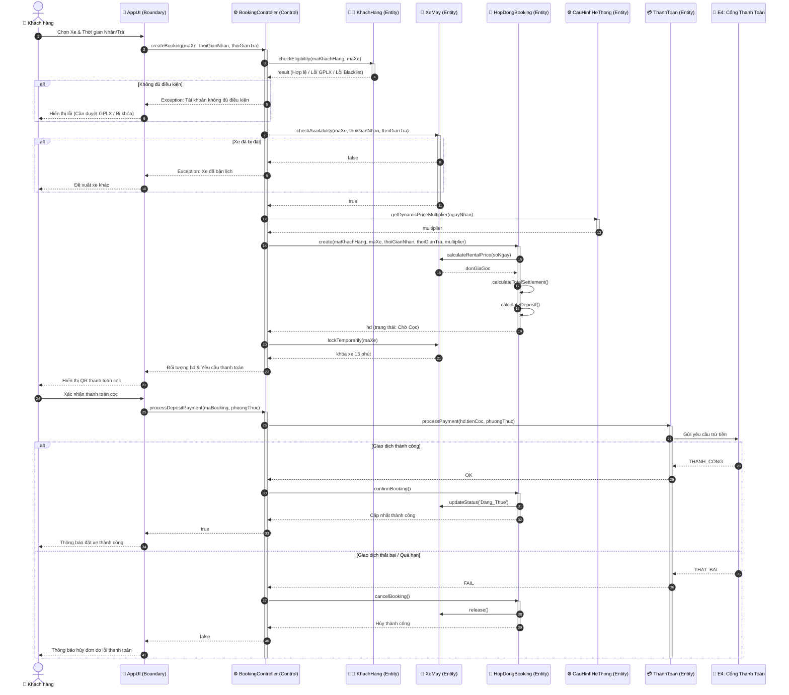
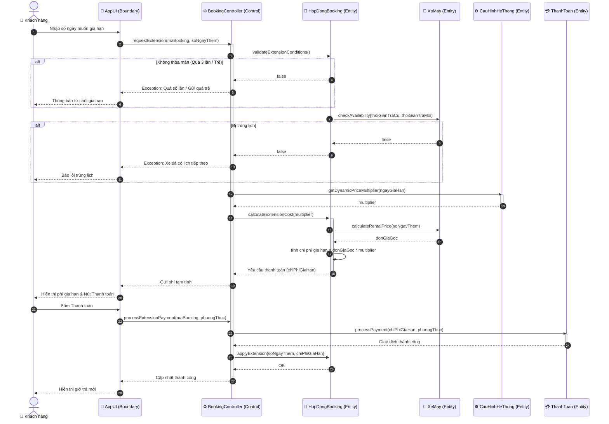
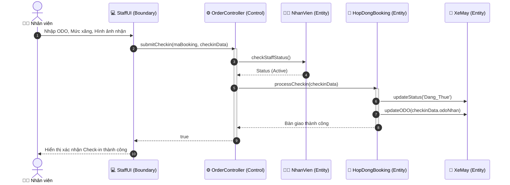
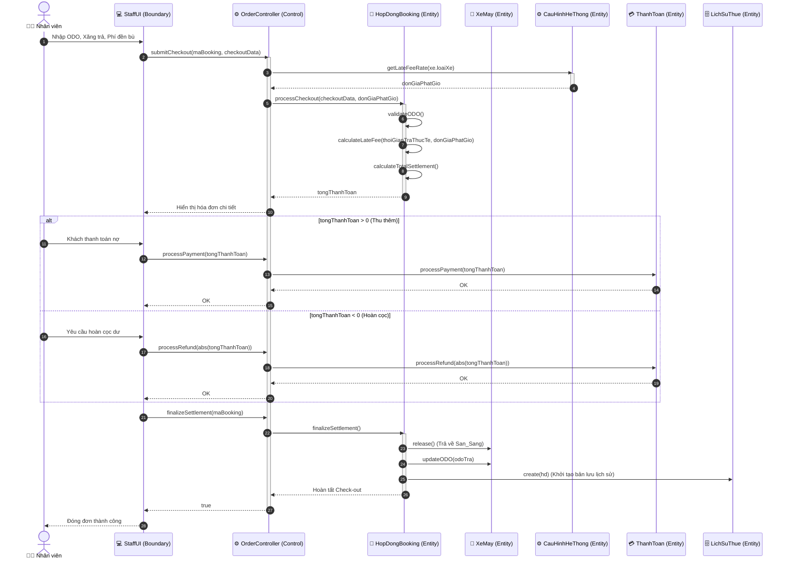
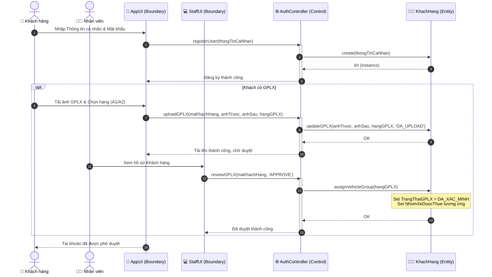
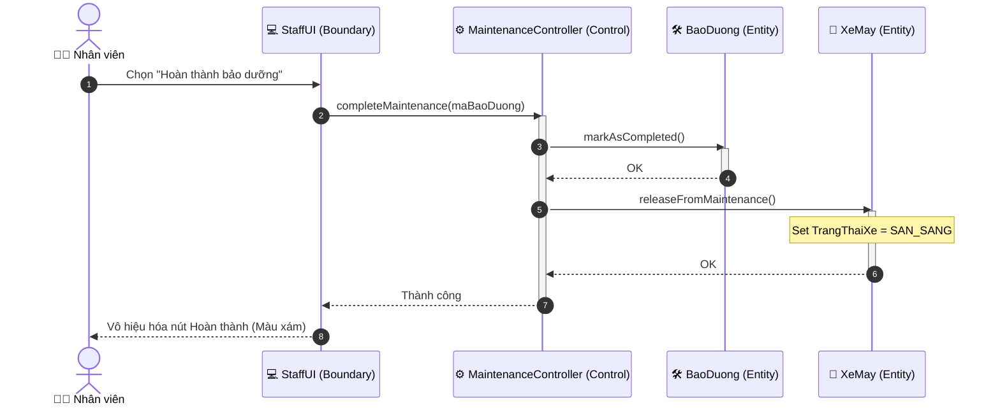

# TÀI LIỆU THIẾT KẾ: SƠ ĐỒ TUẦN TỰ (SEQUENCE DIAGRAMS)

## 1. LUỒNG ĐẶT XE & THANH TOÁN CỌC TRỰC TUYẾN

---

## 2. LUỒNG GIA HẠN THUÊ XE TRÊN ỨNG DỤNG (EXTENSION)

---

## 3. LUỒNG BÀN GIAO XE (CHECK-IN)

---

## 4. LUỒNG QUYẾT TOÁN PHỤ PHÍ & ĐỀN BÙ HƯ HẠI (CHECK-OUT)

---

## 5. LUỒNG ĐĂNG KÝ TÀI KHOẢN VÀ DUYỆT GPLX THỦ CÔNG

---

## 6. LUỒNG HOÀN THÀNH BẢO DƯỠNG

