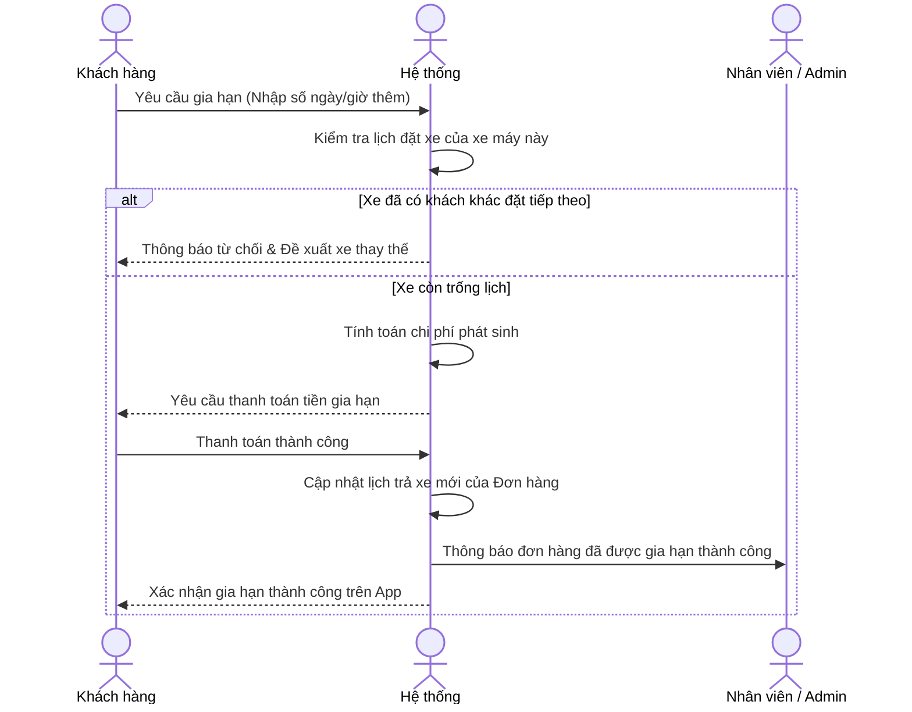
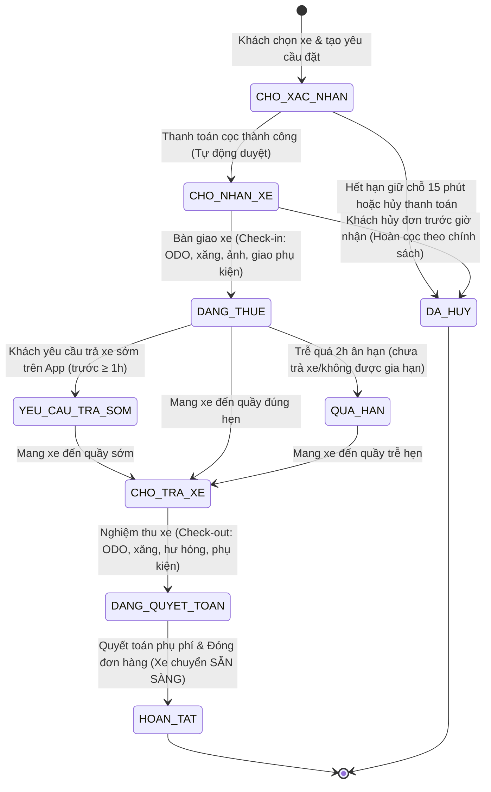

# 📋 TÀI LIỆU PHÂN TÍCH YÊU CẦU PHẦN MỀM (SRS)
## Dự án: Hệ thống Quản lý và Cho thuê xe máy Thông minh (Smart Motorcycle Rental System)

---

## 1. ĐỊNH NGHĨA BÀI TOÁN & BỐI CẢNH (PROBLEM DEFINITION)

### 1.1. Hiện trạng & Khó khăn thực tế
Hiện nay, các cửa hàng cho thuê xe máy (xe ga, xe số, xe côn tay) truyền thống gặp nhiều khó khăn trong khâu quản lý vận hành:
*   **Quản lý thủ công:** Việc ghi chép thông tin khách hàng, lịch trình thuê, và quản lý tình trạng xe (rảnh, đang thuê, đang bảo dưỡng) chủ yếu thực hiện qua sổ sách hoặc Excel, dễ dẫn đến nhầm lẫn, trùng lịch (overbooking).
*   **Kiểm soát giấy tờ phức tạp:** Việc kiểm tra và lưu trữ thông tin Giấy phép lái xe (GPLX hạng A1, A2) của khách hàng gặp khó khăn, dễ xảy ra trường hợp khách sử dụng GPLX không hợp lệ.
*   **Rủi ro tài sản cao:** Khó theo dõi thời gian trả xe của khách, dẫn đến việc trễ hẹn ảnh hưởng đến khách thuê sau. Khó quản lý lịch sử hư hỏng, sự cố phát sinh của từng chiếc xe máy.
*   **Khó theo dõi doanh thu:** Việc tính toán doanh thu, tiền phạt trễ giờ, chi phí sửa chữa xe không được tự động hóa.

### 1.2. Giải pháp: Hệ thống Cho thuê xe máy Thông minh
Hệ thống ra đời nhằm cung cấp giải pháp chuyển đổi số toàn diện cho cửa hàng thuê xe máy với hai phân hệ giao diện:
1.  **Giao diện Khách hàng (Customer Web/App):** Tìm kiếm, lọc xe máy theo loại (xe số, xe ga, xe côn tay), xem giá thuê theo ngày, đăng ký thông tin cá nhân (GPLX A1/A2), đặt xe, thanh toán đặt cọc trực tuyến và yêu cầu gia hạn thuê xe khi cần.
2.  **Giao diện Quản trị (Admin Dashboard):** Giúp chủ cửa hàng và nhân viên quản lý toàn bộ vòng đời của xe, tiếp nhận và duyệt đơn hàng, xử lý bàn giao/nhận lại xe, tính toán phụ phí (trễ giờ, hư hỏng) và theo dõi doanh thu.

---

## 2. PHẠM VI DỰ ÁN (PROJECT SCOPE)

### 2.1. Các Tác nhân trong Hệ thống (Actors)
*   **Khách hàng (Customer):** Người có nhu cầu thuê xe máy. Thực hiện tìm xe, đặt xe, thanh toán, yêu cầu gia hạn và đánh giá dịch vụ.
*   **Nhân viên cửa hàng (Staff):** Thực hiện bàn giao xe, kiểm tra tình trạng xe khi khách trả, ghi nhận sự cố, lập hóa đơn phụ phí và duyệt yêu cầu gia hạn thủ công (nếu cần).
*   **Quản trị viên / Chủ cửa hàng (Admin):** Quản lý danh mục xe máy, cấu hình giá thuê/phí phạt, quản lý tài khoản nhân viên, kiểm duyệt các đơn đặt xe và xem báo cáo tài chính.

### 2.2. Các phân hệ chính
1.  **Quản lý Xe máy:** Phân loại theo loại xe (Xe số, Xe ga, Xe côn tay, Xe PKL, Xe điện), phân khối (cc), tình trạng xe (Sẵn sàng, Đang thuê, Đang bảo dưỡng, Đang sửa chữa). Phân nhóm xe rõ ràng theo dung tích xi-lanh và động cơ: Nhóm dưới 50cc & Xe điện (không yêu cầu GPLX), Nhóm từ 50cc - dưới 175cc (yêu cầu GPLX hạng A1 hoặc A2), và Nhóm từ 175cc trở lên / Xe phân khối lớn PKL (yêu cầu GPLX hạng A2).
2.  **Quản lý Đặt xe (Booking):** Theo dõi toàn bộ vòng đời đơn đặt xe từ lúc khởi tạo -> đặt cọc -> bàn giao xe -> (gia hạn/trả xe sớm nếu có) -> trả xe & thanh quyết toán. Hỗ trợ hệ thống gửi thông báo tự động trước giờ nhận/trả xe và khi quá hạn.
3.  **Quản lý Khách hàng & Xác thực:** Đăng ký, đăng nhập với hai tùy chọn (Có GPLX và Chưa có GPLX). Tải lên và duyệt hình ảnh GPLX (hạng A1/A2...) bởi Admin. Hỗ trợ phân quyền tài khoản khi chưa được duyệt GPLX.
4.  **Cấu hình Giá & Phí phạt:** Thiết lập giá thuê theo ngày, cấu hình giảm giá cho thuê dài ngày, định giá động tự động tăng 15% - 30% vào Lễ/Tết hoặc cuối tuần. Cấu hình phí phạt trễ giờ lũy tiến (sau 2 tiếng ân hạn), bảng giá đền bù linh kiện hư hỏng.

---

## 3. YÊU CẦU CHỨC NĂNG (FUNCTIONAL REQUIREMENTS)

### 3.1. Chức năng dành cho Khách hàng
*   **Đăng ký & Đăng nhập:** 
    *   Xác thực qua Email hoặc Số điện thoại.
    *   Lựa chọn đăng ký: **Có GPLX** hoặc **Chưa có GPLX**.
    *   Nếu chọn **Có GPLX**, khách hàng phải tải ảnh chụp GPLX lên và đợi Admin kiểm duyệt. Trong lúc chờ duyệt, tài khoản được xếp vào nhóm giống như khách hàng chưa có GPLX (chỉ thuê được xe dưới 50cc và xe điện).
*   **Tìm kiếm & Lọc xe máy:**
    *   Lọc theo hãng (Honda, Yamaha, Vespa...), loại xe (xe ga, xe số, xe côn, xe PKL, xe điện), phân khối (50cc, 110cc, 125cc, 150cc, 175cc, 300cc...), và khoảng giá.
    *   Hiển thị rõ ràng ba phân loại nhóm xe và điều kiện tương ứng:
        *   *Nhóm xe dưới 50cc (và xe điện):* Dành cho học sinh, sinh viên hoặc khách hàng chưa có GPLX / GPLX chưa được Admin duyệt.
        *   *Nhóm xe từ 50cc đến dưới 175cc:* Yêu cầu khách hàng bắt buộc phải có GPLX hạng A1 hoặc A2 còn hiệu lực đã được Admin duyệt thành công.
        *   *Nhóm xe từ 175cc trở lên (Xe PKL):* Yêu cầu khách hàng bắt buộc phải có GPLX hạng A2 còn hiệu lực đã được Admin duyệt thành công.
*   **Xem chi tiết xe:** Hình ảnh xe, biển số (ẩn một phần bảo mật), tình trạng mũ bảo hiểm đi kèm, mức tiêu thụ xăng, bảng giá thuê.
*   **Đặt xe trực tuyến:**
    *   Chọn thời gian nhận/trả xe.
    *   Chọn thêm dịch vụ đi kèm (thuê thêm mũ bảo hiểm chất lượng cao, áo mưa, định vị GPS cầm tay).
    *   Hệ thống kiểm tra trạng thái GPLX của khách hàng: Nếu đặt xe nhóm từ 50cc đến dưới 175cc, khách hàng phải có GPLX A1 hoặc A2 đã duyệt. Nếu đặt xe nhóm từ 175cc trở lên (Xe PKL), khách hàng phải có GPLX A2 đã duyệt.
*   **Thanh toán đặt cọc:** Tích hợp thanh toán online (chuyển khoản ngân hàng hoặc ví điện tử) để giữ xe.
*   **Gia hạn thuê xe (Rental Extension):** Yêu cầu gia hạn thời gian thuê trực tiếp trên app (Xem chi tiết tại mục Quy tắc nghiệp vụ).
*   **Yêu cầu trả xe sớm:** Tính năng cho phép khách hàng chủ động yêu cầu kết thúc hành trình sớm hơn dự kiến ngay trên ứng dụng di động (yêu cầu gửi trước giờ muốn trả ít nhất 1 tiếng).
*   **Đánh giá chuyến đi (Rating & Review):** Khách hàng đánh giá độ ổn định và tình trạng vận hành của xe, thái độ phục vụ của cửa hàng sau khi hoàn tất đơn thuê.

### 3.2. Chức năng dành cho Nhân viên (Staff)
*   **Quản lý Đơn đặt xe (Booking Workflow):**
    *   Tiếp nhận yêu cầu đặt xe, đối chiếu và xác nhận thông tin đăng ký GPLX của khách hàng (nếu thuê dòng xe từ 50cc trở lên).
    *   Duyệt hoặc Từ chối đơn đặt xe (đối với đơn đã cọc thành công).
*   **Quy trình Bàn giao xe (Check-in):** 
    *   Đối chiếu GPLX gốc của khách hàng khi đến tiệm (yêu cầu GPLX A1/A2 còn hiệu lực cho xe từ 50cc - dưới 175cc; GPLX A2 còn hiệu lực cho xe từ 175cc trở lên).
    *   Kiểm tra xe cùng khách hàng: Ghi nhận số ODO ban đầu, tình trạng ngoại quan có xước/móp hay không (chụp ảnh lưu trữ).
    *   Bàn giao xe kèm phụ kiện (2 mũ bảo hiểm + 1 áo mưa).
    *   Xác nhận bàn giao xe và chuyển trạng thái đơn sang "Đang thuê (In Progress)".
*   **Quy trình Nhận lại xe (Check-out):** 
    *   Tiếp nhận thông tin khi khách hàng gửi yêu cầu trả xe sớm trên ứng dụng di động.
    *   Kiểm tra tình trạng xe khi khách trả: Đối chiếu số ODO thực tế, kiểm tra vết trầy xước/hư hỏng mới (so với ảnh chụp lúc giao).
    *   Kiểm tra số lượng phụ kiện trả lại (mũ bảo hiểm, áo mưa).
    *   Lập biên bản sự cố và áp phí phạt đền bù hư hại (nếu có) dựa trên bảng giá linh kiện có sẵn.
*   **Xử lý Gia hạn thuê xe (thủ công):** Phê duyệt hoặc từ chối yêu cầu gia hạn khi khách gọi hotline hoặc yêu cầu trực tiếp tại quầy.

### 3.3. Chức năng dành cho Quản trị viên (Admin)
*   **Quản lý Xe máy (Inventory):** Thêm mới xe, cập nhật thông tin (Biển số, số khung, số máy, phân khối, đời xe), xóa xe hoặc thay đổi trạng thái xe (Sẵn sàng, Đang bảo dưỡng, Đang sửa chữa).
*   **Quản lý Cấu hình Giá & Phí phạt:** 
    *   Thiết lập bảng giá thuê xe theo ngày cho từng dòng xe (xe số, xe ga, xe côn tay, xe PKL).
    *   Cấu hình ưu đãi giảm giá khi thuê xe dài ngày (giảm giá theo số ngày thuê).
    *   Cấu hình định giá động (Dynamic Pricing): Cấu hình khoảng tăng giá từ 15% - 30% vào các ngày Lễ/Tết hoặc dịp cuối tuần.
    *   Cấu hình phí phạt trễ giờ (theo giờ hoặc tự động tính theo 1/2 ngày, 1 ngày thuê mới).
    *   Cấu hình Bảng giá đền bù linh kiện/phụ kiện bị hư hại hoặc mất mát.
*   **Quản lý Tài khoản (Staff Management):** Tạo tài khoản nhân viên mới, phân quyền, khóa tài khoản nhân viên.
*   **Quản lý Khách hàng & Duyệt hồ sơ:** 
    *   Kiểm duyệt hồ sơ GPLX của khách hàng đăng ký "Có GPLX" (Xem ảnh chụp GPLX, thông tin, sau đó duyệt hoặc từ chối).
    *   Xem hồ sơ khách hàng, lịch sử các lần thuê xe, và đánh dấu cảnh báo (Blacklist) đối với khách hàng nợ xấu hoặc vi phạm nghiêm trọng hợp đồng.
*   **Quản lý Lịch bảo dưỡng:** Lập lịch và theo dõi lịch bảo trì định kỳ cho xe máy (thay dầu, kiểm tra phanh, lốp sau mỗi X km).
*   **Thống kê & Báo cáo:** Xem biểu đồ doanh thu theo thời gian, hiệu suất hoạt động của từng dòng xe, chi phí sửa chữa bảo trì định kỳ.

---

## 4. QUY TẮC NGHIỆP VỤ & CÁC TRƯỜNG HỢP ĐẶC BIỆT (BUSINESS RULES)

Đây là các quy tắc nghiệp vụ chi tiết phục vụ cho việc thiết kế sơ đồ và lập trình logic hệ thống.

### 4.1. Nghiệp vụ Gia hạn thuê xe (Rental Extension)
Khách hàng đang thuê xe có thể gửi yêu cầu gia hạn thời gian thuê thông qua ứng dụng/web. Quy trình xử lý như sau:
*   **Thời gian yêu cầu:** Khách hàng phải gửi yêu cầu gia hạn **trước giờ trả xe hiện tại ít nhất 2 tiếng**.
*   **Kiểm tra tính khả dụng của xe:**
    *   Hệ thống kiểm tra xem chiếc xe đó **có lịch đặt của khách hàng khác** trong khoảng thời gian yêu cầu gia hạn hay không.
    *   *Trường hợp 1 (Xe trống):* Hệ thống cho phép gia hạn -> Tính toán số tiền cần trả thêm -> Khách hàng thanh toán trực tuyến -> Hệ thống tự động gia hạn thành công và cập nhật lịch trả xe mới.
    *   *Trường hợp 2 (Xe đã được đặt trước bởi người khác):* Hệ thống hiển thị từ chối gia hạn tự động. Gợi ý khách hàng trả xe đúng hẹn hoặc liên hệ hotline cửa hàng để nhân viên hỗ trợ đổi sang một xe máy khác cùng phân khúc (nếu còn trống) khi khách mang xe đến trả.
*   **Giới hạn gia hạn:** Khách hàng chỉ được gia hạn tối đa **3 lần** cho một đơn thuê để tránh tình trạng chiếm giữ xe quá lâu ảnh hưởng đến kế hoạch bảo dưỡng định kỳ của cửa hàng.

### 4.2. Quy định Trả xe muộn (Late Return)
Nếu khách hàng trả xe trễ so với thời gian cam kết trong hợp đồng mà không được duyệt gia hạn:
*   **Thời gian ân hạn (Grace Period):** Khách hàng được phép trả xe trễ tối đa **2 tiếng** so với giờ hẹn trả trong hợp đồng mà không bị tính phí phạt trễ hạn.
*   **Tính phí phạt khi vượt quá Thời gian ân hạn (Trễ > 2 tiếng):**
    *   Trễ từ **trên 2 tiếng đến dưới 6 tiếng:** Áp dụng phí phạt tính theo giờ, nhưng tối đa không vượt quá mức phạt của mốc tiếp theo (1/2 ngày thuê xe).
        *   Xe số / Xe ga thường: 30,000 VND / giờ.
        *   Xe côn tay / Xe phân khối lớn (>= 175cc): 50,000 VND / giờ.
    *   Trễ **từ 6 tiếng đến dưới 12 tiếng:** Phí phạt bằng **1/2 ngày thuê** của xe đang thuê.
    *   Trễ **từ 12 tiếng trở lên:** Tính tròn thành **1 ngày thuê mới** (phí phạt bằng 1 ngày thuê xe).

### 4.3. Quy định Hủy đặt xe (Cancellation & Refund)
Khách hàng đã đặt cọc xe trực tuyến nhưng muốn hủy đơn:
*   **Hủy trước giờ nhận xe > 24 tiếng:** Hoàn cọc 100% về tài khoản khách hàng.
*   **Hủy trước giờ nhận xe từ 12 đến 24 tiếng:** Phạt 50% tiền cọc (hoàn lại 50%).
*   **Hủy trước giờ nhận xe < 12 tiếng hoặc không đến nhận xe (No-show) quá 2 tiếng so với lịch hẹn:** Phạt 100% tiền cọc (không hoàn tiền).

### 4.4. Quy định Xử lý Sự cố & Hư hỏng (Damage & Incidents)
Khi khách hàng trả xe, nhân viên thực hiện đối chiếu ngoại quan xe dựa trên ảnh chụp và ODO lúc bàn giao:
*   **Hư hại linh kiện / Trầy xước nặng:**
    *   Nhân viên lập biên bản hư hại trên hệ thống, chụp ảnh vết thương tổn của xe.
    *   Hệ thống áp phí đền bù dựa trên **Bảng giá linh kiện thay thế** được Admin cấu hình sẵn (ví dụ: vỡ gương: 100,000 VND, bể yếm xe: 300,000 VND, xước sơn sâu: 150,000 VND).
    *   Tiền phạt hư hại sẽ được trừ trực tiếp vào tiền cọc (nếu cọc bằng tiền mặt/chuyển khoản giữ chân) hoặc yêu cầu khách thanh toán thêm qua cổng trực tuyến trước khi đóng đơn hàng.
*   **Mất mát phụ kiện đi kèm:**
    *   Mất mũ bảo hiểm: Phạt 150,000 VND / chiếc.
    *   Mất áo mưa: Phạt 50,000 VND / chiếc.

### 4.5. Quy trình Yêu cầu Trả xe sớm (Early Return)
*   **Điều kiện thực hiện:** Khách hàng có thể chủ động kết thúc hành trình sớm hơn dự kiến qua ứng dụng di động.
*   **Quy trình nghiệp vụ:**
    1.  Khách hàng bấm nút **"Yêu cầu trả xe sớm"** trên ứng dụng ít nhất trước **1 tiếng** so với thời điểm muốn trả thực tế.
    2.  Hệ thống gửi thông báo cho nhân viên tại điểm trả xe để sẵn sàng tiếp nhận xe và kiểm tra bàn giao.
    3.  Khách hàng mang xe đến tiệm, nhân viên tiến hành quy trình nhận lại xe (Check-out) như bình thường.
    4.  *Chính sách chi phí:* Khách hàng thanh toán theo hợp đồng đã ký kết ban đầu. Mọi khoản hoàn phí thuê cho thời gian trả sớm (nếu có) sẽ dựa theo chính sách cấu hình từ Admin hoặc trao đổi trực tiếp tại quầy.

### 4.6. Hệ thống Cảnh báo & Thông báo tự động (Automatic Alerts)
Hệ thống tự động gửi các thông báo nhắc nhở qua ứng dụng di động của khách hàng:
*   **Trước giờ nhận xe 2 tiếng:** Nhắc nhở chuẩn bị đầy đủ giấy tờ cần thiết (CCCD, GPLX phù hợp với loại xe đã đặt) và mã đặt xe.
*   **Trước giờ trả xe 2 tiếng:** Nhắc nhở khách hàng sắp xếp thời gian quay lại điểm trả xe, kiểm tra lại đồ đạc cá nhân trong cốp và đổ lại lượng xăng ban đầu giống lúc nhận xe.
*   **Khi chạm mốc hết giờ hẹn trả xe:** Bắt đầu gửi thông báo liên tục nhắc nhở trả xe hoặc đề xuất thực hiện gia hạn nếu đủ điều kiện.

### 4.7. Cấu hình Giá đặc biệt & Định giá động (Dynamic Pricing & Discounts)
*   **Ưu đãi thuê dài ngày:** Giảm giá tự động theo ngày thuê (do Admin thiết lập, ví dụ: thuê trên 3 ngày giảm 5%, trên 7 ngày giảm 10% trên tổng hóa đơn thuê xe gốc).
*   **Định giá động (Dynamic Pricing):** Hệ thống tự động tăng giá thuê xe từ **15% - 30%** vào các ngày Lễ/Tết hoặc dịp cuối tuần dựa trên dữ liệu cấu hình hệ thống từ Admin.

---

## 5. LUỒNG NGHIỆP VỤ CHÍNH (KEY BUSINESS FLOWS)

### 5.1. Luồng Yêu cầu Gia hạn Thuê xe

### 5.2. Quy trình Bàn giao & Kiểm tra trả xe máy

---

## 6. YÊU CẦU PHI CHỨC NĂNG (NON-FUNCTIONAL REQUIREMENTS)

### 6.1. Hướng đến khách du lịch đa quốc gia (Đa ngôn ngữ VIE/ENG)
*   **Hỗ trợ đa ngôn ngữ:** Thiết lập và hỗ trợ song song hai ngôn ngữ là Tiếng Việt (VIE) và Tiếng Anh (ENG) trên cả giao diện Web và Ứng dụng di động.
*   **Trải nghiệm người dùng:** Cho phép người dùng chuyển đổi ngôn ngữ linh hoạt tại phần cài đặt hoặc góc trên thanh điều hướng. Mọi thông tin mô tả xe, điều khoản hợp đồng và thông báo đều được dịch nghĩa chuẩn xác.
