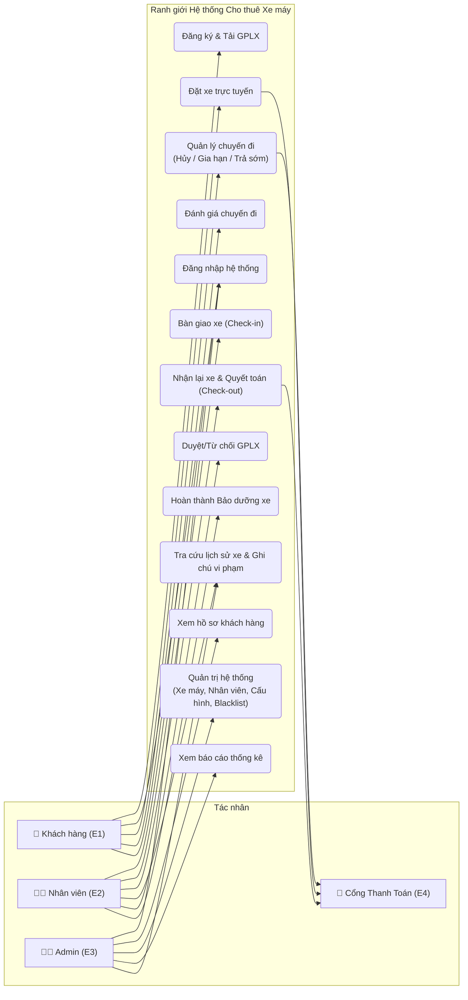
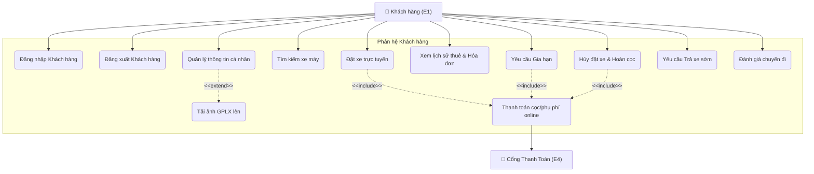

# TÀI LIỆU THIẾT KẾ: SƠ ĐỒ USE CASE (USE CASE DIAGRAMS)

## QUY ƯỚC THIẾT KẾ (DESIGN CONVENTIONS)

1. **Xác thực và Phân quyền (Authentication & Authorization):** Các hành động (Login, Logout) được định nghĩa là **Tiền điều kiện (Pre-conditions)**.
2. **Loại bỏ phân rã chức năng (Functional Decomposition):** Các bước xử lý logic tự động (Khóa xe tạm 15 phút, Kiểm tra lịch xe trống) được đặc tả trong **Luồng sự kiện (Flow of Events)**.
3. **Phân cấp sơ đồ:** Phân tách thành Sơ đồ tổng thể và Sơ đồ phân hệ để quản lý tính phức tạp.

---

## 1. DANH SÁCH CÁC TÁC NHÂN (ACTORS)

| Tác nhân | Ký hiệu | Loại tác nhân | Vai trò trong hệ thống |
|----------|:---:|:---:|------------------------|
| **Khách hàng** (Customer) | `E1` | Primary Actor (Chính) | Đăng ký tài khoản, tìm kiếm xe máy, thực hiện đặt xe trực tuyến, quản lý chuyến đi (gia hạn, hủy đặt, yêu cầu trả sớm), thực hiện thanh toán online và đánh giá dịch vụ sau chuyến đi. |
| **Nhân viên** (Staff) | `E2` | Primary Actor (Chính) | Xem danh sách công việc giao nhận, thực hiện quy trình bàn giao xe (Check-in), nhận lại xe (Check-out), kiểm tra tình trạng xe, ghi nhận đền bù hư hại và ghi chú vi phạm nội bộ. |
| **Quản trị viên** (Admin) | `E3` | Primary Actor (Chính) | Tra cứu, hậu kiểm thông tin khách hàng và bằng lái, quản lý danh mục xe máy, tài khoản nhân viên, cấu hình thông số hệ thống, quản lý danh sách đen (Blacklist) và xem báo cáo thống kê. |
| **Cổng thanh toán** (Payment Gateway) | `E4` | Supporting Actor (Hỗ trợ) | Hệ thống bên ngoài thực hiện xử lý các giao dịch thanh toán đặt cọc cọc, hoàn tiền cọc, hoặc thu phụ phí từ Khách hàng và phản hồi kết quả giao dịch về hệ thống. |

---

## 2. SƠ ĐỒ USE CASE TỔNG THỂ HỆ THỐNG (OVERALL DIAGRAM)

---

## 3. SƠ ĐỒ USE CASE PHÂN HỆ KHÁCH HÀNG (CUSTOMER SUB-SYSTEM)

---

## 4. SƠ ĐỒ USE CASE PHÂN HỆ QUẢN TRỊ & VẬN HÀNH (MANAGEMENT SUB-SYSTEM)

```mermaid
graph TB
    E2["🧑‍💼 Nhân viên (E2)"]
    E3["👨‍💻 Admin (E3)"]
    E4["🏦 Cổng Thanh Toán (E4)"]

    subgraph Management_Boundary [Phân hệ Quản trị & Vận hành]
        %% Common
        UC_LoginStaff("Đăng nhập Quản trị")
        UC_History("Tra cứu lịch sử xe")
        UC_Violate("Ghi chú vi phạm nội bộ")

        %% Staff Use Cases
        UC_Worklist("Xem danh sách giao nhận")
        UC_Checkin("Bàn giao xe (Check-in)")
        UC_Checkout("Nhận lại xe & Quyết toán (Check-out)")
        UC_Damage("Ghi nhận đền bù hư hại")
        UC_ApproveGPLX("Duyệt/Từ chối GPLX")
        UC_Maintenance("Hoàn thành Bảo dưỡng xe")

        %% Admin Use Cases
        UC_ReviewCustomer("Xem hồ sơ khách hàng")
        UC_ManageVehicles("Quản lý danh mục xe máy")
        UC_ManageStaff("Quản lý tài khoản nhân viên")
        UC_LockStaff("Khóa tài khoản nhân viên")
        UC_ManageConfig("Quản lý cấu hình hệ thống")
        UC_Blacklist("Quản lý Blacklist khách hàng")
        UC_Report("Xem báo cáo thống kê")
    end

    %% Staff Actions
    E2 --> UC_LoginStaff
    E2 --> UC_Worklist
    E2 --> UC_Checkin
    E2 --> UC_Checkout
    E2 --> UC_History
    E2 --> UC_Violate
    E2 --> UC_ApproveGPLX
    E2 --> UC_Maintenance

    %% Admin Actions
    E3 --> UC_LoginStaff
    E3 --> UC_ReviewCustomer
    E3 --> UC_ManageVehicles
    E3 --> UC_ManageStaff
    E3 --> UC_ManageConfig
    E3 --> UC_Blacklist
    E3 --> UC_History
    E3 --> UC_Violate
    E3 --> UC_Report
    E3 --> UC_ApproveGPLX

    %% Relationships (Includes/Extends)
    UC_Checkout -.->|"&lt;&lt;extend&gt;&gt;"| UC_Damage
    UC_ManageStaff -.->|"&lt;&lt;extend&gt;&gt;"| UC_LockStaff

    %% Payments connection during checkout
    UC_Checkout --> E4
```

---

## 5. ĐẶC TẢ CHI TIẾT CÁC USE CASE ĐẶC TRƯNG HỆ THỐNG

### 5.1. Use Case: Đặt xe trực tuyến & Khóa xe tạm
*   **Mô tả:** Khách hàng tiến hành đặt xe máy trực tuyến. Hệ thống kiểm tra điều kiện tài khoản và lịch xe khả dụng, sau đó khóa xe tạm thời 15 phút trong khi chờ khách hàng hoàn tất thanh toán cọc trực tuyến qua cổng thanh toán.
*   **Tác nhân chính:** Khách hàng (E1).
*   **Tác nhân hỗ trợ:** Cổng thanh toán (E4).
*   **Tiền điều kiện:** 
    1. Khách hàng đã đăng nhập tài khoản thành công.
    2. Nếu đặt xe > 50cc, khách hàng đã tải ảnh GPLX và **được Nhân viên/Admin phê duyệt** hợp lệ, phân hạng tương thích với nhóm xe muốn thuê.
    3. Khách hàng không nằm trong danh sách đen (Blacklist) của hệ thống.
*   **Luồng sự kiện chính:**
    1. Khách hàng chọn chiếc xe máy mong muốn và khoảng thời gian thuê (Ngày/Giờ Nhận - Ngày/Giờ Trả).
    2. Hệ thống kiểm tra điều kiện tài khoản (Hệ thống kiểm tra xem tài khoản đã có dữ liệu ảnh GPLX trong kho dữ liệu chưa để mở khóa danh mục xe tương ứng, và kiểm tra xem có nằm trong Blacklist hay không).
    3. Hệ thống kiểm tra lịch khả dụng của xe máy trong thời gian thuê để đảm bảo không bị trùng lịch với đơn đặt khác.
    4. Hệ thống hiển thị thông tin hóa đơn tạm tính và số tiền đặt cọc cần đóng (thường là 30% giá trị đơn hàng hoặc 1.000.000đ tùy cấu hình loại xe).
    5. Hệ thống khóa trạng thái xe tạm thời trong hệ thống (`TrangThaiXe = KHOA_TAM_15M`) và bắt đầu bộ đếm ngược 15 phút.
    6. Khách hàng lựa chọn phương thức thanh toán và thực hiện chuyển tiền cọc thông qua Cổng thanh toán (E4).
    7. Cổng thanh toán xử lý giao dịch và gửi phản hồi kết quả giao dịch thành công cho hệ thống.
    8. Hệ thống lưu chính thức đơn đặt xe (Trạng thái đơn hàng: `CHO_NHAN_XE`), cập nhật lịch xe máy là `DA_DAT` trong khoảng thời gian đã chọn, đồng thời gửi thông báo chuẩn bị xe tới Nhân viên tại chi nhánh tương ứng.
*   **Luồng thay thế và Luồng ngoại lệ:**
    *   *Ngoại lệ 2a (GPLX không hợp lệ):* Hệ thống thông báo tài khoản chưa tải ảnh GPLX hoặc hạng bằng lái không tương thích với phân khối xe yêu cầu và dừng Use Case.
    *   *Ngoại lệ 2b (Tài khoản thuộc Blacklist):* Hệ thống thông báo tài khoản bị từ chối dịch vụ do vi phạm quy định và dừng Use Case.
    *   *Ngoại lệ 3a (Xe đã bị đặt trùng lịch - Race condition):* Hệ thống thông báo xe vừa được đặt bởi người dùng khác trong quá trình chọn, đề xuất khách hàng chọn xe khác cùng phân khúc.
    *   *Ngoại lệ 5a (Giao dịch thất bại hoặc quá 15 phút không thanh toán):* Hệ thống tự động giải phóng trạng thái xe từ `KHOA_TAM_15M` về trạng thái khả dụng (`SAN_SANG`), đồng thời hủy đơn tạm thời và thông báo đơn đặt xe hết hạn.
    *   *Ngoại lệ 7a (Lỗi phản hồi từ Cổng thanh toán):* Hệ thống giữ trạng thái khóa tạm của xe để chờ cổng thanh toán đối soát hoặc hiển thị liên kết để khách hàng thử thanh toán lại trong thời gian 15 phút còn lại.

### 5.2. Use Case: Nhận lại xe & Quyết toán (Check-out)
*   **Mô tả:** Nhân viên kiểm tra và nhận lại xe máy từ khách hàng khi kết thúc hành trình. Hệ thống tính toán các khoản phụ thu phát sinh (phạt trễ hạn, đền bù hư hỏng nếu có) và thực hiện xuất hóa đơn quyết toán, tự động xử lý hoàn tiền đặt cọc hoặc yêu cầu thanh toán thêm.
*   **Tác nhân chính:** Nhân viên (E2).
*   **Tác nhân hỗ trợ:** Cổng thanh toán (E4).
*   **Tiền điều kiện:** 
    1. Nhân viên đã đăng nhập thành công và tài khoản đang ở trạng thái hoạt động.
    2. Đơn đặt xe tương ứng đang ở trạng thái hoạt động (`DANG_THUE`).
*   **Luồng sự kiện chính:**
    1. Nhân viên mở danh sách xe đến hạn trả hoặc nhận yêu cầu trả xe từ khách hàng, chọn đúng Đơn đặt xe tương ứng.
    2. Nhân viên cùng khách hàng đồng kiểm ngoại quan, động cơ và các phụ kiện đi kèm.
    3. Nhân viên nhập dữ liệu Check-out vào hệ thống bao gồm: Chỉ số ODO trả, Mức nhiên liệu trả, Số lượng phụ kiện trả lại, tải lên ảnh chụp hiện trạng xe và mức Phí đền bù hư hại (nếu có).
    4. Hệ thống kiểm tra và xác nhận các dữ liệu đầu vào hợp lệ.
    5. Hệ thống tự động tính toán phí phạt trễ hạn (nếu có) và tính tổng tiền quyết toán (`TongQuyetToan = TienThueGoc + TienPhatTreHan + TienDenBuHuHai - TienCoc`).
    6. Hệ thống xuất hóa đơn quyết toán gửi tới email/ứng dụng khách hàng và hiển thị trên màn hình của Nhân viên.
    7. Hệ thống tiến hành quyết toán tài chính:
        *   Nếu `TongQuyetToan > 0`: Khách hàng thực hiện thanh toán khoản thiếu qua cổng thanh toán (E4) hoặc tiền mặt cho nhân viên.
        *   Nếu `TongQuyetToan < 0`: Trong trường hợp khách trả sớm hoặc cọc dư, hệ thống tự động gọi API hoàn tiền thông qua Cổng thanh toán (E4), nhân viên tuyệt đối không trả tiền mặt.
    8. Hệ thống cập nhật trạng thái Đơn đặt xe sang `HOAN_TAT`.
    9. Hệ thống giải phóng xe máy về trạng thái khả dụng (`SAN_SANG`), cập nhật chỉ số ODO mới và mức xăng mới làm cơ sở cho lần thuê tiếp theo.
*   **Luồng thay thế và Luồng ngoại lệ:**
    *   *Thay thế 5a (Phát sinh phạt trễ hạn):* Nếu thời gian trả xe muộn hơn giờ hẹn, hệ thống tự động áp dụng biểu phí phạt trễ hạn lũy tiến được cấu hình sẵn:
        *   Trễ ≤ 2 tiếng: Miễn phí (ân hạn).
        *   Trễ từ 2h - 6h: Phạt 30.000đ/giờ (xe số/xe ga) hoặc 50.000đ/giờ (xe côn/PKL) (tối đa không quá 1/2 đơn giá ngày).
        *   Trễ từ 6h - 12h: Phạt bằng 1/2 đơn giá thuê 1 ngày.
        *   Trễ trên 12h: Phạt bằng 1 ngày thuê gốc.
    *   *Thay thế 5b (Phát sinh hư hại hoặc mất phụ kiện):* Nhân viên chọn thêm mục "Ghi nhận đền bù hư hại" trong giao diện, chọn loại linh kiện hỏng/mất từ danh mục có sẵn (kèm đơn giá chuẩn) hoặc nhập số tiền thỏa thuận đền bù trực tiếp để cộng vào hóa đơn quyết toán.
    *   *Ngoại lệ 3a (Sai lệch dữ liệu chỉ số ODO hoặc nhiên liệu):* Nếu chỉ số ODO trả nhỏ hơn chỉ số ODO bàn giao ban đầu, hệ thống báo lỗi dữ liệu không hợp lệ và yêu cầu nhân viên kiểm tra, nhập lại.
    *   *Ngoại lệ 7a (Khách hàng không đồng ý mức phí phạt hoặc đền bù):* Nhân viên ghi nhận tình trạng, tải lên các bằng chứng (ảnh chụp, video) và chọn trạng thái đơn hàng là `TRANH_CHAP`. Xe máy vẫn tạm thời chuyển về trạng thái `KHOA_TAM` để kiểm định thêm và luồng quyết toán tài chính sẽ chuyển cho Admin giải quyết thủ công.
    *   *Ngoại lệ 7b (Lỗi kết nối Cổng thanh toán khi thực hiện hoàn cọc):* Hệ thống ghi nhận trạng thái hoàn cọc lỗi, lưu vết lệnh hoàn tiền ở trạng thái `CHO_XU_LY` (Pending) để kế toán thực hiện xử lý tay, đồng thời đơn thuê vẫn chuyển về `HOAN_TAT` để giải phóng xe hoạt động.

### 5.3. Use Case: Đánh giá chuyến đi
*   **Mô tả:** Khách hàng thực hiện đánh giá chất lượng xe và dịch vụ sau khi chuyến đi kết thúc. Hệ thống đảm bảo mỗi đơn đặt xe chỉ được đánh giá duy nhất một lần bằng cách vô hiệu hóa nút đánh giá nếu đã có dữ liệu.
*   **Tác nhân chính:** Khách hàng (E1).
*   **Tiền điều kiện:** 
    1. Chuyến đi đã được hoàn tất (`TrangThaiBooking = HOAN_TAT`).
    2. Phương thức `isReviewed()` của `HopDongBooking` trả về `false` (Khách hàng chưa từng đánh giá đơn này).
*   **Luồng sự kiện chính:**
    1. Hệ thống hiển thị nút "Đánh giá" trên đơn thuê đã hoàn tất.
    2. Khách hàng click vào nút Đánh giá, chọn số sao (1-5) và nhập nội dung.
    3. Hệ thống kiểm tra lại điều kiện `isReviewed() == false`.
    4. Hệ thống lưu bản ghi đánh giá vào kho dữ liệu `D8: Danh_Gia`.
    5. Hệ thống vô hiệu hóa nút "Đánh giá" (chuyển sang màu xám/disabled).
*   **Luồng thay thế và Luồng ngoại lệ:**
    *   *Ngoại lệ 3a (Khách hàng đã đánh giá):* Nếu hệ thống phát hiện đơn hàng đã có dữ liệu đánh giá trước đó do khách click đúp hoặc mở trên nhiều thiết bị, hệ thống báo lỗi "Đơn này đã được đánh giá" và hủy thao tác.
